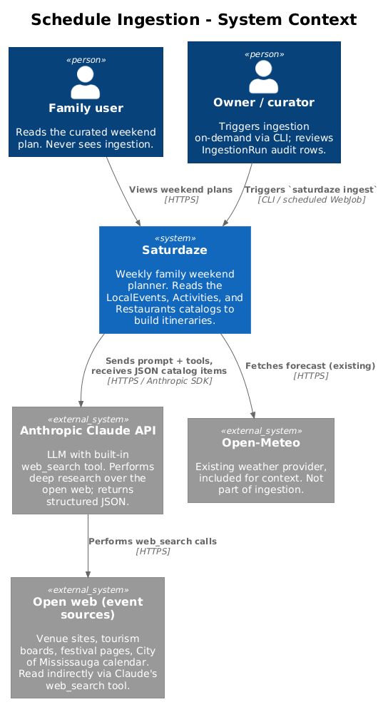
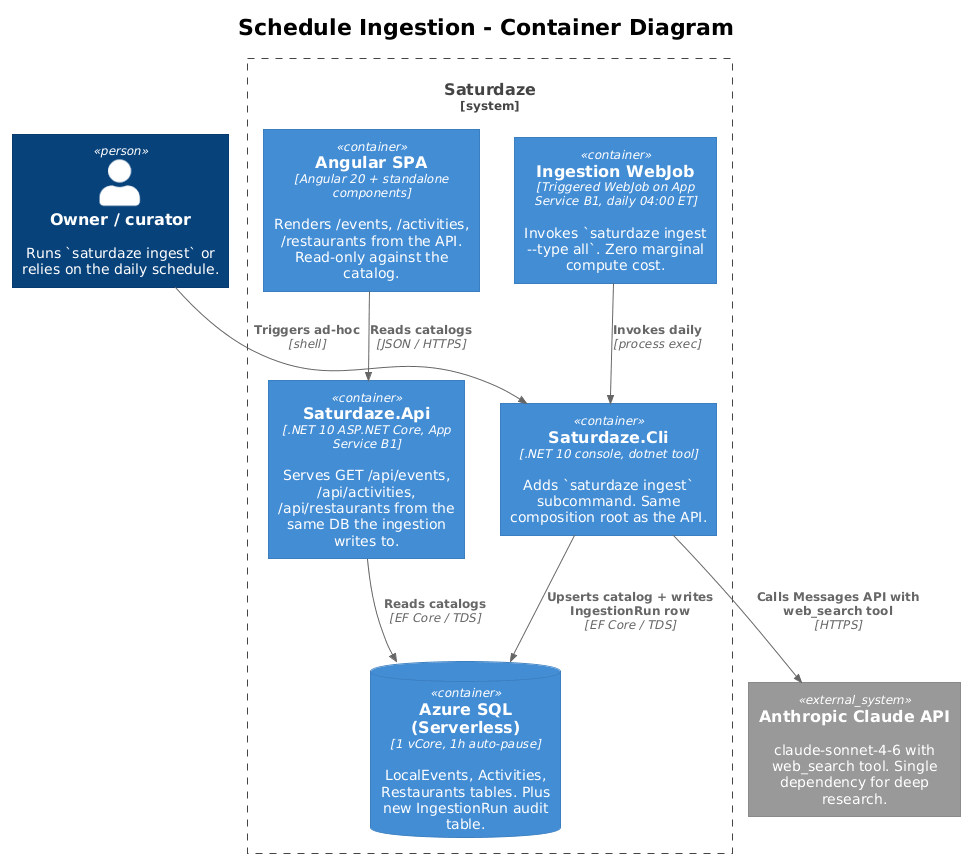
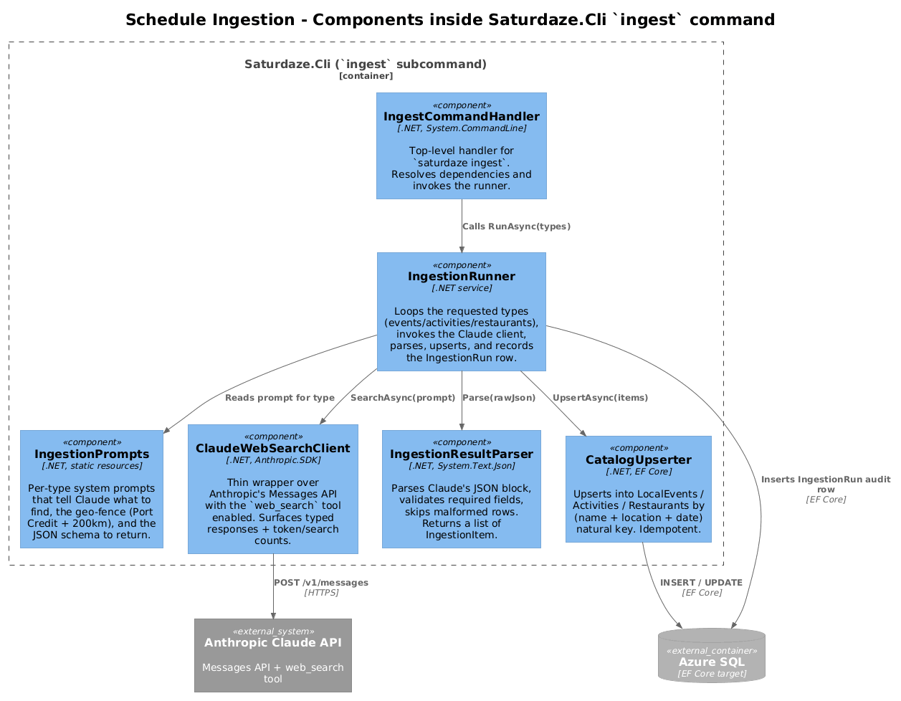
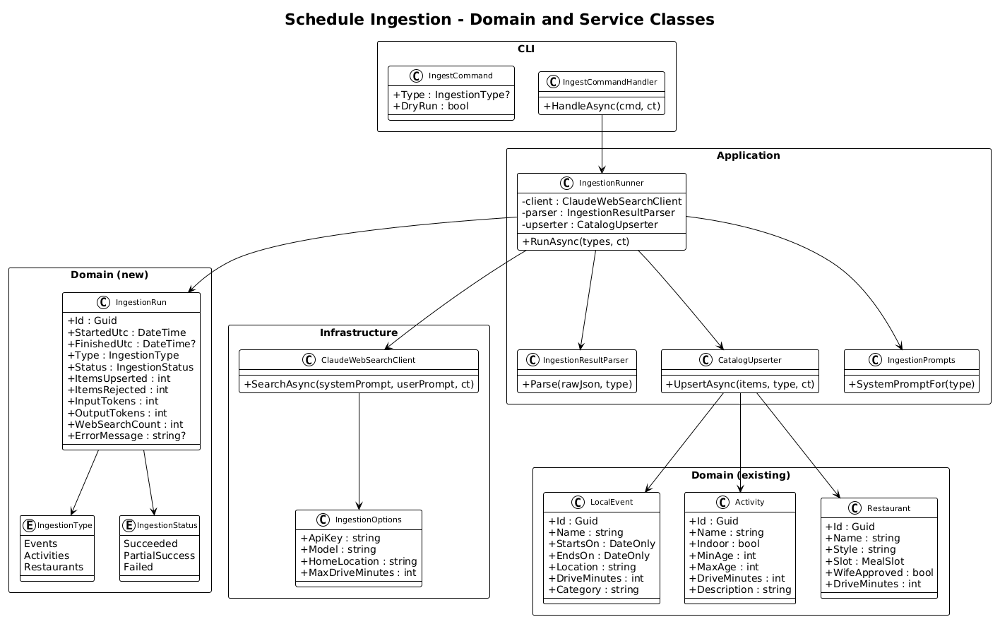
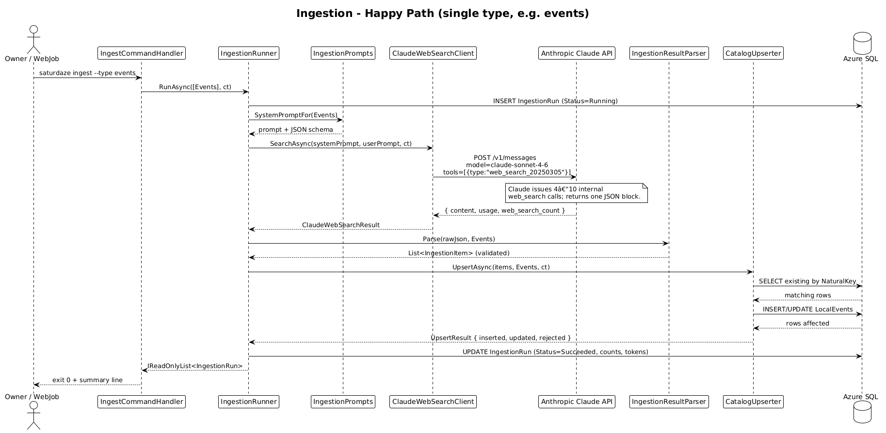
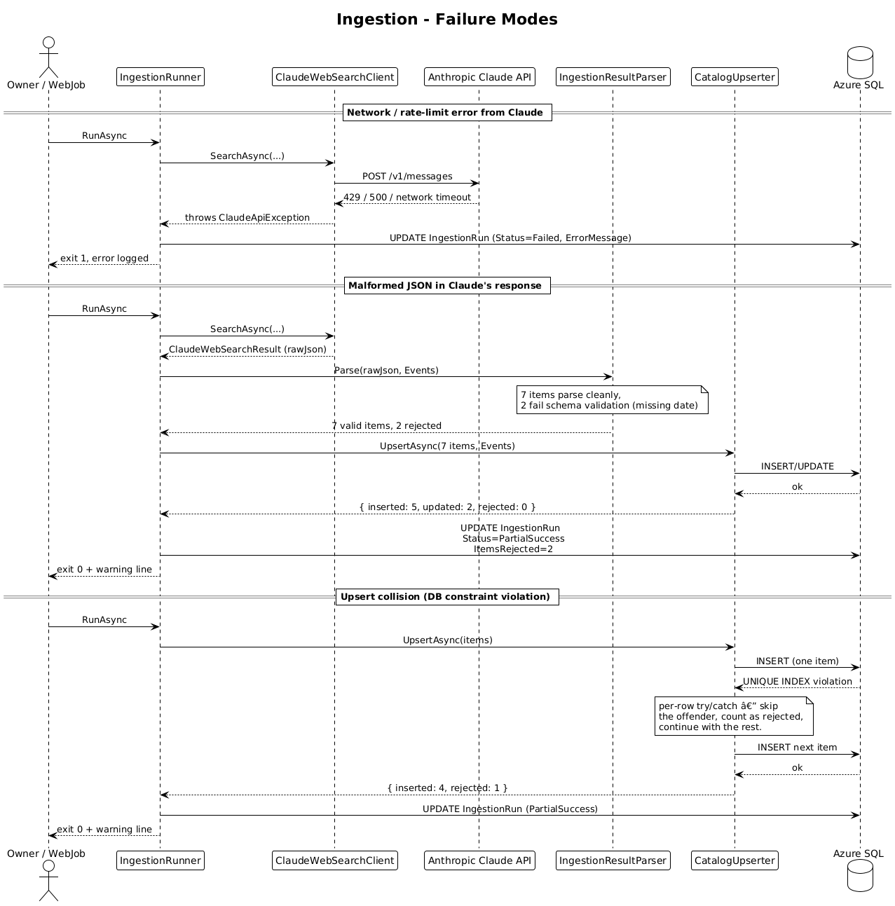

# Schedule Ingestion — Detailed Design

> Status: **Draft** — first version, awaiting review.
> Owner: Quinn (sole maintainer).
> Last updated: 2026-05-17.

## 1. Overview

Saturdaze's value proposition is that on Friday at 6 pm a family opens the app and sees a hand-feeling weekend already drafted around their kids, their commitments, and the weather. That promise depends on a catalog of three things being **fresh, local, and curated**:

| Table          | What it holds                                                          | Today's count       |
| -------------- | ---------------------------------------------------------------------- | ------------------- |
| `LocalEvents`  | Time-bounded one-offs: festivals, theatre, seasonal openings.          | ~10 rows (seed)     |
| `Activities`   | Mostly evergreen places to spend an afternoon: parks, hikes, lavender. | ~10 rows (seed)     |
| `Restaurants`  | Places to eat by meal slot, with the "wife-approved" filter.           | ~8 rows (seed)      |

Today, all three catalogs are 100 % hand-written JSON files in `backend/src/Saturdaze.Cli/Seed/Data/`, loaded once by `saturdaze seed`. New rows do not appear over time. As of today (2026-05-17), the seed's `anchorSaturday` is `2026-05-16` — i.e. *last weekend*. Every weekend that goes by, the catalog gets staler.

This is the make-or-break product surface. If the Friday-6 pm draft surfaces the same Rec Room every weekend, the product dies of boredom. If it surfaces a thing the family had no idea was happening, the product lives.

**Scope of this design.** Decide *how Saturdaze finds new catalog rows over time*. Cover every viable option (manual, scraped, public-API, AI-driven, hybrid), justify the chosen one against cost and effort, and specify it down to class signatures and a daily run flow.

**Out of scope.** Recommendation/ranking (how the planner picks rows for a given family), restaurant photos, ticketed-event payment integration, push notifications when new events appear.

**Traces to L1 requirements:** L1-005 (Activity Discovery), L1-006 (Restaurant Discovery), L1-007 (Local Events Discovery), L1-017 (Administrative CLI). No L1 currently mandates *how* catalogs are populated — the requirements are about presentation. This design fills the implicit gap that the catalogs must come from somewhere.

---

## 2. Current State (the thing we're improving)

```
backend/src/Saturdaze.Cli/Seed/Data/
├── activities.json    (98 lines, ~10 rows)
├── local-events.json  (68 lines, ~10 rows, pinned to 2026-05-16 weekend)
├── restaurants.json   (10 lines, 8 rows)
├── family.json        (per-family — out of scope)
└── users.json         (auth — out of scope)
```

Workflow today:
1. Owner edits a JSON file in the repo.
2. Owner deploys (CI runs `saturdaze migrate && saturdaze seed`).
3. Rows appear in `Azure SQL`. API serves them via `GET /api/events`, `GET /api/activities`, `GET /api/restaurants`.

What works: zero infra cost, owner controls every row. What doesn't: it doesn't scale past one curator's free time, and nothing keeps it fresh. The frontend's `EventsService` even hard-codes `DEMO_WEEKEND_OF = '2026-05-16'` because there's nothing newer in the table to look at — the staleness has already leaked into client code.

---

## 3. Options Analysis

The design space splits along two axes: **where does the data come from** (curatorial / structured API / unstructured web / AI) and **what triggers a refresh** (push / scheduled / on-demand). I evaluated everything credible.

### 3.1 Option A — Hand curation (the baseline, sharpened)

| Variant | What changes                                                               |
| ------- | -------------------------------------------------------------------------- |
| A1      | Status quo: JSON in repo, redeploy to update.                              |
| A2      | Admin web UI: signed-in owner CRUDs catalog rows inside the SPA.           |
| A3      | Google Sheet source-of-truth: owner edits a sheet, a job syncs daily.      |

- **Pros.** Zero AI cost. Total editorial control. No risk of model hallucination polluting the catalog.
- **Cons.** Doesn't scale beyond the time the curator personally has. Quality of catalog ≈ quality of one weekend's worth of curator's attention.
- **Cost.** $0 marginal.
- **Verdict.** Keep A1 as the **escape hatch** — the seed CLI stays, the owner can still hand-place rows for special weekends. But this can't be the primary source if Saturdaze is going to feel alive for more than one family.

### 3.2 Option B — Structured public event APIs

| API                      | Coverage for Port Credit / GTA                                       | Pricing                  | Verdict                                                                                                   |
| ------------------------ | -------------------------------------------------------------------- | ------------------------ | --------------------------------------------------------------------------------------------------------- |
| **Ticketmaster Discovery** | Concerts, sports, big-venue theatre. Misses farms, parks, festivals. | Free (rate-limited)      | Partial fit. Good for the Roy Thomson / Rogers Centre layer; useless for Terre Bleu and RBG.              |
| **Eventbrite**           | Smaller community + workshop events.                                 | Discovery API not open to new partners since 2020. | Effectively unavailable.                                                                                  |
| **Bandsintown**          | Live music only.                                                     | Free (rate-limited)      | Too narrow.                                                                                               |
| **Meetup GraphQL**       | Small social groups.                                                 | Paid for production use. | Wrong audience (we're not building a meetup app).                                                         |
| **SeatGeek**             | Secondary-market tickets.                                            | Free (rate-limited)      | Same coverage gap as Ticketmaster, lower quality.                                                         |
| **PredictHQ**            | Aggregated, polished, tagged.                                        | Enterprise $200+ / mo.   | Excellent data, wrong price point for a hobby-scale product.                                              |
| **Tourism boards / Open Data** | Mississauga has no public events API. Toronto Open Data has a calendar feed but it's noisy. | Free                     | Marginal value, high parsing effort per source.                                                           |

- **Pros.** Structured, deterministic, fast to query.
- **Cons.** Each individual API has a coverage hole that's exactly the kind of thing Saturdaze wants to surface — lavender farms, conservation areas, Friday-night markets, small-venue theatre. Stitching 3-4 APIs together to cover the long tail is more code than the long tail is worth.
- **Cost.** $0 (free tiers) — but you get what you pay for.
- **Verdict.** Useful as a *second source* alongside AI ingestion (Section 3.5) but not as the primary. The product Saturdaze is trying to be is exactly the gap between Ticketmaster and "what's actually happening in Port Credit this Saturday."

### 3.3 Option C — Per-source HTML scraping

Maintain a small farm of scrapers for the venues the curator already trusts: Living Arts Centre, Royal Botanical Gardens, Terre Bleu, City of Mississauga events page, Tourism Burlington, Halton Conservation, etc.

- **Pros.** Highest possible fidelity for known sources. Free.
- **Cons.** **Brittle.** Every site redesigns once a year and a scraper silently breaks. Each new source = new code. Many target pages are JS-rendered, requiring a headless browser (Playwright .NET → +200 MB image, +RAM cost on B1). Robot-policy / ToS questions for some sites.
- **Cost.** Compute is essentially free on the existing B1, but the **maintenance cost is real** — about an hour of debugging per scraper per quarter. With ten sources that's ten hours / quarter of unpaid curator labour, and the failure mode is a silent stale row.
- **Verdict.** No. Optimises for the wrong constraint (per-source perfection) at the expense of the only constraint that actually matters here (one human's available time).

### 3.4 Option D — RSS / iCal subscriptions

A handful of venues publish `.ics` calendar feeds or RSS event feeds. A subscriber-style job pulls and parses each one.

- **Pros.** Standardised format, no scraping. Stable across redesigns.
- **Cons.** Coverage is sparse — most of the venues Saturdaze cares about don't publish a feed.
- **Cost.** $0.
- **Verdict.** Worth it as a *fallback enrichment* layer in the long run (if a venue offers .ics, prefer it over LLM extraction). Not the primary ingestion path. Not part of the v1.

### 3.5 Option E — AI-driven deep research

A scheduled job calls an LLM with a built-in web-search tool and a constrained prompt: "find me family-friendly events near Port Credit this weekend and the next, return a strict JSON array matching this schema."

Sub-options:

| Provider                                          | Notes                                                                                                                                                                  |
| ------------------------------------------------- | ---------------------------------------------------------------------------------------------------------------------------------------------------------------------- |
| **E1: Anthropic Claude API + `web_search` tool**  | First-party Anthropic. Returns one structured response. Already the AI stack Saturdaze's developer uses day-to-day. Pricing transparent (per token + per search).      |
| **E2: OpenAI Responses API + `web_search` tool**  | Similar shape. Equivalent cost. Adds a second AI dependency (Saturdaze has no other OpenAI dependencies).                                                              |
| **E3: Azure AI Foundry agents + "Grounding with Bing Search"** | Azure-native. Lets you stay inside the Azure billing boundary. Requires creating a Foundry project + Bing grounding resource. More moving parts; Bing search billed by SKU. |
| **E4: Perplexity Sonar API**                      | LLM with built-in web search, single endpoint. Lower per-call cost. Less control over the model, less mature SDKs.                                                     |

- **Pros (across all four).** Replaces 10 scrapers + 4 APIs with one HTTP call. The model handles the "go look at the Living Arts Centre page, then check RBG's calendar, then summarise" loop internally. No per-source maintenance — when a venue redesigns, the LLM still finds the events.
- **Cons.** Hallucination risk (mitigated by URL-grounding and a hard JSON schema). Per-call cost is real, not zero. Output is non-deterministic — same prompt can yield slightly different rows.
- **Cost.** See Section 4. Roughly **$0.20 per ingestion run** on Claude Sonnet 4.6 with a 5-search budget; cheaper on Haiku.
- **Verdict on which provider.** **E1 (Claude).** Already the AI stack the developer uses (Claude Code is part of the daily workflow). Single billing relationship. Anthropic's `web_search` tool was purpose-built for grounded extraction. Azure-native (E3) is appealing for cost-centre tidiness but adds a Foundry project + Bing resource + agent definition for what is fundamentally a one-API-call use case.

### 3.6 Option F — Hybrid

The serious version of this design — and the one I considered the longest — is layering:

```
RSS feed exists?     → use it.
Else: known venue?   → scrape its page.
Else: tell the LLM   → "find anything I missed."
```

- **Pros.** Best of all worlds: deterministic where data is structured, AI fallback for everything else.
- **Cons.** Three pipelines to maintain instead of one. The simplicity tax is huge. For a single-curator hobby product where the cost difference between "LLM does everything" and "LLM does the long tail" is ~$5 / mo, the engineering complexity is not worth it.
- **Verdict.** Not the v1. Revisit if the LLM-only approach is judged insufficiently accurate after 3 months of real running.

### 3.7 Summary table

| Option            | Coverage         | Freshness     | Maintenance      | $/mo at our scale | Pick? |
| ----------------- | ---------------- | ------------- | ---------------- | ----------------- | ----- |
| A. Hand curation  | What 1 curator can write | Stale fast   | Curator's full time | $0                | Keep as escape hatch |
| B. Public APIs    | Big venues only  | Live          | Low              | $0–200            | Reject as primary |
| C. Per-source scrapers | High fidelity for known sites | Live  | High (breaks often) | $0 + maintenance hours | Reject |
| D. RSS / iCal     | Sparse           | Live          | Low              | $0                | Future enrichment |
| **E1. Claude + web_search** | **Broad**  | **Live**      | **Low**          | **~$6–9 (daily) or ~$1–2 (weekly)** | **YES — primary** |
| F. Hybrid (D+E1)  | Highest          | Live          | Medium           | ~$6–9             | Future v2 |

---

## 4. Cost Analysis

### 4.1 Current Azure footprint (baseline)

| Resource                         | SKU / Tier                     | Estimated monthly cost (CAD) |
| -------------------------------- | ------------------------------ | ---------------------------- |
| App Service (`saturdaze-asp`)    | B1 (1 core, 1.75 GB RAM), Linux | ~$17 ([Azure list](https://azure.microsoft.com/en-ca/pricing/details/app-service/linux/)) |
| Azure SQL Database               | General Purpose Serverless, 1 vCore, auto-pause 1 h | $5–35 depending on active hours (light demo usage ≈ $10) |
| Static Web Apps                  | Free                            | $0                           |
| Outbound bandwidth               | Negligible                      | < $1                         |
| **Subtotal (baseline)**          |                                | **~$25–55**                  |

These are the published list prices for `canadacentral`; actual billing will vary. SQL Serverless is the variable line — long idle periods auto-pause to storage-only (~$5/mo for 5 GB).

### 4.2 Marginal cost of each ingestion option

All numbers are in CAD and assume **one ingestion pass per day**, covering all three catalog types. Token estimates come from a few hand-run sample prompts against Sonnet 4.6: roughly 30 K input tokens (system prompt + tool messages + web search results re-fed to the model) and 5 K output tokens (the JSON array of items) per type, with the model issuing ~5 internal `web_search` calls.

| Option                         | Per-run cost                                                                                                          | Daily   | Monthly | Notes                                                                  |
| ------------------------------ | --------------------------------------------------------------------------------------------------------------------- | ------- | ------- | ---------------------------------------------------------------------- |
| **E1 — Claude Sonnet 4.6**     | `30K × $3/MTok + 5K × $15/MTok + 5 searches × $0.01` = `$0.09 + $0.075 + $0.05` ≈ `$0.22` per type, × 3 types = `$0.66` | $0.66   | **~$20** | Premium model. Best for the make-or-break feature.                     |
| **E1 — Claude Haiku 4.5**      | ~1/3 Sonnet → ~$0.07 per type, × 3                                                                                    | $0.22   | **~$7**  | Good enough if the prompt is tight. Worth A/B-testing.                 |
| **E1 — Sonnet, weekly only**   | Same per-run, one run / week, all types                                                                                | $0.66/wk | **~$3**  | Friday morning refresh before the weekend's plan. Probably enough.    |
| **E3 — Azure AI Foundry + Bing Grounding (gpt-4o-mini + S1 Bing)** | gpt-4o-mini ~$0.15/MTok in, $0.60/MTok out → tokens ~$0.012; Bing S1 = $25 per 1K queries → 5 queries = $0.125 | $0.14  | **~$4**  | Cheaper per call, but adds a Bing resource, an AI Foundry project, and an agent definition to provision and pay attention to. |
| **C — Scrapers on B1 WebJob**  | Compute is "already paid". Maintenance time is real but unbilled.                                                       | $0      | $0       | Curator time cost is the hidden one.                                   |
| **B — Ticketmaster / Bandsintown** | Free tier                                                                                                          | $0      | $0       | But coverage gap.                                                      |
| **D — RSS/iCal**               | Free                                                                                                                  | $0      | $0       | But sparse.                                                            |

### 4.3 Total projected monthly cost after this change

Choosing **E1 — Claude Sonnet 4.6, daily**:

| Line                                | Monthly (CAD) |
| ----------------------------------- | ------------- |
| Existing Azure (baseline)           | $25–55        |
| Anthropic Claude API (ingestion)    | **+$20**      |
| **Total**                           | **$45–75**    |

A weekly cadence (Friday morning) drops the Anthropic line to **~$3** for a total of $28–58. Sweet spot for a hobby-scale product: weekly Sonnet, with on-demand `saturdaze ingest --type events` from the CLI when the curator wants a refresh before special weekends.

### 4.4 What changes if the audience grows

Ingestion cost is **decoupled from user count.** One ingestion run feeds the entire user base — Saturdaze isn't doing per-user ingestion. Going from 1 family to 1,000 families changes the API cost line, not the ingestion line. SQL serverless will be the next thing to grow (from ~$10 to ~$40 if usage stays active most of the day). The ingestion design here is sized correctly for any plausible Saturdaze audience.

---

## 5. Chosen Approach (radically simple)

**Anthropic Claude Sonnet 4.6 with the `web_search` tool, called from a `saturdaze ingest` CLI command, run daily by a triggered WebJob on the existing App Service.**

That is the entire architecture sentence. No new Azure resources. No new external dependencies beyond the Anthropic SDK NuGet. One new SQL table (`IngestionRun`). One new CLI subcommand. Five new C# classes.

### Why this is the radically simple pick

| Criterion                                                              | Result                                                                  |
| ---------------------------------------------------------------------- | ----------------------------------------------------------------------- |
| Is a specific requirement forcing each piece to exist?                 | Yes — L1-005, L1-006, L1-007 require fresh catalogs.                    |
| Could this be one thing instead of two?                                | The runner / parser / upserter / client are four small classes, each with one real responsibility (orchestration, JSON parsing, EF Core writes, HTTP). Pulled out for testability; would be unwieldy if inlined. |
| Is there an interface with one implementation?                         | None. All concrete classes.                                             |
| Am I solving a real problem or imagined?                               | Real: the seed JSON is already last weekend's data; the staleness has already leaked into client code as `DEMO_WEEKEND_OF`. |
| Does it reuse what exists?                                             | Yes — same composition root as the API, same `AppDbContext`, same entities, same Clean Architecture layout, same CLI (`saturdaze` tool). |
| Does it need new Azure infrastructure?                                 | **No.** WebJobs run free on the existing B1.                            |

### What we deliberately are not doing in v1

These were considered and rejected for v1; they live in **Section 11 — Open Questions** as candidate v2 work:

- A separate "scraper farm" microservice (Container Apps Job per source).
- A retrieval-augmented database of per-source HTML snapshots.
- An admin web UI for editing rows live.
- Multi-LLM fallback (Claude → OpenAI → Azure AI Foundry).
- Per-family ingestion ("find events in *your* city").
- Diff-and-notify ("a new lavender event appeared — push to the user").
- Embeddings-based dedupe.

---

## 6. Architecture

### 6.1 C4 Context



The family user never sees ingestion. The owner is the only human in the loop — and only because they can trigger an on-demand run via the CLI or review an `IngestionRun` audit row. Everything else is the WebJob calling Claude calling the open web.

### 6.2 C4 Container



The runtime additions are tiny:

- **Ingestion WebJob** — a *triggered* WebJob on the existing App Service. Configured by a small `settings.job` file telling Azure to run on a cron expression. The "binary" is just a shell command invoking the existing `saturdaze` dotnet tool. Zero marginal compute cost because the App Service plan is already paid.
- **Saturdaze.Cli** — the existing CLI grows one new subcommand: `saturdaze ingest [--type events|activities|restaurants|all] [--dry-run]`.
- **Azure SQL** — one new table, `IngestionRun`. Existing tables (`LocalEvents`, `Activities`, `Restaurants`) keep their schema.
- **Anthropic Claude API** — one new outbound dependency.

### 6.3 C4 Component



Inside the `saturdaze ingest` command, six things in a straight line: handler → runner → prompts → client → parser → upserter. The runner also opens/closes the `IngestionRun` audit row. No queue, no event bus, no orchestrator — the entire flow is one async method.

---

## 7. Component Details

Every new class. Each is concrete (no interfaces with one implementation), each has one responsibility, each is testable independently.

### 7.1 `IngestCommand` (CLI)

- **File:** `backend/src/Saturdaze.Cli/Ingest/IngestCommand.cs`
- **Responsibility:** Defines the CLI surface for `saturdaze ingest`. Uses `System.CommandLine` like the existing `migrate` and `seed` commands.
- **Options:**
  - `--type {events|activities|restaurants|all}` (default `all`)
  - `--dry-run` — perform the LLM call and parse but skip writes; log what would change.
- **Why a separate class:** Keeps the parsing of argv away from any business logic. Matches the pattern set by `MigrateCommand` and `SeedCommand` in the same project.

### 7.2 `IngestCommandHandler` (CLI)

- **File:** `backend/src/Saturdaze.Cli/Ingest/IngestCommandHandler.cs`
- **Responsibility:** Resolves `IngestionRunner` from DI, calls `RunAsync`, formats the result for stdout, returns a process exit code (0 / 1).
- **Dependencies:** `IngestionRunner` (constructor injection).
- **Why a separate class:** Same pattern as the existing handlers. Lets the runner stay framework-agnostic.

### 7.3 `IngestionRunner` (Application)

- **File:** `backend/src/Saturdaze.Application/Ingestion/IngestionRunner.cs`
- **Responsibility:** Orchestrates a single ingestion pass:
  1. Insert an `IngestionRun` row with `Status = Running`.
  2. For each requested type: pull the system prompt, call the Claude client, parse the response, upsert the items, accumulate counts.
  3. Update the `IngestionRun` row with final status, counts, and token usage.
- **Dependencies:** `ClaudeWebSearchClient`, `IngestionResultParser`, `CatalogUpserter`, `AppDbContext`, `IDateTimeProvider`.
- **Public API:**
  ```csharp
  public async Task<IReadOnlyList<IngestionRun>> RunAsync(
      IReadOnlyList<IngestionType> types, CancellationToken ct);
  ```
- **Why this layer exists:** It is the only class that knows the *workflow* — everything else is a single-step utility. Pulling it out lets you unit-test the workflow with fake collaborators.

### 7.4 `IngestionPrompts` (Application — static)

- **File:** `backend/src/Saturdaze.Application/Ingestion/IngestionPrompts.cs`
- **Responsibility:** Holds the per-type system prompts and the JSON response schemas. One method: `SystemPromptFor(IngestionType type)`. Returns a string with `{home_location}`, `{max_drive_minutes}`, `{this_weekend_date}` placeholders substituted at the call site.
- **Why a separate file:** Prompts are content, not code. Editing a prompt should be a one-file change that doesn't touch logic. Putting them in a separate static class keeps `IngestionRunner` short and lets the prompts be reviewed in isolation.
- **Sample (events):**
  > You are curating a list of weekend events for a family living in *{home_location}*. Find events happening on or near {this_weekend_date} and the following weekend, within {max_drive_minutes} minutes driving distance. Prefer family-friendly outdoor, seasonal, cultural, and community events. Avoid ticketed concerts > $50 and adults-only events. Use the `web_search` tool to find real events from venue and tourism-board pages. Return ONLY a JSON array matching this exact schema: \[{"name": str, "startsOn": "YYYY-MM-DD", "endsOn": "YYYY-MM-DD", "location": str, "driveMinutes": int, "url": str, "category": str}\]. Reject any row you can't verify.

### 7.5 `ClaudeWebSearchClient` (Infrastructure)

- **File:** `backend/src/Saturdaze.Infrastructure/Ingestion/ClaudeWebSearchClient.cs`
- **Responsibility:** Thin wrapper around the Anthropic Messages API with the `web_search` tool enabled. Single method:
  ```csharp
  public async Task<ClaudeWebSearchResult> SearchAsync(
      string systemPrompt, string userPrompt, CancellationToken ct);
  ```
- **Returns:** `ClaudeWebSearchResult` — a record containing `RawJson`, `InputTokens`, `OutputTokens`, `WebSearchCount`. Tokens come from Anthropic's `usage` block in the response.
- **Why a wrapper:** Two reasons: (1) lets `IngestionRunner` be tested without a real HTTP call; (2) centralises the Anthropic API key + model name + max-searches budget in one place. We deliberately do **not** introduce `IAnthropicClient` — one impl, no need for an interface today.
- **HTTP details:** `POST https://api.anthropic.com/v1/messages`, header `x-api-key: {ANTHROPIC_API_KEY}`, body includes `model`, `max_tokens`, `system`, `messages`, and `tools: [{ "type": "web_search_20250305", "max_uses": 5 }]`.
- **Retries:** One retry on 429/5xx with 30-second back-off, then throw `ClaudeApiException`. The runner catches it and writes `IngestionStatus.Failed`.

### 7.6 `IngestionResultParser` (Application)

- **File:** `backend/src/Saturdaze.Application/Ingestion/IngestionResultParser.cs`
- **Responsibility:** Parse the raw JSON string returned by Claude into a typed list of `IngestionItem` records. Reject malformed rows (missing required fields, bad date format) without aborting the whole run.
- **Public API:**
  ```csharp
  public IReadOnlyList<IngestionItem> Parse(string rawJson, IngestionType type);
  ```
- **Implementation:** `System.Text.Json` with a per-type schema check. Surrounds parsing of each row in a try/catch so one bad row doesn't kill the rest. Returns valid rows; the rejected count is logged via the runner.

### 7.7 `CatalogUpserter` (Application)

- **File:** `backend/src/Saturdaze.Application/Ingestion/CatalogUpserter.cs`
- **Responsibility:** Idempotently upsert `IngestionItem`s into `LocalEvents`, `Activities`, or `Restaurants`, using a natural key for dedupe.
- **Natural keys:**
  - `LocalEvent` — `(Name, StartsOn, Location)`.
  - `Activity` — `(Name, Location)` (activities are evergreen — no date field).
  - `Restaurant` — `(Name, Slot)`.
- **Public API:**
  ```csharp
  public async Task<UpsertResult> UpsertAsync(
      IReadOnlyList<IngestionItem> items, IngestionType type, CancellationToken ct);
  ```
- **Returns:** `UpsertResult` — `{ Inserted, Updated, Rejected }`. Rejections happen when an item violates a DB constraint (handled per-row; runner keeps going).
- **Why a separate class:** The upsert logic per type has different shape (different natural keys, different fields). Pulling it out of the runner keeps the runner readable.

### 7.8 `IngestionOptions` (Infrastructure)

- **File:** `backend/src/Saturdaze.Infrastructure/Ingestion/IngestionOptions.cs`
- **Responsibility:** Holds configuration values:
  - `ApiKey` (from `ANTHROPIC_API_KEY` env var)
  - `Model` (default `claude-sonnet-4-6`)
  - `MaxSearches` (default `5`)
  - `HomeLocation` (default `Port Credit, Mississauga, ON`)
  - `MaxDriveMinutes` (default `200`)
- **Binding:** Bound via `IOptions<IngestionOptions>` from `appsettings.json` + environment variables, like every other config section in the project.

### 7.9 `IngestionItem` and `UpsertResult` (records)

Both are immutable `record` types — `IngestionItem` is what the parser produces (`NaturalKey` + a `JsonDocument` payload), `UpsertResult` is what the upserter returns. They exist only to give the data a name as it flows between collaborators; no behaviour on them.

### 7.10 `IngestionRun`, `IngestionType`, `IngestionStatus` (Domain)

The new persistence entity and its enums. See **Section 8** for full fields and rationale.

### 7.11 What we are deliberately *not* adding

- No `IIngestionRunner` interface. There is one implementation. If a second one ever appears, extracting an interface is a 30-second refactor.
- No `IClaudeWebSearchClient` interface. Same reason. The runner takes the concrete class; unit tests use the same class against a `WireMock` HTTP handler.
- No "ingestion pipeline" abstraction. The four-class chain is the pipeline; no need for a `Pipeline<TIn,TOut>` framework.
- No background-service hosted-service `IHostedService`. The WebJob *is* the scheduler; we don't need a second scheduler running inside the API process.

---

## 8. Data Model

### 8.1 Class diagram



### 8.2 Entity descriptions

#### Existing entities (reused unchanged)

- **`LocalEvent`** — already in `backend/src/Saturdaze.Domain/Entities/LocalEvent.cs`. Fields: `Id`, `Name`, `StartsOn`, `EndsOn`, `Location`, `DriveMinutes`, `Url`, `Category`. Unique index will be added on `(Name, StartsOn, Location)` to enforce the natural key used by the upserter.
- **`Activity`** — already in `Activity.cs`. Unique index on `(Name, Description)` to dedupe (Activity has no `Location` field today; treating description as the discriminator. See open question 11.3).
- **`Restaurant`** — already in `Restaurant.cs`. Unique index on `(Name, Slot)`.

#### New entity

##### `IngestionRun`

The single new table this design adds. One row per `saturdaze ingest` invocation per type. It is an audit log — no rows are ever updated after `FinishedUtc` is set, and no business logic depends on its contents.

| Column           | Type              | Notes                                                              |
| ---------------- | ----------------- | ------------------------------------------------------------------ |
| `Id`             | `uniqueidentifier`| PK.                                                                |
| `StartedUtc`     | `datetime2`       | When the runner inserted the row.                                  |
| `FinishedUtc`    | `datetime2?`      | Null while running. Set when the runner closes the row.            |
| `Type`           | `int`             | Enum: 0 = Events, 1 = Activities, 2 = Restaurants.                 |
| `Status`         | `int`             | Enum: 0 = Running, 1 = Succeeded, 2 = PartialSuccess, 3 = Failed. |
| `ItemsConsidered`| `int`             | How many rows the parser found in the LLM response.                |
| `ItemsUpserted`  | `int`             | Insert + Update count from the upserter.                           |
| `ItemsRejected`  | `int`             | Rows the parser or upserter refused (bad schema, constraint).      |
| `InputTokens`    | `int`             | From Claude's `usage.input_tokens`.                                |
| `OutputTokens`   | `int`             | From Claude's `usage.output_tokens`.                               |
| `WebSearchCount` | `int`             | How many `web_search` tool calls the model made.                   |
| `ErrorMessage`   | `nvarchar(2000)?` | First exception message if Status = Failed.                        |

##### `IngestionType` / `IngestionStatus`

Standard C# enums, persisted as `int` columns. Kept tiny on purpose — adding states later is an enum addition, not a schema change.

### 8.3 What the data model is *not* doing

- Not storing the raw LLM response. If we ever need to debug a specific run, we re-run with `--dry-run` against the same prompt. Storing every response would inflate the DB by 50–100 KB per run with no read path.
- Not modelling "sources" / "providers" as a first-class entity. Today the only source is Claude. If a second provider appears in v2 (e.g. Bandsintown direct), introducing a `Source` table is a non-breaking addition.
- Not tracking per-item provenance ("this row came from ingestion run X"). Useful for forensics but not for product behaviour; can be added later as a nullable `LastIngestedRunId` foreign key on each entity.

---

## 9. Key Workflows

### 9.1 Happy path



The full path from a CLI invocation (or WebJob fire) to rows landing in SQL. Note the single `POST /v1/messages` to Anthropic — the model handles the multi-step web-search loop internally. From Saturdaze's point of view, ingestion is one HTTP call out and one batch upsert in.

### 9.2 Failure modes



Three failure paths the design must survive without manual intervention:

1. **Claude API unavailable** (network timeout / 429 / 5xx). One automatic retry, then the runner records `Status = Failed` with the exception message and exits with code 1. The WebJob log shows the failure; SQL has the audit row. No partial writes.
2. **Malformed JSON in the response.** The parser validates each row independently; valid rows still get upserted. The run is recorded as `PartialSuccess` with the rejected count.
3. **DB constraint violation on a single row.** The upserter catches per-row, skips the offender, continues. Same `PartialSuccess` outcome.

There is no email alert, no PagerDuty, no SignalR push. Failures live in the `IngestionRun` audit table and the App Service log stream. For a single-curator product that's enough; the next run (tomorrow / next week) will heal.

### 9.3 On-demand from CLI

Identical to 9.1 except the trigger is `saturdaze ingest --type events --dry-run` from a developer shell, and `--dry-run` skips the upserter entirely (the runner logs what would change instead). Useful for tuning the prompt without polluting the catalog.

---

## 10. Configuration and Secrets

| Setting                    | Where                                                                                              | Default                            |
| -------------------------- | -------------------------------------------------------------------------------------------------- | ---------------------------------- |
| `ANTHROPIC_API_KEY`        | App Service application setting, **secret**. Never logged. Never echoed by the CLI in `--dry-run`. | none — startup fails fast if absent |
| `Ingestion:Model`          | `appsettings.json` / env override                                                                  | `claude-sonnet-4-6`                |
| `Ingestion:MaxSearches`    | `appsettings.json`                                                                                 | `5`                                |
| `Ingestion:HomeLocation`   | `appsettings.json`                                                                                 | `Port Credit, Mississauga, ON`     |
| `Ingestion:MaxDriveMinutes`| `appsettings.json`                                                                                 | `200`                              |
| WebJob schedule            | `settings.job` next to the WebJob binary                                                            | `0 0 8 * * 5` (Fridays 08:00 UTC = 04:00 ET) |

Secrets follow the existing pattern — the connection string and SMTP credentials are already managed this way; the Anthropic key just joins the list.

---

## 11. Open Questions

The reviewer should weigh in on these before implementation. None block the v1 architecture, but each shapes details:

1. **Cadence — daily or weekly?** Daily costs ~$20/mo on Sonnet, weekly costs ~$3/mo. Weekly is almost certainly enough for a Friday-6 pm-plan product, but daily lets the catalog reflect "I added a new lavender event" same-day without manual triggering.

2. **Model tier — Sonnet or Haiku?** Sonnet 4.6 is the default for quality. Haiku 4.5 is 3× cheaper and might be sufficient for the structured-extraction job we're asking the model to do. A two-week A/B (alternate days) would settle this with real data; not committing now.

3. **Activity dedupe natural key.** `Activity` has no `Location` field today. Using `(Name, Description)` for dedupe works but is fragile to wording changes. Options: add a `Location` field to `Activity` (small migration), or accept fragile dedupe and rely on a curator review pass.

4. **Where does the curator review go?** The audit table records what was ingested but does not surface "here are 8 events the model added — approve / reject before users see them." A v2 admin UI would help. For v1, the curator just SQL-queries the table.

5. **Should LLM-ingested rows be flagged?** Add a nullable `Source` column to each catalog entity (e.g., `Source = 'claude-sonnet-4-6'` or `Source = 'manual'`)? Helps when debugging "where did this row come from?" Cost: a small migration. Not blocking.

6. **Quotas and circuit-breaker.** Today there's no upper bound on Anthropic spend. Should we set `Ingestion:MaxRunsPerDay = 5` to prevent a runaway loop from costing $$$? Probably yes — a 30-line guard in the runner.

7. **Hallucination mitigation.** The prompt asks the model to verify each row via `web_search`. Should we also require the `url` field to resolve (HTTP HEAD)? Adds latency and noise for blocked HEAD requests; might be more harm than good.

8. **Per-family ingestion.** As the audience grows, "find events near Port Credit" stops being one prompt — every family has a different home location. The natural evolution is a per-family scheduled run keyed off `Family.HomeLocation`. Out of scope for v1 (one family); flagged as the obvious v2 follow-up.

9. **PII and ToS.** The model is reading public web pages — same posture as a human visitor. We do not ship any user PII to Claude. The system prompt includes only the family's geographic centre and drive radius; no member names, ages, or preferences. Worth a quick legal-side double-check; nothing should change.

---

## 12. Implementation Plan (one-pager)

For the implementer (likely future-me), the order to land this:

1. **Migration** — add `IngestionRun` table + unique indexes on the three catalog entities' natural keys.
2. **Application** — add `IngestionRunner`, `IngestionResultParser`, `CatalogUpserter`, `IngestionPrompts`. Pure POCOs + EF Core; no HTTP yet. Unit-test with hand-crafted JSON strings.
3. **Infrastructure** — add `ClaudeWebSearchClient` + `IngestionOptions`. Integration-test against the live Anthropic API with a $1 budget.
4. **CLI** — add `IngestCommand` / `IngestCommandHandler`. Wire into the root `saturdaze` command.
5. **WebJob** — add a triggered WebJob in `backend/deploy/webjobs/ingest/` with a `run.cmd` invoking `saturdaze ingest --type all` and a `settings.job` with the cron expression. Ship as part of the App Service zip.
6. **Secret** — add `ANTHROPIC_API_KEY` to App Service application settings via the Azure portal.
7. **Manual smoke** — run `saturdaze ingest --type events --dry-run` from a dev shell. Iterate the prompt until the output looks right.
8. **Cut over** — drop `DEMO_WEEKEND_OF` from `frontend/projects/api/src/lib/services/events.service.ts` and read the active weekend from `WeekendPlanService.getOverview()` instead. The events table is now real.

Each step is independently shippable; the catalog stays stale-but-working throughout.
