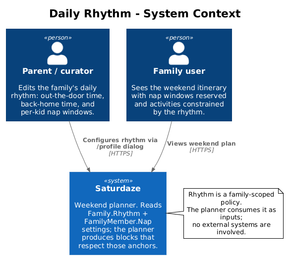
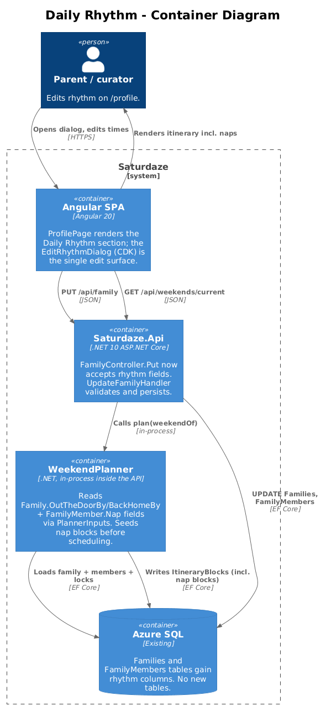
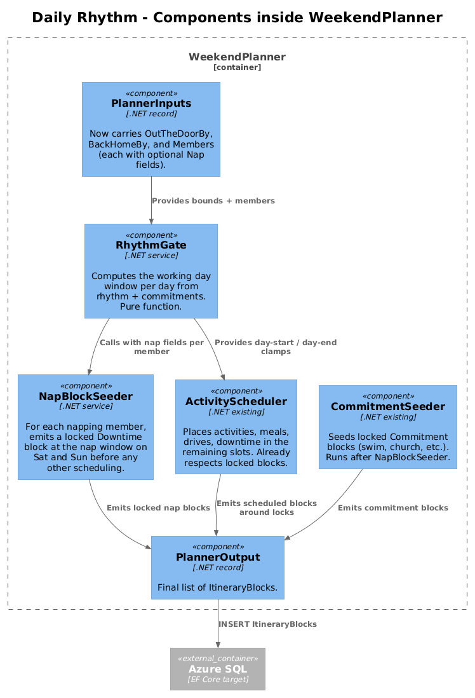
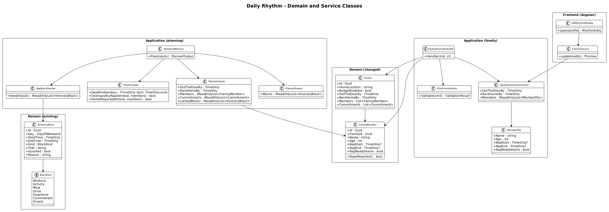
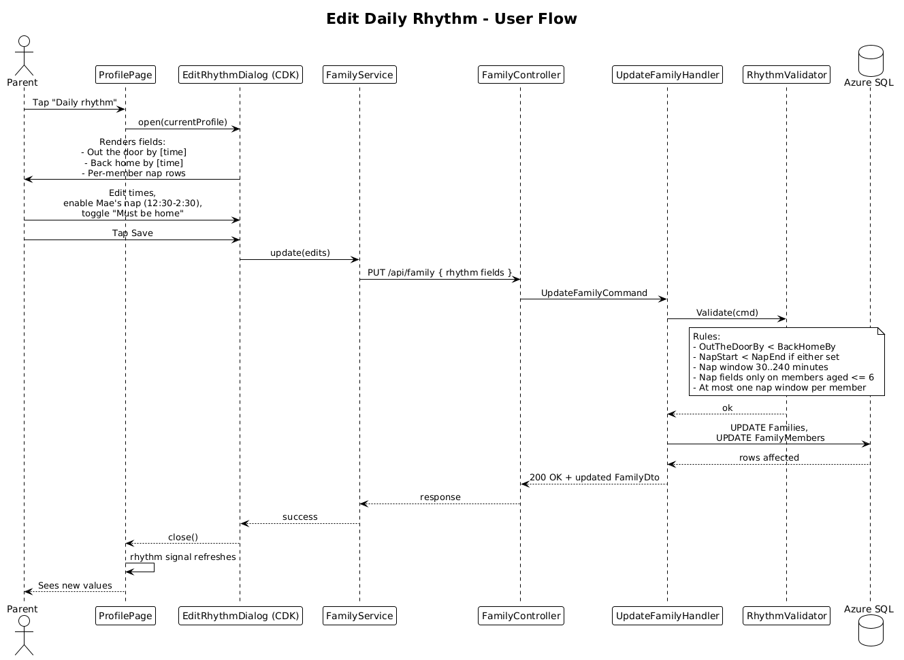
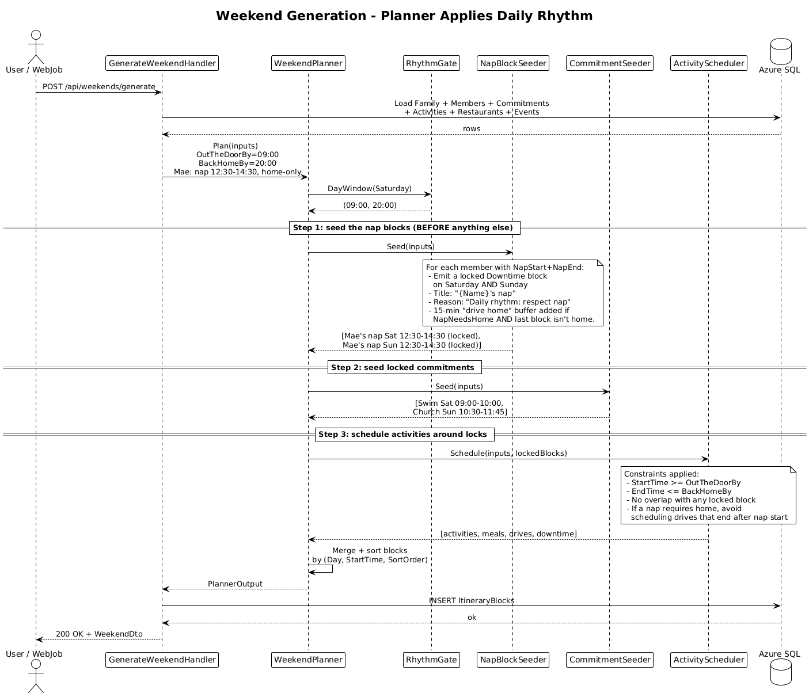

# Daily Rhythm — Detailed Design

> Status: **Draft** — first version, awaiting review.
> Owner: Quinn (sole maintainer).
> Last updated: 2026-05-17.

## 1. Overview

Daily Rhythm is the family's *non-negotiable shape of a day* — the times around which everything else has to fit. For Saturdaze it has to mean three real things:

1. **Out the door by** — the family is not actually mobile before this time, so don't propose a 7:00 am farmer's market for a household whose youngest is being dressed at 9:15.
2. **Back home by** — the family must be at home in time to start the evening (dinner, bath, bedtime). No activity, no drive home, no "one more thing" past this.
3. **Naps — per kid.** A two-year-old naps every day. Miss it once and the weekend is over. The planner *must* reserve the nap window, ideally at home, and shape every other block to land on either side of it. This is the make-or-break case the product has to nail; if Saturdaze surfaces a "fun" 1:00 pm activity to a family whose toddler melts down at 12:45, the product is broken.

Today (see Section 2) the Profile page has a "Daily rhythm" section that looks editable but isn't, the database has no rhythm fields, the API has no place to put them, and the planner — `WeekendPlanner` — has hardcoded `DayStart = 09:00` and `DayEnd = 21:00` in `PlannerTimes.cs` regardless of who the family is. This design closes every part of that gap.

**Scope.** Make the rhythm storable per family, editable from the existing Profile page via a CDK dialog, and *actually consumed* by the planner — including a per-member nap concept that produces a locked Downtime block on Saturday and Sunday.

**Out of scope.** Per-weekday vs per-weekend rhythm (assume Saturday and Sunday share one rhythm). Multiple naps per day (toddlers only). Friday-night preview times. Per-member bedtimes (we use one family-wide `BackHomeBy` and document why in §11). Stroller/car naps as a first-class option — see §11.

**Traces to L1 requirements:**
- **L1-002** (Family Profile and Preferences): "...daily rhythm anchors..." — currently unsatisfied.
- **L1-003** (Weekend Itinerary Generation): "...time-blocked activities..." — must respect rhythm.
- **L1-004** (Itinerary Block Control): the nap block is a *locked* block; regenerate must respect it.

---

## 2. Current State (the thing we're fixing)

| Layer                                                 | What's there                                                                                                          |
| ----------------------------------------------------- | --------------------------------------------------------------------------------------------------------------------- |
| L1 spec                                                | Requires "daily rhythm anchors" on Family Profile.                                                                    |
| Backend domain (`Family.cs`, `FamilyMember.cs`)       | **No rhythm fields.** `grep -ri rhythm backend/src` returns zero matches.                                             |
| API DTO (`FamilyDto`)                                 | No rhythm fields.                                                                                                     |
| Frontend service (`family.service.ts:101`)            | `mapFamily()` always returns `rhythm: PLACEHOLDER_PROFILE.rhythm` — a hardcoded `[9:00am, 9:00pm]` literal. The backend value (which doesn't exist anyway) is never consulted. |
| Frontend Profile page (`profile.page.html:101–110`)   | Renders the two tiles. No click handler. Tapping does nothing.                                                        |
| User guide (`docs/user-guide/02-setting-up-your-family.md:78–85`) | Tells the user "tap to change the time." Untrue.                                                                      |
| Planner (`PlannerTimes.cs:6–7`)                       | `DayStart = 09:00`, `DayEnd = 21:00` — hardcoded constants. No nap concept.                                          |
| Itinerary output                                      | Never contains a nap block.                                                                                            |

The feature looks real and behaves like decoration. The fix is the entire stack.

---

## 3. The Hard Case This Design Must Solve

Imagine the Browns hypothetically grow by one — Quinn and Sara welcome a third child, Reese, age 2. Reese's reality:

- **Up at 6:30 am.** Earliest the family can leave: 09:00 (parents need coffee).
- **Naps 12:30–14:30 every day**, and *needs to be in her crib* (car naps don't stick).
- **Bedtime starts at 19:00.** Bath at 18:30. Dinner by 17:45. Realistic "must be home by" is 17:30.
- **By 11:30** she is already showing tired signs — drive home from a 60-min-away activity by then or she'll lose the nap.

Without the rhythm being real:
- Planner schedules an 11:00 Terre Bleu drive that ends at 14:30. Nap is lost. Saturday is over by 3:00 pm.
- A "Sunday Rec Room at 19:00" appears. Bath time is already underway.

With the rhythm working:
- Locked Downtime block: **Reese's nap — Sat 12:30–14:30**, in the crib at home.
- An additional 15-min drive-home buffer is enforced before the nap if a previous block isn't home.
- After 17:30 the planner doesn't schedule further family-mobile activities; only kitchen/home blocks. Sunday Rec Room at 19:00 is impossible to surface.
- Saturday's outdoor block ends at 11:45, with a 30-min drive home tucked in at 12:00, and the nap block locked starting 12:30. Saturday gets a second-half plan from 15:00 onward.

This case is the design's acceptance test.

---

## 4. Design

### 4.1 C4 Context



The parent is the only person editing rhythm. The family user just sees the consequences. There are no external systems — this is a planner-policy feature, not an integration feature.

### 4.2 C4 Container



The change footprint is small:

- **Schema**: two columns added to `Families`, three added to `FamilyMembers`. No new tables.
- **API**: `PUT /api/family` accepts the new fields. No new endpoints. The existing FamilyDto grows.
- **Planner**: a new `RhythmGate` and `NapBlockSeeder` slot into the existing `WeekendPlanner` flow. The current `PlannerTimes` constants get replaced by per-family values from `PlannerInputs`.
- **Frontend**: one CDK dialog (`EditRhythmDialog`) — the existing Profile page's static Daily Rhythm section becomes editable.

### 4.3 C4 Component (inside the planner)



The planner is now four small stages in series:

1. **`RhythmGate`** — computes the working day window (start, end) from `OutTheDoorBy` / `BackHomeBy`.
2. **`NapBlockSeeder`** — for each napping member, emits a locked Downtime block on Sat and Sun *before any other scheduling*.
3. **`CommitmentSeeder`** (existing) — emits locked Commitment blocks (swim, church).
4. **`ActivityScheduler`** (existing) — places activities, meals, drives, downtime in the remaining slots, treating the seeded locks as immovable.

Critically, nap blocks are seeded **first** so the rest of the schedule is built around them, not the other way around. This is the difference between "the planner happened to leave 12:30–14:30 empty" and "the planner is constitutionally unable to put anything there."

---

## 5. Data Model

### 5.1 Class diagram



### 5.2 Entity changes

#### `Family` (modified)

| Column          | Type        | Default | Notes                                                              |
| --------------- | ----------- | ------- | ------------------------------------------------------------------ |
| `OutTheDoorBy`  | `time(0)`   | `09:00` | Earliest start time for any mobile family activity.                |
| `BackHomeBy`    | `time(0)`   | `20:00` | Latest end time for any mobile family activity. Default sized to fit a 7-pm dinner. |

`time(0)` is SQL Server's `TIME` type at second precision; EF Core maps to `TimeOnly`. Both columns are `NOT NULL`. Migration backfills existing rows with the defaults (one family today; the Browns).

#### `FamilyMember` (modified)

| Column          | Type        | Default | Notes                                                              |
| --------------- | ----------- | ------- | ------------------------------------------------------------------ |
| `NapStart`      | `time(0)?`  | `NULL`  | When the nap typically begins. NULL means this member doesn't nap. |
| `NapEnd`        | `time(0)?`  | `NULL`  | When the nap typically ends. NULL when `NapStart` is NULL.         |
| `NapNeedsHome`  | `bit`       | `1`     | When true, the planner enforces a home-by-nap-start constraint and avoids scheduling drives that end after `NapStart - 15 min`. |

Convention: `NapStart` and `NapEnd` are either *both* set or *both* NULL — enforced by a `CHECK ((NapStart IS NULL AND NapEnd IS NULL) OR (NapStart IS NOT NULL AND NapEnd IS NOT NULL AND NapEnd > NapStart))` constraint.

A derived domain method `FamilyMember.NapsRequired()` returns `NapStart.HasValue` for readability inside the planner.

#### Why these are columns on `Family` / `FamilyMember`, not a separate `DailyRhythm` table

Radical-simplicity check: a `DailyRhythm` table with a 1:1 FK to `Family` would add a join for every read in exchange for "logical grouping." The two columns belong to the family the same way `HomeLocation` does. Same for nap fields on the member — they describe the member. No table extracted; no parallel entity introduced. If we add ten more rhythm anchors later (lunch window, snack-by, screen-time start), we'll re-evaluate.

### 5.3 Why no per-member bedtime

A natural extension is `FamilyMember.BedTimeBy`, so a 2-year-old going to bed at 19:00 and a 9-year-old at 21:00 produce different effective `BackHomeBy` values for different members. That's correct but over-models the v1 problem:

- The whole family stops doing mobile activities when the youngest is going to bed (you can't leave a 2-year-old at home).
- The user is already capable of writing `BackHomeBy = 17:30` to encode "we need to start Reese's bath at 18:30."
- A computed-from-members `BackHomeBy` is an extension worth doing later, not now.

Documented as Open Question 11.2.

---

## 6. Component Details

Every new or materially changed class.

### 6.1 `Family` (domain — modified)

- **File:** `backend/src/Saturdaze.Domain/Entities/Family.cs`
- **Change:** add `OutTheDoorBy` and `BackHomeBy` properties (both `TimeOnly`).
- **Invariant:** `BackHomeBy > OutTheDoorBy + 1 hour`. Enforced in `RhythmValidator`, not the entity, because the entity is plain POCO.

### 6.2 `FamilyMember` (domain — modified)

- **File:** `backend/src/Saturdaze.Domain/Entities/FamilyMember.cs`
- **Change:** add `NapStart`, `NapEnd` (nullable `TimeOnly?`), `NapNeedsHome` (`bool`, default true).
- **New method:** `public bool NapsRequired() => NapStart.HasValue;`
- **Invariant:** either both nap times are set or neither; if set, `NapEnd > NapStart` and the gap is between 30 minutes and 4 hours. Enforced in `RhythmValidator`.

### 6.3 `RhythmGate` (application — new)

- **File:** `backend/src/Saturdaze.Application/Planning/RhythmGate.cs`
- **Responsibility:** stateless helper that the planner asks "what's the working window for this day?" and "is a candidate block legal vs. the rhythm?"
- **Public API:**
  ```csharp
  public (TimeOnly Start, TimeOnly End) DayWindow();
  public bool OverlapsAnyNap(TimeOnly start, TimeOnly end, IReadOnlyList<FamilyMember> members);
  public bool HomeRequiredAt(TimeOnly time, IReadOnlyList<FamilyMember> members);
  ```
- **Why a class:** the planner already has many small predicates; pulling these three out makes them unit-testable without spinning up the whole planner.

### 6.4 `NapBlockSeeder` (application — new)

- **File:** `backend/src/Saturdaze.Application/Planning/NapBlockSeeder.cs`
- **Responsibility:** convert each napping member into two locked `ItineraryBlock`s (Sat + Sun).
- **Public API:**
  ```csharp
  public IReadOnlyList<ItineraryBlock> Seed(PlannerInputs inputs);
  ```
- **Emitted block shape:**
  - `Kind = BlockKind.Downtime`
  - `IsLocked = true`
  - `Title = $"{member.Name}'s nap"`
  - `Reason = "Daily rhythm: respect nap window"`
  - `StartTime = member.NapStart!`, `EndTime = member.NapEnd!`
  - `Day = Saturday` and `Day = Sunday` (two blocks per napping member)
- **Why a separate class:** the `WeekendPlanner` already has multiple seeders (commitments). One more, sitting first in the chain, is consistent with the existing pattern. Plus, "nap-block creation rules" is a thing that will grow (nap rigidity, multiple naps, weekday vs weekend) — having a class to put it in is cheap insurance.

### 6.5 `WeekendPlanner` (application — modified)

- **File:** `backend/src/Saturdaze.Application/Planning/WeekendPlanner.cs`
- **Change:** new pipeline order — `RhythmGate` → `NapBlockSeeder` → `CommitmentSeeder` → `ActivityScheduler`. Where the current code references `PlannerTimes.DayStart` / `DayEnd`, swap to `inputs.OutTheDoorBy` / `inputs.BackHomeBy` (or `RhythmGate.DayWindow()` for readability).
- **Net new code:** ~30 lines (wiring + the two new constraints). The existing scheduler doesn't need changes — it already respects locked blocks.

### 6.6 `PlannerInputs` (application — modified)

- **File:** `backend/src/Saturdaze.Application/Planning/PlannerInputs.cs`
- **Change:** add `OutTheDoorBy : TimeOnly` and `BackHomeBy : TimeOnly` to the existing record. The existing `Members : IReadOnlyList<FamilyMember>` is already there; the nap fields ride along on the members.

### 6.7 `PlannerTimes` (application — modified)

- **File:** `backend/src/Saturdaze.Application/Planning/PlannerTimes.cs`
- **Change:** delete `DayStart` and `DayEnd` (now per-family). Keep `LunchWindowStart/End`, `DinnerWindowStart/End`, `MealMinutes`, etc. — those remain centralised constants because meal windows are intentionally not family-tunable in v1.

### 6.8 `UpdateFamilyCommand` (application — modified)

- **File:** `backend/src/Saturdaze.Application/Family/UpdateFamilyCommand.cs` (existing MediatR command)
- **Change:** add `OutTheDoorBy`, `BackHomeBy`, and the per-member nap fields to the existing command shape.

### 6.9 `UpdateFamilyHandler` (application — modified)

- **File:** `backend/src/Saturdaze.Application/Family/UpdateFamilyHandler.cs`
- **Change:** persist the new fields. Add a `RhythmValidator.Validate(cmd)` call at the top; reject with a 400 if invalid.

### 6.10 `RhythmValidator` (application — new, tiny)

- **File:** `backend/src/Saturdaze.Application/Family/RhythmValidator.cs`
- **Responsibility:** enforce the cross-field invariants in one place.
  - `BackHomeBy > OutTheDoorBy + 1h`
  - For each member: nap fields all-set or all-NULL.
  - If nap is set: `NapEnd > NapStart`, gap in `[30 min, 4 hours]`.
  - Nap allowed only for members with `Age <= 6`. (A 12-year-old "napping" is almost certainly a misconfiguration; gate it.)
- **Why a class:** validation lives in the application layer for now (no FluentValidation dependency added — radical simplicity). One static method, fully testable.

### 6.11 `FamilyController` (API — modified)

- **File:** `backend/src/Saturdaze.Api/Controllers/FamilyController.cs`
- **Change:** the existing `PUT /api/family` controller method accepts the new fields via the (already-expanded) `UpdateFamilyCommand`. No route change. No new endpoint.

### 6.12 `EditRhythmDialog` (frontend — new)

- **File:** `frontend/projects/saturdaze/src/app/dialogs/edit-rhythm-dialog/edit-rhythm-dialog.ts`
- **Pattern:** CDK `Dialog` (per the project's "no inline forms" memory). Opens from a click on the Daily Rhythm section header in `ProfilePage`.
- **Form contents:**
  - Time picker — *Out the door by* (default current value)
  - Time picker — *Back home by*
  - For each member with `Age <= 6` (computed in the page from the family signal): a row with a toggle *"{Name} naps?"* and, when on, two time pickers (Start, End) plus a *"Must be home for nap"* toggle.
- **On save:** calls `FamilyService.update(edits)` → `PUT /api/family` → on success, closes and lets the page's signal refresh.
- **Why a new dialog rather than reusing existing edit dialogs:** the existing edit-family-member dialog is per-member; this one is family-wide + multi-member in one shot. A dedicated dialog keeps the form short.

### 6.13 `FamilyService` (frontend — modified)

- **File:** `frontend/projects/api/src/lib/services/family.service.ts`
- **Change:** delete the hardcoded `rhythm: PLACEHOLDER_PROFILE.rhythm` mapping. Build `rhythm` from the real DTO fields (`outTheDoorBy`, `backHomeBy`, per-member nap fields) — same `RhythmEntry` shape the Profile page already reads, just sourced from real data.

### 6.14 `ProfilePage` (frontend — modified)

- **File:** `frontend/projects/saturdaze/src/app/pages/profile/profile.page.html` and `.ts`
- **Change:** wire a click handler on the Daily Rhythm section that opens `EditRhythmDialog`. Show the per-member nap rows below the two family-wide rows when present.

### 6.15 What we are deliberately *not* adding

- No `IRhythmGate` interface. One implementation, no swap-out scenario.
- No `RhythmAnchor` polymorphic entity. Two named columns are clearer than a generic `(kind, value)` table.
- No new audit table. Rhythm changes are auditable via existing infrastructure if needed (App Service logs, plus we can `LastUpdatedUtc` on `Family` in a later iteration).
- No client-side validation library. The dialog uses Angular Reactive Forms' built-in validators; the server is the source of truth.
- No timezone handling. Rhythm is local-time-of-day; the family's home timezone is implicit. This is correct for the product's scope (single-region rollout).

---

## 7. Key Workflows

### 7.1 Editing the rhythm



Single round trip from dialog to DB. Validation is server-side (the dialog uses Reactive Forms required/min/max validators for UX; the server enforces the actual rules).

### 7.2 Generation with rhythm applied



The order matters: **seed nap blocks before commitment blocks before activity scheduling**. The existing scheduler already treats locked blocks as immovable, so by the time it runs, the nap windows are already taken.

The 15-minute drive-home buffer for `NapNeedsHome=true` is the subtle one: if a 60-min-away activity ends at 12:00 and the nap starts at 12:30, that leaves 30 min for a 30-min drive — exactly tight enough to fail. The planner subtracts a 15-min buffer from the scheduling cap so the activity ends at 11:45 instead, leaving 45 min of margin.

---

## 8. API Contract

```http
PUT /api/family
Content-Type: application/json
Authorization: Bearer ...

{
  "homeLocation": "Port Credit, Mississauga, ON",
  "budgetEnabled": false,
  "outTheDoorBy": "09:00",
  "backHomeBy":   "20:00",
  "members": [
    { "name": "Quinn", "age": 38 },
    { "name": "Sara",  "age": 36 },
    { "name": "Eli",   "age": 9  },
    { "name": "Mae",   "age": 5  },
    {
      "name": "Reese", "age": 2,
      "napStart": "12:30",
      "napEnd":   "14:30",
      "napNeedsHome": true
    }
  ],
  "commitments": [...],
  "preferences": [...]
}
```

Response: `200 OK` with the updated `FamilyDto`. Error: `400` with `{ code: "validation_failed", message: "..." }`.

Backward compatibility: existing clients that don't send the new fields receive validation errors. Migration: backfill defaults in a SQL `UPDATE` before deploying the API change (or include them in the EF Core migration's `Up` method).

---

## 9. UI Sketch (text)

```
PROFILE
─────────────────────────
Daily rhythm                                          ✎  ← tap to edit
─────────────────────────
🏠  Out the door by                              9:00am
🛏️  Back home by                                 8:00pm
💤  Reese's nap                          12:30 – 2:30pm
💤  (taps to expand: must be home for nap ✓)
```

Edit dialog (CDK):

```
┌─ Edit daily rhythm ────────────────────────┐
│                                            │
│ Out the door by      [ 09:00 ] ▼           │
│ Back home by         [ 20:00 ] ▼           │
│                                            │
│ Naps                                       │
│ ─────────────────                          │
│  Reese, 2     [●—] naps                    │
│    Start    [ 12:30 ] ▼                    │
│    End      [ 14:30 ] ▼                    │
│    Must be home for nap     [●—]           │
│                                            │
│  Mae, 5       [—●] no naps                 │
│                                            │
│        [ Cancel ]   [ Save ]               │
└────────────────────────────────────────────┘
```

(Only members with `Age <= 6` show the nap toggle; older members are listed with the toggle disabled and labelled "no naps.")

---

## 10. Edge Cases and How the Design Handles Them

| Case                                                                                 | Behaviour                                                                                                                                            |
| ------------------------------------------------------------------------------------ | ---------------------------------------------------------------------------------------------------------------------------------------------------- |
| Family has no napping members.                                                       | `NapBlockSeeder.Seed()` returns empty. Planner behaves like today, plus the personalised `OutTheDoorBy` / `BackHomeBy`.                              |
| Two kids with overlapping nap windows.                                                | Two nap blocks emitted, one per member. They may overlap in the itinerary; the rendered timeline shows both with the offender's name. Planner treats it as one locked window covering the union. |
| Two kids with non-overlapping nap windows.                                            | Both windows reserved as separate locked blocks. The planner can put a low-key home activity between them if it fits; usually it can't.              |
| Nap window collides with a Commitment (e.g. Swim 12:00–13:00, nap 12:30–14:30).      | Commitment wins (a real-world appointment beats a rhythmic default). `RhythmValidator` emits a *warning* (returned in the response body) so the dialog can flag it. The nap block is still emitted but trimmed to the non-overlapping portion (13:00–14:30); if that's < 30 min, it's dropped. |
| User saves with `BackHomeBy < OutTheDoorBy + 1h`.                                     | Server returns 400. Dialog surfaces the message.                                                                                                     |
| User saves with `NapStart >= NapEnd`.                                                  | Same — server 400 + dialog error.                                                                                                                    |
| User saves a 10-hour nap.                                                              | Server caps at 4 hours and returns 400. ("If your kid sleeps 10 hours in the day, you have other problems.")                                          |
| Nap is set but `NapNeedsHome=false`.                                                   | Planner still reserves the window as locked Downtime but skips the home-by-nap-start drive constraint. Useful for "she sleeps in the car" families.   |
| Member is removed from the family.                                                    | Their nap block disappears on next plan. Existing weekend blocks are untouched (already persisted).                                                  |
| `OutTheDoorBy` change happens after a weekend is already generated.                    | The current weekend keeps the blocks it has. Next regenerate uses the new window. The locked Commitment + nap blocks survive.                        |
| Weather is bad and the planner wants to keep everyone home.                            | Unchanged — the existing "rainy day" fallback path now also gets to know about the nap and `BackHomeBy`, but doesn't otherwise change behaviour.      |
| Planner can't satisfy all constraints.                                                  | Same as today's behaviour for over-constrained input: it emits what it can and the gaps appear as Downtime. The locks always win.                    |

---

## 11. Open Questions

1. **Nap rigidity granularity.** Right now `NapNeedsHome` is a single bool. A real model might be a three-way enum: `Anywhere | Stroller | HomeOnly`. Worth promoting later if user feedback says the binary is too coarse. Not blocking v1.

2. **Per-member bedtime → derived `BackHomeBy`.** As discussed in §5.3 — defer.

3. **Per-day-of-week rhythm.** Some families have a wildly different Sunday (church). Today rhythm is one set of values for Saturday *and* Sunday. If this becomes a real ask, the cleanest extension is duplicating the columns: `OutTheDoorBySat`, `OutTheDoorBySun`, etc. Or splitting into a `DailyRhythm` table keyed by `(FamilyId, DayOfWeek)`. The latter is the right model if this is the second feature in this area; not the first.

4. **"Quiet hours" / screen-time start.** Adjacent feature — surface "no screens after 18:00" as a softer rhythm constraint that the planner could honour by avoiding indoor cinema after that hour. Out of scope.

5. **Friday preview window**. The Friday 6 pm preview email/notification (mentioned in `Preferences`) might want its own time. Trivially additive.

6. **Validating commitment-vs-nap collisions at save time vs plan time.** Today the design surfaces the warning at plan time via the response body. It might be friendlier to surface it in the edit dialog as the user types ("This collides with Swim on Saturday 12:00–13:00. The nap block will be 13:00–14:30 on Saturdays."). Adds client-side cross-form logic; defer.

7. **Locked nap blocks visible to children's avatars.** Should the day-card chip on the Home page surface "💤 Reese 12:30" the way commitments do? Probably yes — small UI follow-up.

8. **History/repeat.** When the user "Use this weekend as current" (per L1-010) and a nap shifted in the meantime, we need to fix-up. v1 punts: re-running the planner against the new rhythm and the old "saved" picks is a re-plan, and locks are re-seeded fresh.

---

## 12. Implementation Plan (one-pager)

Each step is independently shippable; rhythm remains "fake" until step 8 lands, but no regression in between.

1. **Migration** — add the two columns to `Families` and the three columns to `FamilyMembers`. Backfill defaults via SQL `UPDATE` (one family today). Add the `CHECK` constraint on nap fields.
2. **Domain + DTO** — extend `Family`, `FamilyMember`, `FamilyDto`, `FamilyMemberDto`. Compile-only.
3. **API** — extend `UpdateFamilyCommand` + `UpdateFamilyHandler` to persist the new fields. Add `RhythmValidator`. Unit tests for validation rules.
4. **`RhythmGate` + `NapBlockSeeder`** — pure domain logic, fully unit-tested against the spec table in §10.
5. **`WeekendPlanner`** — wire the two new steps. Switch from `PlannerTimes.DayStart` to `inputs.OutTheDoorBy`. Existing planner tests should still pass with default rhythm; add new tests for nap-seeded output.
6. **Frontend service** — delete the hardcoded `PLACEHOLDER_PROFILE.rhythm` and source from the DTO. The Profile page now shows real values.
7. **`EditRhythmDialog`** — CDK dialog + form + save → service → API. Open from `ProfilePage`'s Daily Rhythm header tap.
8. **User-guide doc edit** — update `docs/user-guide/02-setting-up-your-family.md` step 5 to describe naps and per-member fields. (The user guide currently lies; this step makes it true.)
9. **Smoke test** — add a 2-year-old member to the seed `family.json` (or the demo family on prod), set a 12:30–14:30 nap, regenerate the weekend, confirm the nap appears as a locked Downtime block and surrounding activities respect it.

---

## 13. Why This is the Radically Simple Pick

Walking the simplicity checklist from the skill prompt:

| Question                                                                          | Answer                                                                                                        |
| --------------------------------------------------------------------------------- | ------------------------------------------------------------------------------------------------------------- |
| Does a specific requirement force every component to exist?                       | Yes — L1-002 mandates the data; L1-003/L1-004 mandate the planner respecting it; the make-or-break case in §3 mandates per-member naps. |
| Could this be one thing instead of two?                                           | Considered merging `RhythmGate` and `NapBlockSeeder`. They have distinct responsibilities (computing a window vs emitting blocks) and the planner already has multiple seeders — splitting matches the existing pattern. Kept separate. |
| Interface with one implementation?                                                | None. `RhythmGate`, `NapBlockSeeder`, `RhythmValidator` are all concrete classes.                              |
| Real problem or imagined?                                                         | Real — see §2 ("the user guide currently lies") and §3 (toddler nap case).                                    |
| Reuses what exists?                                                               | Yes — same `Family`, `FamilyMember`, `ItineraryBlock`, `Commitment` entities; same Clean Architecture layout; same MediatR command handlers; same locked-block respect already in the scheduler; same CDK dialog pattern; same Profile page; same `PUT /api/family` endpoint. |
| New Azure infra?                                                                  | None.                                                                                                          |

The cheapest plausible alternative is "just add the two family-wide fields and ignore naps." That's a rectangle drawn around the easy half of the problem — and the half that doesn't matter much in product terms. Toddler nap reservation is the entire reason this feature is worth doing.
