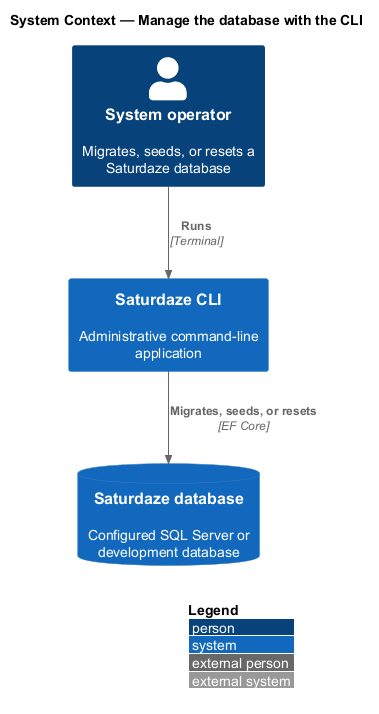
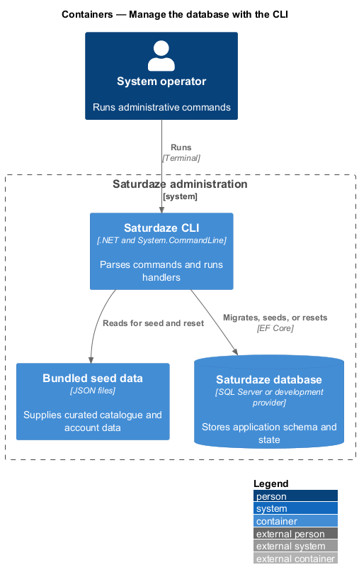
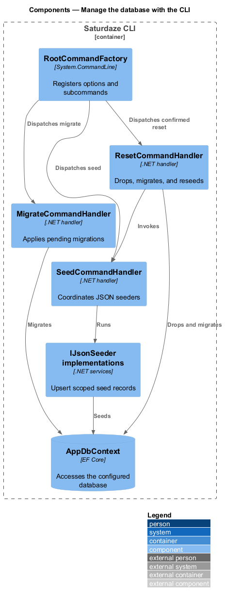
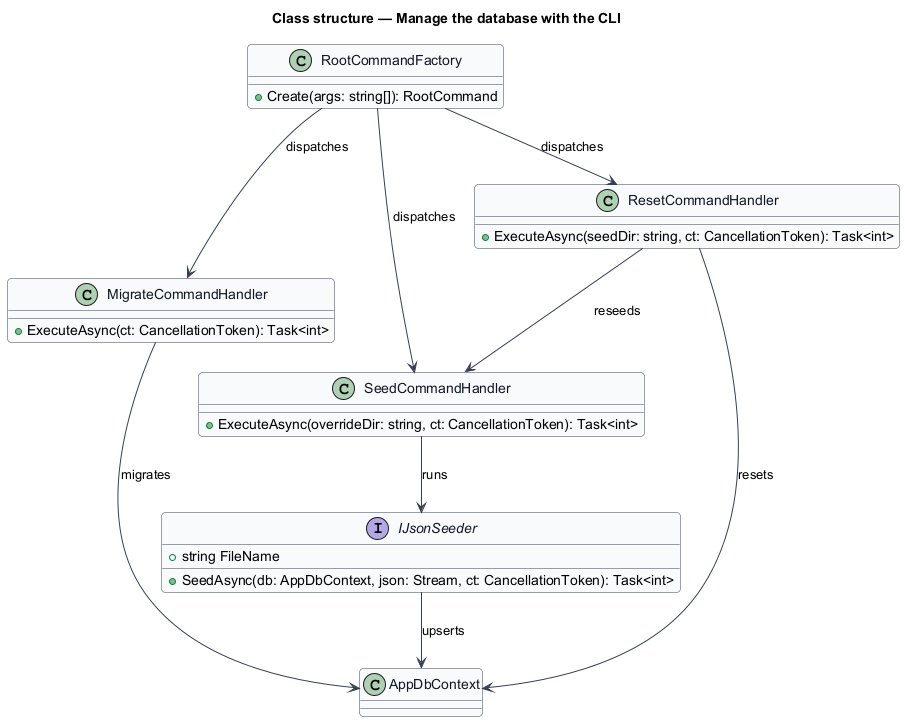
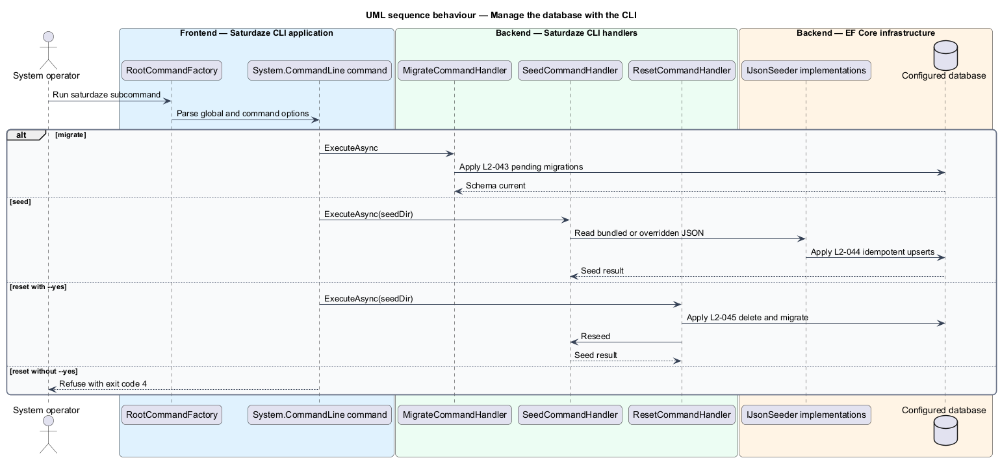

# Manage the database with the CLI

## Overview

Saturdaze combines an Angular web application, an ASP.NET Core API, SQL Server persistence, and administrative delivery tooling. The `saturdaze` command-line application is the supported entry point for migrations, deterministic seed data, and confirmed development resets.

*natural key* — stable business identifier used to detect an existing seed row

`RootCommandFactory` binds global database options and the three subcommands. Each handler resolves `AppDbContext` through the same host and provider configuration.

## Description

The feature crosses the application and platform boundaries needed to deliver its observable outcome.

- **`RootCommandFactory`** — System.CommandLine composition root for global options and subcommands.
- **`MigrateCommandHandler`** — Handler that invokes `Database.MigrateAsync()` and sanitizes logged connection details.
- **`SeedCommandHandler`** — Handler that resolves seed files and runs every registered `IJsonSeeder`.
- **`IJsonSeeder implementations`** — Activity, restaurant, local-event, family, user, and event-submission seeders.
- **`ResetCommand and ResetCommandHandler`** — Confirmed destructive command that drops, migrates, and reseeds.
- **`DbContextRegistrar and AppDbContext`** — Shared provider and EF Core persistence configuration.

## Requirements

The feature realizes the following level-2 (L2) requirements. Each row cites the level-1 (L1) capability refined by the requirement.

| L2 ID | Refines (L1) | Requirement |
|-------|--------------|-------------|
| `L2-043` | `L1-017` | The `saturdaze migrate` CLI command must apply pending EF Core migrations to the configured database and must be safe to run repeatedly. |
| `L2-044` | `L1-017` | The `saturdaze seed` CLI command must seed activities, restaurants, local events, the Brown family, and seed users from bundled JSON, must skip rows that already exist (by natural key), and must accept a `--seed-dir` override. |
| `L2-045` | `L1-017` | The `saturdaze reset` CLI command must drop the schema, re-apply migrations, and re-seed, gated behind a confirmation step (or `--yes`). |

## Diagrams

### System context

The context view identifies the person using or operating the capability and the participating system boundary.

### Containers

The container view shows the deployable applications, platform services, or data stores that carry the feature.

### Components

The component view names the runtime or delivery components that implement the slice.

### Class structure

The class view shows the code and configuration relationships that control the feature.

### Behaviour — run an administrative database command

The sequence view traces the primary behaviour to `L2-043`, `L2-044`, and `L2-045`. Its alternate path shows the controlled non-success outcome.

