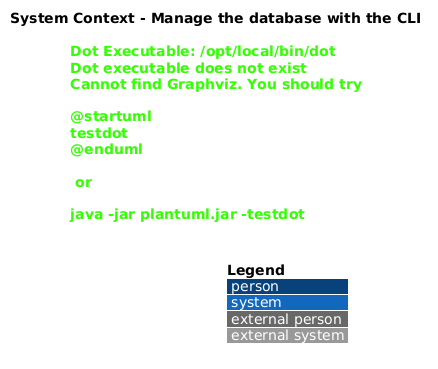
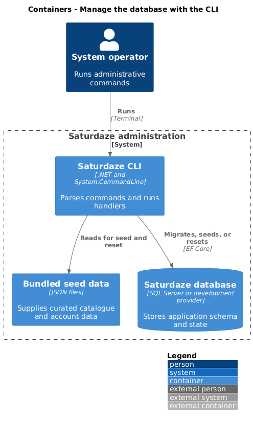
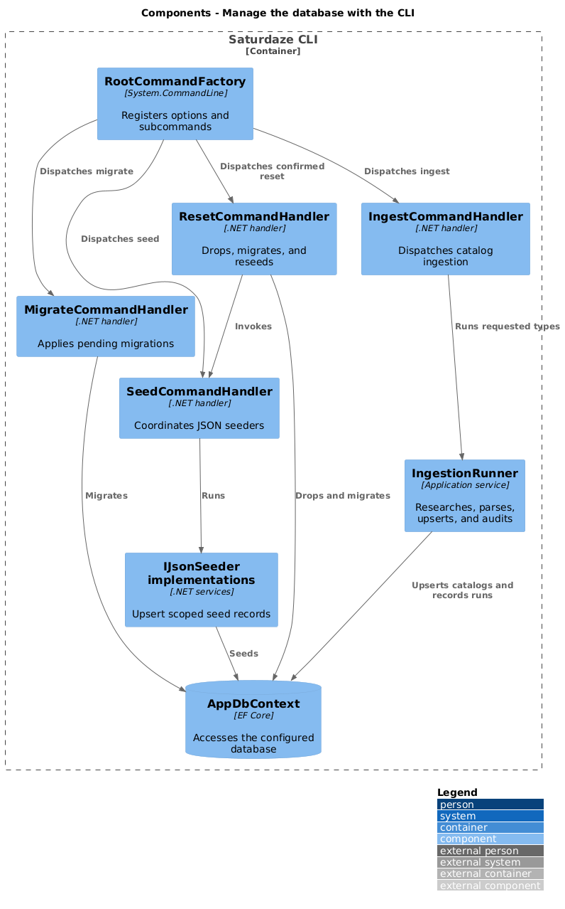
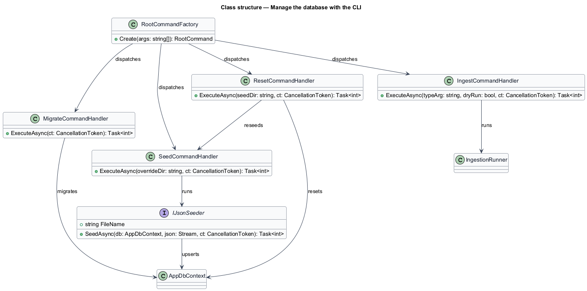
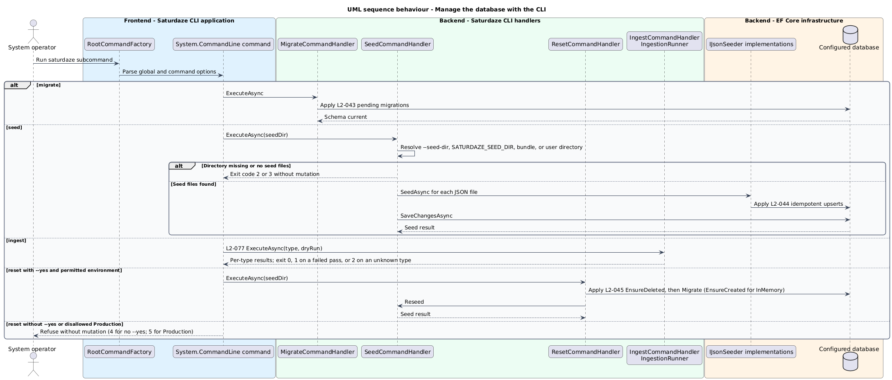

# Manage the database with the CLI

## Overview

Saturdaze combines an Angular web application, an ASP.NET Core API, SQL Server persistence, and administrative delivery tooling. The `saturdaze` command-line application is the supported entry point for migrations, deterministic seed data, confirmed development resets, and catalog ingestion.

*natural key* — stable business identifier used to detect an existing seed row

`RootCommandFactory` binds four global options (`--provider`, `--connection`, `--seed-dir`, `--verbose`) and four subcommands. Each handler resolves `AppDbContext` through the same host and provider configuration.

## Description

`RootCommandFactory` registers `migrate`, `seed`, `reset`, and `ingest`. `CliHostFactory` resolves an explicit connection flag before `SATURDAZE_CONNECTION`, connection-string configuration, and the SQLite user-directory default.

`MigrateCommandHandler` calls EF `MigrateAsync` on the configured provider without a relational-provider check. `SeedPathResolver` selects `--seed-dir`, then `SATURDAZE_SEED_DIR`, bundled JSON, and finally the legacy user directory. `SeedCommandHandler` runs six `IJsonSeeder` implementations: activities, restaurants, local events, family, users, and event submissions. Seeders update existing natural keys and insert missing records. The command exits with code 2 when the seed directory is missing and code 3 when it holds no seed files.

`ResetCommand` requires `--yes`; Production additionally requires `--allow-production`. `ResetCommandHandler` deletes the target database, recreates its schema, and seeds it. It applies migrations for relational providers and calls `EnsureCreatedAsync` for the `InMemory` provider. A missing `--yes` exits with code 4; a blocked Production reset exits with code 5. Connection details pass through `ConnectionStringSanitizer` before logging.

`IngestCommandHandler` calls `IngestionRunner` and exits with code 2 for an unknown `--type` and code 1 when any pass fails; its pipeline and dry-run behavior are described in [Ingest catalogs](../../discovery/ingest-catalogs/README.md). `eng/Start-FreshStack.ps1` packages and invokes the CLI for local stack preparation.

## Requirements

The following L2 requirements refine the cited L1 capabilities. Implementation gaps stated in Description do not waive these obligations.

| L2 ID | Refines (L1) | Requirement |
|-------|--------------|-------------|
| `L2-043` | `L1-017` | The `saturdaze migrate` CLI command shall apply pending EF Core migrations to the configured database and shall be safe to run repeatedly. |
| `L2-044` | `L1-017` | The `saturdaze seed` CLI command shall seed activities, restaurants, local events, the Brown family, and seed users from bundled JSON, shall upsert rows by natural key (an existing row is refreshed from the JSON, never duplicated), and shall accept a `--seed-dir` override. |
| `L2-045` | `L1-017` | The `saturdaze reset` CLI command shall drop the schema, re-apply migrations, and re-seed, gated by the explicit `--yes` flag, with `--allow-production` additionally required in Production. |
| `L2-077` | `L1-017`, `L1-031` | The `saturdaze ingest` command shall accept catalog types events, activities, restaurants, or all, defaulting to all. It shall use the shared ingestion runner and report per-type results. |

## Diagrams

### System context

The context view identifies the person using or operating the capability and the participating system boundary.

### Containers

The container view shows the deployable applications, platform services, or data stores that carry the feature.

### Components

The component view names the runtime or delivery components that implement the slice.

### Class structure

The class view shows selected code and configuration relationships. Cancellation parameters and unrelated members are omitted.

### Behaviour — run an administrative database command

The sequence view traces the primary behaviour to `L2-043`, `L2-044`, and `L2-045`. Its alternate path shows the controlled non-success outcome.

