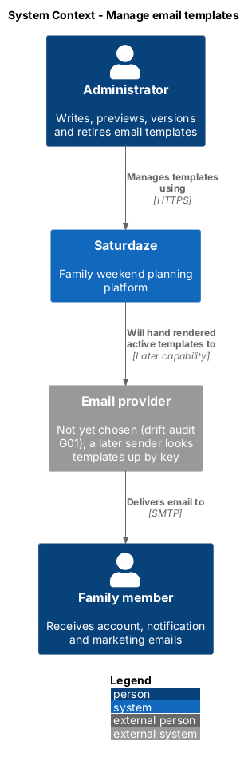
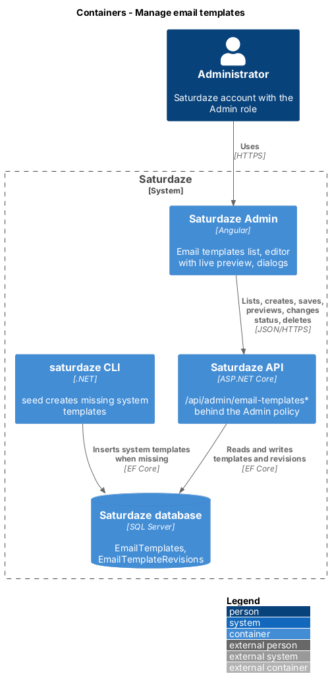
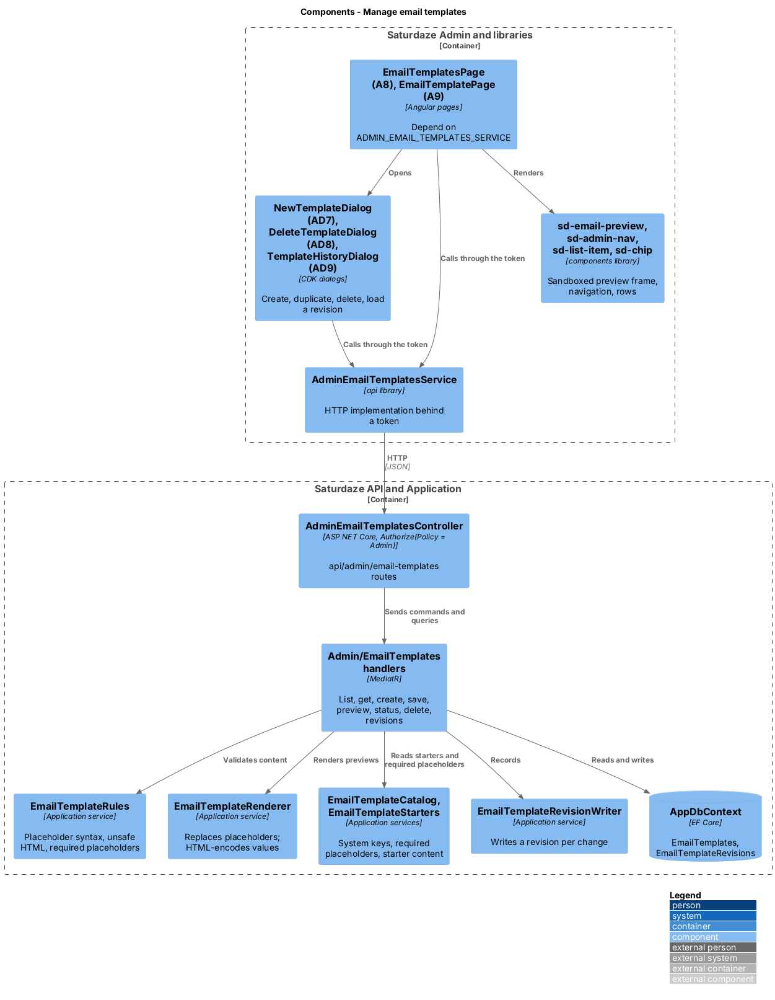
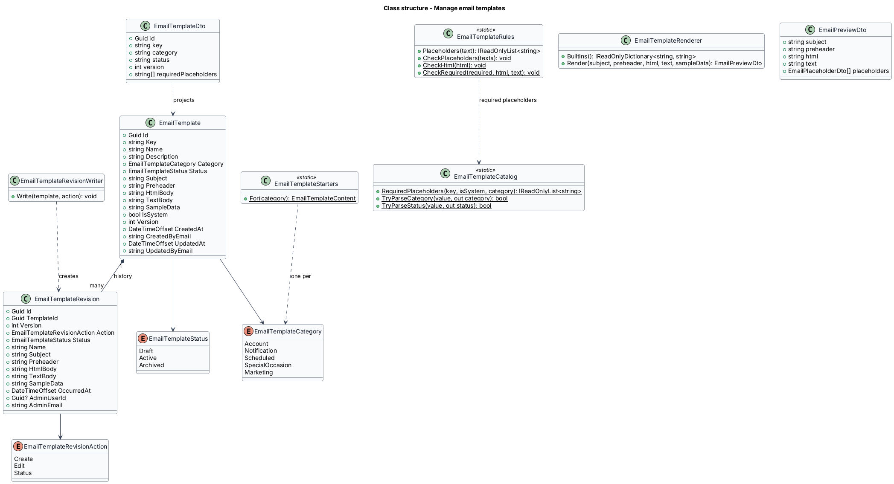
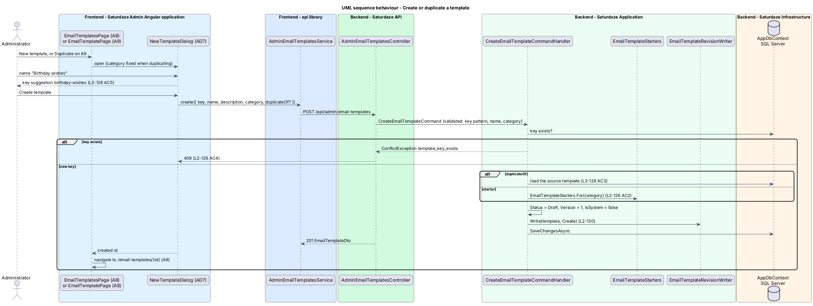
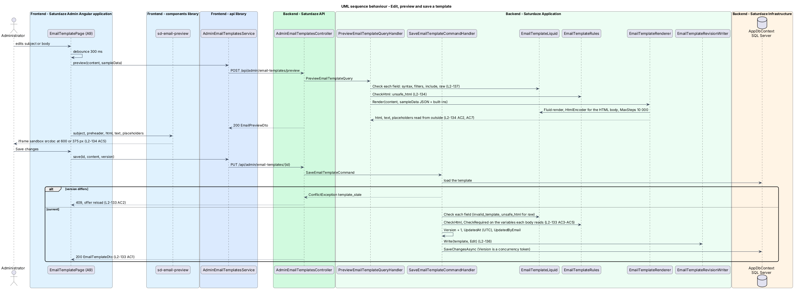
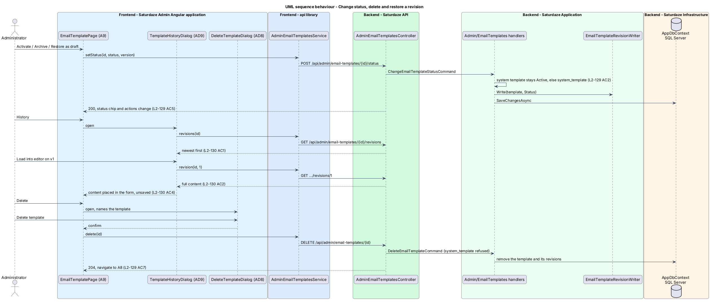

# Manage email templates

## Overview

Saturdaze is a web application that plans personalized family weekends. The API already drafts two account emails, email verification and password reset, but their wording lives in no editable place and no email provider sends them yet (drift audit gap G01, video 18). Later capabilities add scheduled emails, notifications, special-occasion greetings and marketing. This feature gives those emails one managed home: an administrator writes, previews, versions and retires email templates from Saturdaze Admin (`scaffold-admin-application`), and a later sender looks an active template up by its key.

*email template* — named, categorized email content: a subject, a preheader, an HTML body and a plain-text body

*key* — immutable, unique identifier a sender uses to find a template, such as `account.password-reset`; lowercase words joined by dots or hyphens

*category* — what the template is for: `Account`, `Notification`, `Scheduled`, `SpecialOccasion` or `Marketing`; fixed at creation

*status* — lifecycle state: `Draft` (being written), `Active` (available to senders) or `Archived` (retired, kept for reference)

*placeholder* — `{{name}}` marker in the content that a sender fills with a value at send time; names use letters, digits and underscores in dot-separated parts

*sample data* — per-template placeholder values the preview uses in place of real recipient data

*built-in placeholder* — placeholder every template may use without sample data: `appName`, `appUrl`, `recipientName`, `recipientEmail`, `unsubscribeUrl`, `currentYear`

*system template* — template the platform itself depends on (`account.verify-email`, `account.password-reset`); editable, never deleted, archived or left without its required placeholder

*revision* — immutable snapshot of a template written on every create, save and status change

The slice touches no family data. Templates hold content, not recipients; the preview renders sample values only.

## Description

### Domain

`EmailTemplate` (`Saturdaze.Domain/Entities`) carries `Id`, `Key`, `Name`, `Description`, `Category` (`EmailTemplateCategory`), `Status` (`EmailTemplateStatus`), `Subject`, `Preheader`, `HtmlBody`, `TextBody`, `SampleData` (a JSON object of placeholder name to sample value), `IsSystem`, `Version`, `CreatedAt`, `CreatedByEmail`, `UpdatedAt`, `UpdatedByEmail` and `UpdatedBy` (nullable administrator id). `Version` starts at 1 and increases by one on every change; it doubles as the optimistic concurrency token.

`EmailTemplateRevision` carries `Id`, `TemplateId`, `Version`, `Action` (`EmailTemplateRevisionAction`: `Create`, `Edit`, `Status`), `Status`, `Name`, `Subject`, `Preheader`, `HtmlBody`, `TextBody`, `SampleData`, `OccurredAt`, `AdminUserId` (null for the seeder) and `AdminEmail`. Revisions are written, never updated, and are deleted with their template.

### Persistence

The migration `AddEmailTemplates` creates `EmailTemplates` with a unique index on `Key` and an index on `(Category, Status)`, and `EmailTemplateRevisions` with a unique index on `(TemplateId, Version)` and a cascading foreign key to the template. Enums are stored as strings. `HtmlBody` and `TextBody` are `nvarchar(max)` bounded by validation at 100 000 and 50 000 characters. The migration applies through `saturdaze migrate`.

`EmailTemplateSeeder` (`Saturdaze.Cli/Seed`, an `IJsonSeeder` over the bundled `email-templates.json`) inserts each system template whose key is missing as `Active`, `IsSystem = true`, version 1, with a version 1 revision. It never changes a template that exists, so an administrator's edits survive every `saturdaze seed`.

### Application

Handlers live in `Saturdaze.Application/Admin/EmailTemplates/`; `AdminEmailTemplatesController` (`api/admin/email-templates`) stays thin and carries `[Authorize(Policy = "Admin")]`.

| Handler | Route | Behaviour |
|---------|-------|-----------|
| `ListEmailTemplatesQueryHandler` | `GET /api/admin/email-templates?q=&category=&status=` | Filters by category and status, matches `q` against name, key and subject ignoring case, orders by name, returns `EmailTemplateSummaryDto` rows. |
| `GetEmailTemplateQueryHandler` | `GET /api/admin/email-templates/{id}` | Returns `EmailTemplateDto` with the content, sample data and `requiredPlaceholders`; 404 for an unknown id. |
| `CreateEmailTemplateCommandHandler` | `POST /api/admin/email-templates` | Validates the key pattern, name and category; refuses an existing key with `template_key_exists`; copies the content from `duplicateOf` or from `EmailTemplateStarters.For(category)`; creates a `Draft` at version 1 and a `Create` revision. |
| `SaveEmailTemplateCommandHandler` | `PUT /api/admin/email-templates/{id}` | Refuses a stale `version` with `template_stale` (through `EmailTemplateConcurrency`, which also turns a lost race on the `Version` token into `template_stale`), checks the content through `EmailTemplateRules`, saves name, description, subject, preheader, bodies and sample data, increments the version and writes an `Edit` revision. |
| `PreviewEmailTemplateQueryHandler` | `POST /api/admin/email-templates/preview` | Checks the content as a save would (without required placeholders) and renders it through `EmailTemplateRenderer` without touching the database. |
| `ChangeEmailTemplateStatusCommandHandler` | `POST /api/admin/email-templates/{id}/status` | Refuses any status but `Active` for a system template with `system_template`, refuses a stale version, sets the status, increments the version and writes a `Status` revision. |
| `DeleteEmailTemplateCommandHandler` | `DELETE /api/admin/email-templates/{id}` | Refuses a system template with `system_template`; deletes the template and, by cascade, its revisions; logs the key and the administrator id. |
| `ListEmailTemplateRevisionsQueryHandler` | `GET /api/admin/email-templates/{id}/revisions` | Returns revision summaries newest first. |
| `GetEmailTemplateRevisionQueryHandler` | `GET /api/admin/email-templates/{id}/revisions/{version}` | Returns one revision's full content; 404 for an unknown version. |

`EmailTemplateCatalog` holds the fixed knowledge: the system keys and their required placeholders (`verificationLink`, `resetLink`), `unsubscribeUrl` as required for every marketing template, and the wire names of categories and statuses. `EmailTemplateStarters.For(category)` returns the starter content per category. `EmailTemplateLimits` holds the field limits a save and a preview share.

`EmailTemplateRules` finds placeholders with one regular expression and raises `BadRequestException` with `invalid_placeholder` for a malformed `{{ … }}`, `unsafe_html` for `<script>`, `<iframe>`, `<object>`, `<embed>`, `<form>`, `<base>`, an `on…=` attribute or a `javascript:`, `vbscript:` or `data:text/html` URL, and `missing_placeholder` for a required placeholder absent from either body. The check is a deny-list at the point of authoring; the preview frame's sandbox is the second line of defence, and a future sender should send only active, checked content.

`EmailTemplateRenderer` replaces each placeholder with its sample value, else the built-in value, else an empty string. Values substituted into the HTML body are HTML-encoded with `WebUtility.HtmlEncode`; subject, preheader and text body take values as written. It returns the placeholders in order of first use with the value and its source (`sample`, `builtin`, `missing`). `EmailTemplateRenderer.BuiltIns()` supplies the built-in samples; `appUrl` comes from `EmailPreviewOptions.AppUrl`, bound from `Saturdaze:Email:AppUrl` and else `Saturdaze:Share:AppOrigin`. The renderer has no database dependency, so a sender can reuse it.

`EmailTemplateRevisionWriter` is the one place that creates revisions, reading the administrator from `ICurrentUserAccessor`. FluentValidation validators bound name (120), description (500), subject (1 to 200), preheader (200), HTML body (1 to 100 000) and text body (1 to 50 000); the exception middleware returns 400 with field errors.

### Frontend

`api` gains `IAdminEmailTemplatesService` with the `ADMIN_EMAIL_TEMPLATES_SERVICE` token and the HTTP implementation `AdminEmailTemplatesService` (`list`, `get`, `create`, `save`, `preview`, `setStatus`, `remove`, `revisions`, `revision`), the DTOs (`email-template.dto.ts`) and the view models (`EmailTemplateRow`, `EmailTemplateView`, `EmailPreviewView`, `EmailRevisionRow`). The admin composition root binds the token.

`AdminNavKey` gains `emails` ("Email templates", `mail` icon, `/email-templates`), so `sd-admin-nav` shows the destination in the side navigation and the top bar.

Pages in `projects/admin/src/app/pages/`:

- `EmailTemplatesPage` (A8, `/email-templates`) lists templates as `sd-list-item` rows with category, status and system chips and the last change, with a search box and Category and Status selects reflected in the query string. "New template" opens AD7.
- `EmailTemplatePage` (A9, `/email-templates/:id`) is the editor screen: a form for name, description, subject, preheader, HTML body, text body and one sample-value field per custom placeholder the content uses, beside a sticky `sd-email-preview` from 1200 px and below it under 1200 px. The header shows the key, category, version and last change and offers Save changes, History, Activate, Archive or Restore as draft, Duplicate and Delete according to the status and the system flag; the status, System and Unsaved changes chips sit directly under it, followed by the note that explains a template's required placeholders. The bodies use the `code` option of `sd-text-input` (monospace, no wrapping, no spellcheck), added for this screen with its own story. Edits trigger a preview 300 ms after the last keystroke.

Dialogs in `projects/admin/src/app/dialogs/`: `NewTemplateDialog` (AD7: name, key with a suggestion from the name, category, description; also the Duplicate flow), `DeleteTemplateDialog` (AD8: names the template, Delete template) and `TemplateHistoryDialog` (AD9: revisions newest first, Load into editor). Each opens through CDK `Dialog` with the shared `DIALOG_OPTIONS`.

`components` gains `sd-email-preview` (`EmailPreview`) with a story folder (ADR-012) and a perf-test scenario (ADR-014) that renders 50 copies, since each copy is an iframe with its own document. It shows the subject and preheader as an inbox line, an `<iframe sandbox>` with no `allow-scripts` or `allow-same-origin` whose `srcdoc` holds the rendered HTML, a Width switch (Desktop 600 px, Phone 375 px) and a Format switch (HTML, Plain text) built on `sd-seg-radio`, and the placeholder list with missing values flagged. The frame's document carries a Content-Security-Policy that blocks scripts and every fetch but HTTPS images and fonts.

### Tests

`Saturdaze.Api.Tests/Admin/EmailTemplates/` covers each endpoint with the seeded system templates: access (401, 403), list filters, create (starter, duplicate, 409, 400), save (version, `template_stale`, `unsafe_html`, `invalid_placeholder`, `missing_placeholder`), preview (sample, built-in, missing, HTML encoding), status and delete rules, and revisions. `Saturdaze.Cli.Tests` covers the seeder's insert-only behaviour. `e2e/tests/admin/email-templates.spec.ts` and `email-template-{create,edit,preview,lifecycle,history}.spec.ts` drive A8, A9 and AD7 to AD9 through `e2e/pages/admin/admin-email-templates.page.ts` and `admin-email-template.page.ts`; `e2e/fixtures/email-templates.ts` creates a template per test through the API so no spec depends on data an earlier run left behind.

### Out of scope

Sending, scheduling, audience selection, unsubscribe handling and localisation are later capabilities. Each shall look a template up by `Key` with `Status = Active` and render it through `EmailTemplateRenderer`.

## Requirements

The following L2 requirements refine the cited L1 capabilities.

| L2 ID | Refines (L1) | Requirement |
|-------|--------------|-------------|
| `L2-124` | `L1-037`, `L1-017` | An `EmailTemplate` shall carry `Id`, `Key` (unique, lowercase letters and digits in dot- or hyphen-separated words, at most 100 characters, immutable after creation), `Name` (at most 120), `Description` (at most 500), `Category` (`Account`, `Notification`, `Scheduled`, `SpecialOccasion`, `Marketing`; immutable), `Status` (`Draft`, `Active`, `Archived`), `Subject` (at most 200), `Preheader` (at most 200), `HtmlBody` (at most 100 000 characters), `TextBody` (at most 50 000), `SampleData` (placeholder name → sample value), `IsSystem`, `Version` (starts at 1, increases by one on every change), `CreatedAt`, `CreatedBy`, `UpdatedAt` and `UpdatedBy`. `saturdaze seed` shall create the system templates `account.verify-email` ("Verify your email", requires `{{verificationLink}}`) and `account.password-reset` ("Reset your password", requires `{{resetLink}}`) as `Active`, `Account`, `IsSystem = true` when they are missing, and shall never overwrite a template that exists. |
| `L2-125` | `L1-037`, `L1-011` | `GET /api/admin/email-templates?q=&category=&status=` shall return every template ordered by name with `id`, `key`, `name`, `category`, `status`, `isSystem`, `subject`, `version`, `updatedAt` and `updatedByEmail`; `q` matches name, key or subject ignoring case. Every `/api/admin/email-templates*` endpoint shall require the `Admin` policy (L2-111). The Email templates screen (A8, `/email-templates`), reached from an "Email templates" link in the admin navigation, shall list each template as a row with its name, key, category chip, status chip and "Updated {UTC time} by {email}", and shall offer a search box and Category and Status filters that are kept in the URL. |
| `L2-126` | `L1-037` | `POST /api/admin/email-templates` with `{ key, name, description, category, duplicateOf? }` shall create a `Draft` template at version 1 with `isSystem = false`. Without `duplicateOf` the subject, preheader, bodies and sample data shall come from the category's starter content (a marketing starter carries `{{unsubscribeUrl}}` in both bodies); with `duplicateOf` they shall be copied from that template. The response shall be 201 with the full template. A key that exists shall be refused with 409 `template_key_exists`; a malformed key, an empty name or an unknown category shall be refused with 400 naming the field. The New template dialog (AD7), opened by "New template" on A8 and by "Duplicate" on A9, shall collect name, key (suggested from the name until the key is edited), category (fixed to the source's category when duplicating) and description, and on success shall open the new template's editor. |
| `L2-127` | `L1-037`, `L1-012` | `GET /api/admin/email-templates/{id}` shall return the full template plus its `requiredPlaceholders`. `PUT /api/admin/email-templates/{id}` with `{ name, description, subject, preheader, htmlBody, textBody, sampleData, version }` shall save the content, increase `version` by one and record the administrator and UTC time; key, category, status and system flag shall not change. The save shall be refused with 409 `template_stale` when `version` is not the stored version, with 400 `invalid_placeholder` when a `{{ … }}` is not a name made of letters, digits and underscores in dot-separated parts, with 400 `unsafe_html` when the HTML body contains `<script>`, `<iframe>`, `<object>`, `<embed>`, `<form>`, `<base>`, an `on…=` event attribute, or a `javascript:`, `vbscript:` or `data:text/html` URL, and with 400 `missing_placeholder` when a system template's HTML or text body drops its required placeholder or a marketing template's body drops `{{unsubscribeUrl}}`. The Email template editor (A9, `/email-templates/{id}`) shall edit name, description, subject, preheader, HTML body, text body and the sample value of every placeholder the content uses, keep "Save changes" disabled until something changed, show the server's refusal in an alert, and on `template_stale` say that someone else changed the template and offer to reload. |
| `L2-128` | `L1-037`, `L1-012`, `L1-014` | `POST /api/admin/email-templates/preview` with `{ subject, preheader, htmlBody, textBody, sampleData }` shall render the content without saving it and return `{ subject, preheader, html, text, placeholders }`. Every `{{name}}` shall be replaced by its sample value, else by a built-in sample (`appName`, `appUrl`, `recipientName`, `recipientEmail`, `unsubscribeUrl`, `currentYear`), else by an empty string; values placed into the HTML shall be HTML-encoded. `placeholders` shall list each distinct placeholder in order of first use with its `value` and `source` (`sample`, `builtin` or `missing`). The preview shall refuse unsafe HTML and malformed placeholders with the same codes as L2-127. On A9 the preview pane (`sd-email-preview`) shall show the rendered subject and preheader, the HTML in an `<iframe sandbox>` that allows neither scripts nor same-origin access, a Desktop (600 px) and Phone (375 px) width switch, a "Plain text" view, and the list of placeholders with missing ones flagged; it shall refresh within one second of an edit without saving. |
| `L2-129` | `L1-037` | `POST /api/admin/email-templates/{id}/status` with `{ status, version }` shall move a template to `Active`, `Archived` or `Draft`, increase its version and record the administrator. A system template shall stay `Active`: any other status shall be refused with 400 `system_template`. A stale `version` shall be refused with 409 `template_stale`. `DELETE /api/admin/email-templates/{id}` shall delete a non-system template and its revisions and return 204; a system template shall be refused with 400 `system_template`. On A9, a draft shall offer "Activate", an active non-system template "Archive", and an archived template "Restore as draft"; "Delete" shall open the Delete template confirmation (AD8) naming the template and, on confirm, return to A8 without the template. |
| `L2-130` | `L1-037`, `L1-015` | Every create, save and status change shall write an `EmailTemplateRevision` (`TemplateId`, `Version`, `Action` of `Create`, `Edit` or `Status`, `Status`, `Name`, `Subject`, `Preheader`, `HtmlBody`, `TextBody`, `SampleData`, `OccurredAt` in UTC, `AdminUserId`, `AdminEmail`). Seeding writes version 1 with no administrator. `GET /api/admin/email-templates/{id}/revisions` shall list the template's revisions newest first with `version`, `action`, `status`, `subject`, `occurredAt` and `adminEmail`; `GET /api/admin/email-templates/{id}/revisions/{version}` shall return one revision's full content. The History dialog (AD9), opened by "History" on A9, shall list the revisions as "v{n} · {action} · {UTC time} · {email}" with the subject, and "Load into editor" on a revision shall put its name, subject, preheader, bodies and sample data into the editor unsaved, so "Save changes" makes it the next version. |

## Diagrams

### System context

The context view shows the administrator managing templates and the email provider a later sender hands active templates to.

### Containers

The container view follows a change from the admin application through the API to the database, and the CLI inserting the system templates.

### Components

The component view names the pages and dialogs, the `api` service, the preview component, the handlers and the application services they share.

### Class structure

The class view shows the template, its revisions, the enums and the services that check, render and record content.

### Behaviour — create or duplicate a template

The sequence view traces AD7 from the key suggestion through the key check, the starter or duplicated content and the first revision (`L2-126`, `L2-130`).

### Behaviour — edit, preview and save

The sequence view traces a debounced preview through the rules and the renderer, then a save with its version check and revision (`L2-127`, `L2-128`, `L2-130`).

### Behaviour — status, history and delete

The sequence view traces a status change, loading a revision into the editor and deleting a template through AD8 (`L2-129`, `L2-130`).

