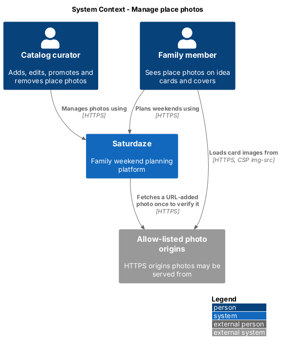
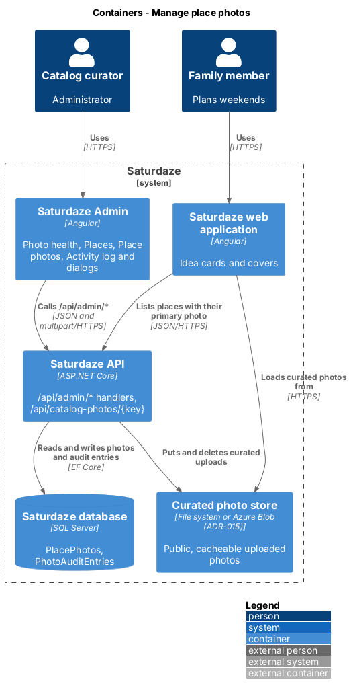
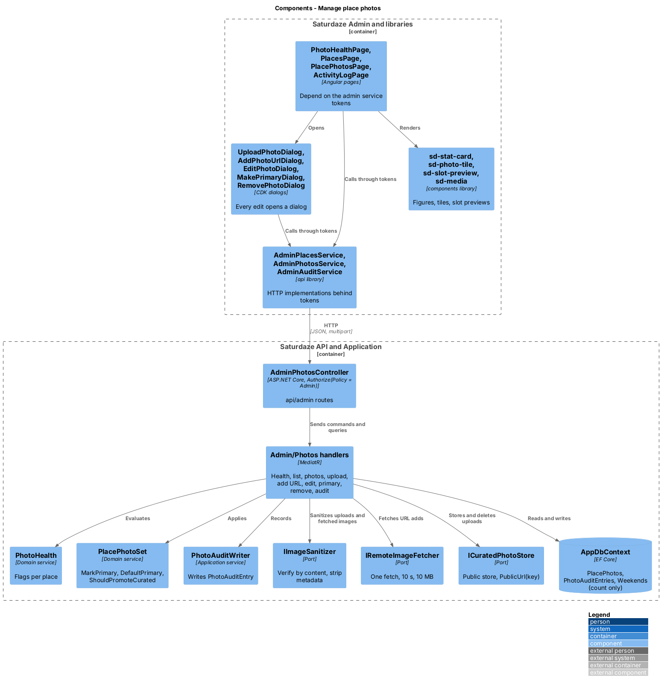
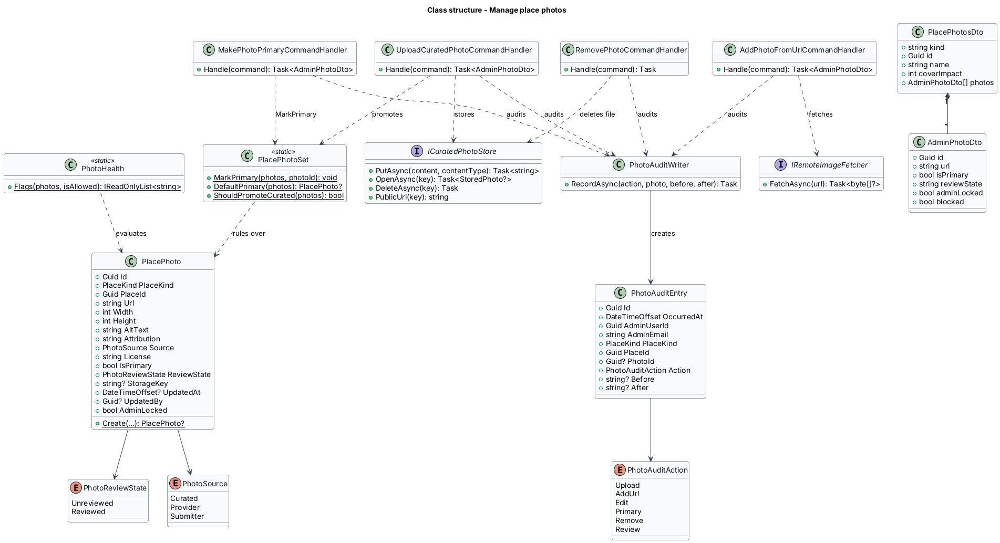
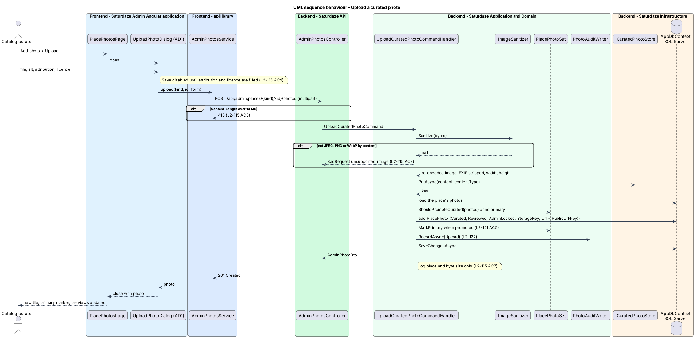
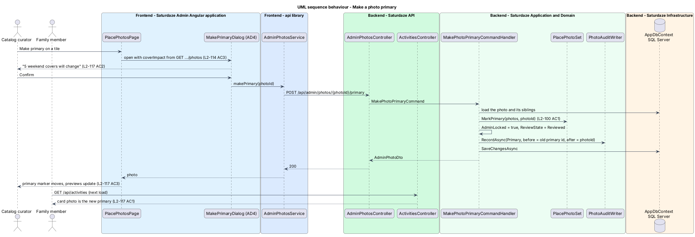

# Manage place photos

## Overview

Saturdaze is a web application that plans personalized family weekends. Every idea card, weekend cover and Past card leads with a place photo (`discovery/store-place-location-and-imagery`). Until now a curated photo could only change through seed JSON and a deploy. This feature lets an administrator measure photo coverage, find the places with the worst imagery, add curated photos by upload or by URL, edit their details, choose the primary photo, remove photos, and read an audit trail of every change, all from Saturdaze Admin (`scaffold-admin-application`).

*curated photo* — place photo an administrator added or reviewed; `Source = Curated` for uploads and URL adds

*primary photo* — the single photo that represents a place on cards and covers

*health flag* — computed label on a place: `no-photo`, `blocked-url`, `unreviewed` or `missing-alt`

*curated store* — public object storage for uploaded curated photos, served from an origin in `ImageOptions.AllowedOrigins` (ADR-015)

*cover impact* — count of weekends whose chosen cover follows a place, which changes when that place's primary changes

*admin lock* — `PlacePhoto.AdminLocked`, true once an administrator touched the photo, which seeding and ingestion respect

The slice reads catalog tables only. Family data and weekend identifiers never leave the API; the cover impact is a number (ADR-008).

## Description

### Domain

`PlacePhoto` gains `ReviewState` (`PhotoReviewState.Unreviewed | Reviewed`), `StorageKey` (nullable, set for curated uploads only), `UpdatedAt`, `UpdatedBy` (nullable administrator id) and `AdminLocked`. `PlacePhoto.Create` keeps its attribution and licence rule and takes the review state; a curated or seeded photo is created `Reviewed`.

`PlacePhotoSet.MarkPrimary` stays the single way to change the primary. `PlacePhotoSet.DefaultPrimary(photos)` picks the next primary when none is chosen: the first curated photo, else the first reviewed provider photo, else null. `PlacePhotoSet.ShouldPromoteCurated(photos)` returns true when the current primary is an unreviewed provider photo, so a new curated photo becomes primary (L2-121 AC5).

`PhotoAuditEntry` (`Id`, `OccurredAt`, `AdminUserId`, `AdminEmail`, `PlaceKind`, `PlaceId`, `PhotoId`, `Action` of `PhotoAuditAction` = `Upload | AddUrl | Edit | Primary | Remove | Review`, `Before`, `After` as JSON strings) records every change. `PlaceKind` and `PlaceId` stay on the entry after the photo row is deleted.

`PhotoHealth` (Domain service) evaluates one place's photos against the allow-list predicate and returns its flags in severity order: `no-photo`, `blocked-url`, `unreviewed`, `missing-alt`. The same evaluation feeds the health figures, the list filters and the default sort, so the three screens agree.

### Persistence

The migration `AddAdminPhotoColumns` adds the five columns on `PlacePhotos`; existing provider rows become `Unreviewed` and every other row `Reviewed`, all unlocked. Later migrations add the `PhotoAuditEntries` table with an index on `(PlaceKind, PlaceId)` and one on `AdminUserId`, and the `RejectedPlacePhotos` table (`review-ingested-photos`). Each applies through `saturdaze migrate`.

### Application

Handlers live in `Saturdaze.Application/Admin/Photos/`; `AdminPhotosController` (`api/admin`) stays thin and carries `[Authorize(Policy = "Admin")]`.

| Handler | Route | Behaviour |
|---------|-------|-----------|
| `GetPhotoHealthQueryHandler` | `GET /api/admin/photo-health` | Loads each catalog's places and photos, evaluates `PhotoHealth`, returns `PhotoHealthDto` with one `CatalogPhotoHealthDto` per catalog (`places`, `withPrimary`, `noPhoto`, `blockedUrl`, `unreviewed`, `missingAlt`). Events count only those starting today or later. |
| `ListAdminPlacesQueryHandler` | `GET /api/admin/places` | Applies `q`, `kind`, `flag`, `source`, `upcoming`, `sort` and `page` (50 per page) and returns `AdminPlacePageDto` (`items`, `total`, `page`, `pageSize`). Each `AdminPlaceDto` carries `kind`, `id`, `name`, `photoCount`, `photo` (projected through `PlacePhotoReader.Project`), `flags` and `updatedAt`. The `health` sort orders by the most severe flag, then name. |
| `GetPlacePhotosQueryHandler` | `GET /api/admin/places/{kind}/{id}/photos` | Returns `PlacePhotosDto` (`kind`, `id`, `name`, `coverImpact`, `photos`). `coverImpact` counts `Weekends` with `CoverSource = Stop` and the matching `CoverPlaceKind`/`CoverPlaceId`. Each `AdminPhotoDto` carries every column plus `blocked`. |
| `UploadCuratedPhotoCommandHandler` | `POST .../photos` (multipart) | Sanitizes through `IImageSanitizer` (`unsupported_image` on null), stores through `ICuratedPhotoStore.PutAsync`, creates the `PlacePhoto` (`Curated`, `Reviewed`, `AdminLocked`, `StorageKey`) with `Url = store.PublicUrl(key)`, promotes it when `ShouldPromoteCurated` or the place has no primary, audits `Upload` and logs the place and byte size only. |
| `AddPhotoFromUrlCommandHandler` | `POST .../photos` (JSON) | Refuses a URL that is not HTTPS on an allowed origin (`url_not_allowed`) and a URL the place already has (`photo_exists`), fetches once through `IRemoteImageFetcher` (10 s, 10 MB), sanitizes to read the type and size, and creates the photo as above. The stored URL is the source URL, not a copy. |
| `EditPhotoDetailsCommandHandler` | `PATCH /api/admin/photos/{photoId}` | Validates attribution and licence as non-empty, updates alt, attribution and licence, sets `AdminLocked`, audits `Edit`. |
| `MakePhotoPrimaryCommandHandler` | `POST /api/admin/photos/{photoId}/primary` | Applies `MarkPrimary`, sets `AdminLocked` and `Reviewed`, audits `Primary` with the previous and new primary ids. |
| `RemovePhotoCommandHandler` | `DELETE /api/admin/photos/{photoId}?nextPrimaryId=` | For a primary photo requires `nextPrimaryId` (`next_primary_required`) naming a sibling (`next_primary_invalid`) or `none`; deletes the row, applies `MarkPrimary` to the sibling, deletes the stored file for a curated upload, audits `Remove`. |
| `ListPhotoAuditQueryHandler` | `GET /api/admin/photo-audit` | Filters by `kind`, `placeId`, `adminId`; 50 newest per page. |

`PhotoAuditWriter` is the one place that creates `PhotoAuditEntry` rows, reading the administrator from `ICurrentUserAccessor`. Validators (`FluentValidation`) enforce the mandatory fields so the exception middleware returns 400 with a field error.

### Infrastructure

`ICuratedPhotoStore` (Application) is the public store: `PutAsync(content, contentType)`, `DeleteAsync(key)`, `OpenAsync(key)` and `PublicUrl(key)`. `FileSystemCuratedPhotoStore` writes under `Saturdaze:CuratedPhotos:Directory` and `CatalogPhotosController` serves `GET /api/catalog-photos/{key}` anonymously with `Cache-Control: public, max-age=31536000, immutable`; `PublicUrl` is `{Saturdaze:CuratedPhotos:PublicOrigin}/api/catalog-photos/{key}`. The API origin joins `Saturdaze:Images:AllowedOrigins` and both apps' CSP `img-src` (ADR-015). An Azure Blob implementation of the same interface is the production option the ADR leaves open.

`IRemoteImageFetcher` (Application) fetches an allowed URL once with a 10 s timeout and a 10 MB cap; `HttpRemoteImageFetcher` implements it with a named `HttpClient`. Tests substitute a fake.

### Frontend

`api` gains the contracts and HTTP implementations `AdminPlacesService` (`health()`, `list(query)`, `photos(kind, id)`) , `AdminPhotosService` (`upload`, `addFromUrl`, `edit`, `makePrimary`, `remove`, `review`, `reviews()`) and `AdminAuditService` (`list(query)`, `ingestionSkips()`), with their tokens, DTOs (`admin-*.dto.ts`) and view models (`PlaceRow`, `PhotoTileView`, `HealthView`, `AuditRow`).

Pages in `projects/admin/src/app/pages/`: `PhotoHealthPage` (A2), `PlacesPage` (A3), `PlacePhotosPage` (A4), `ActivityLogPage` (A7). Dialogs in `projects/admin/src/app/dialogs/`: `UploadPhotoDialog` (AD1), `AddPhotoUrlDialog` (AD2), `EditPhotoDialog` (AD3), `MakePrimaryDialog` (AD4), `RemovePhotoDialog` (AD5). Every dialog is a CDK `Dialog` opened with the shared `DIALOG_OPTIONS`; no page carries an inline form.

New `components` members with story folders (ADR-012): `sd-stat-card` (`StatCard`: a figure, label and link list for A2), `sd-photo-tile` (`PhotoTile`: `sd-media` at 4:3 with source badge, primary marker, review-state and health chips, licence, attribution, size and an actions slot) and `sd-slot-preview` (`SlotPreview`: renders a `CardMedia` in the idea-card 16:9, 4:3 thumbnail and cover slots at the widths A4 previews). The Places list uses `sd-list` and `sd-list-item` with an `sd-media` thumbnail.

Health chips use existing `sd-chip` tones: `warn` for `no-photo` and `blocked-url`, `sun` for `unreviewed`, `indoor` for `missing-alt`.

### Tests

`Saturdaze.Api.Tests/Admin/` covers each endpoint with the seeded fixture catalog: health figures, search and sort, upload (EXIF stripped, 413, `unsupported_image`, field errors), URL add (`url_not_allowed`, HTML body, 409), primary with cover impact, edit, remove with `nextPrimaryId`, audit filters, and 401/403. `e2e/tests/admin/` drives the screens through the page objects in `e2e/pages/admin/`.

## Requirements

The following L2 requirements refine the cited L1 capabilities.

| L2 ID | Refines (L1) | Requirement |
|-------|--------------|-------------|
| `L2-112` | `L1-036` | `GET /api/admin/photo-health` shall return, for each catalog (activities, restaurants, upcoming events), the number of places, the number with a primary photo that projects, and the number flagged `no-photo`, `blocked-url`, `unreviewed` (the primary is a provider photo nobody reviewed) and `missing-alt`. The Photo health screen (A2, the admin home) shall show those figures and link each flag count to the Places screen filtered to that flag. |
| `L2-113` | `L1-036` | `GET /api/admin/places` shall list catalog places across the three catalogs with each place's kind, name, photo count, primary photo (projected as in L2-100) and health flags, and shall accept `q` (case-insensitive name contains), `kind`, `flag`, `source` (source of the primary photo), `upcoming` (events only, starting today or later), `sort` (`health` default, `name`, `changed`) and `page` (50 per page). The Places screen (A3) shall render the list as rows with the primary photo thumbnail through `sd-media`, and shall expose the same filters and sort. |
| `L2-114` | `L1-036` | `GET /api/admin/places/{kind}/{id}/photos` shall return every photo of the place (not only the primary) with `id`, `url`, `width`, `height`, `alt`, `attribution`, `license`, `source`, `isPrimary`, `reviewState`, `adminLocked`, `updatedAt`, `updatedBy`, the projection outcome (`blocked` when the URL would project as null) and the place's `coverImpact`: the number of weekends whose chosen cover follows this place. The Place photos screen (A4) shall show each photo as a tile with its source badge, licence, attribution, size, primary marker and review state, and a live preview of the primary photo in the family-app slots: an idea card at 16:9 for 390 px and 1440 px, a 4:3 thumbnail, and a cover with scrim and title. |
| `L2-115` | `L1-036`, `L1-012` | `POST /api/admin/places/{kind}/{id}/photos` as `multipart/form-data` shall accept a JPEG, PNG or WebP `file` of at most 10 MB plus `alt`, `attribution` and `licence` fields. The server shall verify the file by content, re-encode it and strip metadata through `IImageSanitizer`, record the real width and height, store it in the public curated store on an allowed origin (ADR-015), and save a `PlacePhoto` with `Source = Curated`, `ReviewState = Reviewed`, `AdminLocked = true` and its `StorageKey`. The Add photo (upload) dialog (AD1) shall collect the file, alt text, attribution and licence and shall keep Save disabled until attribution and licence are filled. |
| `L2-116` | `L1-036`, `L1-012` | `POST /api/admin/places/{kind}/{id}/photos` as JSON `{ url, alt, attribution, licence }` shall accept only an HTTPS URL on an origin in `Saturdaze:Images:AllowedOrigins`, shall fetch the image once with a 10 s timeout and a 10 MB cap to verify its type by content and read its width and height, and shall save a `PlacePhoto` with `Source = Curated`, `ReviewState = Reviewed` and `AdminLocked = true`. The Add photo (from URL) dialog (AD2) shall refuse a non-allowed address before saving. |
| `L2-117` | `L1-036` | `POST /api/admin/photos/{photoId}/primary` shall apply `PlacePhotoSet.MarkPrimary` so exactly one photo of the place is primary, shall set `AdminLocked = true` on the chosen photo, and shall mark a provider photo reviewed. The Make primary confirmation (AD4) shall state how many weekend covers follow the place before the administrator confirms. |
| `L2-118` | `L1-036`, `L1-014` | `PATCH /api/admin/photos/{photoId}` shall update `alt`, `attribution` and `licence`, shall keep attribution and licence mandatory, shall set `AdminLocked = true`, and shall leave the URL immutable. The Edit details dialog (AD3) shall edit those three fields. A curated or primary photo with empty alt text shall be flagged "Missing alt text" on the Place photos screen and counted on the Photo health screen, while families keep the "Photo of {place}" fallback (L2-100 AC4). |
| `L2-119` | `L1-036` | `DELETE /api/admin/photos/{photoId}?nextPrimaryId=` shall delete the photo row and, for a curated upload, its stored file. Removing the primary photo shall require `nextPrimaryId` naming another photo of the same place, or `nextPrimaryId=none` to leave the place without a photo. The Remove confirmation (AD5) shall make the administrator pick the next primary, defaulting to the next curated photo, else the next reviewed provider photo, else "No photo". |
| `L2-121` | `L1-036`, `L1-017`, `L1-031` | `PlacePhoto` shall carry `AdminLocked`, set to true when an administrator uploads, adds, edits, promotes or reviews it. `CatalogUpserter` shall skip a candidate URL that a `RejectedPlacePhoto` names for the same place, recording "previously rejected" in the run's skip reasons, and shall not change which photo is primary on a place that already has one. `SeedPhotos.Apply` shall not overwrite alt text, attribution or licence on an `AdminLocked` photo and shall not reassign the primary on a place whose primary is `AdminLocked`. Seeding stays idempotent. |
| `L2-122` | `L1-036`, `L1-015` | Every create, edit, primary change, removal and review of a `PlacePhoto` through the admin API shall write a `PhotoAuditEntry` (`Id`, `OccurredAt`, `AdminUserId`, `AdminEmail`, `PlaceKind`, `PlaceId`, `PhotoId`, `Action`, `Before`, `After`). `GET /api/admin/photo-audit?kind=&placeId=&adminId=&page=` shall list entries newest first. The Activity log screen (A7) shall show who, when (UTC), the place, the action and the before/after values, filterable by place and administrator. |

## Diagrams

### System context

The context view shows the curator maintaining photos that families then see on their cards, with the curated store and the allow-listed providers as the image origins.

### Containers

The container view follows a change from the admin application through the API to the database and the curated store, and its effect on what the family application renders.

### Components

The component view names the pages and dialogs, the `api` services, the admin handlers, the domain rules and the stores.

### Class structure

The class view shows the extended `PlacePhoto`, the audit entry, the domain services and the DTOs the handlers return.

### Behaviour — upload a curated photo

The sequence view traces an upload from AD1 through sanitizing, storage, promotion and audit (`L2-115`, `L2-121`, `L2-122`).

### Behaviour — make a photo primary

The sequence view traces AD4's cover-impact statement and the primary change, and the family app's idea card on next load (`L2-114`, `L2-117`).

