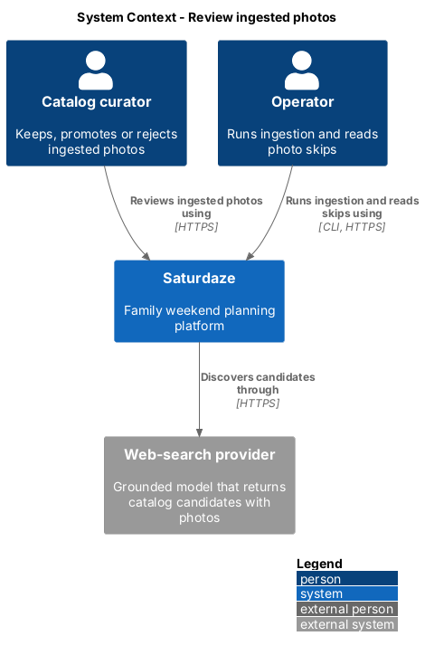
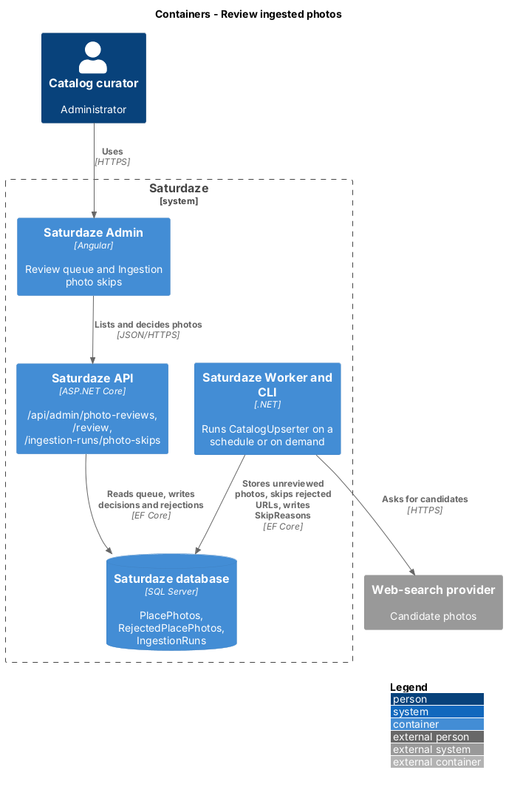
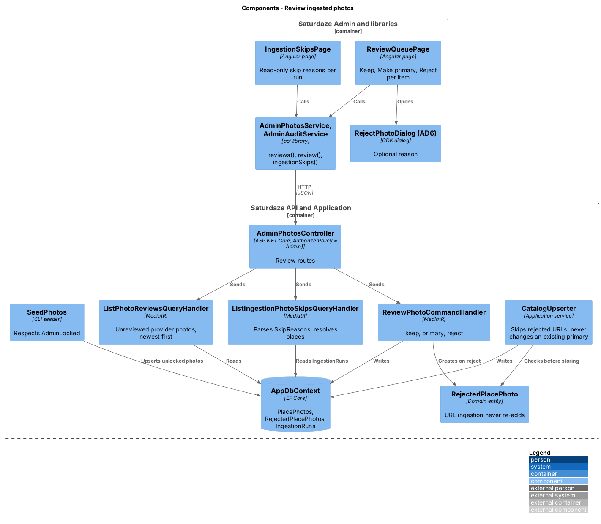
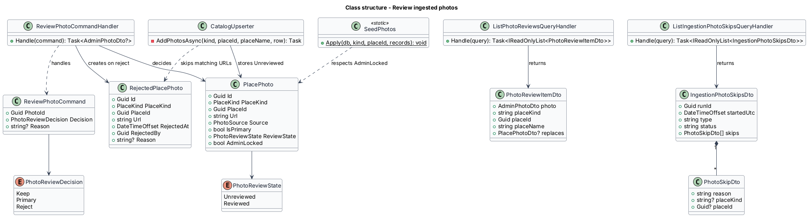
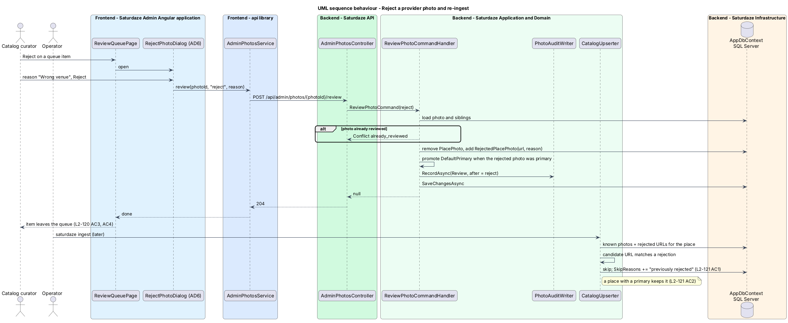

# Review ingested photos

## Overview

Saturdaze is a web application that plans personalized family weekends. Catalog ingestion (`discovery/ingest-catalogs`) brings provider photos into the catalog and promotes the first one when a place has none. Nobody reviews those photos, and the reasons ingestion skipped a photo are written to `IngestionRun.SkipReasons` and never shown. This feature gives every ingested photo a review state, a queue where an administrator keeps, promotes or rejects it, a rejection list that ingestion honours, and a read-only view of each run's photo skips.

*provider photo* — place photo ingestion stored, `Source = Provider`

*review state* — `PhotoReviewState` of a photo: `Unreviewed` until an administrator keeps, promotes or rejects it; `Reviewed` for every curated, seeded or decided photo

*review queue* — list of unreviewed provider photos, newest first

*rejected photo* — `RejectedPlacePhoto` row naming a URL ingestion shall never store again for that place

*photo skip* — line in `IngestionRun.SkipReasons` explaining why a photo candidate was not stored

The feature shares the domain, the audit trail and the admin shell with `manage-place-photos`.

## Description

### Domain

`PlacePhoto.ReviewState` and `PlacePhoto.AdminLocked` are introduced in `manage-place-photos`. `CatalogUpserter.AddPhotosAsync` creates provider photos as `Unreviewed`; `SeedPhotos.Apply` and the admin handlers create photos as `Reviewed`.

`RejectedPlacePhoto` (`Id`, `PlaceKind`, `PlaceId`, `Url`, `RejectedAt`, `RejectedBy`, `Reason`) is a new entity with a unique index on `(PlaceKind, PlaceId, Url)`. A rejection deletes the `PlacePhoto` row and inserts the rejection in one unit of work.

### Ingestion rules

`CatalogUpserter.AddPhotosAsync` loads the place's rejected URLs with its known photos. A candidate whose URL matches a rejection is skipped with the reason `"{place}: photo {url} skipped, previously rejected"` (L2-121 AC1). The method keeps `hasPrimary` as it is today, so a place that already has a primary never changes it (L2-121 AC2); a place with no primary gets the first stored candidate as primary, unreviewed, as before.

`SeedPhotos.Apply` reads `AdminLocked`: it leaves alt text, attribution and licence alone on a locked photo and skips `MarkPrimary` when the place's current primary is locked (L2-121 AC3, AC4). Unlocked photos keep today's upsert-by-URL behaviour, so a second run is still a no-op.

### Application

| Handler | Route | Behaviour |
|---------|-------|-----------|
| `ListPhotoReviewsQueryHandler` | `GET /api/admin/photo-reviews` | Unreviewed provider photos newest first (by `Id` creation order, `UpdatedAt` when set), each as `PhotoReviewItemDto`: the `AdminPhotoDto`, the place `kind`, `id` and `name`, and `replaces`, the place's current primary projected as `PlacePhotoDto` or null. |
| `ReviewPhotoCommandHandler` | `POST /api/admin/photos/{photoId}/review` | `decision = keep` sets `Reviewed` and `AdminLocked`; `decision = primary` also applies `PlacePhotoSet.MarkPrimary`; `decision = reject` deletes the photo, inserts `RejectedPlacePhoto` with the optional trimmed reason, and when the rejected photo was primary promotes `PlacePhotoSet.DefaultPrimary`. Each decision writes a `PhotoAuditEntry` with `Action = Review` and the decision in `After`. An unknown id returns 404; a photo that is not `Unreviewed` returns 409 `already_reviewed`. |
| `ListIngestionPhotoSkipsQueryHandler` | `GET /api/admin/ingestion-runs/photo-skips` | The 50 newest `IngestionRun` rows with non-null `SkipReasons`, each as `IngestionPhotoSkipsDto` (`runId`, `startedUtc`, `type`, `status`, `skips`). A skip line is parsed as `{place name}: photo {url} skipped, {reason}`; when the place name matches one catalog place of the run's type, the skip carries that place's `kind` and `id` so the screen can link it. |

`AdminPhotosController` exposes the three routes under `[Authorize(Policy = "Admin")]`.

### Frontend

`AdminPhotosService` gains `reviews()` and `review(photoId, decision, reason)`; `AdminAuditService` gains `ingestionSkips()`.

`ReviewQueuePage` (A5, `/reviews`) lists each item as an `sd-photo-tile` beside the place name and the photo it would replace (an `sd-media` thumbnail or the fallback tile), with Keep, Make primary and Reject. Keep calls the service directly; Make primary opens `MakePrimaryDialog` (AD4) with the place's cover impact fetched from `photos(kind, id)`; Reject opens `RejectPhotoDialog` (AD6) with an optional reason. A decided item leaves the list.

`IngestionSkipsPage` (A6, `/ingestion-skips`) lists each run with its start time, type and status, and its skip lines; a line whose place resolved links to `/places/{kind}/{id}`. The page is read-only.

### Tests

`Saturdaze.Api.Tests/Admin/PhotoReviewTests.cs` covers the queue, each decision, 409 on a decided photo and the audit entry. `Saturdaze.Application.Tests/Ingestion/` covers the rejected-URL skip and the unchanged primary; `Saturdaze.Cli.Tests` covers `SeedPhotos` respecting `AdminLocked`. `e2e/tests/admin/review-queue.spec.ts` and `ingestion-skips.spec.ts` drive the screens.

## Requirements

The following L2 requirements refine the cited L1 capabilities.

| L2 ID | Refines (L1) | Requirement |
|-------|--------------|-------------|
| `L2-120` | `L1-036`, `L1-031` | Each `PlacePhoto` shall carry `ReviewState` (`Unreviewed` for photos ingestion stores, `Reviewed` for curated, seeded and administrator-reviewed photos). `GET /api/admin/photo-reviews` shall list unreviewed provider photos newest first with the place name and the photo it would replace. `POST /api/admin/photos/{photoId}/review` with `{ decision: keep \| primary \| reject, reason? }` shall mark the photo reviewed, or reviewed and primary, or delete it and record a `RejectedPlacePhoto` (`PlaceKind`, `PlaceId`, `Url`, `RejectedAt`, `RejectedBy`, `Reason`). The Review queue screen (A5) shall offer Keep, Make primary and Reject on each item, and the Ingestion photo skips screen (A6) shall list each `IngestionRun`'s photo skip reasons read-only. |
| `L2-121` | `L1-036`, `L1-017`, `L1-031` | `PlacePhoto` shall carry `AdminLocked`, set to true when an administrator uploads, adds, edits, promotes or reviews it. `CatalogUpserter` shall skip a candidate URL that a `RejectedPlacePhoto` names for the same place, recording "previously rejected" in the run's skip reasons, and shall not change which photo is primary on a place that already has one. `SeedPhotos.Apply` shall not overwrite alt text, attribution or licence on an `AdminLocked` photo and shall not reassign the primary on a place whose primary is `AdminLocked`. Seeding stays idempotent. |

## Diagrams

### System context

The context view shows the operator and the curator on one side of the catalog and the ingestion worker's web-search provider on the other.

### Containers

The container view shows ingestion writing unreviewed photos and skip reasons, and the admin application reading and deciding them through the API.

### Components

The component view names the queue and skips pages, the review handler, the rejection entity and the upserter rule that honours it.

### Class structure

The class view shows `RejectedPlacePhoto` beside `PlacePhoto`, the review command and the DTOs.

### Behaviour — reject a provider photo and re-ingest

The sequence view traces a rejection from AD6 through the handler and the next ingestion run that meets the same URL (`L2-120`, `L2-121`).

