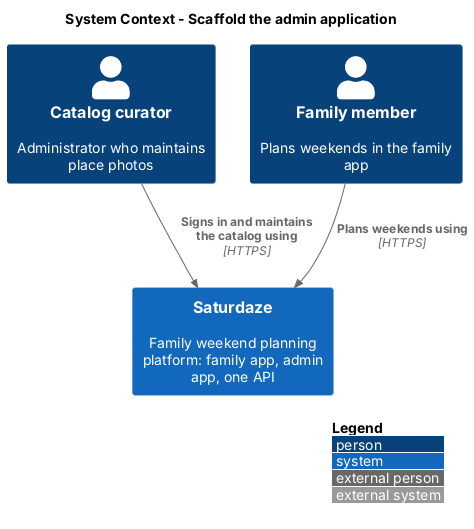
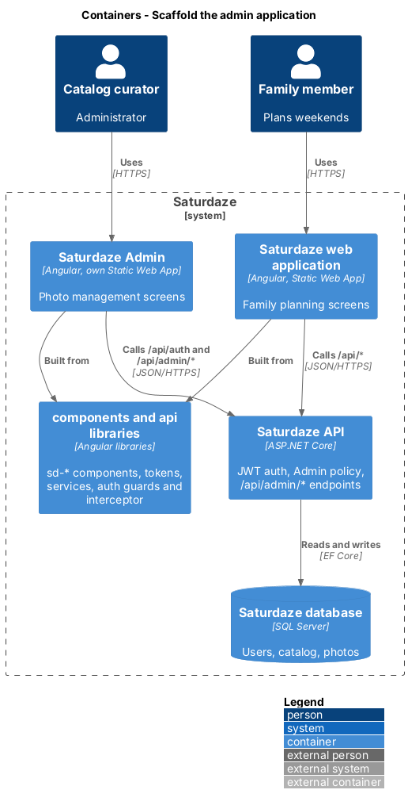
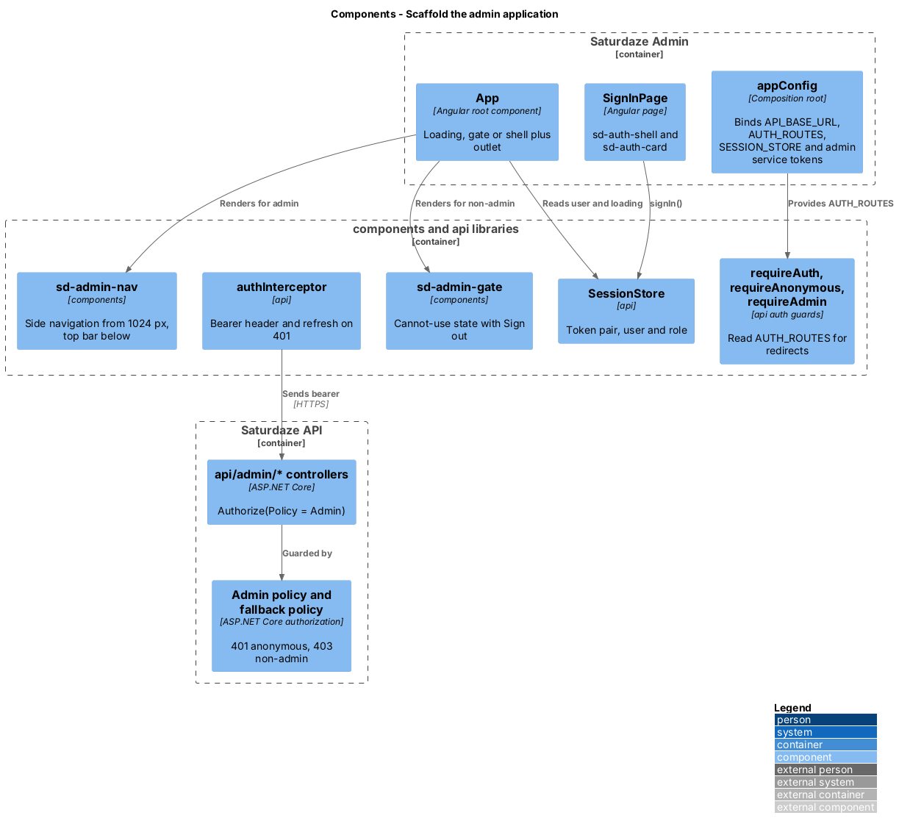
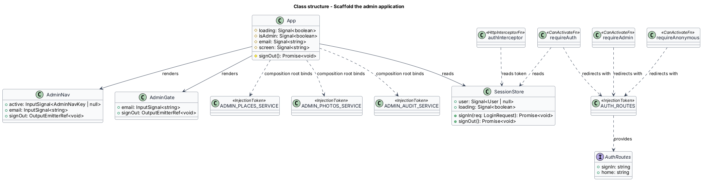
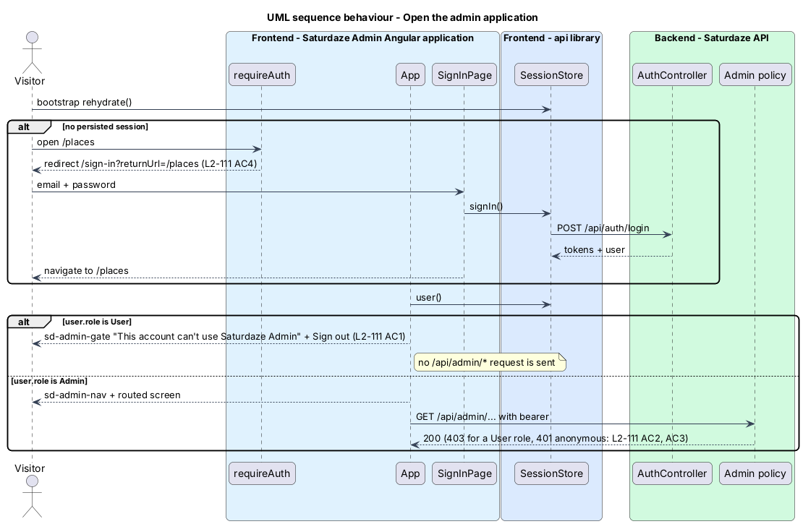

# Scaffold the admin application

## Overview

Saturdaze is a web application that plans personalized family weekends. Saturdaze Admin is a second Angular application in the same workspace for the people who look after the catalog. Its first job is photo management (`manage-place-photos`, `review-ingested-photos`); this feature gives those screens a home: the application project, the shared sign-in, the administrator gate, the shell with its navigation, and the delivery path to its own host.

*admin application* — Angular application at `frontend/projects/admin` that administrators open to maintain the catalog

*administrator* — user whose `Role` is `UserRole.Admin`

*admin gate* — screen state that tells a signed-in non-administrator the account cannot use Saturdaze Admin and offers only sign-out

*admin shell* — chrome shared by every admin screen: a side navigation from 1024 px and a top bar with the same destinations below it

The family app keeps `/review-submissions` and its own shell (ADR-009). The admin application reuses the `components` and `api` libraries, the Fluent tokens (ADR-013) and the JWT session (ADR-007); it copies no component out of `projects/saturdaze`. ADR-014 records the decision to make it a separate application on its own Static Web App.

## Description

### Workspace

`frontend/angular.json` gains the `admin` application project (`root: projects/admin`, `prefix: sd`, `@angular/build:application`, the same budgets, `stylePreprocessorOptions.includePaths` and `assets` layout as `saturdaze`). `frontend/package.json` gains `start:admin` (`ng serve admin --port 4300`) and `build:admin`. `projects/admin/tsconfig.app.json` and `tsconfig.spec.json` mirror the family app's. ESLint and Prettier apply through the workspace configuration; `angular.json` registers the `lint` target for the project.

`projects/admin/public/staticwebapp.config.json` carries the SPA fallback and the same `Content-Security-Policy` `img-src` list as the family app plus the curated photo origin (ADR-015).

### Shared auth plumbing

`authInterceptor`, `requireAuth`, `requireAnonymous` and `requireAdmin` move from `projects/saturdaze/src/app/auth/` into `projects/api/src/lib/auth/` and export through `public-api.ts`. `requireAuth` and `requireAnonymous` take the sign-in and home paths from a new `AUTH_ROUTES` injection token (`{ signIn: '/sign-in', home: '/weekend' }` in the family app, `{ signIn: '/sign-in', home: '/' }` in the admin app) so one implementation serves both apps. `requireAdmin` keeps returning the home URL tree for a non-administrator in the family app; the admin app does not use it as a route guard because the gate is a screen state, not a redirect (L2-111 AC1).

The family app's imports change to `from 'api'`; its behaviour does not change, and the route-guard e2e specs stay as they are (L2-123 AC2).

### Admin application

`projects/admin/src/main.ts` bootstraps `App` with `appConfig`. `app.config.ts` is the composition root: `provideRouter(routes)`, `provideHttpClient(withFetch(), withInterceptors([authInterceptor]))`, `API_BASE_URL` from `environments/environment.ts`, `AUTH_SERVICE`, `SESSION_STORE`, `AUTH_ROUTES` and the admin service tokens `ADMIN_PLACES_SERVICE`, `ADMIN_PHOTOS_SERVICE` and `ADMIN_AUDIT_SERVICE` bound to their HTTP implementations in `api`.

`app.routes.ts` declares `/sign-in` (`requireAnonymous`, bare shell), and under `requireAuth`: `/` (Photo health), `/places`, `/places/:kind/:id`, `/reviews`, `/ingestion-skips` and `/activity`. Route data stamps `screen` on `<body data-screen>`; every admin page stamps `data-page="admin"`.

`App` (`app.ts`) renders the shell once. While `SESSION_STORE.loading()` is true it shows the loading placeholder. When the session resolves to a non-administrator it renders `sd-admin-gate` (the "This account can't use Saturdaze Admin" state with Sign out) instead of the outlet, so no admin page is constructed and no `/api/admin/*` request is sent (L2-111 AC1). For an administrator it renders `sd-admin-nav` and the outlet.

`SignInPage` reuses `sd-auth-shell` and `sd-auth-card` and calls `SESSION_STORE.signIn`. The returnUrl query parameter from `requireAuth` is honoured (L2-111 AC4).

### New `components` members

`sd-admin-nav` (`AdminNav`) renders the admin chrome: at 1024 px and above a vertical `.admin-nav` with the brand, the destination links (`Photo health`, `Places`, `Review queue`, `Ingestion skips`, `Activity log`) and the account block; below 1024 px an `.admin-bar` top bar with the same links in a horizontal scroller. Links carry `data-nav` and `aria-current="page"` for the active destination (L2-123 AC3). The component has a story folder `AdminNav` (ADR-012).

`sd-admin-gate` (`AdminGate`) renders the gate card inside `sd-auth-shell` with the signed-in email and a Sign out button. Story folder `AdminGate`.

### Backend

`AdminPhotosController` and the other admin controllers sit under `api/admin/` with `[Authorize(Policy = "Admin")]` on the class. The global fallback policy already turns an anonymous call into 401 and the `Admin` policy turns a `User` role into 403 (L2-111 AC2, AC3). `Cors:AllowedOrigins` gains the admin origin.

### Delivery

`ci.yml` lints, format-checks and builds both applications (`npx ng build admin --configuration production`). `deploy.yml` gains an `admin-web` job that downloads the `admin-dist` artifact and uploads `dist/admin/browser` with `Azure/static-web-apps-deploy@v1` using `SWA_ADMIN_DEPLOYMENT_TOKEN`, after `migrate` like the family app (L2-123 AC4). The admin hostname and any network restriction beyond the role check are `<TO SUPPLY>` (PRD Q4).

### Tests

`e2e/playwright.config.ts` gains an `admin` project (Chromium, 1440 × 900) whose `baseURL` is the admin dev server on port 4300 and a second `webServer` entry. `e2e/pages/admin/` holds one page object per admin screen and dialog; `e2e/tests/admin/` holds the specs. API coverage lives in `Saturdaze.Api.Tests/Admin/`.

## Requirements

The following L2 requirements refine the cited L1 capabilities.

| L2 ID | Refines (L1) | Requirement |
|-------|--------------|-------------|
| `L2-111` | `L1-036` | Saturdaze Admin shall sign administrators in with their existing Saturdaze account through the shared `SESSION_STORE`, and shall show a signed-in user whose role is not `Admin` the "This account can't use Saturdaze Admin" state with a sign-out action and nothing else. Every `/api/admin/*` endpoint shall require the `Admin` policy on top of the global authenticated fallback; client guards are a navigation aid only. |
| `L2-123` | `L1-036` | Saturdaze Admin shall be the Angular application `frontend/projects/admin` (prefix `sd`, standalone components), consuming `components` and `api` through the workspace path mappings with no component copied from `projects/saturdaze`. `authInterceptor`, `requireAuth` and `requireAdmin` shall live in the `api` library and serve both apps. Admin pages shall depend on the `ADMIN_PLACES_SERVICE`, `ADMIN_PHOTOS_SERVICE` and `ADMIN_AUDIT_SERVICE` tokens bound in the admin composition root. The admin layout shall be desktop-first with a side navigation from 1024 px and shall stay usable to 390 px with no horizontal scroll. `frontend/package.json` shall gain `start:admin` and `build:admin`; CI shall lint, format-check, unit-test and build both apps; `deploy.yml` shall upload `dist/admin/browser` to its own Static Web App after migrations; the admin origin shall be listed in `Cors:AllowedOrigins`. |

## Diagrams

### System context

The context view places the administrator beside the family and the two applications that share one API.

### Containers

The container view shows the admin application as its own Static Web App, the family application, the shared libraries they are built from, and the API that authorizes both.

### Components

The component view names the shell, the gate, the shared guards and interceptor in `api`, and the Admin policy on the API side.

### Class structure

The class view shows the app shell, the shared auth guards with their `AUTH_ROUTES` token, and the service tokens the composition root binds.

### Behaviour — open the admin application

The sequence view follows an anonymous visitor to sign-in, a non-administrator to the gate, and an administrator to the home screen (`L2-111`).

