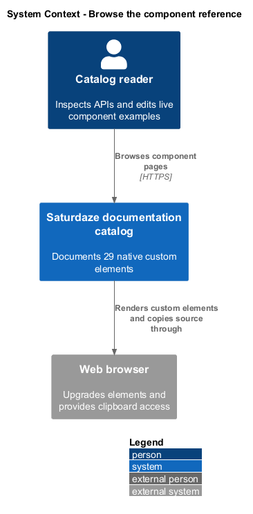
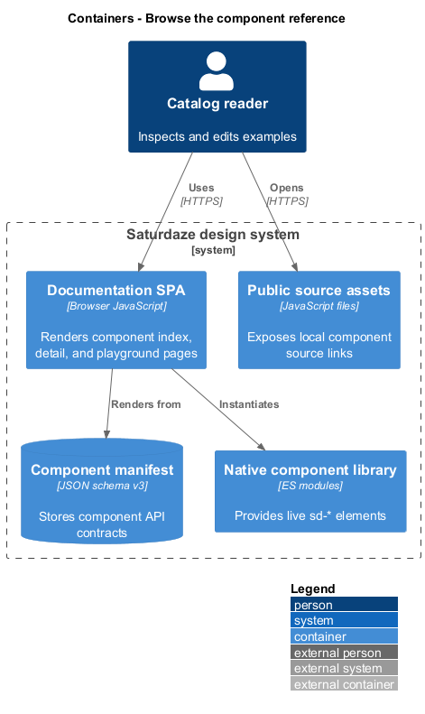
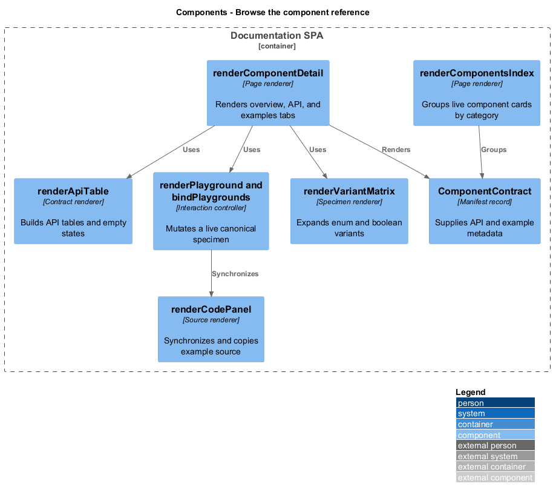
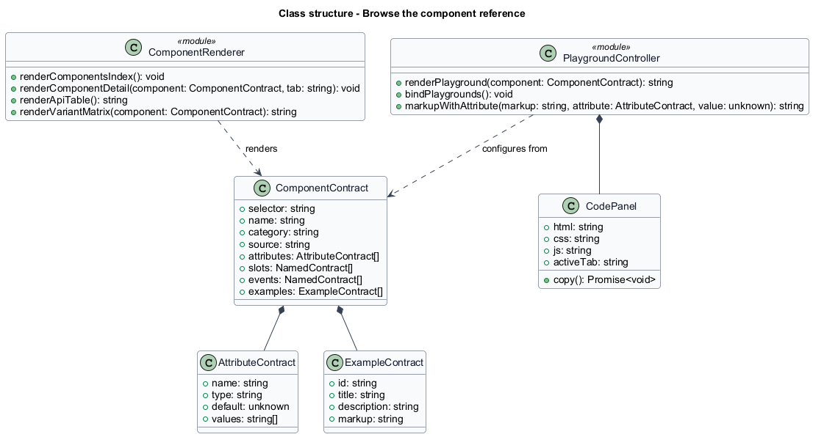
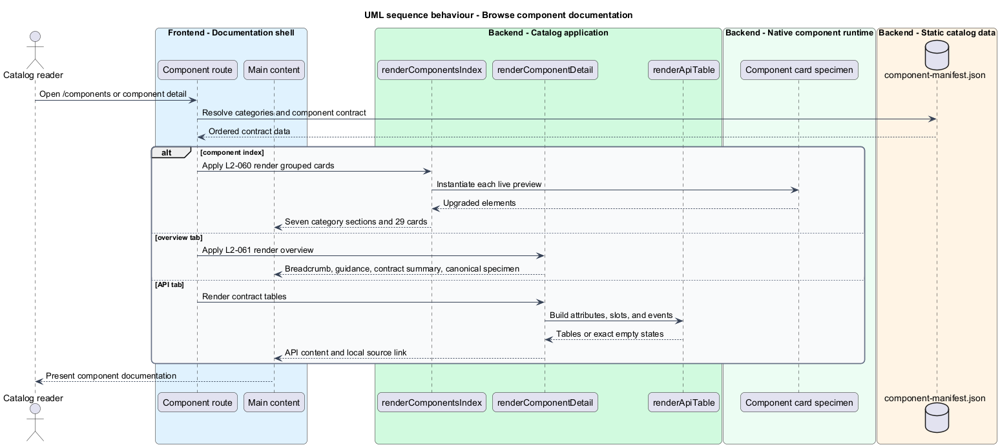
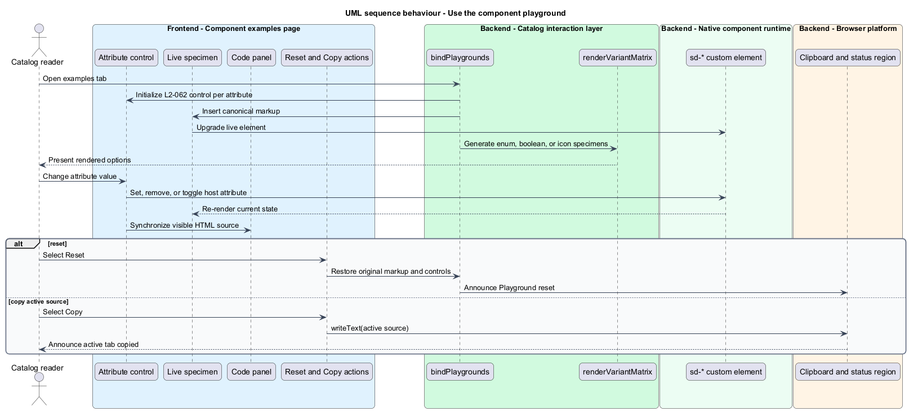

# Browse the component reference

## Overview

The component reference turns the manifest's native-element contracts into browsable documentation. A *canonical specimen* is the first curated example for a component, and a *variant matrix* is the generated set of specimens for every enumerated or boolean presentation option.

This feature covers the category index, component overview and API tabs, and interactive examples. The catalog renders real upgraded elements, derives tables and controls from manifest records, keeps edited markup synchronized with its code panel, and provides explicit empty states when a contract collection has no entries.

## Description

- **`renderComponentsIndex()`** — groups 29 component cards under the seven manifest categories.
- **`renderComponentDetail()`** — selects overview, API, or examples content for one selector.
- **`renderApiTable()`** — creates manifest-driven contract tables or exact empty-state messages.
- **`renderPlayground()`** — creates a live canonical specimen and one control per documented attribute.
- **`bindPlaygrounds()`** — applies control changes, synchronizes HTML, and restores original state.
- **`renderCodePanel()`** — exposes HTML, CSS, and JavaScript tabs with copy support.
- **`renderVariantMatrix()`** — generates enum, boolean, icon, or canonical specimen coverage.

## Requirements

| L2 ID | Refines (L1) | Requirement |
|-------|--------------|-------------|
| `L2-060` | `L1-024` | `/components` must render one live card for every manifested component, grouped under the seven category headings in manifest order, each card previewing the real upgraded element and linking to its detail page. |
| `L2-061` | `L1-024` | Every component detail page must carry breadcrumbs, a header with category eyebrow and selector badge, and a three-tab `Page sections` navigation. The overview tab must give usage guidance plus a contract summary and canonical specimen; the API tab must tabulate the manifest contract with explicit empty states and link to the raw source. |
| `L2-062` | `L1-024` | The examples tab must render a playground that mutates a live element instance through per-attribute controls, a code panel whose HTML tab tracks playground state and supports copy-to-clipboard, a reset action, and an auto-generated variant matrix covering every enumerated and boolean option. |

## Diagrams

### System context

Catalog readers inspect, configure, and copy native component examples. The manifest and component modules supply the public contract and live rendering.

### Containers

The documentation SPA reads the manifest and loads the component library in the browser. Local source modules remain directly addressable from API pages.

### Components

Index, detail, API-table, playground, code-panel, and variant renderers cooperate around one `ComponentContract`.

### Class structure

`ComponentContract` owns its attributes, slots, events, and examples; the renderer and playground state depend on those records.

### Behaviour — browse component documentation

Selecting a component route resolves the contract and renders the requested overview or API tab from manifest data.

### Behaviour — use the component playground

Attribute controls mutate the live element and synchronized source. Reset and copy actions publish status announcements.

