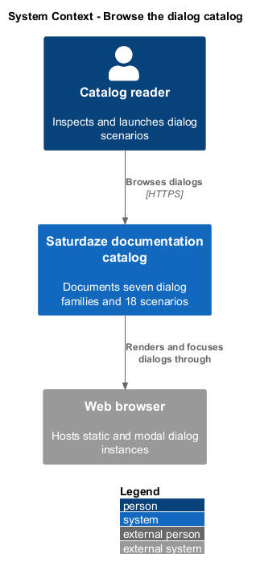
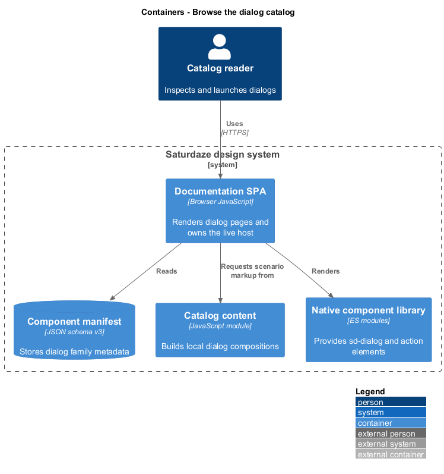
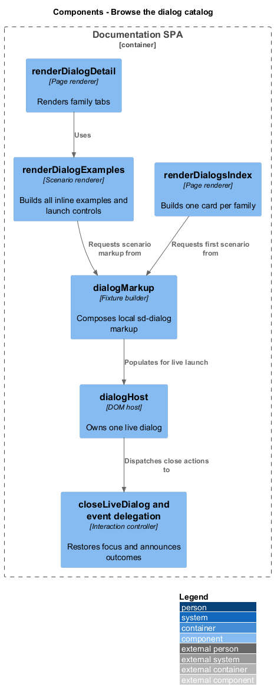
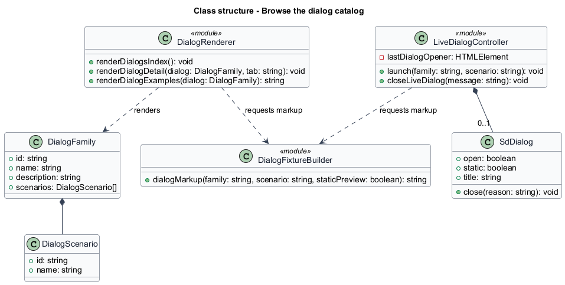
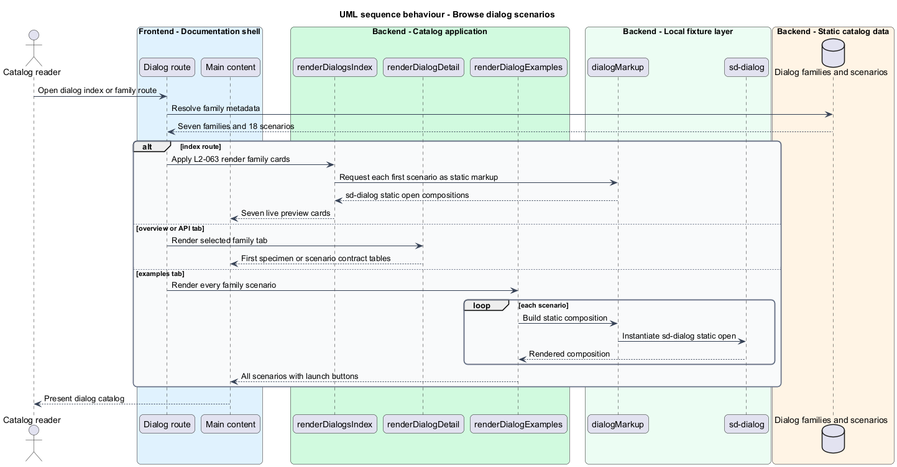
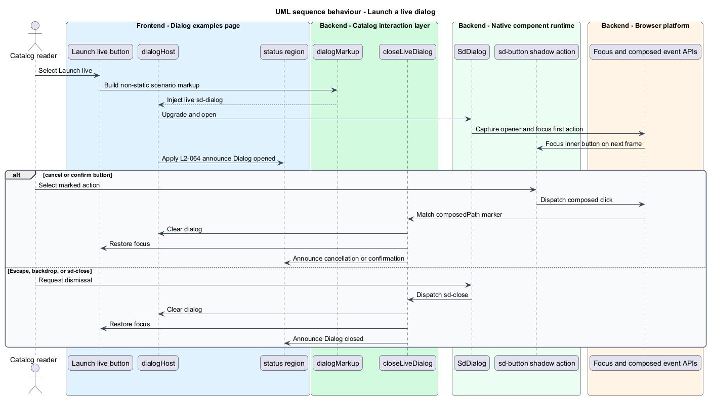

# Browse the dialog catalog

## Overview

The dialog catalog documents complete product dialog compositions instead of isolated component chrome. A *dialog family* groups related scenarios, while a *live launch* places one selected scenario into the page's modal host with active focus and dismissal behavior.

This feature renders all seven families and 18 scenarios from the manifest and local fixture builders. Inline specimens use `sd-dialog[static][open]`; launched specimens use the same `sd-dialog` component without `static` and return focus to their launch button after closure.

## Description

- **`renderDialogsIndex()`** — builds one static-preview card per dialog family.
- **`renderDialogDetail()`** — renders overview, API, and examples tabs for a family.
- **`renderDialogExamples()`** — creates every inline scenario and its launch control.
- **`dialogMarkup()`** — composes local scenario fixtures around `sd-dialog`.
- **`#dialog-host`** — owns the active live-dialog instance.
- **`closeLiveDialog()`** — clears the host, restores opener focus, and announces the result.
- **Composed click handling** — resolves cancel and confirm actions across component shadow boundaries.

## Requirements

| L2 ID | Refines (L1) | Requirement |
|-------|--------------|-------------|
| `L2-063` | `L1-025` | `/dialogs` must render one card per family, each containing a real inline static dialog specimen, and every family detail page must render all of its scenarios inline with no text-only placeholders. |
| `L2-064` | `L1-025` | `Launch live` must inject a working modal for the chosen scenario into `#dialog-host`, move focus into it, and support every dismissal path with focus restoration and a status announcement. |

## Diagrams

### System context

Catalog readers inspect static dialog scenarios and launch working modals. The local manifest and fixture module define the complete catalog.

### Containers

The documentation SPA loads dialog metadata, fixture builders, and native components inside the browser.

### Components

Dialog renderers use `dialogMarkup()` for both static specimens and the live host, while shared close logic manages lifecycle outcomes.

### Class structure

Each `DialogFamily` contains scenarios consumed by the fixture builder; `SdDialog` publishes close events to the live-dialog controller.

### Behaviour — browse dialog scenarios

The dialog route resolves one family and renders its metadata and local static compositions.

### Behaviour — launch a live dialog

Launching creates a non-static modal, moves focus into its first action, and handles all close paths through one restoration routine.

