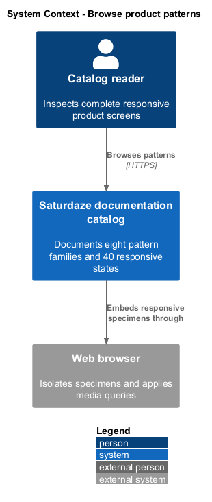
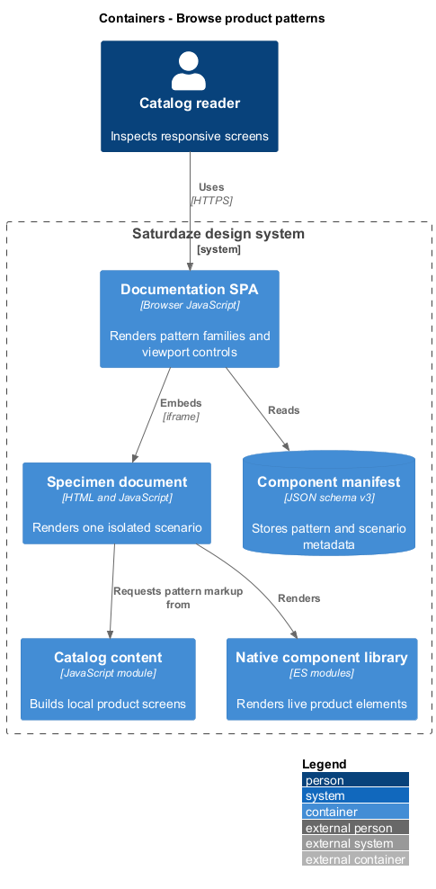
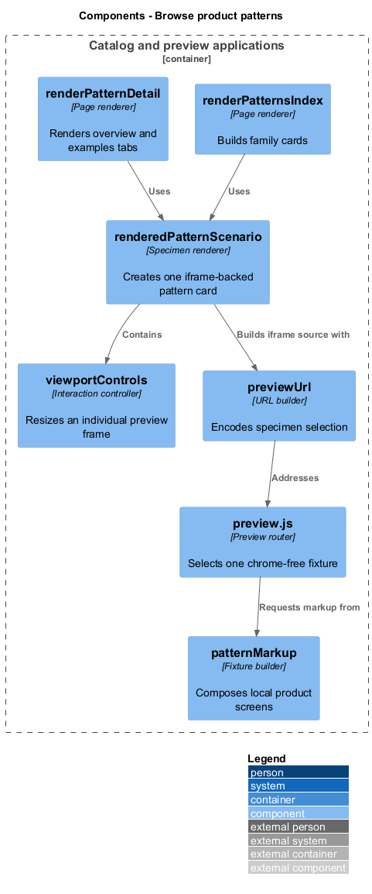
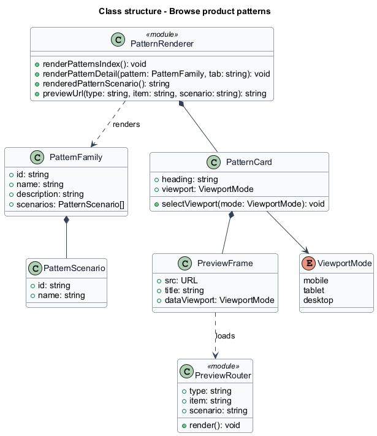
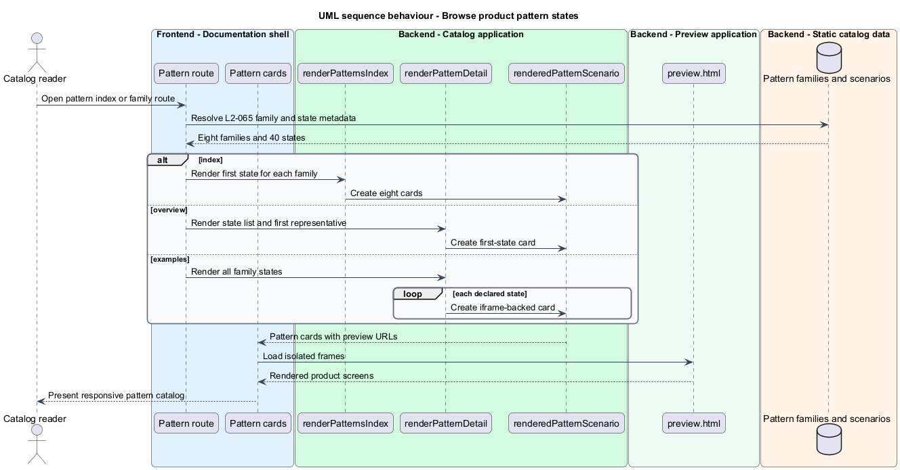
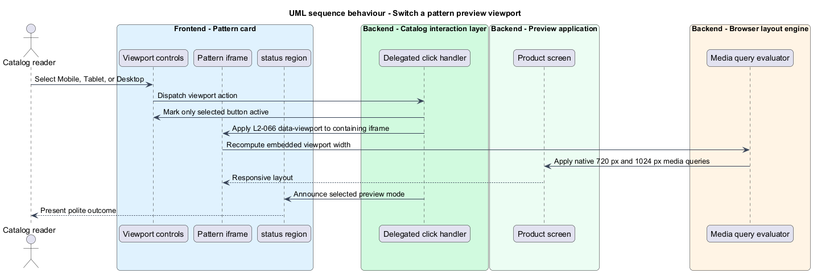
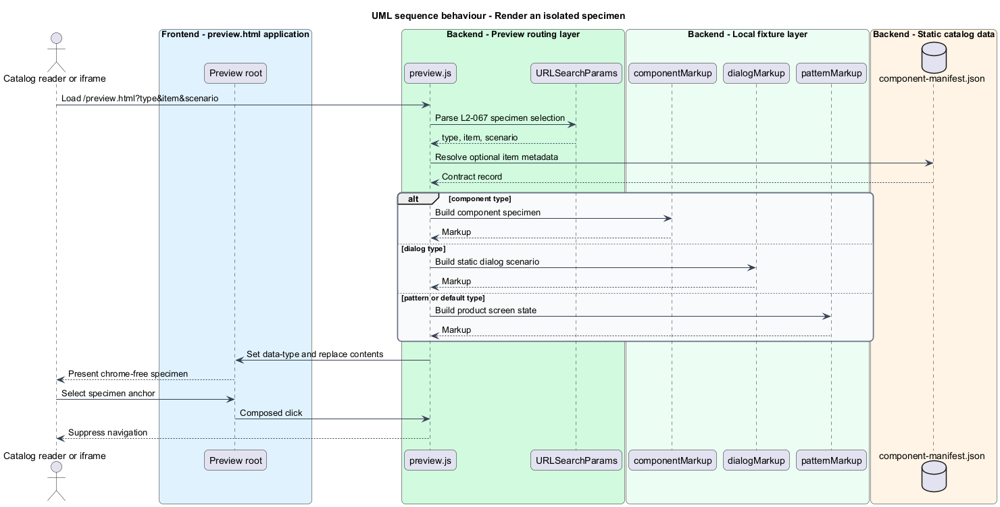

# Browse product patterns

## Overview

The product-pattern catalog presents complete Saturdaze screens in their real responsive states. A *pattern family* groups related screens, a *responsive state* is one named composition within that family, and an *isolated specimen* is a chrome-free preview document rendered outside the documentation shell.

This feature renders eight families and 40 states through iframes. Each specimen owns viewport controls that resize its iframe, allowing the embedded document's native media queries to respond at mobile, tablet, and desktop widths.

## Description

- **`renderPatternsIndex()`** — builds one iframe-backed card per pattern family.
- **`renderPatternDetail()`** — renders overview and examples tabs for a selected family.
- **`renderedPatternScenario()`** — creates a named pattern card, iframe, and viewport controls.
- **`viewportControls()`** — supplies the `390`, `820`, and `Full` control group.
- **`previewUrl()`** — encodes the specimen type, item, and scenario into `/preview.html`.
- **`preview.js`** — resolves query parameters and renders one chrome-free fixture.
- **`patternMarkup()`** — composes product screens entirely from local component modules and fixture data.

## Requirements

| L2 ID | Refines (L1) | Requirement |
|-------|--------------|-------------|
| `L2-065` | `L1-026` | `/patterns` must render one card per family with an iframe preview, and each family's examples tab must render one framed specimen per declared responsive state, so all 40 states are reachable. |
| `L2-066` | `L1-026` | Every pattern specimen must carry viewport controls that resize the iframe itself, so the document inside responds through its real 720/1024 px media queries rather than simulated styles. |
| `L2-067` | `L1-026` | `preview.html` must render a single chrome-free specimen selected by query string — a pattern state, dialog scenario, or component example — for use inside catalog iframes and by direct navigation. |

## Diagrams

### System context

Catalog readers inspect responsive product screens through the documentation application. The browser isolates each specimen so its own media queries govern layout.

### Containers

The documentation SPA embeds the independent preview document, which reads manifest metadata, local fixture builders, and component modules.

### Components

Pattern renderers, URL construction, viewport controls, preview routing, and fixture builders connect the catalog shell to each isolated screen.

### Class structure

Each `PatternFamily` contains responsive scenarios; a `PatternCard` owns one `PreviewFrame` and its independent viewport state.

### Behaviour — browse pattern states

The pattern route resolves family metadata and creates an iframe-backed card for every requested state.

### Behaviour — switch a preview viewport

A viewport control updates only its containing iframe width and announces the selected responsive mode.

### Behaviour — render an isolated specimen

The preview document resolves query parameters, selects the matching fixture builder, and suppresses navigation inside the specimen.

