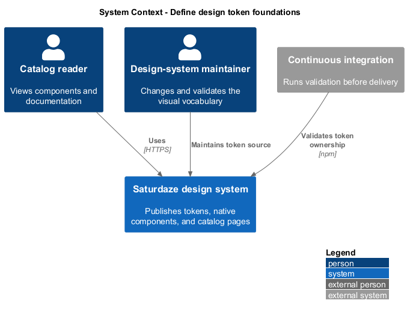
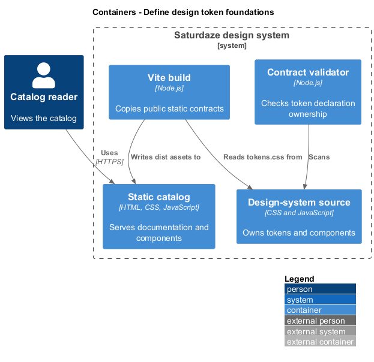
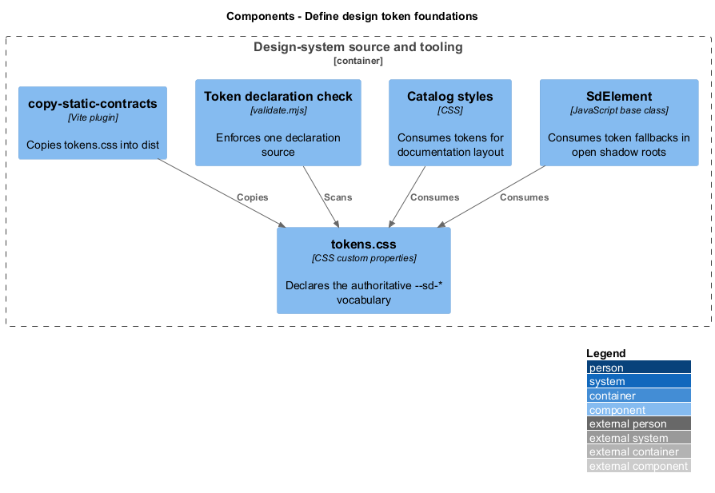
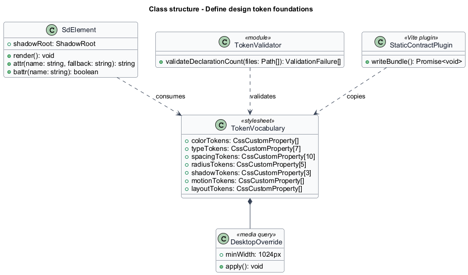
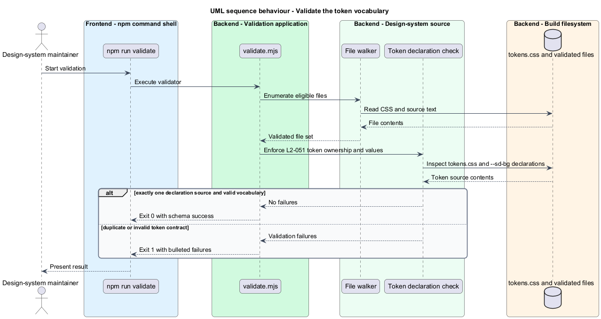

# Define design token foundations

## Overview

The Saturdaze design system uses design tokens to give every component and catalog page the same visual vocabulary. A *design token* is a named CSS custom property that represents a reusable visual decision such as a color, font size, spacing value, radius, shadow, duration, or breakpoint.

This feature establishes `design-system/assets/tokens.css` as the authoritative token source. Browser consumers read the `--sd-*` properties from `:root`, while the contract validator prevents another file from declaring a competing vocabulary.

## Description

- **`tokens.css`** — authoritative stylesheet that declares the complete `--sd-*` vocabulary and its desktop override.
- **`:root`** — document scope that exposes tokens to the catalog shell and every open shadow root.
- **`SdElement`** — shared custom-element base class whose fallback styles consume the typography and color tokens.
- **`validate.mjs`** — contract validator that scans the folder and enforces a single declaration source for `--sd-bg`.
- **Vite build** — copies `tokens.css` into `dist/assets/` as an unhashed public contract.

## Requirements

| L2 ID | Refines (L1) | Requirement |
|-------|--------------|-------------|
| `L2-051` | `L1-019` | `design-system/assets/tokens.css` must declare the complete `--sd-*` token vocabulary on `:root`: the warm-neutral color palette, the Inter-first font stack, a seven-step type scale, a ten-step four-pixel spacing scale, five radii, three elevation shadows, motion easing and durations, layout dimensions, and the two application breakpoints. It must be the only file in the folder that declares the token vocabulary, and the only responsive override must be a single desktop media query adjusting padding and the three largest type sizes. |

## Diagrams

### System context

The design system publishes one visual vocabulary for catalog readers and product consumers. The validation gate protects that vocabulary before delivery.

### Containers

The source stylesheet flows through the Vite build into the static catalog, where the browser exposes its properties to the documentation shell and custom elements.

### Components

The token source, shared element base, catalog styles, validator, and static-copy plugin form the implementation boundary for this feature.

### Class structure

`SdElement` consumes the token vocabulary, while the validator and build plugin depend on the authoritative stylesheet as a file contract.

### Behaviour — validate the token vocabulary

The validation command scans token declarations and reports success only when `tokens.css` is the sole vocabulary source.

