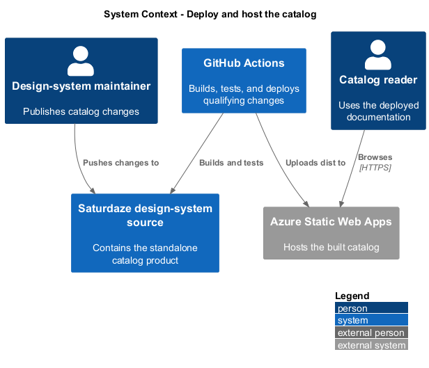
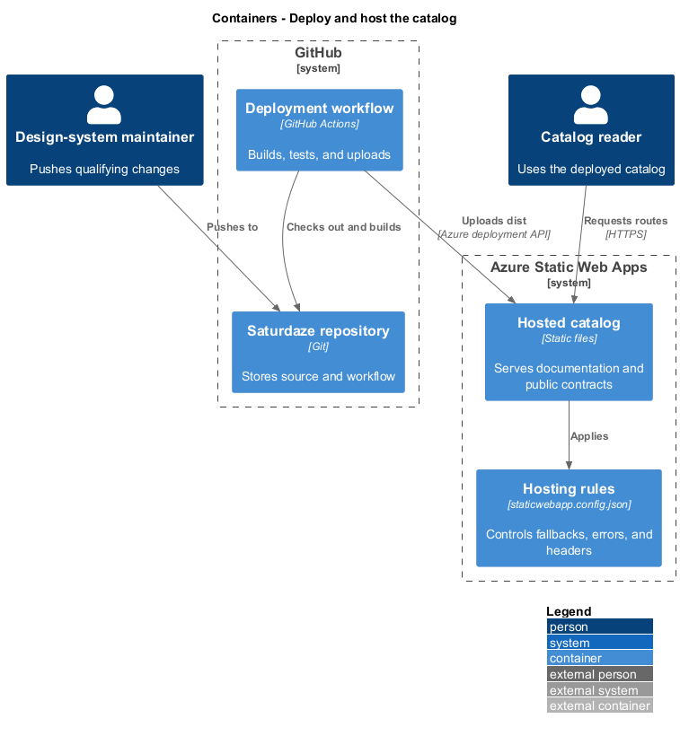
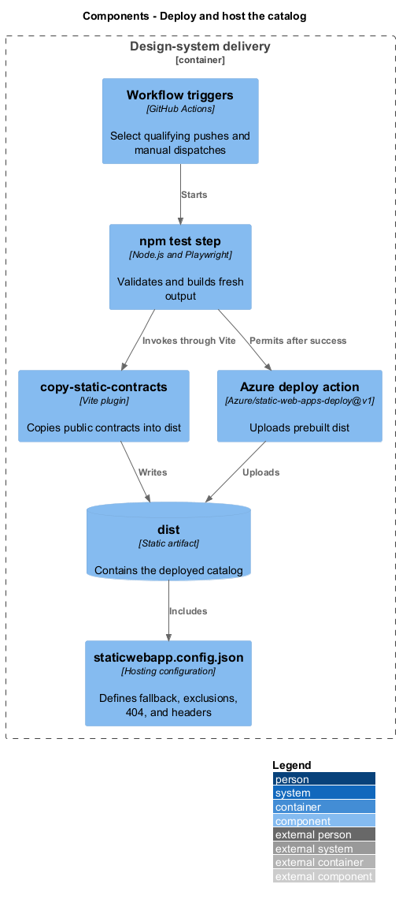
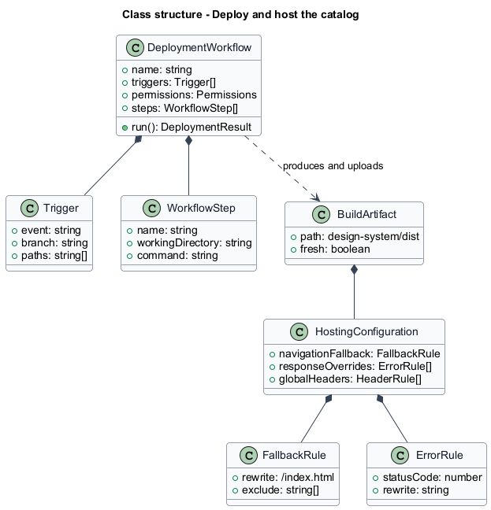
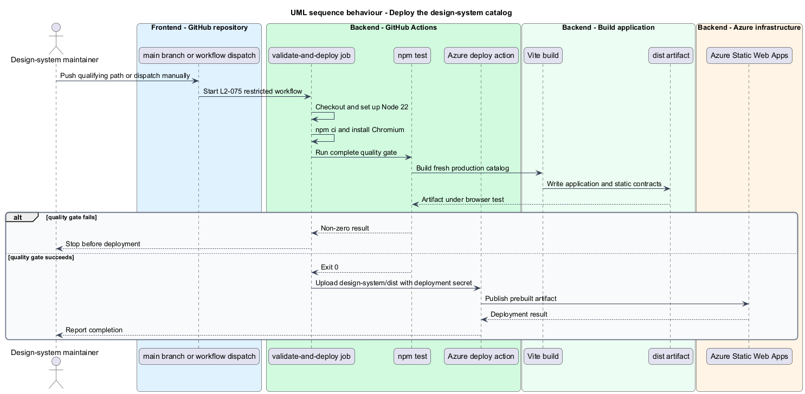
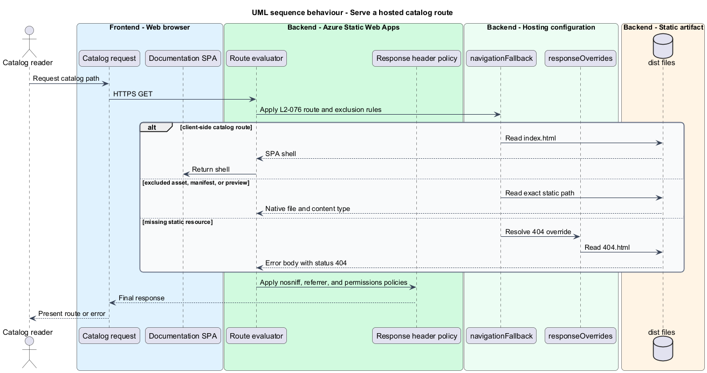

# Deploy and host the catalog

## Overview

The design-system catalog deploys independently to Azure Static Web Apps after its local quality gates pass. A *navigation fallback* serves the SPA shell for client routes, while an *excluded static contract* bypasses that rewrite so assets, the manifest, and the specimen document retain their native responses.

This feature connects the path-filtered GitHub Actions workflow, Vite production build, quality command, Azure upload, and static hosting configuration. Deployment publishes only fresh `dist/` output and applies global response headers and an honest host-level 404 response.

## Description

- **`deploy-design-system.yml`** — path-filtered workflow with restricted repository permissions and ordered Node, validation, test, and deployment steps.
- **`npm test`** — produces and verifies the fresh production build before upload.
- **`vite.config.js`** — builds `index.html` and `preview.html` and copies public contracts into `dist/`.
- **`Azure/static-web-apps-deploy@v1`** — uploads the already-built static output using the dedicated deployment secret.
- **`staticwebapp.config.json`** — defines SPA fallback exclusions, the 404 response, MIME behavior, and global security headers.
- **`404.html`** — host-level error document returned with status code 404.

## Requirements

| L2 ID | Refines (L1) | Requirement |
|-------|--------------|-------------|
| `L2-075` | `L1-030` | `.github/workflows/deploy-design-system.yml` must deploy the catalog to its own Azure Static Web App only after the validation and browser gates pass, triggered solely by changes that can affect it. |
| `L2-076` | `L1-030` | The deployed site's `staticwebapp.config.json` must preserve SPA deep links while serving assets, the manifest, and the preview page as raw files, must return honest 404s, and must apply security response headers globally. |

## Diagrams

### System context

Maintainers publish changes through GitHub, and catalog readers access the resulting Azure Static Web App. The deployment workflow gates the connection between them.

### Containers

GitHub Actions builds and tests the design-system product before Azure Static Web Apps serves the uploaded static output.

### Components

Workflow triggers, quality steps, Vite copying, Azure upload, and static hosting rules form the delivery slice.

### Class structure

The deployment job owns ordered steps and one artifact, while the hosting configuration owns fallback, exclusion, error, and response-header rules.

### Behaviour — deploy the catalog

A qualifying push or manual dispatch installs dependencies, runs the complete quality gate, and uploads the resulting `dist/` directory.

### Behaviour — serve a hosted route

Azure distinguishes SPA routes from excluded static contracts and missing resources before applying the global response headers.

