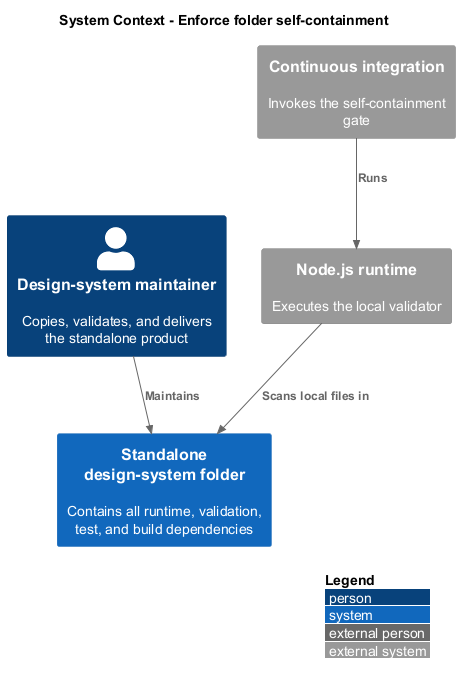
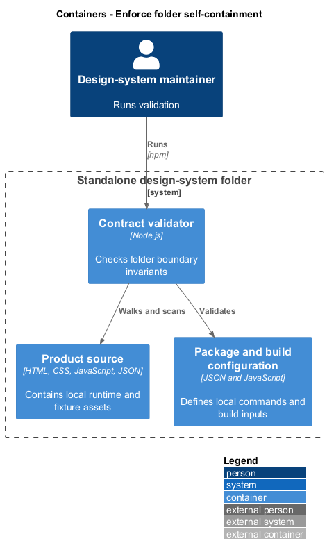
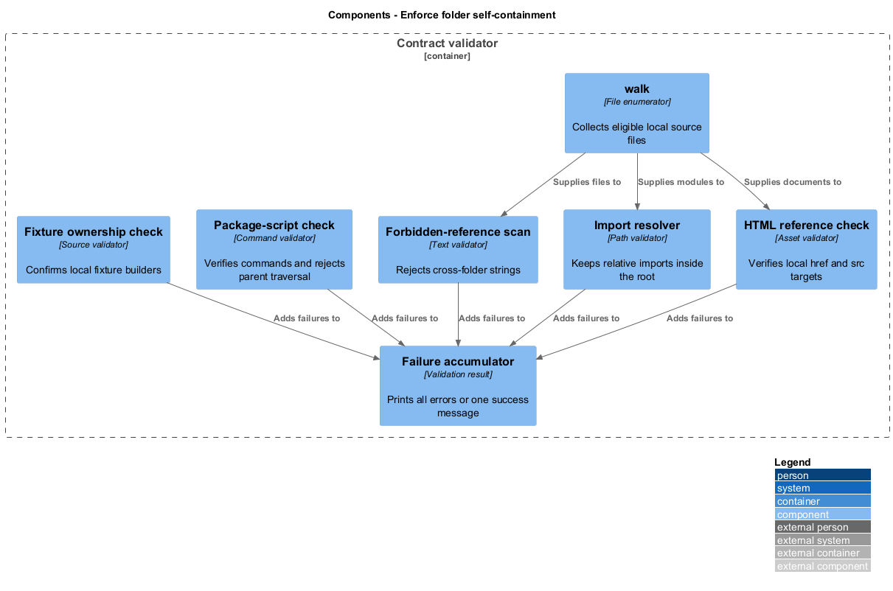
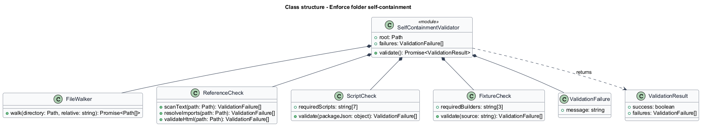
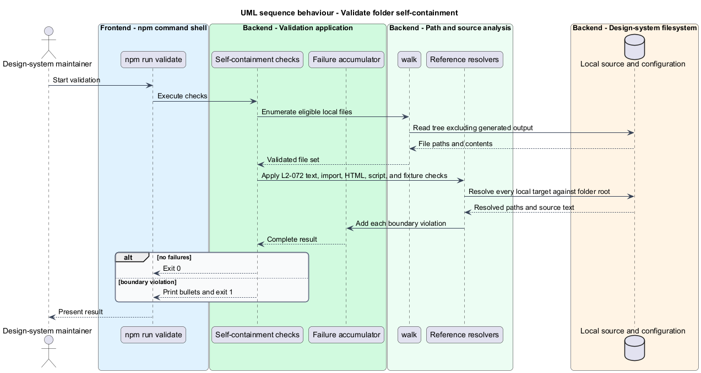

# Enforce folder self-containment

## Overview

The `design-system/` folder is a standalone product that can be copied, built, validated, tested, and deployed without another repository directory. *Self-containment* means every relative dependency resolves inside the folder and every runtime asset required by its HTML, scripts, fixtures, and build commands is local.

This feature checks source text, module imports, HTML asset references, package scripts, and fixture ownership. The validator excludes generated output from source scanning and reports every discovered violation together.

## Description

- **`walk()`** — recursively enumerates validated source files while excluding build and test output.
- **Forbidden-reference scan** — normalizes path separators and rejects known cross-folder strings.
- **Import resolver** — resolves relative JavaScript imports and verifies that targets remain below the design-system root.
- **HTML reference check** — verifies local `href` and `src` targets from `index.html` and `preview.html`.
- **Package-script check** — verifies the required command surface and rejects parent-directory traversal.
- **`catalog-content.js`** — owns `dialogMarkup`, `patternMarkup`, and `componentMarkup` locally.

## Requirements

| L2 ID | Refines (L1) | Requirement |
|-------|--------------|-------------|
| `L2-072` | `L1-029` | Nothing inside `design-system/` may depend on or reference the rest of the repository: no forbidden path strings in any validated file, no relative import escaping the folder, no HTML reference to a missing or external file, and no package script that walks above the folder root. |

## Diagrams

### System context

Design-system maintainers validate the standalone product before it is copied or delivered. No application repository folder participates in its runtime or quality gates.

### Containers

The Node validation command reads only the design-system source tree and reports its result to the maintainer or CI workflow.

### Components

File walking, text scanning, import resolution, HTML reference checks, script validation, and fixture checks enforce the boundary.

### Class structure

`SelfContainmentValidator` aggregates file, import, HTML, script, and fixture checks into one collection of validation failures.

### Behaviour — validate self-containment

The validator walks each eligible file, applies the boundary checks, and returns all failures in one non-zero result or the standard success message.

