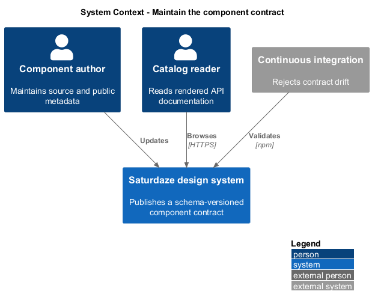
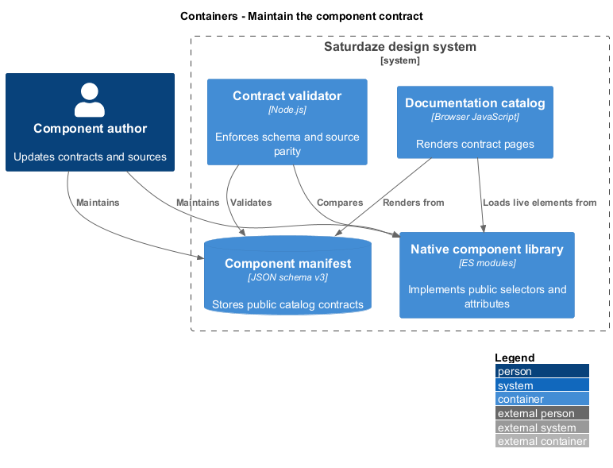
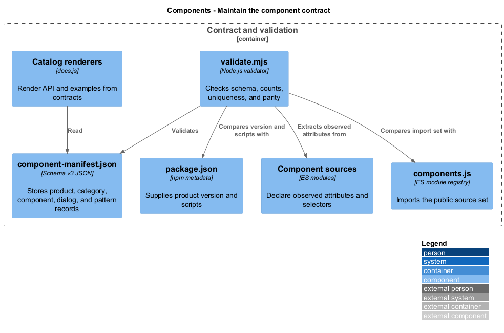
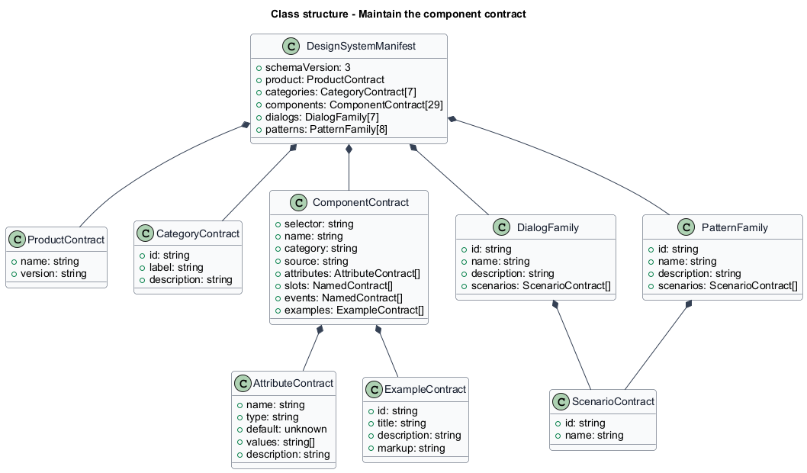
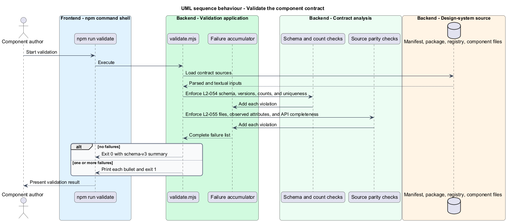

# Maintain the component contract

## Overview

The component manifest is the machine-readable public contract for the design system. A *manifest entry* describes one component's selector, category, source, attributes, slots, events, guidance, and examples; dialog and pattern families describe their named scenario sets.

This feature keeps `component-manifest.json`, `package.json`, the source registry, and component implementations in parity. The catalog reads the same manifest that the validator checks, so documentation coverage and validation share one inventory.

## Description

- **`component-manifest.json`** — schema-versioned inventory of components, categories, dialogs, patterns, and product metadata.
- **`package.json`** — supplies the product version checked against `manifest.product.version`.
- **Component source modules** — expose observed host attributes and self-register public selectors.
- **`components.js`** — defines the complete registry import set.
- **`validate.mjs`** — parses all contracts, checks counts and uniqueness, and compares documented attributes with source observations.
- **Catalog renderers** — consume complete contract arrays and examples without separate hard-coded API metadata.

## Requirements

| L2 ID | Refines (L1) | Requirement |
|-------|--------------|-------------|
| `L2-054` | `L1-021` | `design-system/component-manifest.json` must declare `schemaVersion` 3 and a `product.version` equal to the folder's `package.json` version, and must inventory exactly 29 components, 7 categories, 7 dialog families totalling 18 scenarios, and 8 pattern families totalling 40 responsive states, with complete and unique family and scenario metadata. |
| `L2-055` | `L1-021` | Every manifest component entry must be verifiably consistent with its source: the source file must exist, every attribute a component observes in code must be documented, and every documented API shape must be complete enough to render the reference pages and playground without guesswork. |

## Diagrams

### System context

Component authors maintain source and manifest data, while catalog readers consume the resulting documentation. The validator prevents contract drift between those views.

### Containers

The manifest connects source modules, the documentation SPA, and the validation command inside the standalone design-system product.

### Components

Schema checks, parity checks, registry checks, and documentation renderers read the same contract data.

### Class structure

The manifest model owns categories and family records; each `ComponentContract` refers to one source module and contains its public API arrays.

### Behaviour — validate the manifest contract

The validation command loads each source of contract truth, accumulates every invariant failure, and exits with one combined result.

