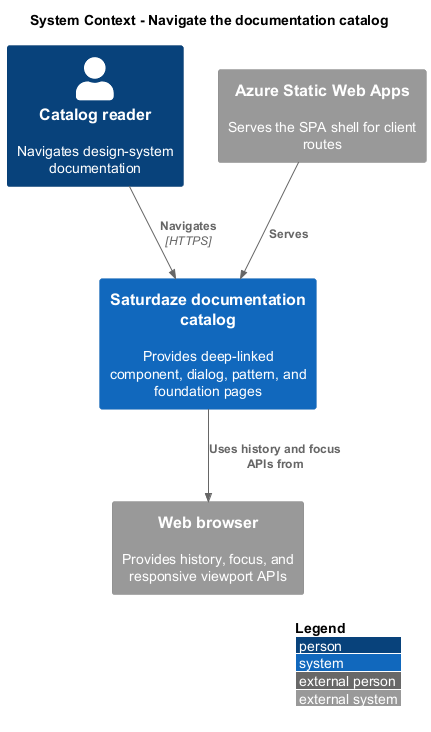
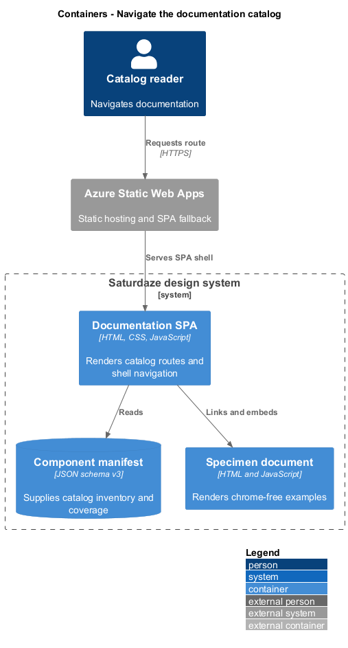
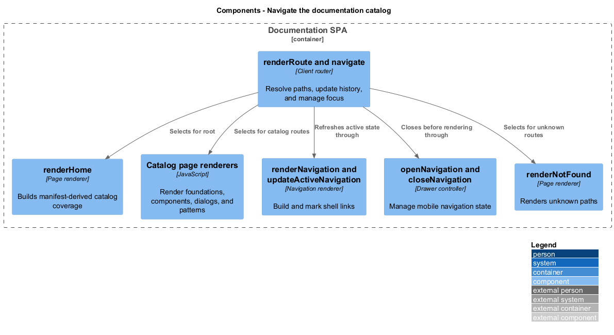
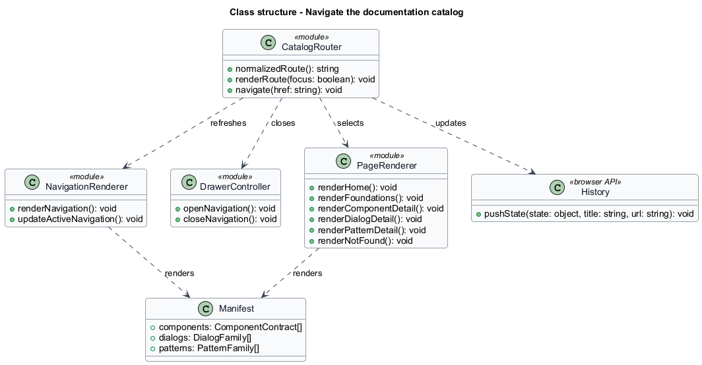
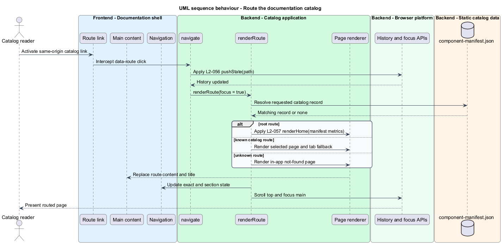
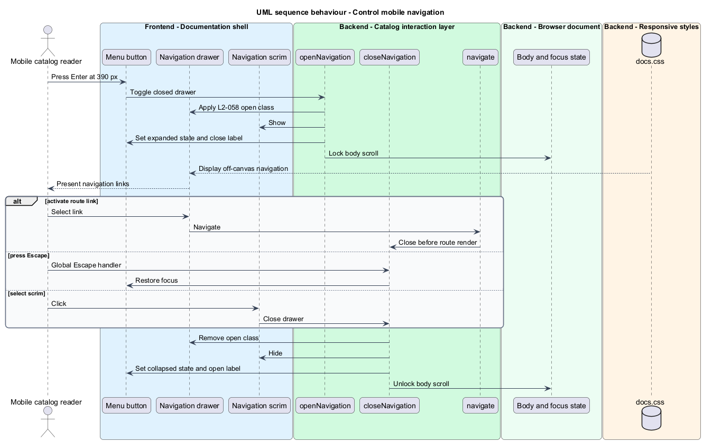

# Navigate the documentation catalog

## Overview

The design-system catalog is a client-side-routed documentation application. A *deep link* is a URL that opens a specific catalog entry or tab directly, and the *documentation shell* is the persistent header, navigation, search, content region, and status infrastructure around each route.

This feature renders the product overview, translates supported paths into catalog pages, maintains browser history and focus, and adapts the navigation from a desktop sidebar to a mobile drawer. Unknown catalog routes receive an in-app not-found view, while the host preserves direct browser loads through its fallback configuration.

## Description

- **`renderNavigation()`** — builds system, component, dialog, and pattern links from the manifest.
- **`renderHome()`** — computes coverage metrics and featured samples from live manifest data.
- **`normalizedRoute()`** — normalizes root and trailing-slash paths.
- **`renderRoute()`** — selects page renderers, applies tab fallbacks, updates navigation state, and manages content focus.
- **`navigate()`** — pushes same-origin history state without a document reload.
- **`openNavigation()` / `closeNavigation()`** — manage drawer state, scrim visibility, body scroll locking, labels, and focus return.
- **`renderNotFound()`** — provides the in-app unknown-route response.

## Requirements

| L2 ID | Refines (L1) | Requirement |
|-------|--------------|-------------|
| `L2-056` | `L1-022` | The documentation app must intercept same-origin `a[data-route]` clicks, push history entries, and re-render on `popstate`, so `/`, `/foundations`, `/components[/:selector/:tab]`, `/dialogs[/:id/:tab]`, and `/patterns[/:id/:tab]` are all directly addressable, survive a browser refresh, and fall back to an in-app not-found page for unknown paths. |
| `L2-057` | `L1-022` | The home route `/` must present the product hero, four coverage metrics computed from the manifest at render time (never hard-coded), and three curated sample sections linking into components, patterns, and dialogs. |
| `L2-058` | `L1-022` | Below the documentation-shell breakpoint the sidebar must become an off-canvas drawer opened by a hamburger button, with scrim, body scroll lock, keyboard dismissal, and focus return; at and above the breakpoint the sidebar must be persistent. |

## Diagrams

### System context

Catalog readers navigate stable design-system URLs through a browser. Azure Static Web Apps supplies the SPA shell for direct client-route requests.

### Containers

The browser history API, documentation SPA, manifest, and static host cooperate to render catalog routes without full-page navigation.

### Components

The route dispatcher selects page renderers, navigation state logic marks the current location, and drawer controls adapt the shell for mobile use.

### Class structure

The documentation module depends on manifest family records and coordinates the route, navigation, and drawer state held by browser elements.

### Behaviour — route the catalog

Client clicks, direct loads, and browser history events converge on `renderRoute()`, which selects content and updates the document title and focus.

### Behaviour — control mobile navigation

The menu, route selection, Escape key, and scrim provide equivalent drawer dismissal paths with synchronized accessibility state.

