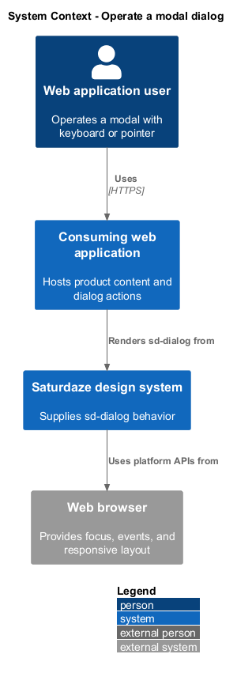
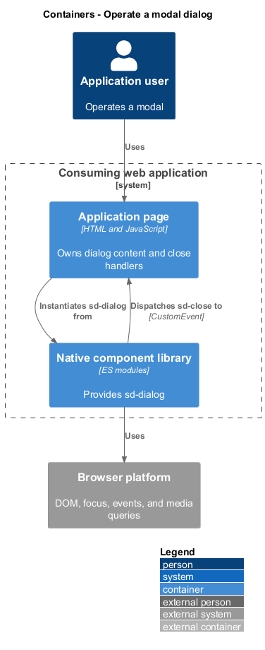
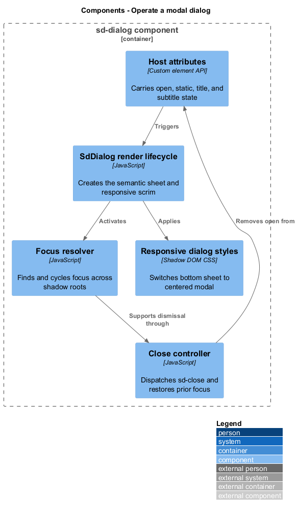
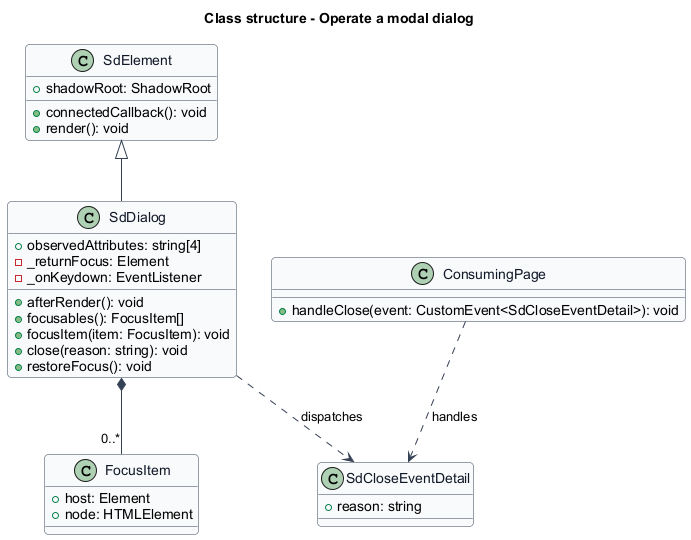
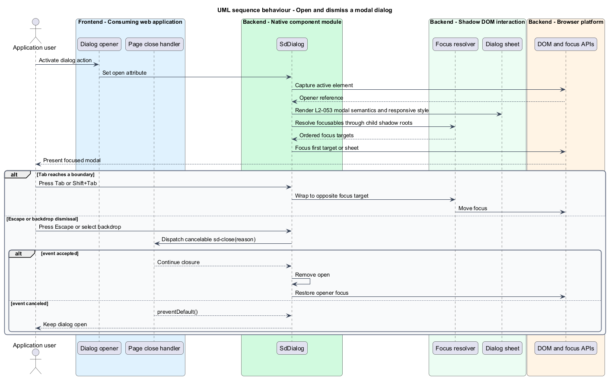

# Operate a modal dialog

## Overview

`sd-dialog` is the design system's modal interaction element. A *focus trap* keeps keyboard focus inside an open modal, and *focus restoration* returns focus to the element that opened it after dismissal.

The element owns its dialog semantics, responsive presentation, keyboard behavior, backdrop handling, and cancelable close event. The same element also supports a `static` presentation that lets documentation pages display dialog specimens without taking over the viewport.

## Description

- **`SdDialog`** — custom-element class registered as `sd-dialog`.
- **`observedAttributes`** — monitors `open`, `title`, `subtitle`, and `static` host state.
- **`afterRender()`** — installs keyboard and backdrop behavior for an open modal.
- **`focusables()`** — resolves focus targets through child shadow roots.
- **`close(reason)`** — dispatches the cancelable, bubbling, composed `sd-close` event before removing `open`.
- **`restoreFocus()`** — returns focus to the captured opener after closure.

## Requirements

| L2 ID | Refines (L1) | Requirement |
|-------|--------------|-------------|
| `L2-053` | `L1-020` | `sd-dialog` must implement complete modal behavior in the component itself: focus capture and restoration, Tab cycling across shadow boundaries, Escape and backdrop dismissal via a cancelable `sd-close` event, an inline `static` presentation for documentation, and responsive bottom-sheet-to-centered-modal presentation at the 720 px breakpoint. |

## Diagrams

### System context

A keyboard or pointer user operates `sd-dialog` inside a consuming web application. The component exposes closure through a stable custom event.

### Containers

The browser hosts the consuming page and the native component module. Both participate in focus ownership and event handling.

### Components

The host attributes, shadow tree, focus resolver, and close-event dispatcher form the modal behavior inside `SdDialog`.

### Class structure

`SdDialog` extends `SdElement`, owns its rendered sheet, and publishes `SdCloseEventDetail` to the consuming page.

### Behaviour — open and dismiss a dialog

Opening captures the prior focus target and moves focus into the dialog. Escape, backdrop, and programmatic paths converge on a cancelable close event and focus restoration.

