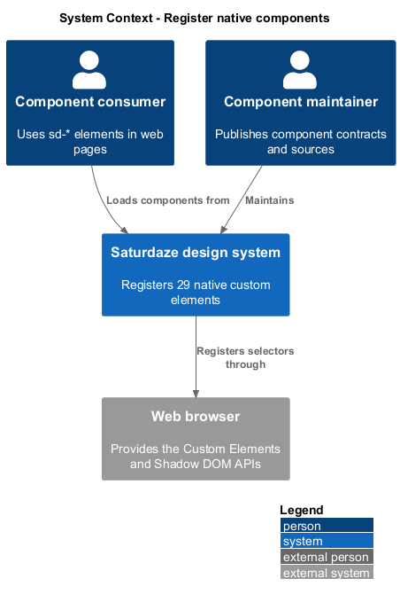
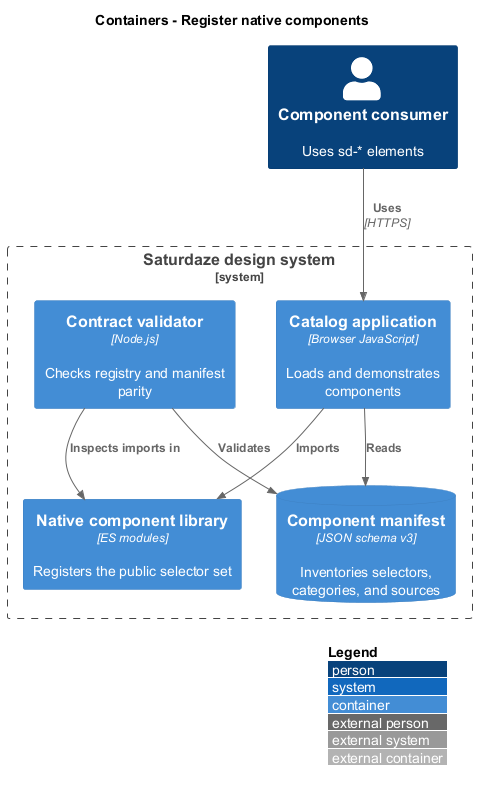
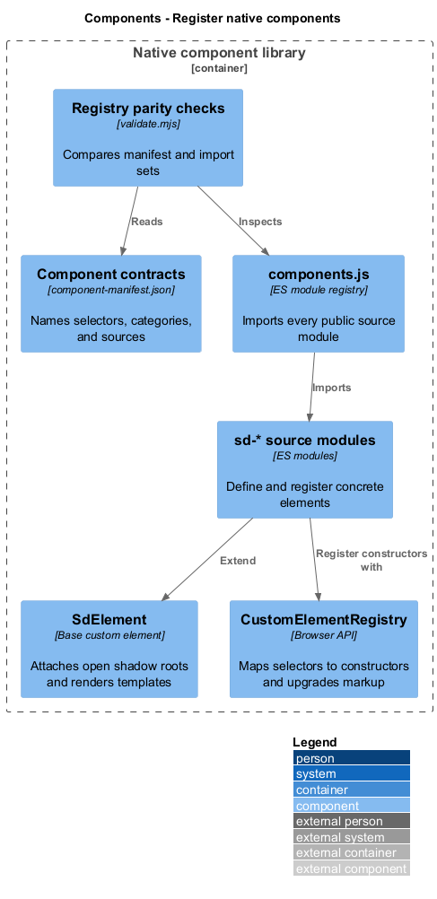
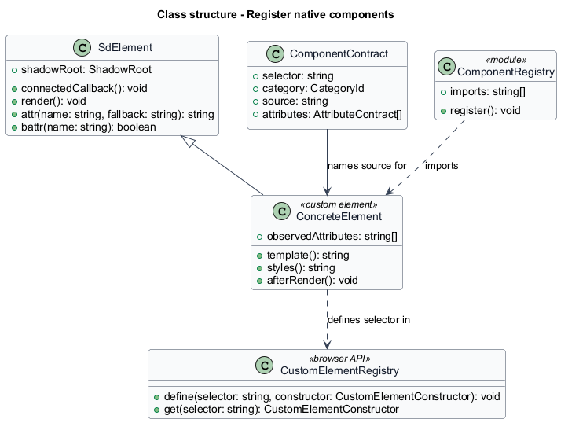
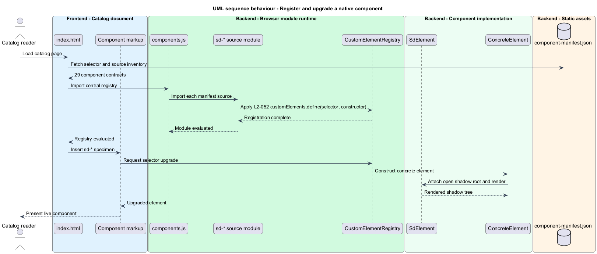

# Register native components

## Overview

The native component library supplies the reusable interface elements shown throughout the design-system catalog. A *public selector* is the stable `sd-*` custom-element name that consumers place in HTML, and an *open shadow root* is an encapsulated DOM tree that remains available for inspection and focus handling.

This feature connects the manifest inventory to the JavaScript module registry. Loading `assets/components.js` imports every declared source module, each module registers its selector, and the browser upgrades matching elements already present in the document.

## Description

- **`component-manifest.json`** — inventories the 29 public selectors, their categories, and their source modules.
- **`components.js`** — central side-effect registry that imports the component source set.
- **`SdElement`** — shared base class that attaches an open shadow root and coordinates initial rendering.
- **Component source modules** — define concrete custom-element classes and call `customElements.define`.
- **`sd-weather-strip.js`** — one source module that registers both `sd-weather-strip` and `sd-weather-day`.
- **`validate.mjs`** — compares manifest sources, registry imports, selectors, and categories.

## Requirements

| L2 ID | Refines (L1) | Requirement |
|-------|--------------|-------------|
| `L2-052` | `L1-020` | `design-system/assets/components.js` must import exactly the component source files named in the manifest, each of which self-registers its element(s) via `customElements.define`. All 29 public selectors must be unique, match `^sd-[a-z0-9-]+$`, attach open shadow roots, and belong to one of the seven manifest categories. `sd-base.js` is shared infrastructure and must not be a public catalog entry. |

## Diagrams

### System context

Catalog readers and product consumers use the registered component library through a browser. The manifest defines the public catalog contract.

### Containers

The browser loads the registry and component modules from the static design-system product, then exposes upgraded elements to the catalog application.

### Components

The manifest, registry, shared base class, concrete modules, and browser custom-element registry participate in component registration.

### Class structure

Each concrete element extends `SdElement`; module side effects register those classes under the selectors declared by the manifest.

### Behaviour — register and upgrade a component

Module loading registers every selector before the browser upgrades catalog markup and invokes the shared render lifecycle.

