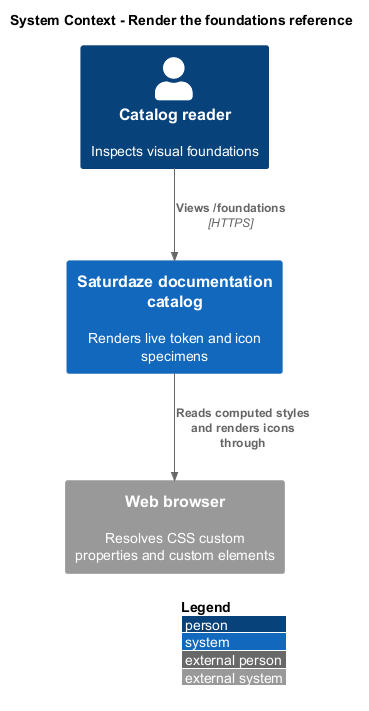
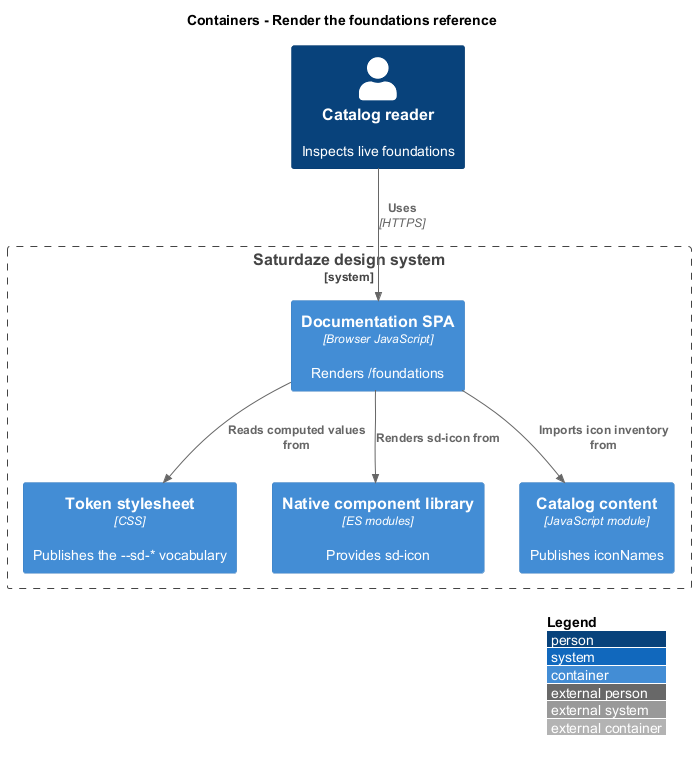
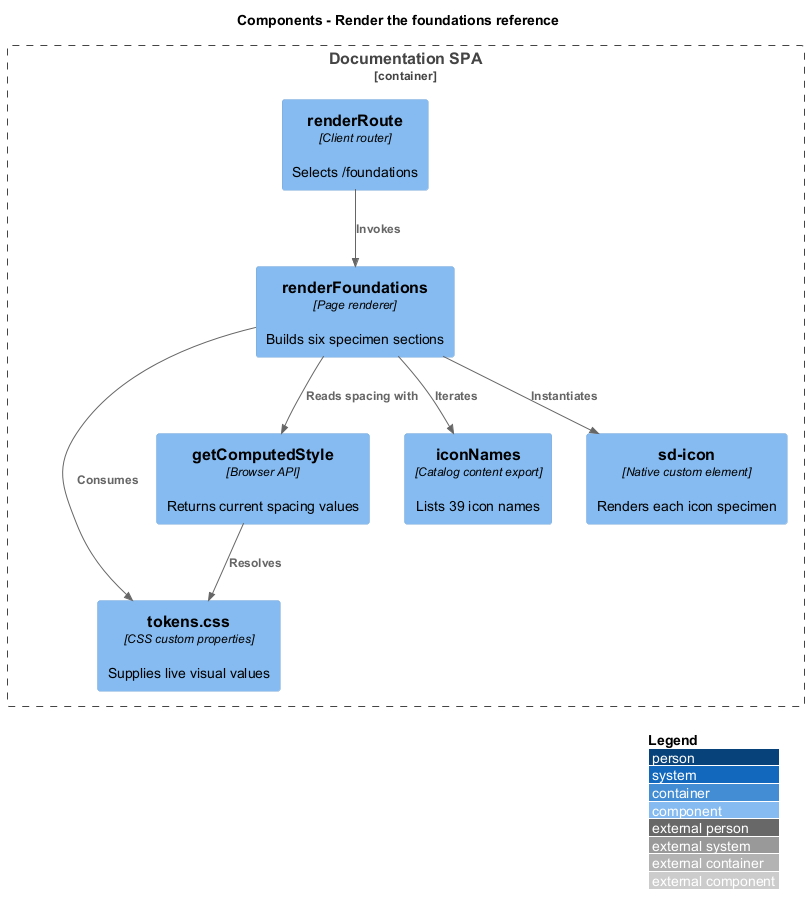
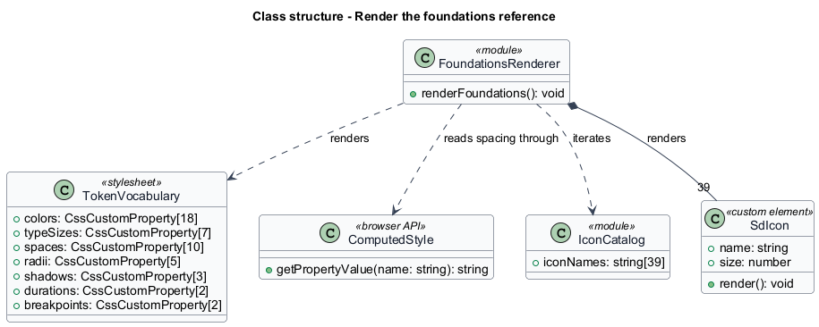
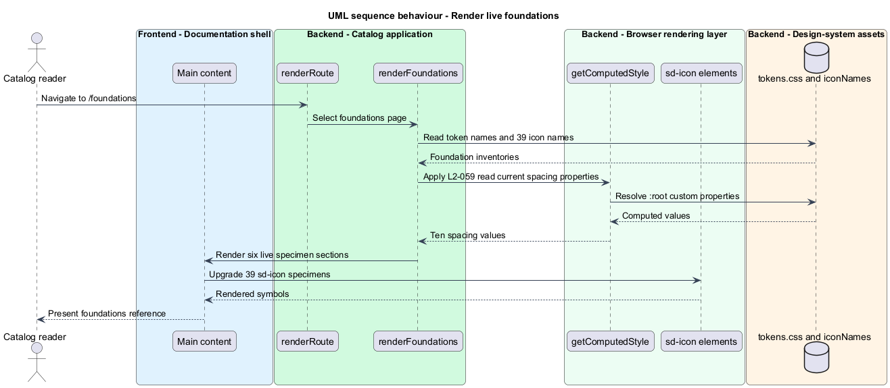

# Render the foundations reference

## Overview

The foundations page documents the visual primitives behind the native component library. A *live specimen* is a rendered example that consumes the same runtime token or element as the product, rather than duplicating its appearance as static documentation data.

This feature presents color, typography, spacing, shape and elevation, motion and breakpoints, and icons on `/foundations`. Token specimens use CSS custom properties directly, spacing values come from computed styles, and the icon grid renders the complete live `sd-icon` set.

## Description

- **`renderFoundations()`** — builds the six foundation sections and assigns the route title.
- **`tokens.css`** — supplies the live color, type, spacing, radius, shadow, duration, and breakpoint values.
- **`getComputedStyle()`** — reads current spacing values from `document.documentElement` at render time.
- **`iconNames`** — exported icon inventory used to build the 39-item specimen grid.
- **`sd-icon`** — native custom element that renders each documented symbol.

## Requirements

| L2 ID | Refines (L1) | Requirement |
|-------|--------------|-------------|
| `L2-059` | `L1-023` | `/foundations` must document the token vocabulary with specimens rendered from the running stylesheet, in six sections, so the page cannot disagree with `tokens.css`. |

## Diagrams

### System context

Catalog readers inspect live design foundations through the documentation application. The rendered specimens derive their values from the published token and icon sources.

### Containers

The documentation SPA reads static token CSS and component modules in the browser to assemble the foundations page.

### Components

`renderFoundations()`, the computed-style API, `iconNames`, and `sd-icon` provide the six live specimen sections.

### Class structure

The foundations renderer depends on the token vocabulary and icon inventory, while each icon specimen contains one `SdIcon` instance.

### Behaviour — render live foundations

The route dispatcher invokes the foundations renderer, which reads computed values and creates live token and icon specimens.

