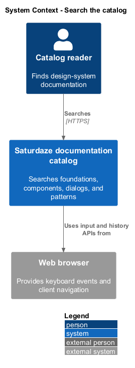
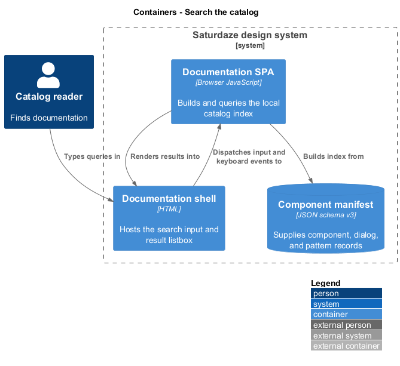
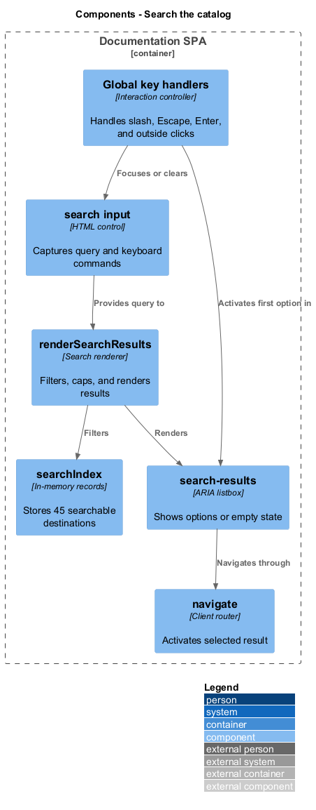
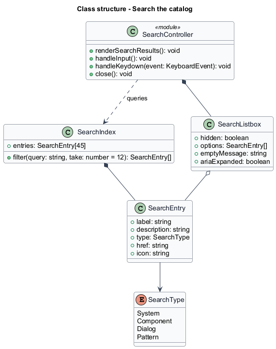
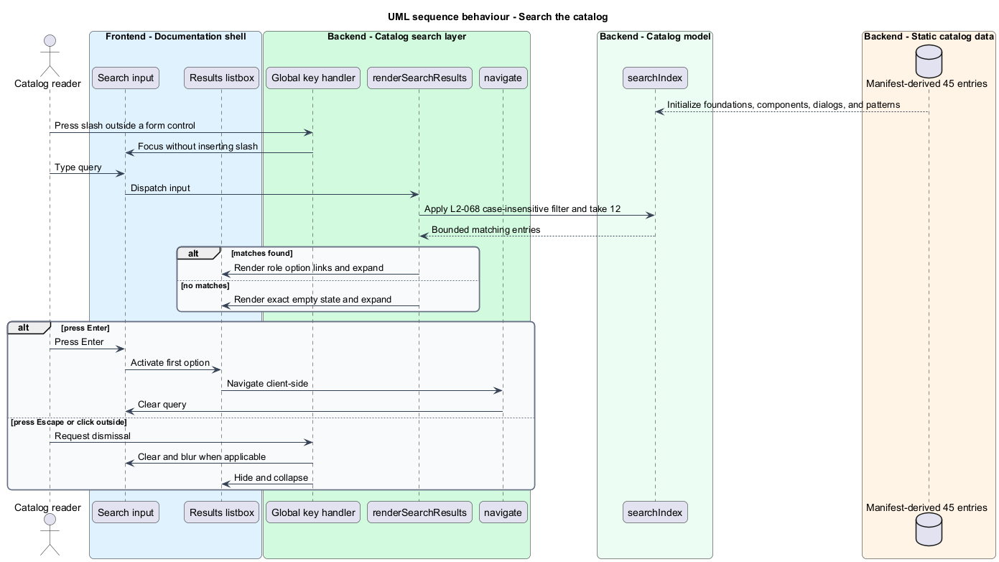

# Search the catalog

## Overview

Global catalog search gives keyboard and pointer users one entry point for finding foundations, components, dialog families, and pattern families. A *search index entry* is a normalized record containing a label, description, type, destination, and icon.

This feature builds its index from the manifest plus the foundations page. Queries match label, description, and type without case sensitivity, return at most 12 results, and support direct keyboard activation through the same client-side navigation path as catalog links.

## Description

- **`searchIndex`** — in-memory collection of 45 normalized catalog destinations.
- **`#search`** — query input with listbox ownership and expanded state.
- **`renderSearchResults()`** — filters, caps, renders, opens, and clears the result panel.
- **`#search-results`** — listbox containing option links or the explicit empty state.
- **Global key handler** — focuses search on `/` outside form controls.
- **Search key handler** — clears on Escape and activates the first result on Enter.
- **`navigate()`** — performs result activation through client-side routing.

## Requirements

| L2 ID | Refines (L1) | Requirement |
|-------|--------------|-------------|
| `L2-068` | `L1-027` | The header search must index the whole catalog (foundations, 29 components, 7 dialog families, 8 pattern families — 45 entries), match case-insensitively on label, description, and type, cap results at 12, and support full keyboard operation. |

## Diagrams

### System context

Catalog readers search all documentation families through the browser. The manifest supplies the entries and client routes provide activation targets.

### Containers

The documentation SPA builds a local index from the manifest and renders results without a backend search service.

### Components

Index construction, query filtering, keyboard handling, the results listbox, and route activation form the search slice.

### Class structure

`SearchIndex` owns `SearchEntry` records and produces a bounded result set consumed by the search controller and listbox.

### Behaviour — search and activate a result

Typing filters the local index and updates listbox state. Enter, pointer selection, Escape, and outside clicks produce the documented activation and dismissal outcomes.

