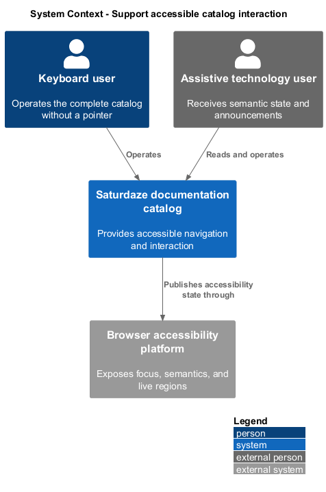
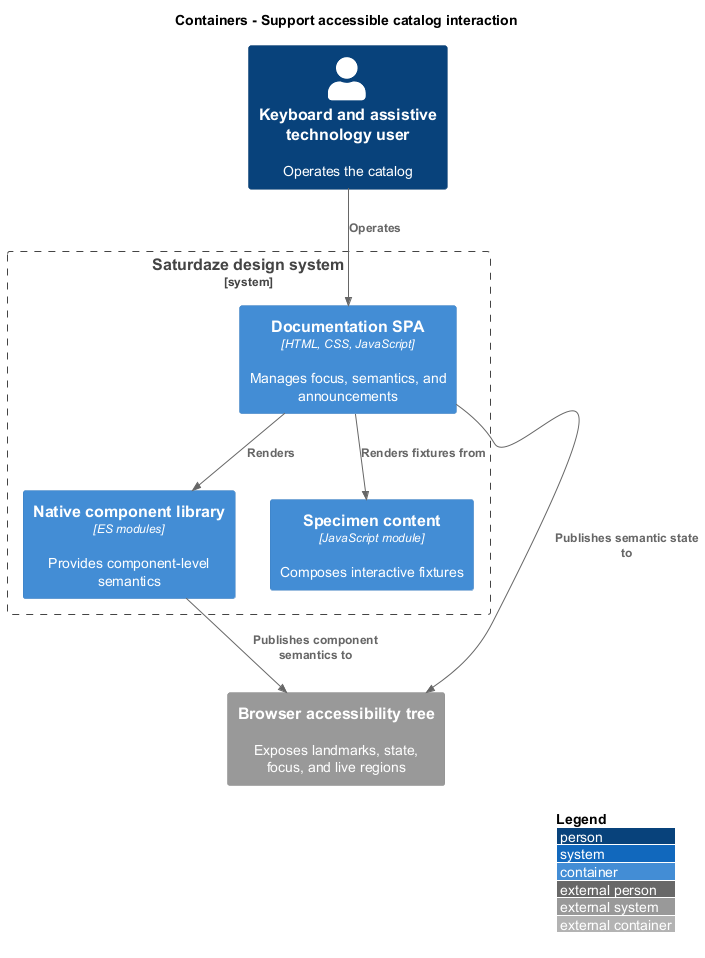
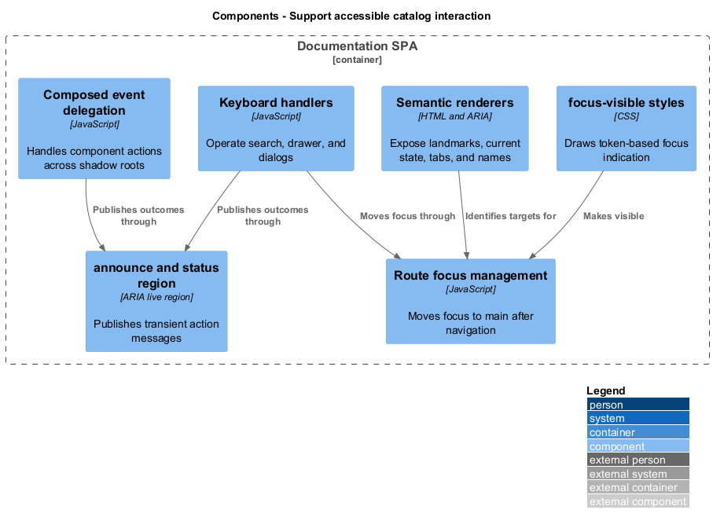
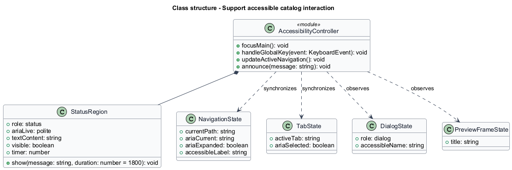
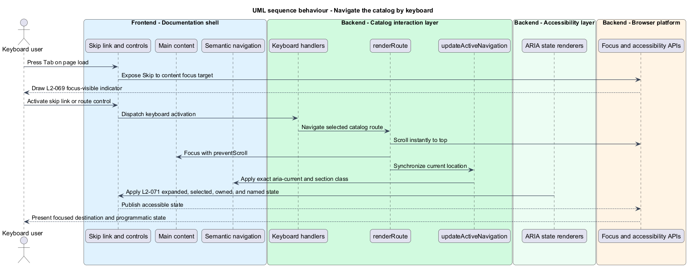
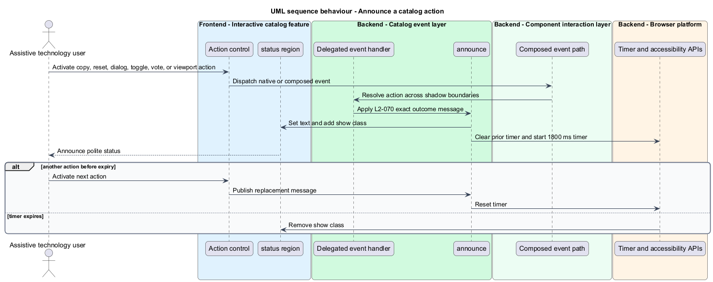

# Support accessible catalog interaction

## Overview

The documentation catalog exposes navigation and state changes to keyboard users and assistive technology. A *live region* is an ARIA status element that announces changing text without moving focus, and *programmatic state semantics* are ARIA attributes that communicate a control's current condition.

This feature combines keyboard reachability, route focus management, visible focus treatment, landmarks, selected and expanded state, dialog naming, iframe titles, and transient action announcements. These behaviors apply across the shell and every interactive catalog feature.

## Description

- **`#main`** — focus target for route changes and destination of the skip link.
- **`:focus-visible` rules** — draw the token-based keyboard focus indicator.
- **`updateActiveNavigation()`** — maintains exact `aria-current` state.
- **Breadcrumb and tab renderers** — expose current location and selected page section.
- **`announce()`** — updates `#status`, resets its 1800 ms timer, and controls transient toast presentation.
- **Event delegation** — announces copy, reset, dialog, toggle, vote, and viewport outcomes across shadow boundaries.
- **Shell controls** — synchronize search and drawer `aria-expanded`, accessible labels, and ownership relationships.

## Requirements

| L2 ID | Refines (L1) | Requirement |
|-------|--------------|-------------|
| `L2-069` | `L1-028` | Every catalog interaction must be operable by keyboard alone, with a skip link, programmatic focus management on navigation, and a visible focus indicator drawn from the token palette. |
| `L2-070` | `L1-028` | Every non-navigational action must be announced through the single `#status` live region, rendered as a transient toast, so assistive technology hears state changes that are otherwise only visual. |
| `L2-071` | `L1-028` | Navigation, breadcrumbs, tabs, search, dialogs, and the menu button must expose their state through ARIA so the current location and each control's condition are programmatically determinable. |

## Diagrams

### System context

Keyboard users and assistive technology operate the same catalog as pointer users. Browser accessibility APIs expose the shell's landmarks, state, focus, and announcements.

### Containers

The documentation SPA publishes semantic HTML and ARIA state through the browser accessibility tree while native components expose their own interaction semantics.

### Components

Focus management, semantic renderers, keyboard handlers, live-region announcements, and component event delegation implement the accessible interaction contract.

### Class structure

The accessibility controller coordinates route focus, semantic element state, and a single `StatusRegion` with a resettable timer.

### Behaviour — navigate by keyboard

Skip-link, route, menu, search, tab, playground, viewport, and dialog controls preserve visible focus and publish their current state.

### Behaviour — announce an action

Non-navigation actions map to exact messages in the shared polite live region, with each new message replacing the prior dismissal timer.

