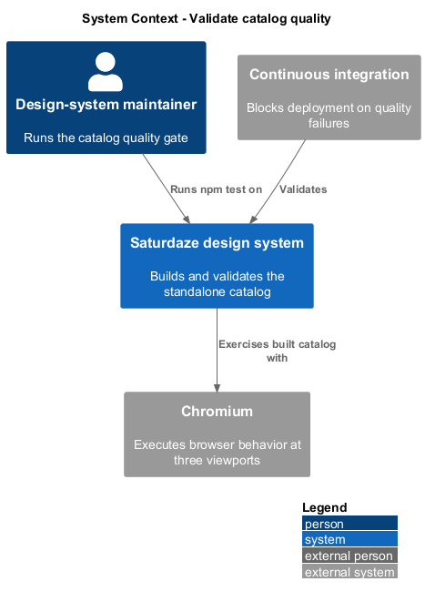
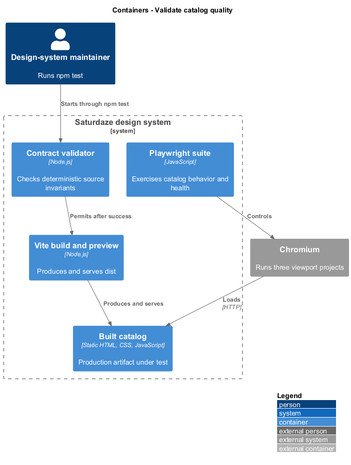
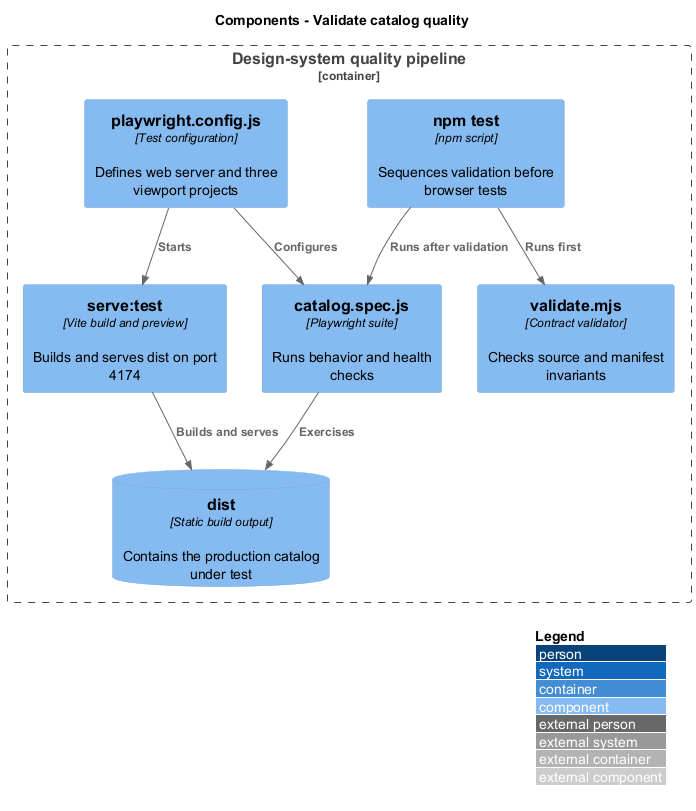
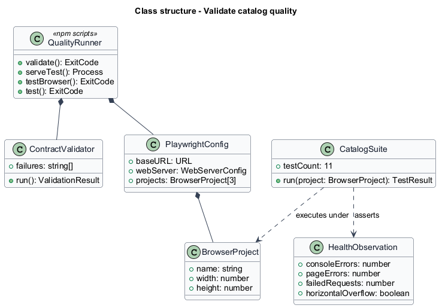
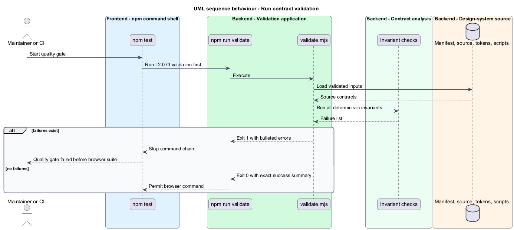
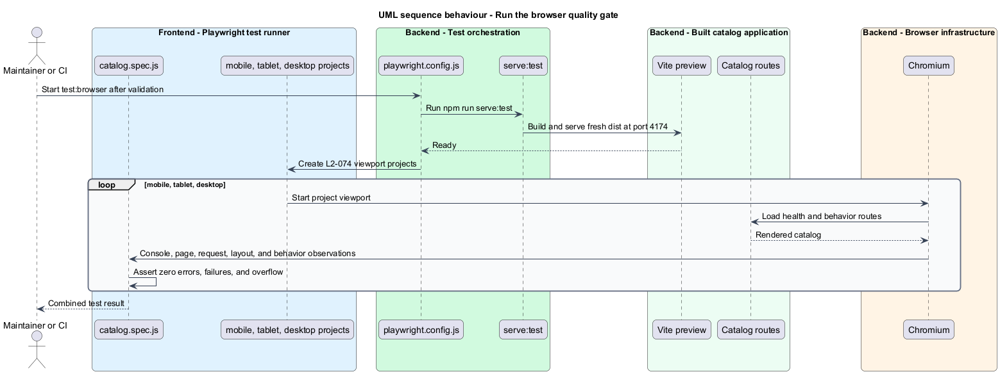

# Validate catalog quality

## Overview

The design-system quality gate combines deterministic contract validation with browser-level behavior checks. A *contract gate* checks source and manifest invariants without launching a browser, while a *browser gate* exercises the built catalog at representative mobile, tablet, and desktop viewports.

This feature makes validation the first stage of `npm test`. A successful contract result permits Playwright to build and serve the production catalog, then verify routing, interaction, rendering health, request health, and horizontal layout across all three projects.

## Description

- **`npm run validate`** — executes `scripts/validate.mjs` and emits the schema-v3 success contract.
- **`validate.mjs`** — accumulates manifest, parity, token, renderer, and self-containment failures.
- **`npm test`** — sequences validation before the browser suite.
- **`playwright.config.js`** — defines mobile, tablet, and desktop projects and the built-site web server.
- **`catalog.spec.js`** — holds the 11 browser tests, including the multi-route health sweep.
- **`serve:test`** — builds the Vite output before serving it at `127.0.0.1:4174`.

## Requirements

| L2 ID | Refines (L1) | Requirement |
|-------|--------------|-------------|
| `L2-073` | `L1-030` | `npm run validate` must execute `scripts/validate.mjs`, which enforces the manifest, parity, token, and self-containment invariants plus the presence of the key documentation renderers, failing loudly and blocking the browser suite when anything drifts. |
| `L2-074` | `L1-030` | The Playwright suite must exercise the built catalog (not the dev server) across mobile, tablet, and desktop viewports, including a health sweep asserting zero console errors, zero failed requests, and no horizontal overflow. |

## Diagrams

### System context

Maintainers and continuous integration invoke one quality command before catalog delivery. Browser automation observes the same built product that deployment uploads.

### Containers

Node validation, the Vite build server, Playwright workers, and the built static catalog form the local and CI quality pipeline.

### Components

Contract checks gate browser startup; Playwright projects then share health and behavior specifications against the production build.

### Class structure

The validation runner aggregates invariant checks, while the Playwright configuration owns three viewport projects that execute the catalog suite.

### Behaviour — run contract validation

`npm test` invokes the deterministic validator first and stops before browser installation or serving when any invariant fails.

### Behaviour — run the browser gate

After validation succeeds, Playwright starts the built catalog and executes the suite across mobile, tablet, and desktop projects.

