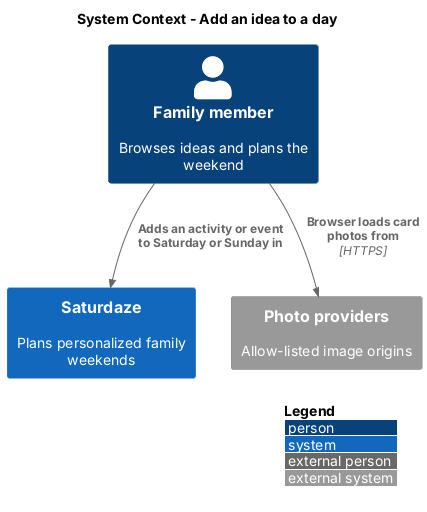
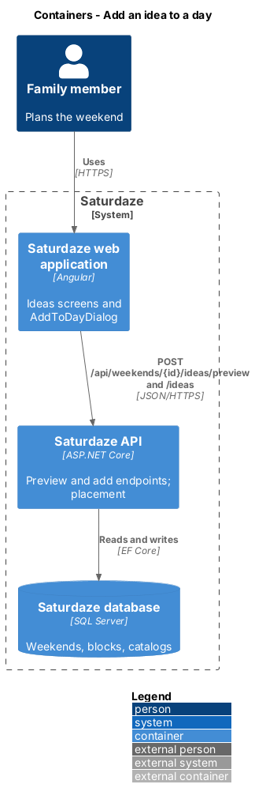
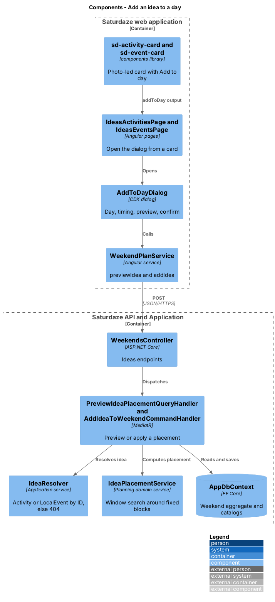
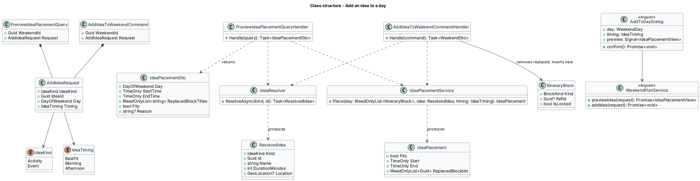
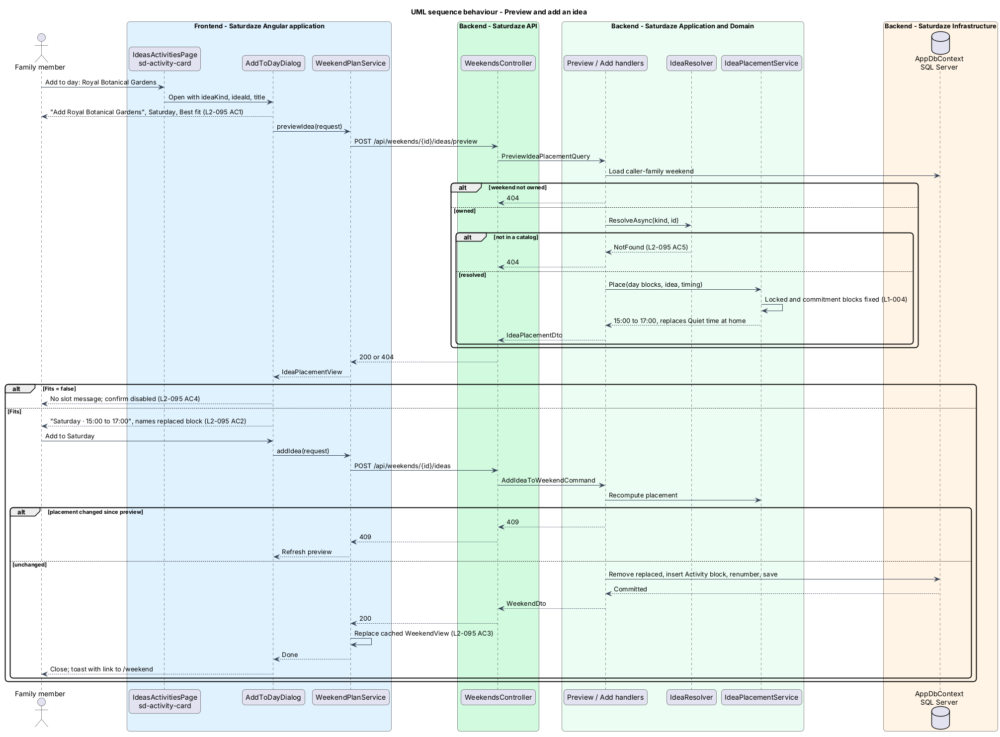

# Add an idea to a day

## Overview

Saturdaze is a web application that plans personalized family weekends. The Ideas screens (`/ideas`, `/ideas/food`, `/ideas/events`) list activities, restaurants, and local events that suit the family and the forecast. Before this feature, an idea card was text led and offered only a map, menu, or details link; a family that liked an idea had no direct way to put it in the plan.

*idea* — activity, or local event dated within the current weekend, shown as a card on an Ideas screen

*placement* — day, start time, and end time the planner proposes for an idea, plus the unlocked blocks it replaces

*timing* — family's coarse preference for a placement: Best fit, Morning, or Afternoon

This feature makes each card lead with its photo, as in `docs/mocks/pages/ideas.html`, `ideas.food.html`, and `ideas.events.html`, and adds an "Add to day" action to activity cards and to this weekend's event cards. The action opens dialog D28 (`docs/mocks/pages/dialogs.html#dialog-add-to-day`), previews the placement, and adds the block on confirmation. Restaurant cards keep "Lock it in" (`discovery/pick-restaurants`) as their way into the plan. Photos come from `discovery/store-place-location-and-imagery`; travel legs around the new block come from `weekend-planning/map-itinerary-and-travel-legs`.

## Description

### Photo-led cards

`ActivityCard`, `FoodCard`, and `EventCard` (models in the `api` project) gain `media: MediaView | null`. `ActivityService`, `RestaurantService`, and `EventsService` map `PlacePhotoDto` to `MediaView`, and pass the category icon and tone the fallback tile uses. The `icon` and `tone` fields stay because the fallback reads them.

`sd-activity-card`, `sd-food-card`, and `sd-event-card` render `sd-media` as their first child with the `card--media` modifier, flush with the card top at 16:9, and drop the leading `disc` (L2-106 AC1). Event cards keep their `sd-date-tile`. A null `media` renders the fallback tile at the same height, so rows stay even (L2-106 AC3). The attribution chip uses a 55 % ink scrim with white text to meet 4.5:1 (L2-106 AC4). Grid columns stay as today: 1, 2, and 3 at 390, 820, and 1440 px (L2-106 AC2).

### Add to day

`sd-activity-card` and `sd-event-card` gain an `addable` input and an `addToDay` output and render an `sd-button` labelled "Add to day" with `aria-label="Add to day: {title}"`, so the accessible name begins with the visible label (L2-107 AC6). `IdeasEventsPage` shows it only for events in its Saturday and Sunday sections; pending submissions and "Coming soon" events have none.

`AddToDayDialog` is a new CDK dialog in `frontend/projects/saturdaze/src/app/dialogs/add-to-day-dialog`. Its data is `{ ideaKind, ideaId, title }`. It renders an `sd-seg-radio` for the day (Saturday preselected), an `sd-select` for timing ("Best fit" selected), and an `sd-well` that shows the preview (L2-107 AC1). Each change re-requests the preview. When the preview reports no fit, the well says so and the confirm `sd-button` is disabled (L2-107 AC4). The confirm label names the day ("Add to Saturday").

`IWeekendPlanService` gains `previewIdea(request): Promise<IdeaPlacementView>` and `addIdea(request): Promise<void>`. `addIdea` replaces the cached `WeekendView` with the returned weekend, so `/weekend` shows the new block without another request (L2-107 AC3). `IdeasActivitiesPage` and `IdeasEventsPage` inject `WEEKEND_PLAN_SERVICE` and open the dialog through CDK `Dialog`.

### API

`WeekendsController` gains two family-scoped endpoints on the current weekend:

- `POST /api/weekends/{id}/ideas/preview` dispatches `PreviewIdeaPlacementQuery` and returns `IdeaPlacementDto(Day, StartTime, EndTime, ReplacedBlockTitles, Fits, Reason)`.
- `POST /api/weekends/{id}/ideas` dispatches `AddIdeaToWeekendCommand` and returns the updated `WeekendDto`.

Both take `{ ideaKind: "activity" | "event", ideaId, day: "saturday" | "sunday", timing: "bestFit" | "morning" | "afternoon" }`. `AddIdeaToWeekendCommandValidator` rejects unknown enum values with 400.

`IdeaResolver` loads the idea from `Activities` or `LocalEvents` by ID. An ID found in neither catalog returns 404; a pending `EventSubmission` ID is never a `LocalEvent`, so another family's pending submission also returns 404 (L2-107 AC5). A weekend outside the caller's family returns 404 through `ICurrentFamilyAccessor`.

`IdeaPlacementService` is a new planning domain service beside `WeekendPlanner`. It reads the chosen day's blocks, treats locked blocks and commitments as fixed (L1-004), and looks for the earliest window inside the timing band that fits the idea's `TypicalDurationMinutes` (activities) or its event hours (events) plus the travel legs on both sides. A window may consume unlocked `Activity` and `Downtime` blocks; those become the replaced blocks (L2-107 AC2). Meals are kept. Timing bands (morning ends at 12:00; afternoon starts at 12:00) reuse `PlannerTimes`. The preview and the add call the same service on the current plan, so an unchanged weekend gets the previewed time. The add recomputes rather than trusting the client; when nothing fits it returns 409 `no_slot` and the dialog refreshes the preview. An unlocked activity that gives way leaves together with the drives that touch it. Whether Best fit prefers the forecast's driest window is `<TO SUPPLY>`.

`AddIdeaToWeekendCommandHandler` removes the replaced blocks, inserts an `ItineraryBlock` of kind `Activity` with `RefId` set to the idea and `Reason` "Added by the family", renumbers `SortOrder`, and saves in one unit of work. The block is unlocked, so a later regenerate may move it; locking it remains a family choice.

## Requirements

The following L2 requirements refine the cited L1 capabilities.

| L2 ID | Refines (L1) | Requirement |
|-------|--------------|-------------|
| `L2-106` | `L1-033` | Activity, restaurant, and event cards in Ideas shall show the place's primary photo flush with the top of the card at 16:9, with its attribution overlaid, followed by the existing title, meta, blurb, chips, and actions (`docs/mocks/pages/ideas.html`, `ideas.food.html`, `ideas.events.html`). |
| `L2-107` | `L1-033` | Each activity card, and each event card dated within the current weekend, shall have an "Add to day" action that opens a CDK dialog (D28 in `docs/mocks/pages/dialogs.html`) asking for the day (Saturday \| Sunday) and timing (Best fit, Morning, Afternoon). Before confirming, the dialog shall preview the placement the planner proposes, including any unlocked block it replaces. Confirming shall add the block to the current weekend. Locked blocks and commitments shall never be displaced (L1-004). Restaurant cards keep "Lock it in" as their way into the plan and carry no "Add to day" action. |

## Diagrams

### System context

The context view shows the family member adding an idea from the Ideas screens to the plan Saturdaze holds.

### Containers

The container view follows the preview and add calls from the Angular application through the API to SQL Server.

### Components

The component view names the card, dialog, service, endpoints, handlers, and the placement service the preview and the add share.

### Class structure

The class view shows the request contract, the placement result, and the services that resolve the idea and place it.

### Behaviour — preview and add an idea

The sequence traces the dialog from opening to confirmation, including the no-fit and not-found alternates (`L2-107`).

