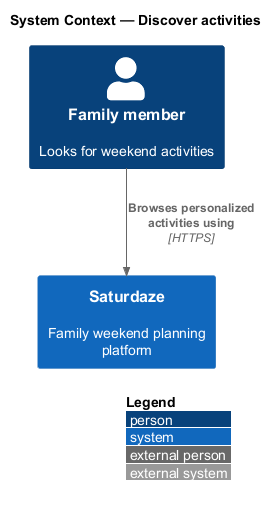
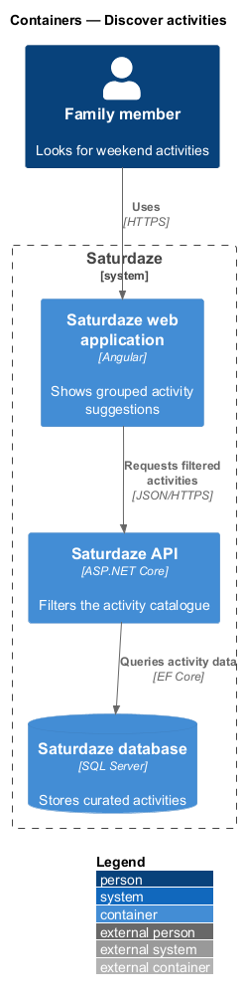
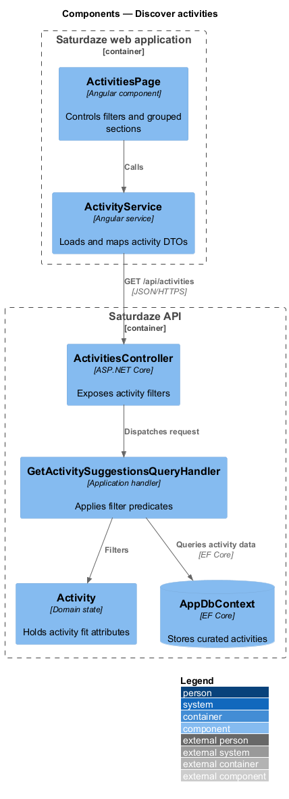
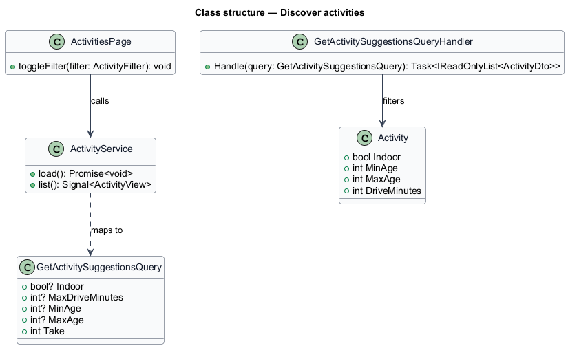
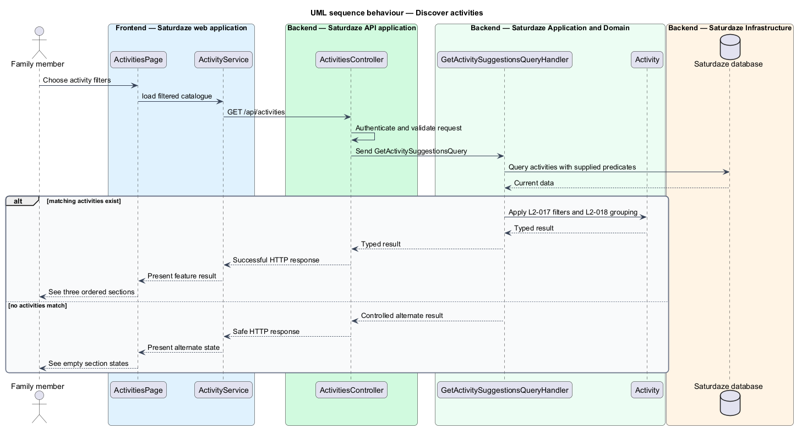

# Discover activities

## Overview

Saturdaze is a web application that plans personalized family weekends. Activity discovery narrows the curated catalogue by weather, age fit, drive time, indoor status, and novelty.

*weather-fit pick* — activity whose indoor or outdoor attributes suit the current forecast

`ActivityService` requests filtered DTOs and maps them into three ordered presentation sections. `GetActivitySuggestionsQueryHandler` applies every supplied server-side filter.

## Description

The feature forms a vertical slice across the Angular application, the ASP.NET Core API, application handlers, domain state, and SQL Server persistence.

- **`ActivitiesPage`** — Angular page that manages filter chips and renders three `sd-section` groups.
- **`ActivityService`** — Typed client service that loads activity suggestions and builds `ActivityView`.
- **`ActivitiesController`** — API controller exposing `GET /api/activities`.
- **`GetActivitySuggestionsQuery`** — Typed query carrying filter values.
- **`GetActivitySuggestionsQueryHandler`** — Application handler that composes the EF Core predicate and result limit.
- **`Activity`** — Domain entity containing age, weather, duration, and drive attributes.

## Requirements

The feature realizes the following level-2 (L2) requirements. Each row cites the level-1 (L1) capability refined by the requirement.

| L2 ID | Refines (L1) | Requirement |
|-------|--------------|-------------|
| `L2-017` | `L1-005` | `GET /api/activities` must accept query filters (`indoor`, `maxDriveMinutes`, `minAge`, `maxAge`, `weather`, `tryNew`, `take`) and return activities whose attributes satisfy every supplied filter. |
| `L2-018` | `L1-005` | The `/activities` page must render three labelled sections in order: weather-fit picks for the current forecast, "If weather turns" fallbacks, and "Try something new" novelty picks. |

## Diagrams

### System context

The context view identifies the person using the discovery capability and the systems that participate in the result.

### Containers

The container view follows the interaction from the Angular web application through the API to persistence.

### Components

The component view names the page, client service, controller, handler, domain type, and infrastructure boundary involved in the slice.

### Class structure

The class view shows the request, handler, and state relationships used by the feature.

### Behaviour — filter and group activities

The sequence view traces the primary behaviour to `L2-017` and `L2-018`. Its alternate path produces a controlled empty, validation, authorization, or fallback state.

