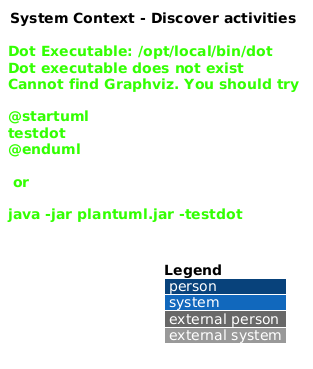
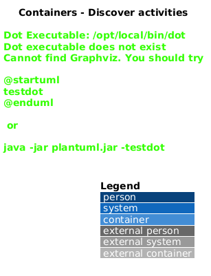
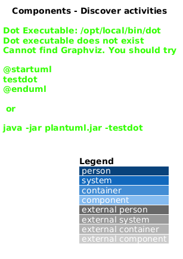
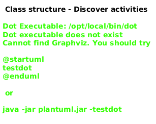
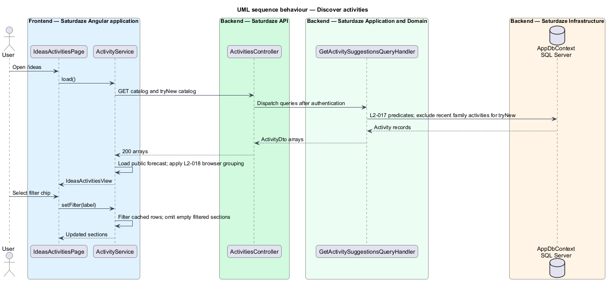

# Discover activities

## Overview

Saturdaze is a web application that plans personalized family weekends. Activity discovery narrows the curated catalogue by weather, age fit, drive time, indoor status, and novelty.

*weather-fit pick* — activity whose indoor or outdoor attributes suit the current forecast

`ActivityService` requests filtered DTOs and maps them into three ordered presentation sections. `GetActivitySuggestionsQueryHandler` applies every supplied server-side filter.

## Description

`IdeasActivitiesPage` at `/ideas` injects `ACTIVITY_SERVICE`, reads `ActivityService.list(): Signal<IdeasActivitiesView>`, and delegates chip changes to `setFilter(label)`. The browser applies the selected chip to loaded records.

`ActivityService.load()` requests the catalog, `?tryNew=true` candidates, and the weekend forecast. `buildSections()` forms weather-fit, fallback, and novelty sections, with at most three unique records per section. Active filters suppress empty sections.

`ActivitiesController` dispatches `GetActivitySuggestionsQuery`. The handler applies supplied age, indoor, drive, weather, and count filters. Results are ordered by drive minutes, then name. Novelty excludes activities from the caller family's last four weekends through `ICurrentFamilyAccessor`, implemented by `CurrentUserFamilyAccessor`.

`Activity` stores catalog attributes; browser services own card mapping and section grouping. Cards open map links. Family-age and drive limits are not automatically supplied by the current browser load; complete family personalization remains a gap under L1-005.

Activity cards lead with the place's photo and offer "Add to day" since the 2026-10-06 mock (`docs/mocks/pages/ideas.html`). `discovery/store-place-location-and-imagery` designs the photo data and `sd-media`; `discovery/add-idea-to-day` designs the photo-led card and the placement dialog. Section building and filters in this design are unchanged.

## Requirements

The following L2 requirements refine the cited L1 capabilities. Implementation gaps stated in Description do not waive these obligations.

| L2 ID | Refines (L1) | Requirement |
|-------|--------------|-------------|
| `L2-017` | `L1-005` | `GET /api/activities` shall accept query filters (`indoor`, `maxDriveMinutes`, `minAge`, `maxAge`, `weather`, `tryNew`, `take`) and return activities whose attributes satisfy every supplied filter. |
| `L2-018` | `L1-005` | The `/ideas` page shall render three labelled sections in order: weather-fit picks for the current forecast, "If the weather turns" fallbacks, and "Try something new" novelty picks. |

## Diagrams

### System context

The context view identifies the person using the discovery capability and the systems that participate in the result.

### Containers

The container view follows the interaction from the Angular web application through the API to persistence.

### Components

The component view names the page, client service, controller, handler, domain type, and infrastructure boundary involved in the slice.

### Class structure

The class view shows the request, handler, and state relationships used by the feature.

### Behaviour — filter and group activities

The sequence view traces the primary behaviour to `L2-017` and `L2-018`. Its alternate path produces a controlled empty, validation, authorization, or fallback state.

