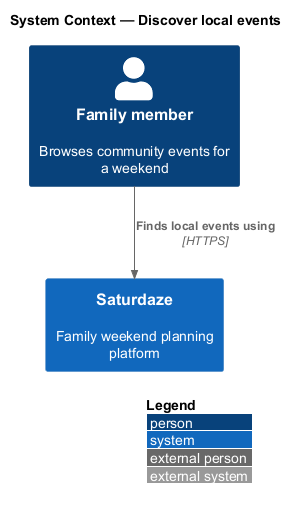
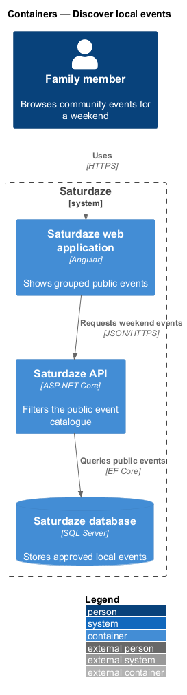
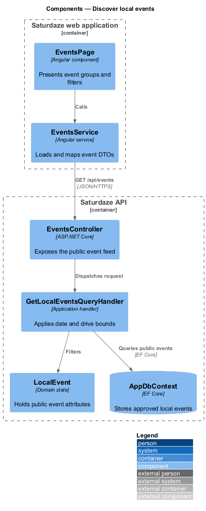
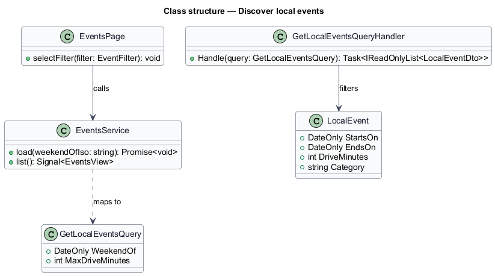
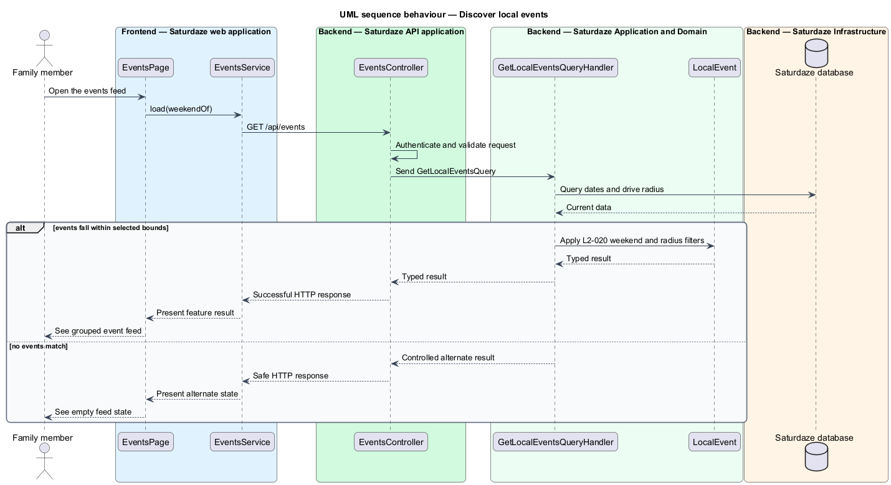

# Discover local events

## Overview

Saturdaze is a web application that plans personalized family weekends. Local-event discovery returns curated community events near the family for the selected weekend and coming-soon window.

*coming-soon window* — events no more than 14 days after the selected weekend

`EventsService` loads event DTOs and maps them into Saturday, Sunday, and coming-soon sections. `GetLocalEventsQueryHandler` applies the date and drive-radius bounds.

## Description

The feature forms a vertical slice across the Angular application, the ASP.NET Core API, application handlers, domain state, and SQL Server persistence.

- **`EventsPage`** — Angular page that presents event sections and filter controls.
- **`EventsService`** — Typed client service that loads and maps the public event feed.
- **`EventsController`** — API controller exposing `GET /api/events`.
- **`GetLocalEventsQuery`** — Typed query containing weekend date and maximum drive time.
- **`GetLocalEventsQueryHandler`** — Application handler that applies date overlap and distance predicates.
- **`LocalEvent`** — Domain entity containing event dates, location, category, URL, and drive time.

## Requirements

The feature realizes the following level-2 (L2) requirements. Each row cites the level-1 (L1) capability refined by the requirement.

| L2 ID | Refines (L1) | Requirement |
|-------|--------------|-------------|
| `L2-020` | `L1-007` | `GET /api/events` must accept `weekendOf` and `maxDriveMinutes` (default 120) and return events whose start date falls between Friday of that weekend and the following Sunday inclusive. |

## Diagrams

### System context

The context view identifies the person using the discovery capability and the systems that participate in the result.

### Containers

The container view follows the interaction from the Angular web application through the API to persistence.

### Components

The component view names the page, client service, controller, handler, domain type, and infrastructure boundary involved in the slice.

### Class structure

The class view shows the request, handler, and state relationships used by the feature.

### Behaviour — filter the local-event feed

The sequence view traces the primary behaviour to `L2-020`. Its alternate path produces a controlled empty, validation, authorization, or fallback state.

