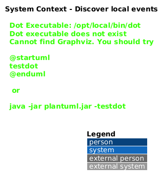
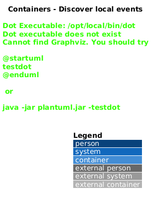
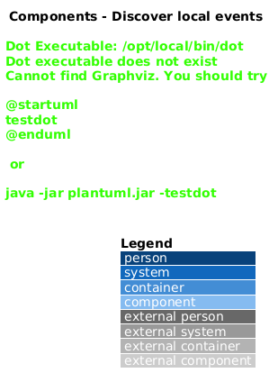
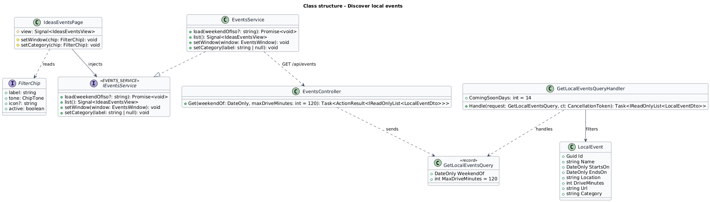
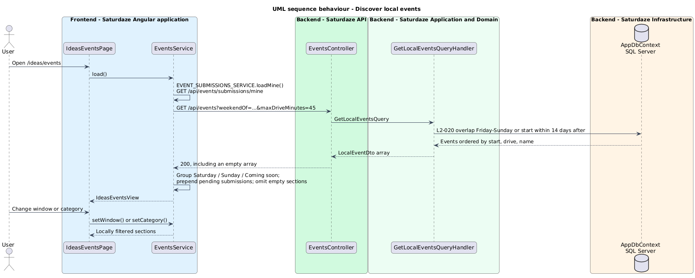

# Discover local events

## Overview

Saturdaze is a web application that plans personalized family weekends. Local-event discovery returns curated community events near the family for the selected weekend and coming-soon window.

*coming-soon window* — events no more than 14 days after the selected weekend

`EventsService` loads event DTOs and maps them into Saturday, Sunday, and coming-soon sections. `GetLocalEventsQueryHandler` applies the date and drive-radius bounds.

## Description

`IdeasEventsPage` at `/ideas/events` reads `EventsService.list(): Signal<IdeasEventsView>`. `setWindow()` and `setCategory()` filter the loaded records in the browser.

`EventsService.load()` sends the upcoming Saturday and `maxDriveMinutes=45` to `GET /api/events`, and loads the caller's submissions. The API default remains 120 minutes for callers omitting that parameter.

`GetLocalEventsQueryHandler` returns events overlapping Friday through Sunday and events starting within 14 days after Sunday. It filters the stored drive estimate and orders by start date, drive minutes, and name.

`EventsService` places a multi-day event on the first weekend day it touches, adds coming-soon entries, and prepends owned pending submissions. Next-weekend filtering uses the following Saturday and Sunday. `LocalEvent` has a category, not a separate indoor flag; the distinct indoor/outdoor filtering obligation in L1-007 remains an implementation gap.

## Requirements

The following L2 requirements refine the cited L1 capabilities. Implementation gaps stated in Description do not waive these obligations.

| L2 ID | Refines (L1) | Requirement |
|-------|--------------|-------------|
| `L2-020` | `L1-007` | `GET /api/events` shall accept `weekendOf` and `maxDriveMinutes` (default 120). It shall return events overlapping Friday through Sunday, plus events starting within 14 days after Sunday, within the requested drive bound. |

## Diagrams

### System context

The context view identifies the person using the discovery capability and the systems that participate in the result.

### Containers

The container view follows the interaction from the Angular web application through the API to persistence.

### Components

The component view names the page, client service, controller, handler, domain type, and infrastructure boundary involved in the slice.

### Class structure

The class view shows the request, handler, and state relationships used by the feature.

### Behaviour — filter the local-event feed

The sequence view traces the primary behaviour to `L2-020`. Its alternate path produces a controlled empty, validation, authorization, or fallback state.

