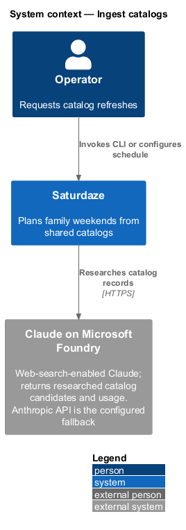
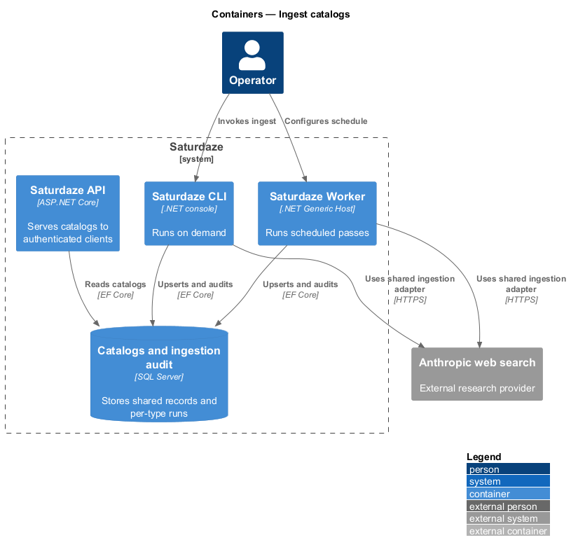
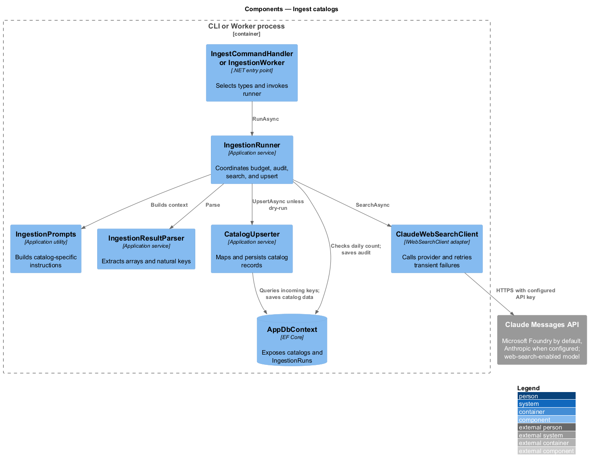
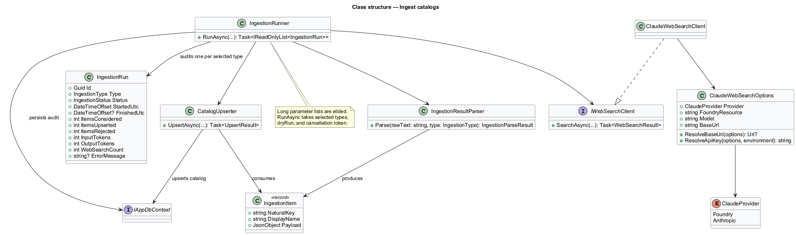
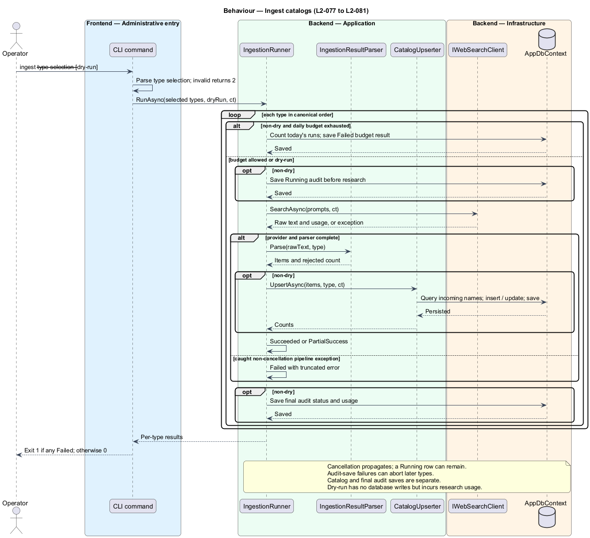
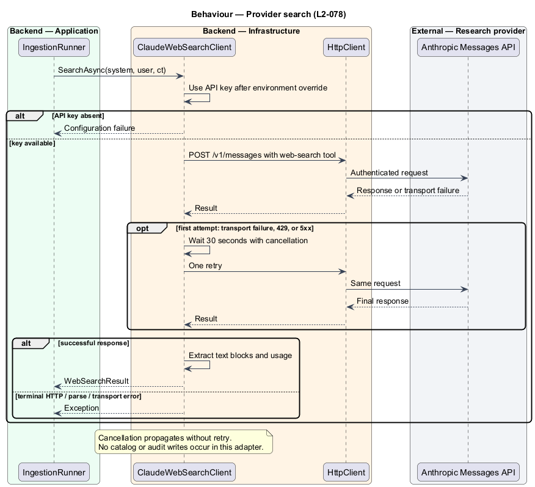

# Ingest discovery catalogs

## Overview

Saturdaze refreshes its shared event, activity, and restaurant catalogs through an operator-invoked CLI command or the scheduled ingestion worker. A *natural key* identifies an incoming record independently of its database ID.

The application layer owns the ingestion workflow. Infrastructure adapts the external web-search provider, and EF Core persists catalog data and per-type audit records. Ingestion has no public HTTP endpoint.

## Description

`RootCommandFactory` registers `saturdaze ingest --type <selection> --dry-run`. `IngestCommandHandler` parses types through `IngestionTypes.Parse()`: omitted or blank input selects all types; singular/plural names and comma, space, or semicolon lists are accepted case-insensitively and deduplicated into canonical order. A recognized `all` returns all types immediately. Invalid input returns 2, a returned Failed run returns 1, and other returned outcomes return 0. Unhandled runner or persistence exceptions are not converted into that result contract.

`IngestionRunner` processes Events, Activities, and Restaurants in order for the selected set. Its prompt context uses configured `Saturdaze:HomeLocation:Name` (fallback Port Credit, Mississauga, ON), the upcoming Saturday, and `Saturdaze:Ingestion:MaxDriveMinutes` (default 200). Member names, ages, and preferences are not included. The radius is prompt guidance, not a validated geographic restriction.

`ClaudeWebSearchClient` implements `IWebSearchClient` using the Claude Messages endpoint and the web-search tool. `ClaudeWebSearchOptions` binds under `Saturdaze:Ingestion:Claude`; its `Provider` selects Microsoft Foundry (the default) or the Anthropic API, which receive the same request.

Foundry's base URL derives from `FoundryResource` as `https://{resource}.services.ai.azure.com/anthropic/`, the Anthropic base URL is `https://api.anthropic.com/`, and a nonblank `BaseUrl` overrides either. The resolved URL always ends in `/`, so the relative `v1/messages` path keeps the `/anthropic` segment. Only the selected provider's variable, `ANTHROPIC_FOUNDRY_API_KEY` or `ANTHROPIC_API_KEY`, overrides the configured key. An unresolved endpoint or missing key fails the search before any HTTP request, so hosts that never ingest still start.

Repository defaults select Foundry resource `sd-ai-uofnt2` (eastus2), deployment `claude-sonnet-5` (the Azure-hosted model version), five searches, 4096 output tokens, and a five-minute HTTP timeout. `eng/Deploy-Foundry.ps1` provisions that account and deployment from `eng/foundry/claude.bicep` ([ADR-011](../../../adr/ADR-011-claude-via-microsoft-foundry.md)). These are checked-in configuration defaults, not a claim about current provider availability.

Transport failures, provider timeouts, 429, and 5xx responses receive one retry after a 30-second delay; caller cancellation and other HTTP failures do not. When Claude returns `stop_reason: "pause_turn"`, the client replays the accumulated conversation with the unchanged assistant content and the same tool definition until the provider ends the turn or the bounded continuation limit is exhausted. Token, output, and web-search usage accumulate across those continuation requests.

`IngestionResultParser` extracts a JSON array, including fenced output, and validates natural-key fields per record. `CatalogUpserter` queries existing records by incoming names, updates matching keys, and inserts new records. Event keys comprise name, start date, and location; activity keys comprise name; restaurant keys comprise name and meal slot. Normalized comparisons are case-insensitive. Overlong key fields are rejected and bounded descriptive fields are truncated.

For non-dry runs, the runner counts audit rows for the type since UTC midnight against `MaxRunsPerDayPerType` (default 48). A rejected pass records Failed without contacting the provider. An accepted pass saves a Running `IngestionRun` before the provider call, then records final status, times, considered/upserted/rejected counts, token usage, and search usage. Rejected records produce PartialSuccess; caught pipeline exceptions produce Failed. Later types continue when audit persistence succeeds.

Dry-run execution calls the provider and parser but bypasses both the daily audit budget and the upserter. It writes neither catalog nor audit data; it can still incur provider charges and does not exercise database field constraints.

Catalog writes and audit finalization are separate saves, not an atomic transaction. Initial or final audit-save failures can abort remaining types; cancellation can leave Running rows. The budget check is not a distributed lock. Empty or unparseable output can produce a successful zero-item result. Schema completeness, source trustworthiness, concurrency coordination, and hard geographic enforcement remain operational limitations.

The checked-in App Service WebJob trigger (`backend/deploy/webjobs/ingest/settings.job`) uses NCRONTAB in UTC. Its default `0 0 8 * * 5` schedule runs Fridays at 08:00 UTC so shared catalogs refresh ahead of the weekend-planning window.

Source anchors are [application ingestion](/backend/src/Saturdaze.Application/Ingestion), [provider adapter](/backend/src/Saturdaze.Infrastructure/Ingestion), [Foundry provisioning](/eng/foundry/claude.bicep), [CLI command](/backend/src/Saturdaze.Cli/Ingest), and [audit entity](/backend/src/Saturdaze.Domain/Entities/IngestionRun.cs).

## Requirements

The following L2 requirements refine the cited L1 capabilities. The limitations above do not imply additional implemented guarantees.

| L2 ID | Refines (L1) | Requirement |
|-------|--------------|-------------|
| `L2-077` | `L1-017`, `L1-031` | The `saturdaze ingest` command shall accept catalog types events, activities, restaurants, or all, defaulting to all. It shall use the shared ingestion runner and report per-type results. |
| `L2-078` | `L1-031` | The ingestion provider client shall request grounded web search using configurable model, token, and search limits from Microsoft Foundry by default, or from the Anthropic API when configured. It shall read the selected provider's key (`ANTHROPIC_FOUNDRY_API_KEY` for Microsoft Foundry, `ANTHROPIC_API_KEY` for the Anthropic API) from the environment in preference to configured key material, retry transient transport failures, HTTP 429, or HTTP 5xx once, and continue bounded `pause_turn` provider responses until the search completes or continuation attempts are exhausted. |
| `L2-079` | `L1-031` | The parser shall locate a usable JSON array within provider text and validate records independently. The upserter shall match events by name, start date, and location; activities by name; and restaurants by name and meal slot, using normalized natural keys. |
| `L2-080` | `L1-015`, `L1-031` | Each non-dry ingestion type shall open an IngestionRun record before its provider call and record its final status, timing, item counts, and provider usage on normal completion. The runner shall reject a new provider call once the configured per-type UTC daily run limit is reached. |
| `L2-081` | `L1-031` | The `--dry-run` ingestion option shall call the provider and parse its response without writing catalog rows or audit records. Dry runs shall bypass the persisted daily run-count check. |

## Diagrams

### System context

The context view identifies the operator, Saturdaze, and the external service boundary.

### Containers

The container view separates executable hosts, shared application code, external services, and persistence.

### Components

The component view traces control and data ownership through the runtime slice.

### Class structure

The class view shows selected implementation members; cancellation parameters and unrelated members are omitted where indicated by the call labels.

### Behaviour — ingest

The sequence includes the successful path and controlled failure or disabled branches.

### Behaviour — provider-search

This sequence isolates the secondary execution path, including paused provider responses that must be continued and the bounded exhaustion failure boundary.

