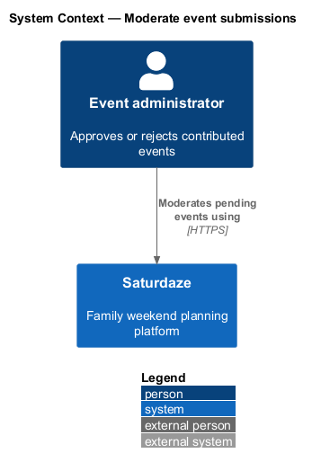
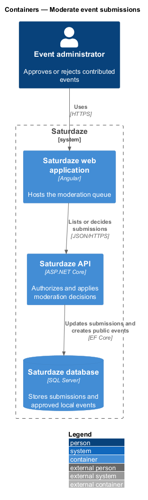
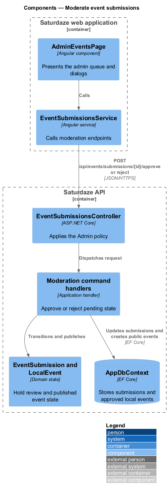
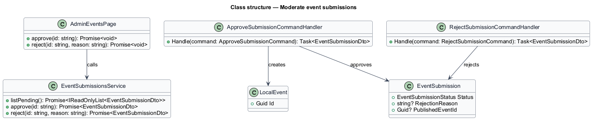
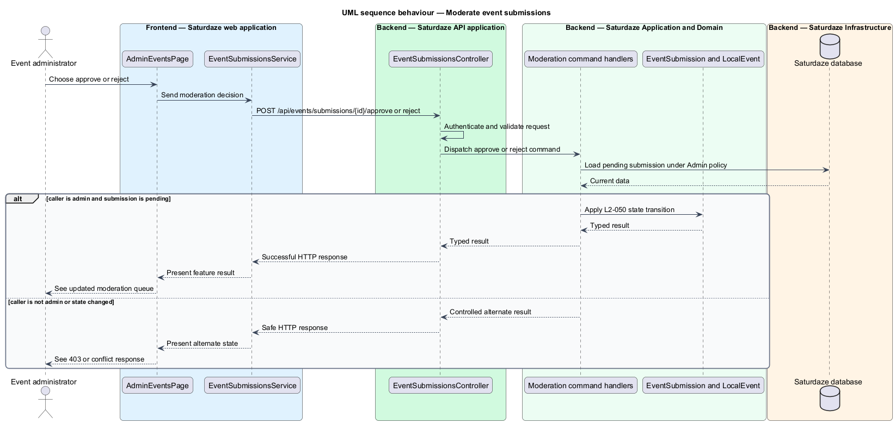

# Moderate event submissions

## Overview

Saturdaze is a web application that plans personalized family weekends. Moderation moves contributed events from pending review to an approved public event or a rejected submission with an optional reason.

*moderation queue* — administrator-only list of event submissions whose status is pending

`AdminEventsPage` opens approval or rejection dialogs and calls `EventSubmissionsService`. API policies require the `Admin` role before listing or deciding submissions.

## Description

The feature forms a vertical slice across the Angular application, the ASP.NET Core API, application handlers, domain state, and SQL Server persistence.

- **`AdminEventsPage`** — Angular page that displays pending submissions and decision actions.
- **`ApproveSubmissionDialog and RejectSubmissionDialog`** — Angular CDK dialogs that confirm the decision and optional reason.
- **`requireAdmin`** — Angular route guard for administrative navigation.
- **`EventSubmissionsController`** — API controller whose pending, approve, and reject endpoints use the `Admin` policy.
- **`ApproveSubmissionCommandHandler`** — Application handler that creates `LocalEvent` and records the published event ID.
- **`RejectSubmissionCommandHandler`** — Application handler that stores rejected status and optional reason.

`/admin/events` is registered in `app.routes.ts` behind `requireAuth` + `requireAdmin`. Approval accepts an optional `driveMinutes` (ADR-006, decision 3) and returns 409 `event_already_published` when an event with the same title and date already exists.
## Requirements

The feature realizes the following level-2 (L2) requirements. Each row cites the level-1 (L1) capability refined by the requirement.

| L2 ID | Refines (L1) | Requirement |
|-------|--------------|-------------|
| `L2-050` | `L1-018` | Users with the `admin` role must have access to `/admin/events` listing all pending submissions. Approving a submission must move its `status` to `approved` and copy it into the public events catalogue; rejecting must move its `status` to `rejected` and record an optional `rejectionReason`. Non-admins must receive 403 when calling the moderation endpoints. |

## Diagrams

### System context

The context view identifies the person using the discovery capability and the systems that participate in the result.

### Containers

The container view follows the interaction from the Angular web application through the API to persistence.

### Components

The component view names the page, client service, controller, handler, domain type, and infrastructure boundary involved in the slice.

### Class structure

The class view shows the request, handler, and state relationships used by the feature.

### Behaviour — approve or reject a pending event

The sequence view traces the primary behaviour to `L2-050`. Its alternate path produces a controlled empty, validation, authorization, or fallback state.

