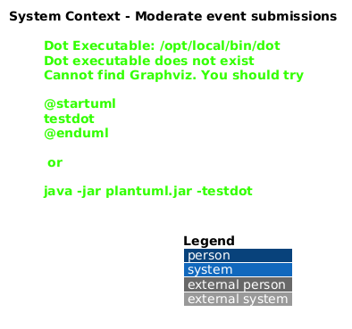
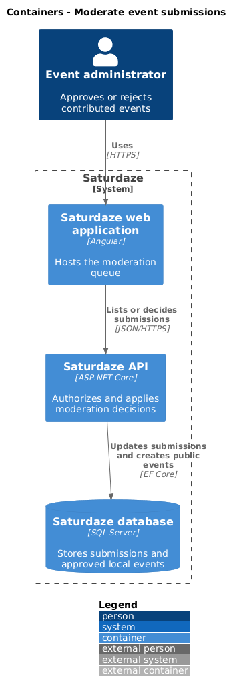
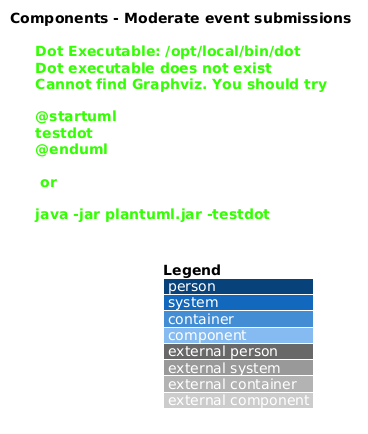
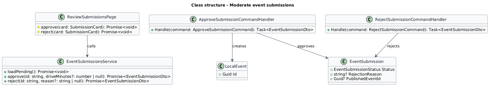
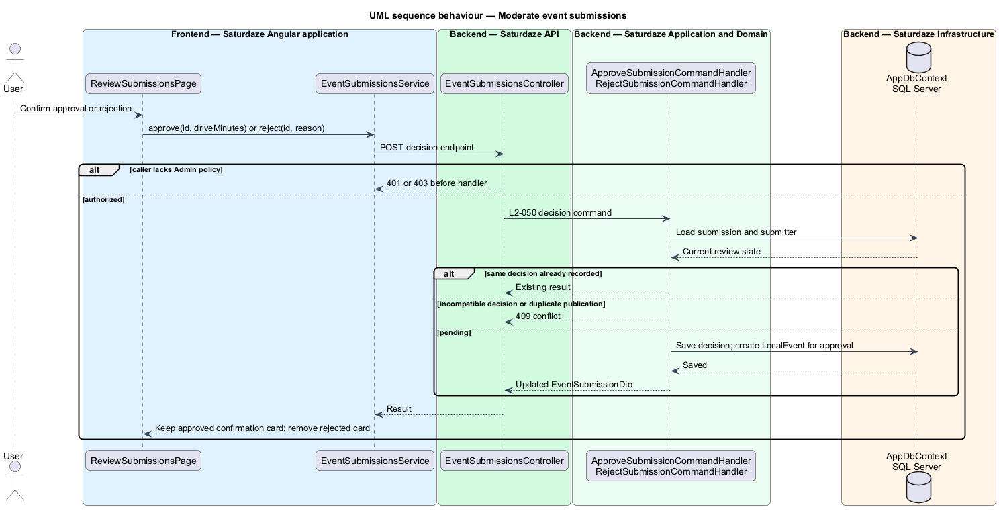

# Moderate event submissions

## Overview

Saturdaze is a web application that plans personalized family weekends. Moderation moves contributed events from pending review to an approved public event or a rejected submission with an optional reason.

*moderation queue* — administrator-only list of event submissions whose status is pending

`ReviewSubmissionsPage` opens approval or rejection dialogs and calls `EventSubmissionsService`. API policies require the `Admin` role before listing or deciding submissions.

## Description

`ReviewSubmissionsPage` at `/review-submissions` is guarded by `requireAuth` and `requireAdmin`. It loads the pending queue through `EventSubmissionsService` and opens approval or rejection dialogs.

`EventSubmissionsController` requires the Admin policy for pending, approve, and reject endpoints. The UI guard aids navigation; the API policy enforces authorization.

`ApproveSubmissionCommandHandler` creates `LocalEvent`, stamps reviewer and publication identifiers, and accepts optional drive minutes. Repeated approval returns the existing result; a previously rejected submission returns 409.

`RejectSubmissionCommandHandler` records Rejected status and the optional trimmed reason. Repeated rejection is idempotent; rejecting an approved submission returns 409.

Approval rejects any existing event with the same name and date, even though ingestion's database key also includes location. This stricter moderation rule remains explicit pending reconciliation.

## Requirements

The following L2 requirements refine the cited L1 capabilities. Implementation gaps stated in Description do not waive these obligations.

| L2 ID | Refines (L1) | Requirement |
|-------|--------------|-------------|
| `L2-050` | `L1-018` | Users with the `admin` role shall have access to `/review-submissions` listing all pending submissions. Approving a submission shall move its `status` to `Approved` and copy it into the public events catalogue; rejecting shall move its `status` to `Rejected` and record an optional `rejectionReason`. Non-admins shall receive 403 when calling the moderation endpoints. |

## Diagrams

### System context

The context view identifies the person using the discovery capability and the systems that participate in the result.

### Containers

The container view follows the interaction from the Angular web application through the API to persistence.

### Components

The component view names the page, client service, controller, handler, domain type, and infrastructure boundary involved in the slice.

### Class structure

The class view shows the request, handler, and state relationships used by the feature.

### Behaviour — approve or reject a pending event

The sequence view traces the primary behaviour to `L2-050`. Its alternate path produces a controlled empty, validation, authorization, or fallback state.

