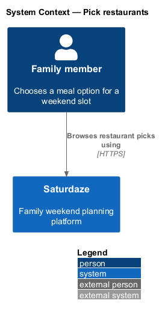
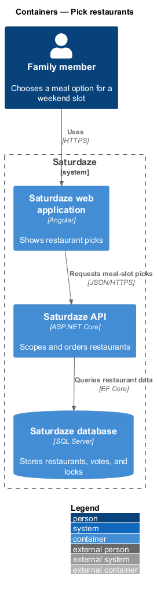
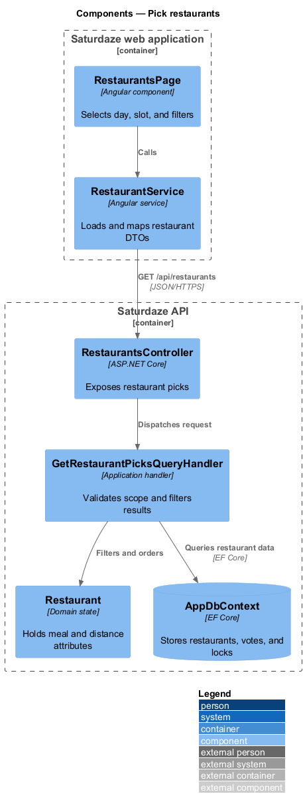
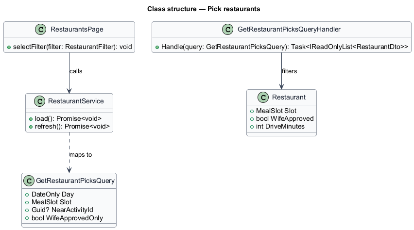
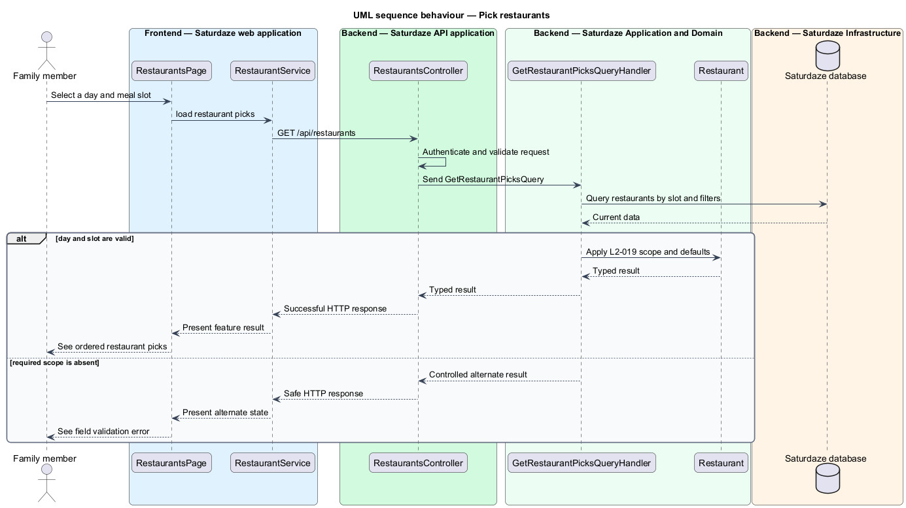

# Pick restaurants

## Overview

Saturdaze is a web application that plans personalized family weekends. Restaurant discovery scopes curated meal options to a day and meal slot, with optional proximity to an activity.

*meal slot* — named meal window such as lunch or dinner on a weekend day

`RestaurantService` loads restaurant DTOs for the selected presentation state. `GetRestaurantPicksQueryHandler` requires the slot, applies the wife-approved default, and can prioritize proximity.

## Description

The feature forms a vertical slice across the Angular application, the ASP.NET Core API, application handlers, domain state, and SQL Server persistence.

- **`RestaurantsPage`** — Angular page that presents restaurant sections and filter controls.
- **`RestaurantService`** — Typed client service that loads, votes on, and locks restaurant choices.
- **`RestaurantsController`** — API controller exposing list, vote, and lock endpoints.
- **`GetRestaurantPicksQuery`** — Typed request containing day, slot, proximity, and approval filters.
- **`GetRestaurantPicksQueryHandler`** — Application handler that validates scope and orders projections.
- **`Restaurant`** — Domain entity containing slot, approval, style, notes, and drive time.

## Requirements

The feature realizes the following level-2 (L2) requirements. Each row cites the level-1 (L1) capability refined by the requirement.

| L2 ID | Refines (L1) | Requirement |
|-------|--------------|-------------|
| `L2-019` | `L1-006` | `GET /api/restaurants` must require a `day` and `slot` parameter, optionally narrow by `nearActivityId`, and default `wifeApprovedOnly=true`. |

## Diagrams

### System context

The context view identifies the person using the discovery capability and the systems that participate in the result.

### Containers

The container view follows the interaction from the Angular web application through the API to persistence.

### Components

The component view names the page, client service, controller, handler, domain type, and infrastructure boundary involved in the slice.

### Class structure

The class view shows the request, handler, and state relationships used by the feature.

### Behaviour — scope restaurant picks

The sequence view traces the primary behaviour to `L2-019`. Its alternate path produces a controlled empty, validation, authorization, or fallback state.

