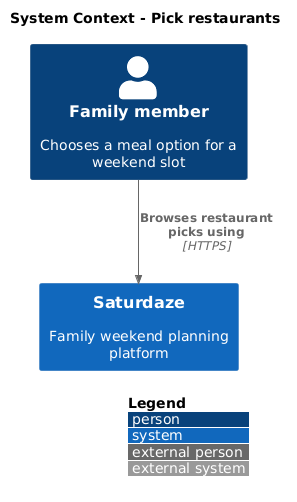
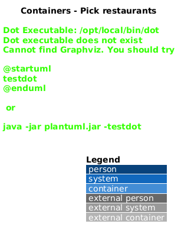
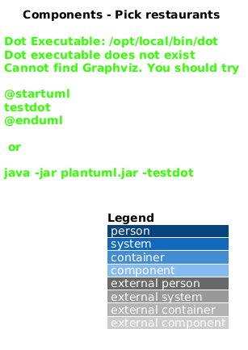
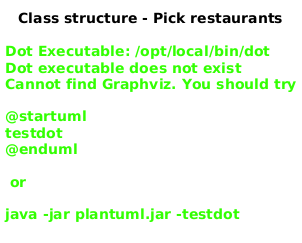
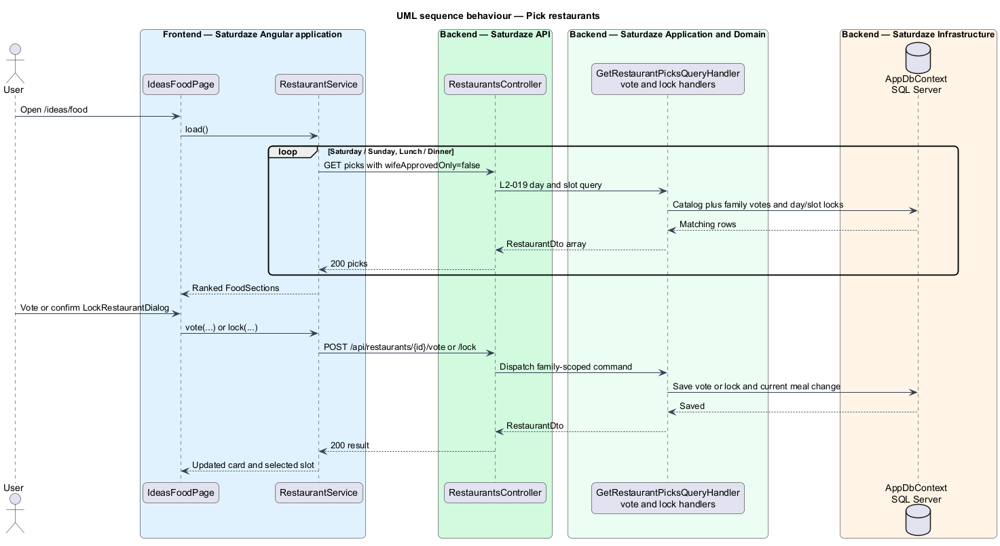

# Pick restaurants

## Overview

Saturdaze is a web application that plans personalized family weekends. Restaurant discovery scopes curated meal options to a day and meal slot, with optional proximity to an activity.

*meal slot* — named meal window such as lunch or dinner on a weekend day

`RestaurantService` loads restaurant DTOs for the selected presentation state. `GetRestaurantPicksQueryHandler` filters by the slot, applies the wife-approved default, and can prioritize proximity.

## Description

`IdeasFoodPage` at `/ideas/food` injects `RESTAURANT_SERVICE` and uses `RestaurantService.list(): Signal<IdeasFoodView>`. The service loads four day/meal lists with `wifeApprovedOnly=false&take=10`; the API's default remains true when omitted. The browser does not supply `nearActivityId`.

`GetRestaurantPicksQueryHandler` filters meal slot, joins family-owned votes and day/slot locks, and optionally ranks by the difference between stored restaurant and activity drive estimates. This is not a geographic route calculation. Without `nearActivityId`, results order by drive minutes, then name. No validator or binding attribute rejects a request that omits `day` or `slot`; the 400 response in the `L2-019` acceptance criteria remains an implementation gap.

`RestaurantService.setFilters()` selects day, meal, wife-approved, and under-15-minute filters locally. The service ranks locked choices first, then approved and nearby choices. `vote(restaurantId, voterName, vote)` sends a family-scoped vote and replaces the returned record.

`LockRestaurantDialog` confirms a day/slot choice. `LockRestaurantCommandHandler` upserts one `RestaurantLock` per family/day/slot and updates or creates the current weekend's locked meal block when a current plan exists. The UI has no restaurant-unlock action.

Patio filtering required by L1-006 has no corresponding DTO field or filter. Voting currently accepts a supplied voter name without checking membership; the design does not imply stronger per-member authorization.

Restaurant cards lead with the restaurant's photo since the 2026-10-06 mock (`docs/mocks/pages/ideas.food.html`); `discovery/store-place-location-and-imagery` designs the photo data. "Lock it in" stays the way to place a restaurant; restaurant cards carry no "Add to day" action (L2-095).

## Requirements

The following L2 requirements refine the cited L1 capabilities. Implementation gaps stated in Description do not waive these obligations.

| L2 ID | Refines (L1) | Requirement |
|-------|--------------|-------------|
| `L2-019` | `L1-006` | `GET /api/restaurants` shall require a `day` and `slot` parameter, optionally narrow by `nearActivityId`, and default `wifeApprovedOnly=true`. |

## Diagrams

### System context

The context view identifies the person using the discovery capability and the systems that participate in the result.

### Containers

The container view follows the interaction from the Angular web application through the API to persistence.

### Components

The component view names the page, client service, controller, handler, domain type, and infrastructure boundary involved in the slice.

### Class structure

The class view shows the request, handler, and state relationships used by the feature.

### Behaviour — scope restaurant picks

The sequence view traces the primary behaviour to `L2-019`. Its alternate path produces a controlled empty, validation, authorization, or fallback state.

