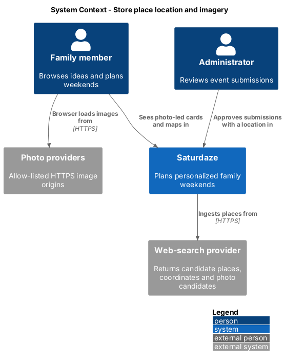
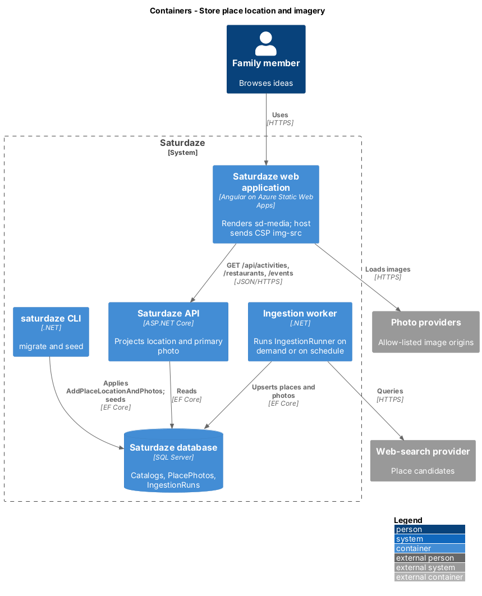
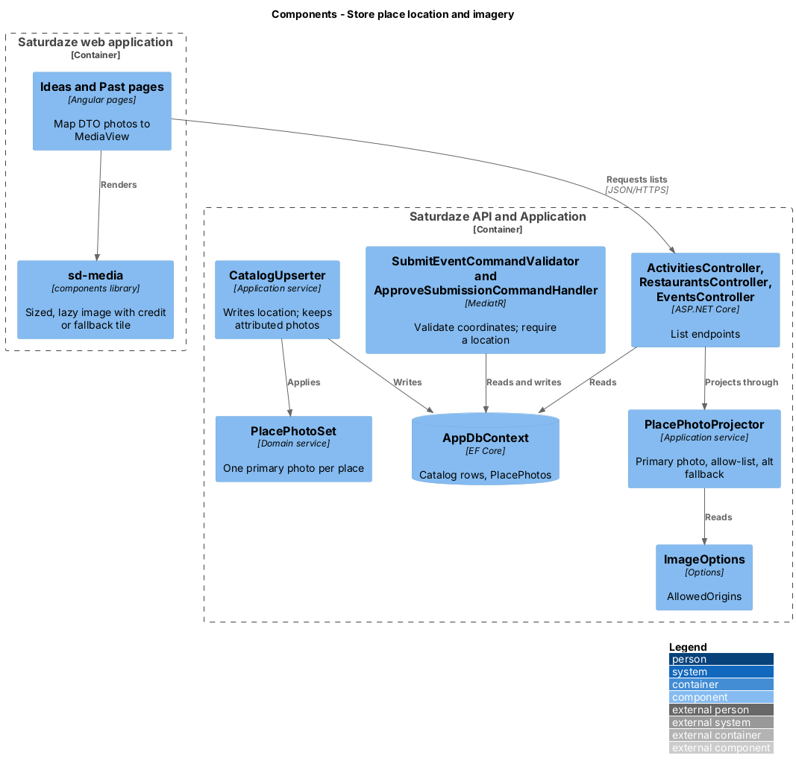
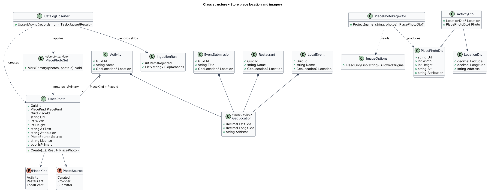
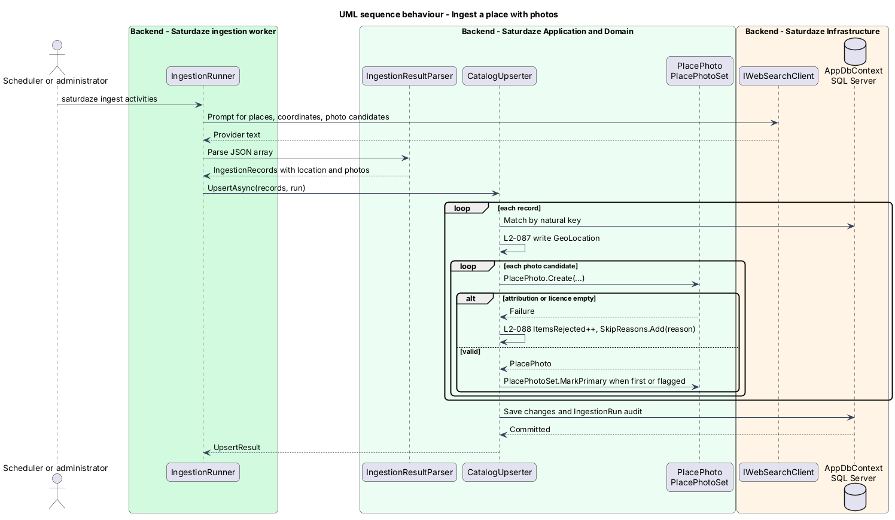
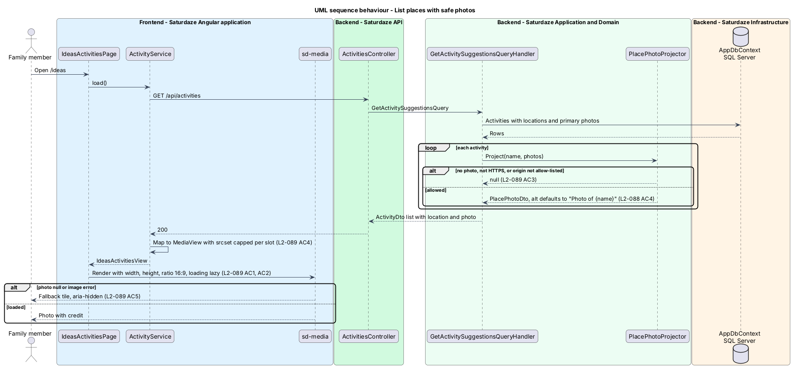

# Store place location and imagery

## Overview

Saturdaze is a web application that plans personalized family weekends. The Weekend, Ideas, and Past screens follow a layout study of Wanderlog: idea cards lead with a photo, the Weekend screen opens on a cover photo, and each day sits beside a map of its stops. Every one of those screens depends on two facts the catalog does not hold today: where each place is, and what it looks like.

*catalog place* — activity, restaurant, local event, or approved event submission that the planner can schedule

*place photo* — licensed image of a catalog place, stored with its source, licence, and attribution

*primary photo* — the single place photo that represents the place on cards and covers

*photo fallback* — tinted tile with the category icon, shown when a place has no usable photo

This feature is the data foundation for the photo and map designs: `discovery/add-idea-to-day` (photo-led cards), `weekend-planning/map-itinerary-and-travel-legs` (pins and legs), and `weekend-planning/choose-weekend-cover-photo` (covers). It adds coordinates and photos to the catalog, captures them during seeding, ingestion, and event submission, and projects them to clients with a safe, layout-stable image contract.

## Description

### Domain

`GeoLocation` is a new owned value type with `Latitude` (decimal, −90 to 90), `Longitude` (decimal, −180 to 180), and `Address` (≤ 300 characters). `Activity`, `Restaurant`, `LocalEvent`, and `EventSubmission` each gain a nullable `Geo` of this type; `Location` already names the venue text on events and submissions. `GeoLocationMapping.OwnsGeo` maps it to nullable `Latitude`, `Longitude`, and `Address` columns on the owner's table. The columns stay nullable until every row is backfilled (L2-099 AC5). `Family` gains a nullable `HomeCoordinates` (columns `HomeLatitude`, `HomeLongitude`, `HomeAddress`); until it is set, the planner reads `HomeLocationOptions.Latitude` and `Longitude`, which the weather slice already uses.

`PlacePhoto` is a new entity: `Id`, `PlaceKind` (`Activity`, `Restaurant`, `LocalEvent`), `PlaceId`, `Url`, `Width`, `Height`, `AltText`, `Attribution`, `Source` (`PhotoSource`: `Curated`, `Provider`, `Submitter`), `License`, and `IsPrimary`. The pair `PlaceKind` + `PlaceId` addresses the owning row because the three catalogs live in separate tables. A filtered unique index on `(PlaceKind, PlaceId) WHERE IsPrimary = 1` enforces one primary photo per place in the database.

`PlacePhotoSet.MarkPrimary(photos, photoId)` is a domain service that clears `IsPrimary` on every sibling before setting it on the chosen photo (L2-100 AC1). `PlacePhoto.Create(...)` returns a failure, not an entity, when `Attribution` or `License` is empty.

### Capture

`ActivitySeeder`, `RestaurantSeeder`, and `LocalEventSeeder` (`IJsonSeeder` implementations in `Saturdaze.Cli`) read `latitude`, `longitude`, `address`, and an optional `photos` array from the bundled seed JSON and upsert them with the existing natural keys, so a second run changes nothing (L2-099 AC1).

`IngestionPrompts` asks the provider for `latitude`, `longitude`, `address`, and photo candidates with attribution and licence. `PayloadReader.GetGeo` reads the location, returning null for a missing or out-of-range coordinate. `CatalogUpserter.UpsertAsync` writes the location through `GeoLocation.Merge`, which keeps an unchanged value so re-runs do not churn rows, and calls `PlacePhoto.Create` for each candidate. A rejected candidate increments `IngestionRun.ItemsRejected` and appends a reason to a new `IngestionRun.SkipReasons` list (L2-100 AC2).

`SubmitEventCommand` gains optional `Latitude`, `Longitude`, and `Address`. `SubmitEventCommandValidator` rejects out-of-range values with a field error named `latitude` or `longitude` (L2-099 AC2). `ApproveSubmissionCommand` accepts optional `Latitude`, `Longitude`, and `Address`. `ApproveSubmissionCommandHandler` refuses an approval when neither the submission nor the request carries a location, throwing `BadRequestException("location_required")`, which the exception middleware writes as a 400 ProblemDetails with that `code` (L2-099 AC3). `ApproveSubmissionDialog` should gain location fields so an administrator can supply one. Geocoding an administrator's address into coordinates is `<TO SUPPLY>` (provider not chosen).

### Projection

`LocationDto(Latitude, Longitude, Address)` and `PlacePhotoDto(Url, Width, Height, Alt, Attribution)` are new contracts. `ActivityDto`, `RestaurantDto`, and `LocalEventDto` gain `Location` and `Photo` (L2-099 AC4). On `LocalEventDto` the former `Location` venue string becomes `Venue`, so `location` means the same object on every list.

`PlacePhotoProjector.Project(place, photos)` returns the primary photo as `PlacePhotoDto` or `null`. It returns `null` when there is no photo, or when the URL is not HTTPS or its origin is absent from `ImageOptions.AllowedOrigins` (L2-101 AC3). An empty `AltText` becomes `"Photo of {place name}"` (L2-100 AC4). `ImageOptions` binds from `Saturdaze:Images` and lists the app's own storage origin plus each configured provider.

### Delivery in the browser

`sd-media` is a new `components` library component. It renders an `` with explicit `width` and `height`, an `aspect-ratio` from its `ratio` input (`16:9` default, `4:3`), `loading` from its `eager` input (lazy by default), `srcset` and `sizes` for the slot, and the attribution as `.media__credit`. On `null` input or an image `error` event it swaps to the photo fallback (`.media--fallback`, `aria-hidden="true"`) in the tone and icon its inputs give, so no broken-image icon appears (L2-101 AC5). Its BEM classes match `docs/mocks/pages/ideas.html`.

`MediaView` is the frontend model the services map from `PlacePhotoDto`: `src`, `srcset`, `width`, `height`, `alt`, `credit`. The `srcset` caps the requested width at 800 px for 390 px slots and 1200 px for 1440 px slots (L2-101 AC4). How a provider URL is resized is provider specific; the resize parameter for each allowed origin is `<TO SUPPLY>`.

`staticwebapp.config.json` gains a `globalHeaders` `Content-Security-Policy` whose `img-src` lists `'self'`, `data:`, the tile provider, and the `ImageOptions.AllowedOrigins` values. The CI build should fail when the two lists diverge; the mechanism is `<TO SUPPLY>`.

### Persistence

The EF migration `AddPlaceLocations` adds the nullable location columns; a later migration adds the `PlacePhotos` table and its indexes. It applies through `saturdaze migrate`; the API does not migrate on startup.

## Requirements

The following L2 requirements refine the cited L1 capabilities.

| L2 ID | Refines (L1) | Requirement |
|-------|--------------|-------------|
| `L2-099` | `L1-032` | `Activity`, `Restaurant`, `LocalEvent`, and `EventSubmission` shall each store `Latitude` (decimal, −90 to 90), `Longitude` (decimal, −180 to 180), and `Address` (≤ 300 characters). The family's home location shall also store coordinates. Ingestion (L1-031) and seeding shall populate them; `DriveMinutes` stays as the planner's input until travel legs (L2-102) supersede it. Activity, restaurant, and event list endpoints shall return the location. |
| `L2-100` | `L1-032` | Each catalog place shall own zero or more `PlacePhoto` records (`Url`, `Width`, `Height`, `AltText`, `Attribution`, `Source` ∈ {Curated, Provider, Submitter}, `License`, `IsPrimary`). Exactly one photo per place shall be primary when any exist. A photo without attribution or license shall not be stored. API projections shall expose the primary photo as `photo: { url, width, height, alt, attribution }` or `null`. |
| `L2-101` | `L1-032` | The frontend shall render place and cover photos with explicit width and height (or a fixed aspect ratio) so layout does not shift, lazy-load below-the-fold images, and request a size appropriate to the slot. Image URLs shall be restricted to an allow-list of HTTPS origins (the app's own storage plus configured providers) by Content-Security-Policy `img-src`. |

## Diagrams

### System context

The context view places the family and the administrator beside the external services that now feed and serve imagery: the web-search provider used by ingestion and the photo providers on the allow-list.

### Containers

The container view shows coordinates and photos entering through the CLI seeder and the ingestion worker, persisting in SQL Server, and leaving through the API to the Angular application, whose static host enforces the `img-src` allow-list.

### Components

The component view names the capture path (`CatalogUpserter`, `SubmitEventCommandValidator`, `ApproveSubmissionCommandHandler`) and the projection path (`PlacePhotoProjector` to `sd-media`).

### Class structure

The class view shows `GeoLocation` owned by each catalog type, `PlacePhoto` addressed by `PlaceKind` and `PlaceId`, and the DTOs the projector produces.

### Behaviour — ingest a place with photos

Ingestion upserts the location and keeps only attributed, licensed photo candidates; each skip is audited on the run (`L2-099`, `L2-100`).

### Behaviour — list places with safe photos

A list request projects each place's primary photo through the allow-list and alt-text rules, and `sd-media` renders it without layout shift or falls back (`L2-100`, `L2-101`).

