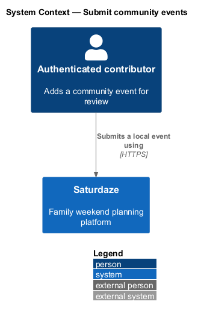
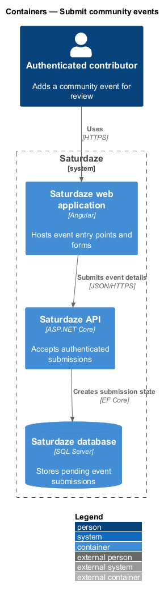
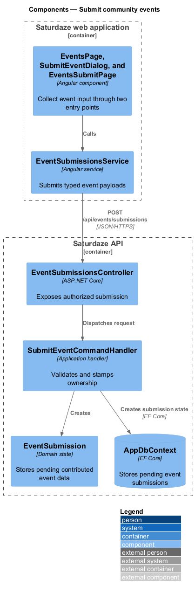
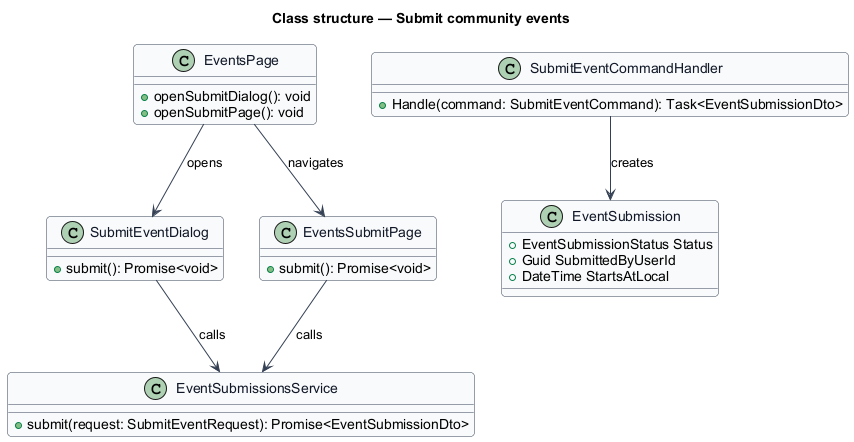
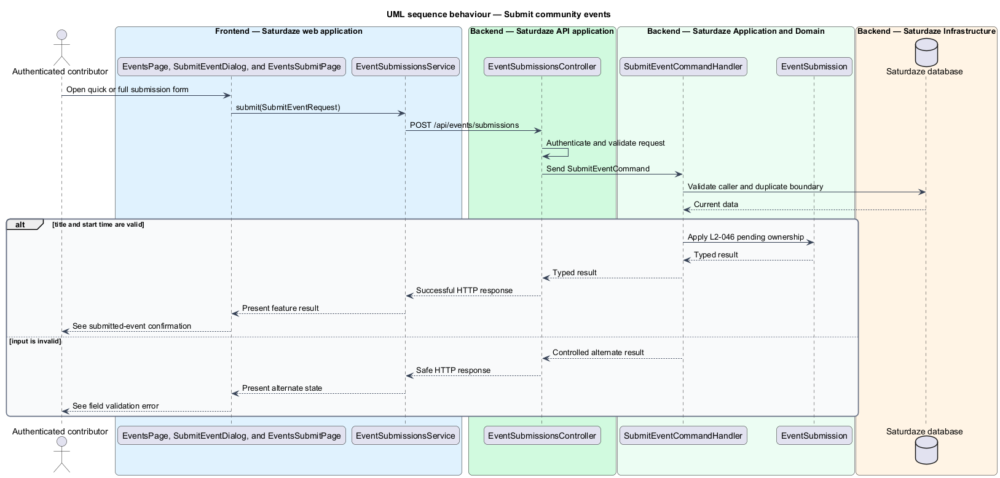

# Submit community events

## Overview

Saturdaze is a web application that plans personalized family weekends. Event submission lets an authenticated user propose a local event without placing unreviewed content in the public catalogue.

*pending submission* — user-contributed event awaiting an administrator decision

The events feed provides a quick dialog and a full-page form. Both use `nextHourDefault()` and `EventSubmissionsService.submit()` before the API records a pending submission owned by the caller.

## Description

The feature forms a vertical slice across the Angular application, the ASP.NET Core API, application handlers, domain state, and SQL Server persistence.

- **`EventsPage`** — Angular feed containing the floating action button and header entry point.
- **`SubmitEventDialog and EventsSubmitPage`** — Quick and full forms that share the next-hour default rule.
- **`nextHourDefault`** — Pure client helper that rounds one hour ahead to the next whole hour.
- **`EventSubmissionsService`** — Typed client service for submission and moderation requests.
- **`EventSubmissionsController`** — Authorized API controller exposing `POST /api/events/submissions`.
- **`SubmitEventCommandHandler`** — Application handler that stamps caller ownership and pending status.

## Requirements

The feature realizes the following level-2 (L2) requirements. Each row cites the level-1 (L1) capability refined by the requirement.

| L2 ID | Refines (L1) | Requirement |
|-------|--------------|-------------|
| `L2-046` | `L1-018` | `POST /api/events/submissions` must accept a payload from an authenticated user, persist an `EventSubmission` row with `status="pending"` and `submittedByUserId` set to the caller, and return the created submission. The payload must require `title`, `startsAtLocal` (ISO 8601 local date-time), and optionally accept `location`, `description`, `costNote`, `ageRange`, and `sourceUrl`. Pending submissions must not appear in `GET /api/events` responses for any user. |
| `L2-047` | `L1-018` | The "Submit an event" screen and its dialog twin must default the date+time field to one hour from now, rounded up to the next whole hour in the user's local time zone, and must disable the submit button until `title` is non-empty. |
| `L2-048` | `L1-018` | `/events` must surface two affordances to submit a new event: a primary floating "+" button anchored bottom-right that opens the quick-add dialog, and a secondary text/icon action in the page header that navigates to the full `/events/submit` screen. The FAB must remain visible while scrolling and must not overlap the bottom navigation or its tablet/desktop left rail. |

## Diagrams

### System context

The context view identifies the person using the discovery capability and the systems that participate in the result.

### Containers

The container view follows the interaction from the Angular web application through the API to persistence.

### Components

The component view names the page, client service, controller, handler, domain type, and infrastructure boundary involved in the slice.

### Class structure

The class view shows the request, handler, and state relationships used by the feature.

### Behaviour — create a pending event submission

The sequence view traces the primary behaviour to `L2-046`, `L2-047`, and `L2-048`. Its alternate path produces a controlled empty, validation, authorization, or fallback state.

