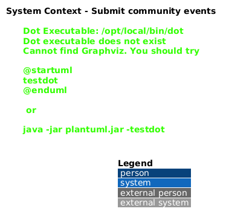
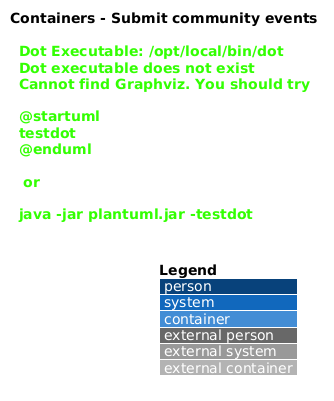
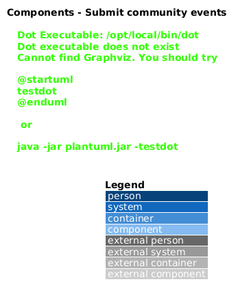
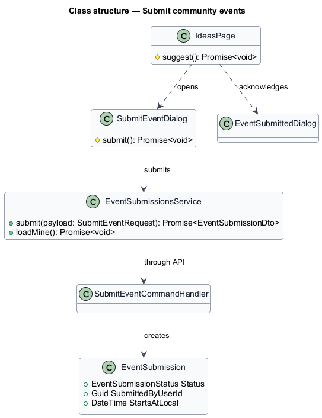
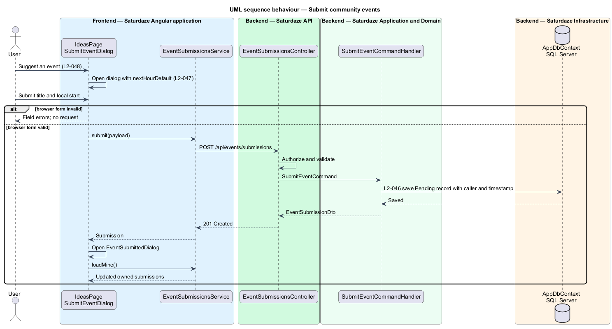

# Submit community events

## Overview

Saturdaze is a web application that plans personalized family weekends. Event submission lets an authenticated user propose a local event without placing unreviewed content in the public catalogue.

*pending submission* — user-contributed event awaiting an administrator decision

The Ideas header opens one submission dialog. `nextHourFromNowAsInputValue()` initializes its local time, and `EventSubmissionsService.submit()` creates a pending submission owned by the caller.

## Description

`IdeasPage` owns the single Suggest an event header action for `/ideas/events`. Its `suggest()` method opens `SubmitEventDialog`, then `EventSubmittedDialog` on success and refreshes owned submissions.

`SubmitEventDialog` uses `nextHourFromNowAsInputValue()` for the initial local date and time. It validates title and start time, then calls `EventSubmissionsService.submit()`; optional inputs include end time, location, description, cost, age range, and URL. The dialog does not capture `category`, although `SubmitEventRequest` and the API accept it.

`EventSubmissionsController` dispatches `SubmitEventCommand`. `SubmitEventCommandValidator` runs in the MediatR `ValidationBehavior` and rejects a missing title or start time, or a non-http(s) `sourceUrl` with `invalid_url`. `SubmitEventCommandHandler` stamps current-user ownership, submission time, and Pending status before saving through `IAppDbContext`.

The API uses enum strings `Pending`, `Approved`, and `Rejected`. Unreviewed submissions remain outside `LocalEvents`. Legacy event-submission routes redirect to `/ideas/events`; no full-page form or floating entry point remains.

## Requirements

The following L2 requirements refine the cited L1 capabilities. Implementation gaps stated in Description do not waive these obligations.

| L2 ID | Refines (L1) | Requirement |
|-------|--------------|-------------|
| `L2-046` | `L1-018` | `POST /api/events/submissions` shall accept a payload from an authenticated user, persist an `EventSubmission` row with `status="Pending"` and `submittedByUserId` set to the caller, and return the created submission. The payload shall require `title`, `startsAtLocal` (ISO 8601 local date-time), and optionally accept `endsAtLocal`, `location`, `description`, `costNote`, `ageRange`, `sourceUrl`, and `category`. Pending submissions shall not appear in `GET /api/events` responses for any user. |
| `L2-047` | `L1-018` | The "Suggest an event" dialog (D10 in `docs/mocks-v2`; the only submission surface since the v2 design, see [ADR-009](/docs/adr/ADR-009-v2-responsive-shell.md)) shall default the date+time field to one hour from now, rounded up to the next whole hour in the user's local time zone, and shall disable the submit button until `title` is non-empty. |
| `L2-048` | `L1-018` | `/ideas/events` shall surface one affordance to submit a new event: the primary "Suggest an event" button in the page header, which opens the "Suggest an event" dialog (D10) in place. On success the "Thanks, it is in the queue" dialog (D11) summarises the submission, and the feed shows it under "Your suggestion" with a "Pending review" chip. (Revised 2026-09-02 with the v2 design: the floating "+" button and the dedicated `/events/submit` screen were retired, and `/events`, `/events/submit` and `/events/submitted` redirect to `/ideas/events` — see [ADR-009](/docs/adr/ADR-009-v2-responsive-shell.md).) |

## Diagrams

### System context

The context view identifies the person using the discovery capability and the systems that participate in the result.

### Containers

The container view follows the interaction from the Angular web application through the API to persistence.

### Components

The component view names the page, client service, controller, handler, domain type, and infrastructure boundary involved in the slice.

### Class structure

The class view shows the request, handler, and state relationships used by the feature.

### Behaviour — create a pending event submission

The sequence view traces the primary behaviour to `L2-046`, `L2-047`, and `L2-048`. Its alternate path produces a controlled empty, validation, authorization, or fallback state.

