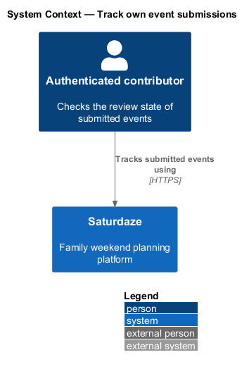
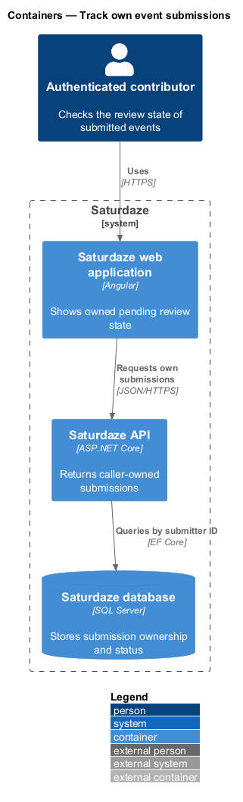
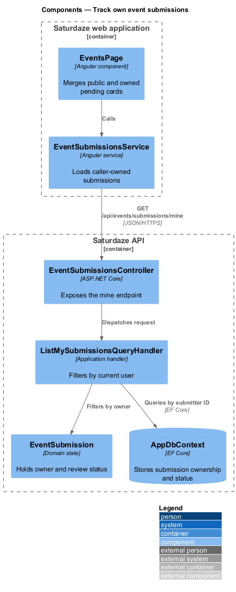
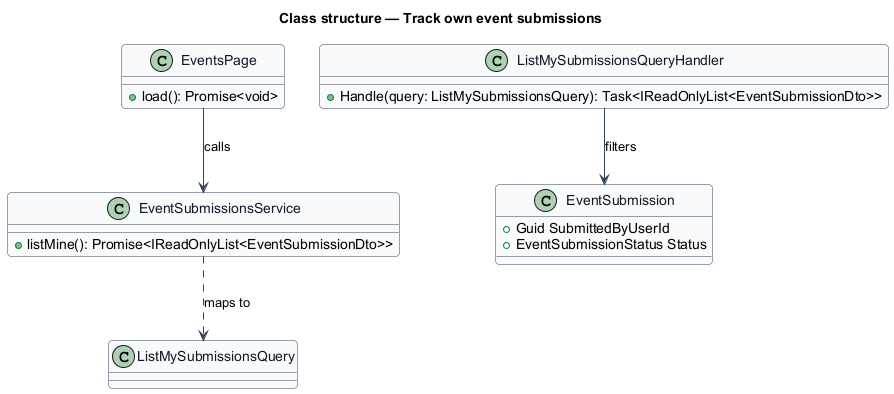
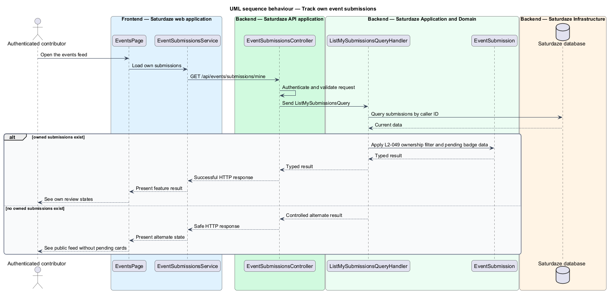

# Track own event submissions

## Overview

Saturdaze is a web application that plans personalized family weekends. Submission tracking distinguishes a contributor's pending content from the approved public event catalogue.

*submission status* — pending, approved, or rejected review state assigned to a contributed event

`EventsService` and `EventSubmissionsService` combine the public feed with the caller's own submissions. The UI marks only the caller's pending cards with the review badge.

## Description

The feature forms a vertical slice across the Angular application, the ASP.NET Core API, application handlers, domain state, and SQL Server persistence.

- **`EventsPage`** — Angular page that merges public events with owned pending cards.
- **`EventsSubmittedPage`** — Angular confirmation page reached after a successful submission.
- **`EventSubmissionsService`** — Typed client service exposing the caller's submission list.
- **`EventSubmissionsController`** — Authorized API controller exposing `GET /api/events/submissions/mine`.
- **`ListMySubmissionsQueryHandler`** — Application handler filtering submissions by current user ID.
- **`EventSubmission`** — Domain entity storing submitter identity and review status.

## Requirements

The feature realizes the following level-2 (L2) requirements. Each row cites the level-1 (L1) capability refined by the requirement.

| L2 ID | Refines (L1) | Requirement |
|-------|--------------|-------------|
| `L2-049` | `L1-018` | `GET /api/events/submissions/mine` must return the caller's own submissions in any status (`pending`, `approved`, `rejected`). The events feed at `/events` must render a "Pending review" badge on cards drawn from the caller's own pending submissions so they understand the event isn't yet public. |

## Diagrams

### System context

The context view identifies the person using the discovery capability and the systems that participate in the result.

### Containers

The container view follows the interaction from the Angular web application through the API to persistence.

### Components

The component view names the page, client service, controller, handler, domain type, and infrastructure boundary involved in the slice.

### Class structure

The class view shows the request, handler, and state relationships used by the feature.

### Behaviour — list caller-owned submissions

The sequence view traces the primary behaviour to `L2-049`. Its alternate path produces a controlled empty, validation, authorization, or fallback state.

