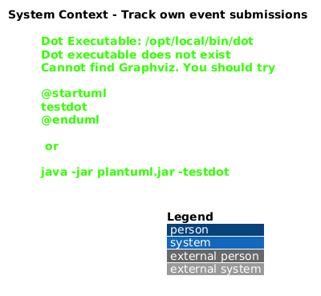
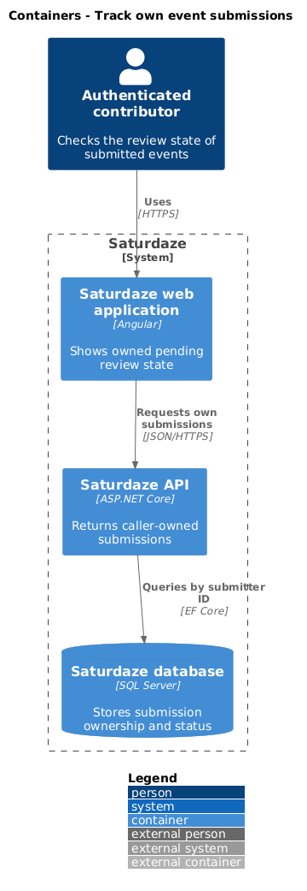
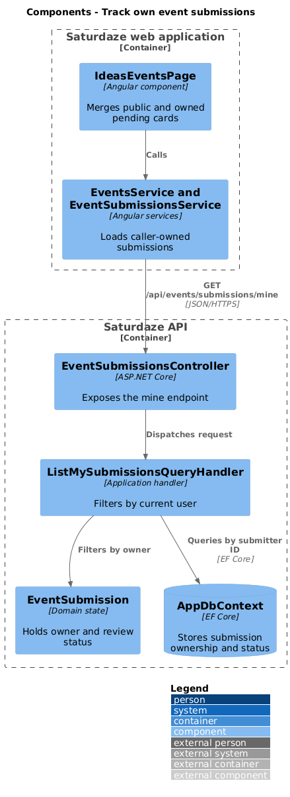
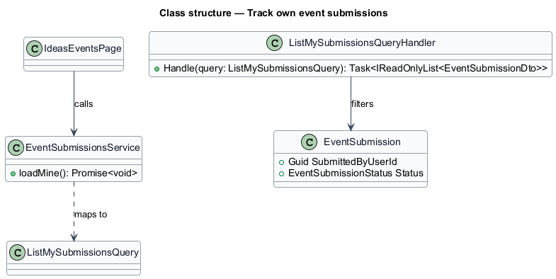
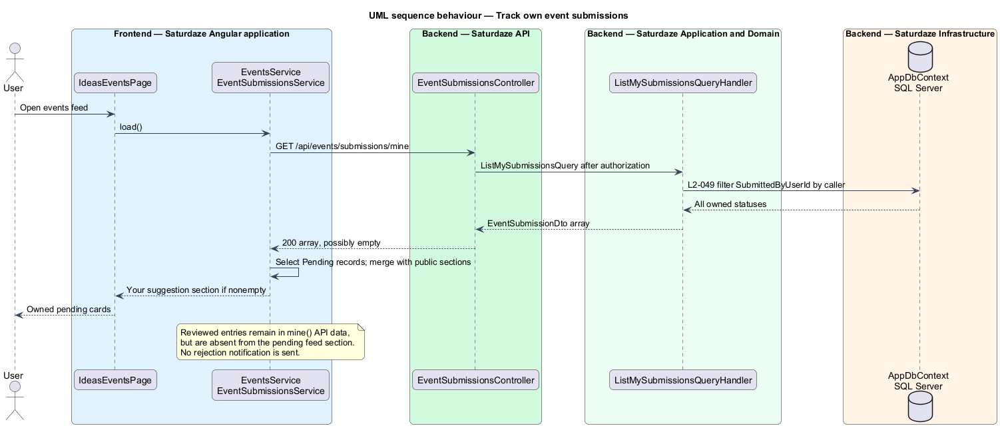

# Track own event submissions

## Overview

Saturdaze is a web application that plans personalized family weekends. Submission tracking distinguishes a contributor's pending content from the approved public event catalogue.

*submission status* — pending, approved, or rejected review state assigned to a contributed event

`EventsService` and `EventSubmissionsService` combine the public feed with the caller's own submissions. The UI marks only the caller's pending cards with the review badge.

## Description

`EventsService` combines the public event catalog with `EventSubmissionsService.mine()`. `IdeasEventsPage` renders only owned Pending submissions in the Your suggestion section.

`EventSubmissionsController.Mine()` dispatches `ListMySubmissionsQuery`. `ListMySubmissionsQueryHandler` filters by the authenticated user and returns all three review statuses, while the feed selects Pending records.

`EventSubmittedDialog` is an in-place acknowledgement opened by `IdeasPage`, not a routed confirmation screen. Returning from it leaves the contributor on `/ideas/events`.

Approval or rejection removes a record from the pending presentation after reload. A rejection-notification delivery mechanism is absent; the notification obligation in L1-018 remains an implementation gap.

## Requirements

The following L2 requirements refine the cited L1 capabilities. Implementation gaps stated in Description do not waive these obligations.

| L2 ID | Refines (L1) | Requirement |
|-------|--------------|-------------|
| `L2-049` | `L1-018` | `GET /api/events/submissions/mine` shall return the caller's own submissions in any status (`Pending`, `Approved`, `Rejected`). The events feed at `/ideas/events` shall render a "Pending review" badge on cards drawn from the caller's own pending submissions so they understand the event isn't yet public. |

## Diagrams

### System context

The context view identifies the person using the discovery capability and the systems that participate in the result.

### Containers

The container view follows the interaction from the Angular web application through the API to persistence.

### Components

The component view names the page, client service, controller, handler, domain type, and infrastructure boundary involved in the slice.

### Class structure

The class view shows the request, handler, and state relationships used by the feature.

### Behaviour — list caller-owned submissions

The sequence view traces the primary behaviour to `L2-049`. Its alternate path produces a controlled empty, validation, authorization, or fallback state.

