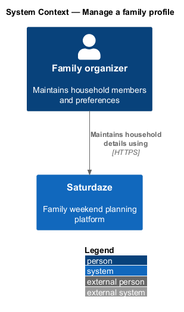
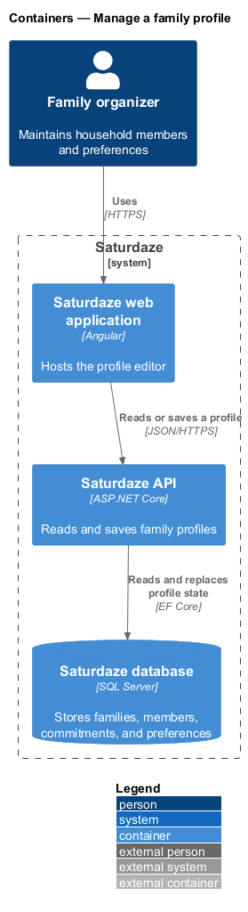
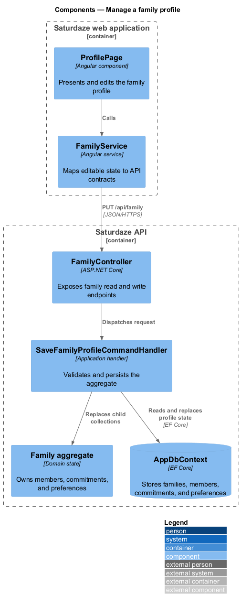
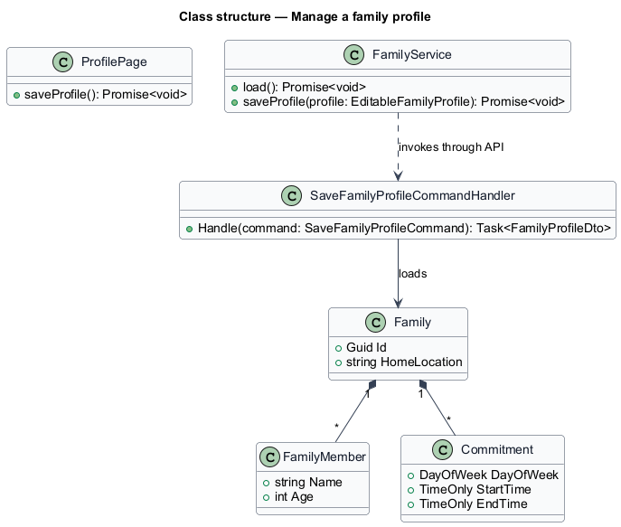
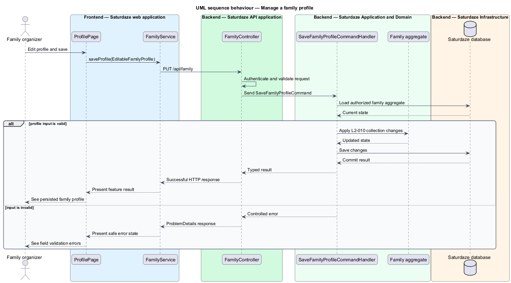

# Manage a family profile

## Overview

Saturdaze is a web application that plans personalized family weekends. The family profile supplies the household data used to personalize every discovery and planning result.

*family profile* — household record containing home location, members, commitments, and preferences

The profile page loads one aggregate for the authenticated family. Dialogs edit members and commitments before `FamilyService.saveProfile()` sends the replacement collection.

## Description

The feature forms a vertical slice across the Angular application, the ASP.NET Core API, application handlers, domain state, and SQL Server persistence.

- **`ProfilePage`** — Angular page that loads profile state and coordinates edits.
- **`FamilyMemberDialog and CommitmentDialog`** — Angular CDK dialogs that return validated member or commitment values.
- **`FamilyService`** — Typed client service exposing `load()` and `saveProfile()`.
- **`FamilyController`** — API controller exposing `GET /api/family` and `PUT /api/family`.
- **`GetFamilyProfileQueryHandler`** — Application handler that projects the full family aggregate.
- **`SaveFamilyProfileCommandHandler`** — Application handler that replaces members, commitments, and preferences after validation.

## Requirements

The feature realizes the following level-2 (L2) requirements. Each row cites the level-1 (L1) capability refined by the requirement.

| L2 ID | Refines (L1) | Requirement |
|-------|--------------|-------------|
| `L2-009` | `L1-002` | `GET /api/family` must return the authenticated caller's family with all members, commitments, and preferences in one response. |
| `L2-010` | `L1-002` | `PUT /api/family` must accept a full or partial family profile and persist additions, edits, and removals to members, commitments, and preferences. |

## Diagrams

### System context

The context view identifies the family member using the capability and the Saturdaze system that owns the weekend state.

### Containers

The container view follows the interaction from the Angular web application through the API to SQL Server.

### Components

The component view names the page, client service, controller, handler, domain type, and persistence boundary involved in the slice.

### Class structure

The class view shows the request path and the state relationships used by the feature.

### Behaviour — save a family profile

The sequence view traces the primary behaviour to `L2-009` and `L2-010`. Its alternate path preserves valid existing state when the request cannot proceed.

