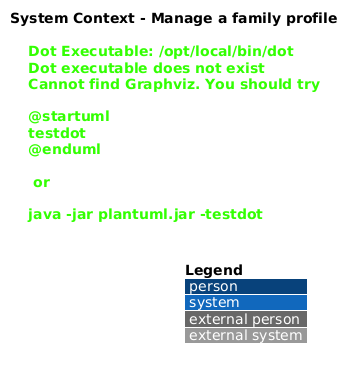
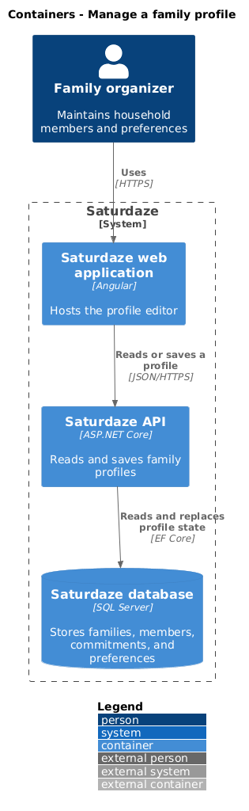
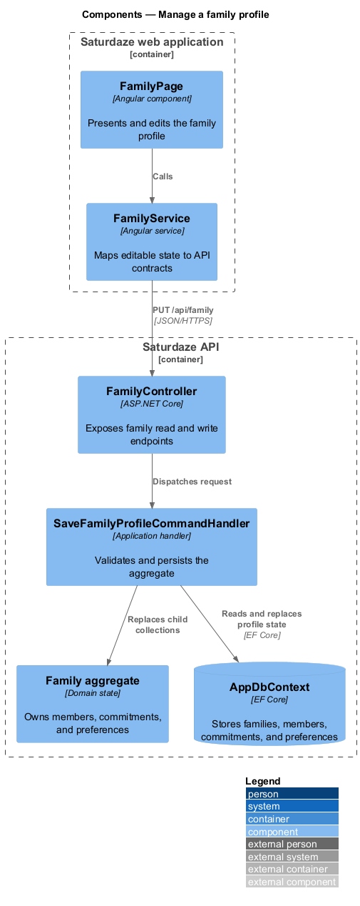
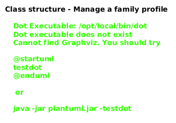
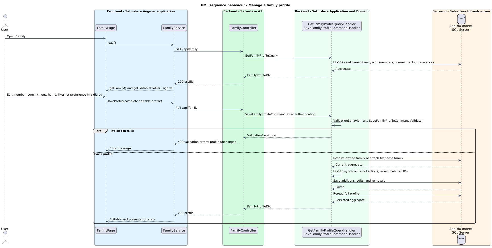

# Manage a family profile

## Overview

Saturdaze is a web application that plans personalized family weekends. The family profile supplies the household data used to personalize every discovery and planning result.

*family profile* — household record containing home location, members, commitments, and preferences

The profile page loads one aggregate for the authenticated family. Dialogs edit members and commitments before `FamilyService.saveProfile()` sends the replacement collection.

## Description

`FamilyPage` at `/family` loads `FamilyService.getEditableProfile()`. `HomeLocationDialog`, `FamilyMemberDialog`, `CommitmentDialog`, and `LikesDialog` return edits; the page persists the complete editable profile through `saveProfile()`.

`SaveFamilyProfileCommandHandler` resolves ownership through `CurrentUserFamilyAccessor`. It can attach a new family to an authenticated account lacking one, then synchronizes member, commitment, and preference collections.

Members match by supplied ID or name; commitments match by ID or title/day. Missing collection entries are removed. Optional scalar settings retain their existing value when omitted where supported; collection synchronization is replacement, not a general PATCH contract.

The response is reread from persistence through `FamilyProfileMapper`. Name, home text, budget, novelty, and Friday-preview preferences are stored. The current planner consumes novelty; budget and Friday-preview delivery are not implemented downstream.

Daily rhythm anchors in L1-002 are not editable profile fields. Home text is not geocoded into forecast or catalog coordinates.

## Requirements

The following L2 requirements refine the cited L1 capabilities. Implementation gaps stated in Description do not waive these obligations.

| L2 ID | Refines (L1) | Requirement |
|-------|--------------|-------------|
| `L2-009` | `L1-002` | `GET /api/family` shall return the authenticated caller's family with all members, commitments, and preferences in one response. |
| `L2-010` | `L1-002` | `PUT /api/family` shall accept a full or partial family profile and persist additions, edits, and removals to members, commitments, and preferences. |

## Diagrams

### System context

The context view identifies the family member using the capability and the Saturdaze system that owns the weekend state.

### Containers

The container view follows the interaction from the Angular web application through the API to SQL Server.

### Components

The component view names the page, client service, controller, handler, domain type, and persistence boundary involved in the slice.

### Class structure

The class view shows the request path and the state relationships used by the feature.

### Behaviour — save a family profile

The sequence view traces the primary behaviour to `L2-009` and `L2-010`. Its alternate path preserves valid existing state when the request cannot proceed.

