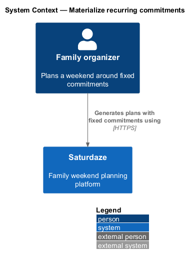
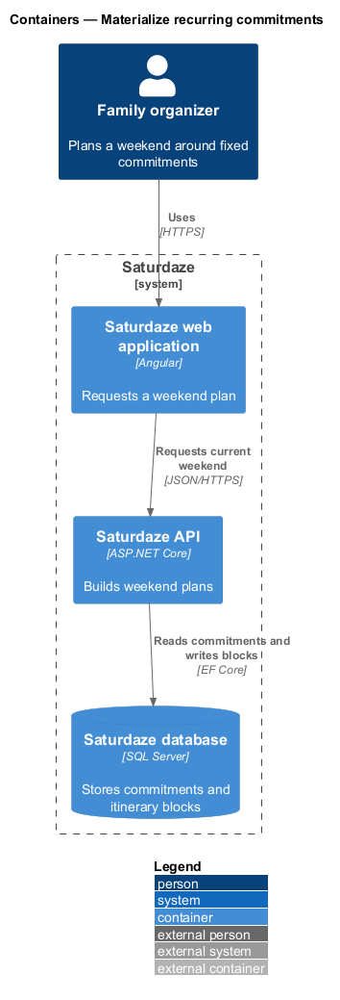
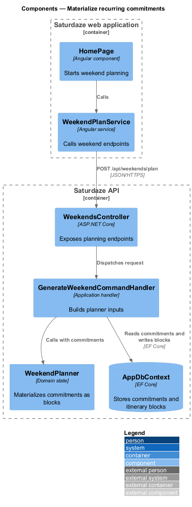
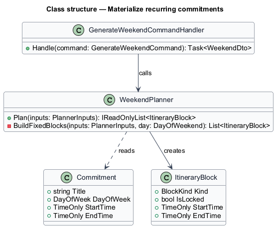
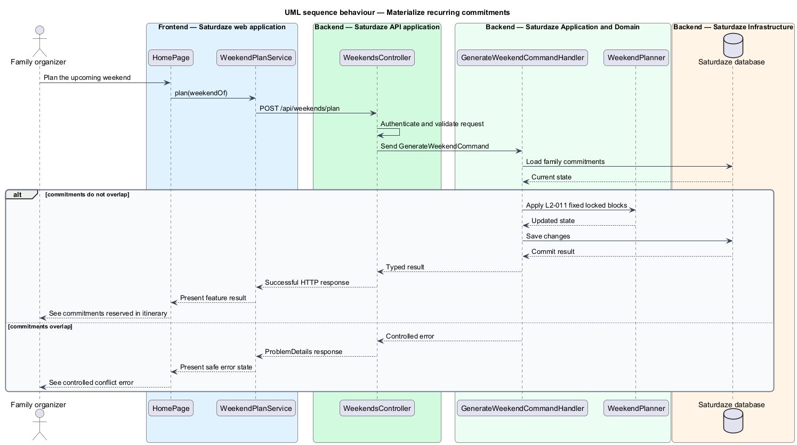

# Materialize recurring commitments

## Overview

Saturdaze is a web application that plans personalized family weekends. Recurring commitments reserve fixed time windows before flexible activities, meals, errands, and downtime are placed.

*commitment block* — itinerary block derived from a recurring family commitment

`WeekendPlanner.BuildFixedBlocks()` converts matching Saturday and Sunday commitments before computing free gaps. The generated block retains the commitment title and time window.

## Description

The feature forms a vertical slice across the Angular application, the ASP.NET Core API, application handlers, domain state, and SQL Server persistence.

- **`ProfilePage`** — Angular page where recurring commitments are maintained.
- **`WeekendPlanService`** — Typed client service that requests the current or generated weekend.
- **`WeekendsController`** — API controller exposing weekend planning endpoints.
- **`GenerateWeekendCommandHandler`** — Application handler that loads the family aggregate and planner inputs.
- **`WeekendPlanner`** — Application service that creates fixed commitment blocks before filling gaps.
- **`Commitment and ItineraryBlock`** — Domain types linked through the generated title, day, and time window.

`WeekendPlanner.BuildFixedBlocks()` currently omits `IsLocked=true` for newly materialized commitments. The assignment needed by `L2-011` is `<TO SUPPLY>`.
## Requirements

The feature realizes the following level-2 (L2) requirements. Each row cites the level-1 (L1) capability refined by the requirement.

| L2 ID | Refines (L1) | Requirement |
|-------|--------------|-------------|
| `L2-011` | `L1-002`, `L1-004` | Every `Commitment` on the family profile must materialize as a locked itinerary block on every generated weekend at the commitment's day and time window. |

## Diagrams

### System context

The context view identifies the family member using the capability and the Saturdaze system that owns the weekend state.

### Containers

The container view follows the interaction from the Angular web application through the API to SQL Server.

### Components

The component view names the page, client service, controller, handler, domain type, and persistence boundary involved in the slice.

### Class structure

The class view shows the request path and the state relationships used by the feature.

### Behaviour — reserve commitment time

The sequence view traces the primary behaviour to `L2-011`. Its alternate path preserves valid existing state when the request cannot proceed.

