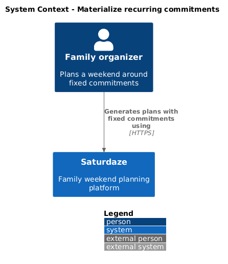
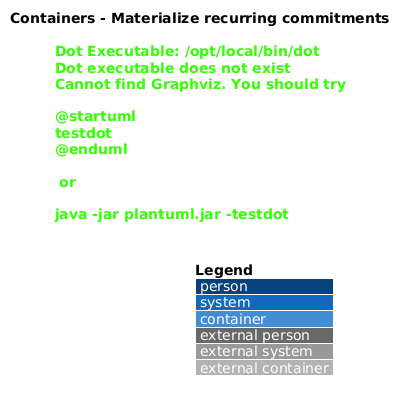
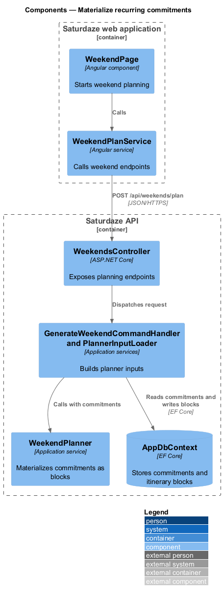
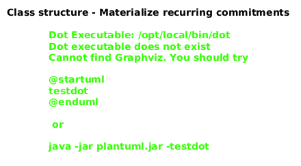
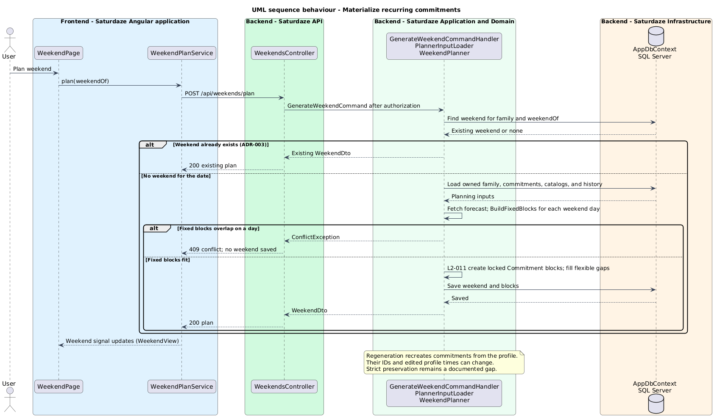

# Materialize recurring commitments

## Overview

Saturdaze is a web application that plans personalized family weekends. Recurring commitments reserve fixed time windows before flexible activities, meals, errands, and downtime are placed.

*commitment block* — itinerary block derived from a recurring family commitment

`WeekendPlanner.BuildFixedBlocks()` converts matching Saturday and Sunday commitments before computing free gaps. The generated block uses the current profile's commitment title and time window.

## Description

`FamilyPage` and `CommitmentDialog` maintain single-day weekly commitments. `WeekendPage` requests planning through `WeekendPlanService` and `WeekendsController`.

`PlannerInputLoader` loads the family and planning inputs. `WeekendPlanner.BuildFixedBlocks()` selects commitments matching Saturday or Sunday and creates locked Commitment blocks at their configured local times.

`LockBlockCommandHandler` returns 409 `commitment_locked` when asked to unlock a commitment. `LockWeekendDayCommandHandler` also preserves commitment locks.

Regeneration reconstructs commitment blocks from the current family profile. Their database IDs can change, and edited profile times can replace prior times. The stronger identity/content-preservation wording in L2-011 and L2-016 remains an explicit implementation discrepancy.

## Requirements

The following L2 requirements refine the cited L1 capabilities. Implementation gaps stated in Description do not waive these obligations.

| L2 ID | Refines (L1) | Requirement |
|-------|--------------|-------------|
| `L2-011` | `L1-002`, `L1-004` | Every `Commitment` on the family profile shall materialize as a locked itinerary block on every generated weekend at the commitment's day and time window. |

## Diagrams

### System context

The context view identifies the family member using the capability and the Saturdaze system that owns the weekend state.

### Containers

The container view follows the interaction from the Angular web application through the API to SQL Server.

### Components

The component view names the page, client service, controller, handler, domain type, and persistence boundary involved in the slice.

### Class structure

The class view shows the request path and the state relationships used by the feature.

### Behaviour — reserve commitment time

The sequence view traces the primary behaviour to `L2-011`. Its alternate path preserves valid existing state when the request cannot proceed.

