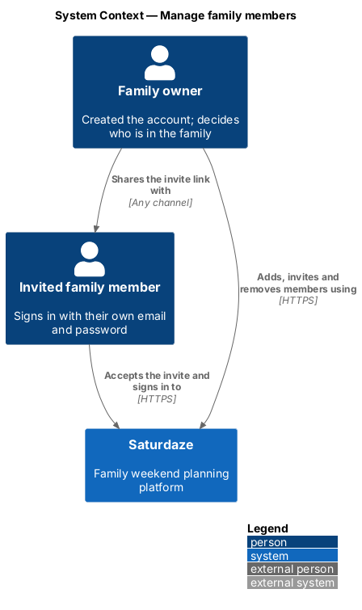
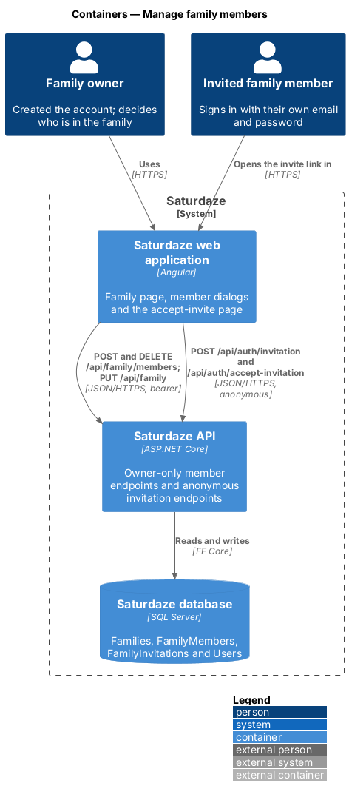
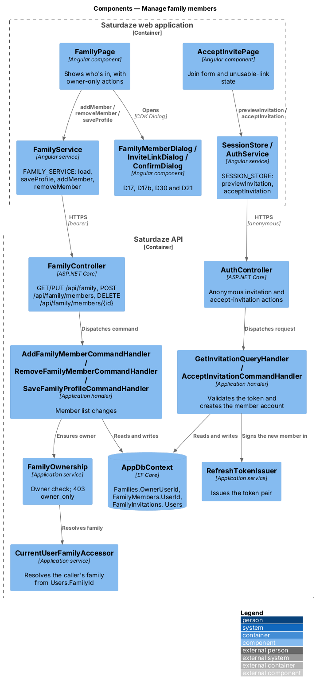
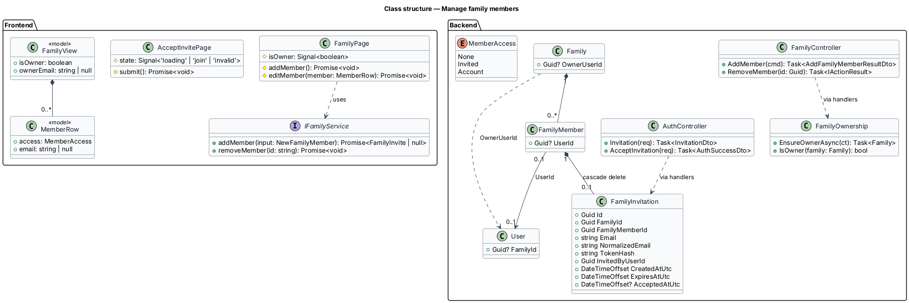
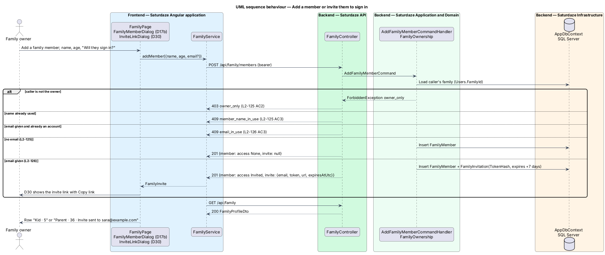
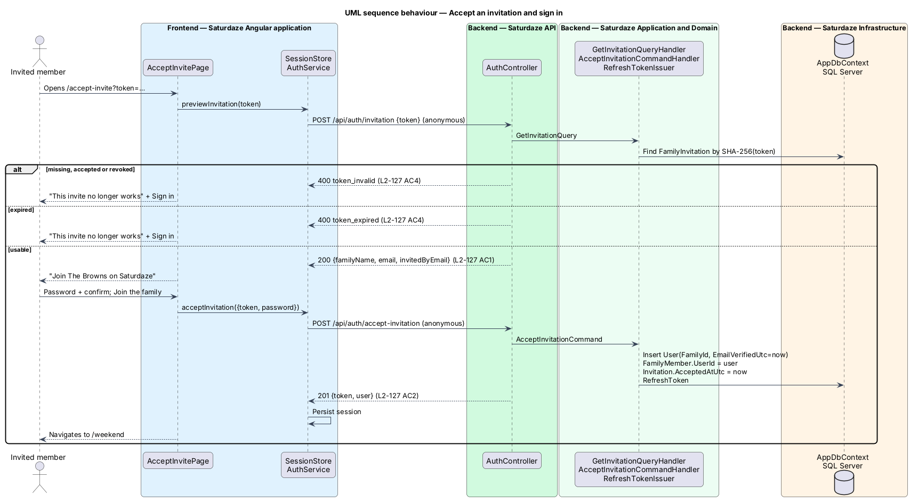
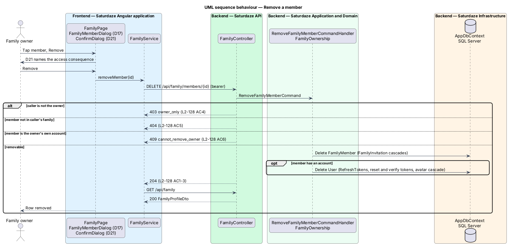

# Manage family members

## Overview

Saturdaze is a web application that plans personalized family weekends. Each account belongs to one *family*: a household profile of members, commitments and preferences that the planner reads, and the weekends planned for it.

*family owner* — the account that created the family, either by registering or by the first profile save of an account that had no family

*member* — a person on the family profile, with a name and an age that shape the planner's picks

*member access* — whether a member signs in: `None` (planned for, never signs in, such as a young child), `Invited` (an invitation is outstanding) or `Account` (signs in with their own email and password)

*invitation* — a single-use capability link, valid for 7 days, that lets the invited person create their own sign-in for the owner's family

This feature lets the owner add members who will not sign in, invite members who will, and remove members. Every account in a family shares the same profile and weekends. Only the owner changes who belongs to the family. ADR-016 records the decisions behind the design.

## Description

### Frontend

`FamilyPage` reads `isOwner` and `ownerEmail` from `FamilyView`. For the owner, the "Who's in" section keeps the subtitle "Ages shape the picks. Tap a person to edit.", each row opens the member dialog, and the "Add a family member" ghost row is shown. For any other member, the subtitle reads "Ages shape the picks. Only {ownerEmail} can change who's in.", rows render without the `action` input and the ghost row is hidden. Each `MemberRow` gains `access` and `email`; `subtitle` appends "Invite sent to {email}" for `Invited` and "Signs in as {email}" for `Account`, so a row reads "Parent · 36 · Invite sent to sara@example.com".

`FamilyMemberDialog` (D17 and D17b in `docs/mocks/pages/dialogs.html`) keeps its Name and Age fields. In add mode (D17b) it adds a `sd-seg-radio` labelled "Will they sign in?" with the options "No sign-in" (default) and "Invite to sign in". Choosing "Invite to sign in" reveals a required Email field and relabels the primary action "Send invite". The hint under the choice reads "No invite is sent. Good for young children." or "They'll choose their own password from the invite link." The dialog closes with `{ kind: 'save', name, age, email }`, where `email` is `null` for "No sign-in". In edit mode (D17), a member with access shows a read-only hint "Signs in as {email}" or "Invite sent to {email}".

`FamilyPage.addMember()` calls `IFamilyService.addMember({ name, age, email })`. When the result carries an invite, the page opens `InviteLinkDialog` (D30), which shows the email, the link in a read-only field and a "Copy link" action that writes the link to the clipboard and reads "Copied" for two seconds. `FamilyPage.editMember()` saves name and age edits through `saveProfile` as before. "Remove" opens `ConfirmDialog` (D21) with a body chosen by access: `None` — "Future weekends will not plan for them."; `Invited` — "The invite sent to {email} will stop working."; `Account` — "{name} will be signed out and will no longer be able to sign in." Confirming calls `IFamilyService.removeMember(id)`.

`IFamilyService` gains `addMember(input: NewFamilyMember): Promise<FamilyInvite | null>` and `removeMember(id: string): Promise<void>`. `FamilyService` sends `POST /api/family/members` and `DELETE /api/family/members/{id}` and reloads the family after each.

`AcceptInvitePage` is the bare-shell route `/accept-invite`, with no guard (like `/verify-email`, both signed-in and signed-out people reach it from a link). It reads the `token` query parameter and calls `ISessionStore.previewInvitation(token)`. While the call is in flight it shows a status row. A usable invitation shows the `join` state: an `sd-auth-card` titled "Join {familyName} on Saturdaze", the subtitle "{invitedByEmail} invited you. Choose a password to sign in with your own account.", a read-only Email field, Password and Confirm password fields with the existing password-rule checklist, and the primary action "Join the family". An unusable invitation shows the `invalid` state: "This invite no longer works", "Ask whoever invited you for a new link.", and a "Sign in" link. `ISessionStore.acceptInvitation({ token, password })` persists the returned session exactly as `signUp` does; the page then navigates to `/weekend`. A `token_invalid` or `token_expired` response switches to the `invalid` state.

### Backend

`Family` gains `Guid? OwnerUserId`. `FamilyMember` gains `Guid? UserId` with a unique filtered index. A new `FamilyInvitation` entity (table `FamilyInvitations`) holds `FamilyId`, `FamilyMemberId` (cascading foreign key to `FamilyMembers`), `Email`, `NormalizedEmail`, `TokenHash` (unique), `InvitedByUserId`, `CreatedAtUtc`, `ExpiresAtUtc` and `AcceptedAtUtc`. Migration `AddFamilyOwnershipAndInvitations` adds them and backfills `OwnerUserId` with each family's earliest-created account.

`RegisterUserCommandHandler` and the family-creating branch of `SaveFamilyProfileCommandHandler` set `OwnerUserId`. `UserSeeder` sets it when it attaches a seeded account to a family without one.

`FamilyOwnership` (scoped) loads the caller's family through `ICurrentFamilyAccessor` and raises `ForbiddenException("owner_only", …)` when `OwnerUserId` is set and differs from the caller. The exception middleware maps `ForbiddenException` to `403` ProblemDetails carrying `code`. `CurrentUserFamilyAccessor` reads `Users.FamilyId` by primary key instead of trusting the `family_id` claim, and raises `InvalidCredentialsException` (401) when the user no longer exists.

`FamilyProfileDto` gains `bool IsOwner` and `string? OwnerEmail`. `FamilyMemberDto` gains `MemberAccess Access` and `string? Email`. `FamilyProfileMapper` computes both from `FamilyMember.UserId` and the member's unaccepted invitation.

`FamilyController` adds two actions:

- `POST /api/family/members` dispatches `AddFamilyMemberCommand(Name, Age, Email?)` and returns `201` with `AddFamilyMemberResultDto(FamilyMemberDto Member, FamilyInviteDto? Invite)`. The validator requires a name of 1–100 characters, an age from 0 to 120 and, when present, a valid email of at most 256 characters. The handler enforces the owner check, `409 member_name_in_use`, `409 email_in_use` (an account already has the email) and `409 already_invited` (an outstanding invitation in the family has it). With an email it stores a `FamilyInvitation` whose `TokenHash` is `IJwtTokenService.HashRefreshToken(raw)` and returns the raw token and `{Saturdaze:Share:AppOrigin}/accept-invite?token={raw}`.
- `DELETE /api/family/members/{id}` dispatches `RemoveFamilyMemberCommand(Id)`. The handler enforces the owner check, returns `404` for a member outside the family and `409 cannot_remove_owner` for the owner's own account, deletes the member (its invitation cascades) and, when the member has an account, deletes that `User` (its refresh, verification and reset tokens and avatar cascade). It returns `204`.

`AuthController` adds two `[AllowAnonymous]` actions. `POST /api/auth/invitation` dispatches `GetInvitationQuery(Token)` and returns `InvitationDto(FamilyName, Email, InvitedByEmail)`. `POST /api/auth/accept-invitation` dispatches `AcceptInvitationCommand(Token, Password)`. Both resolve the invitation by token hash and raise `AuthFlowException(400, "token_invalid")` when it is missing or accepted and `AuthFlowException(400, "token_expired")` when it has expired. The accept handler raises `weak_password` for a password under 8 characters and `409 email_in_use` when an account took the email meanwhile. It creates the `User` with `FamilyId` set, `EmailVerifiedUtc` set to now and the hashed password, links `FamilyMember.UserId`, sets `AcceptedAtUtc`, issues a refresh token through `RefreshTokenIssuer` and returns `201 AuthSuccessDto`.

`SaveFamilyProfileCommandHandler` compares the requested members with the stored ones before syncing. A non-owner whose request differs by name or age raises `403 owner_only`. Any request that leaves an `Invited` or `Account` member unmatched raises `409 member_has_access`.

## Requirements

| L2 ID | Refines (L1) | Requirement |
|-------|--------------|-------------|
| `L2-124` | `L1-037`, `L1-002` | The account that creates a family shall be recorded as the family's owner. `GET /api/family` shall return `isOwner` and `ownerEmail`, and each member shall carry `access` (`None`, `Invited` or `Account`) and `email`. Existing families shall be owned by their earliest-created account. A family with no recorded owner shall let any of its signed-in accounts manage members. |
| `L2-125` | `L1-037`, `L1-002` | The owner shall be able to add a member with a name and age and no email. No invitation shall be created and the member shall never be able to sign in. |
| `L2-126` | `L1-037`, `L1-001`, `L1-012` | The owner shall be able to add a member with a name, age and email address and invite them to sign in, through a single-use invitation that expires after 7 days, whose token is stored only as a hash, and whose link is returned only to the owner. |
| `L2-127` | `L1-037`, `L1-001`, `L1-012` | The invite link shall open `/accept-invite`, which shall create a verified account for the invited email with the chosen password, belonging to the inviting family, linked to the invited member, and sign the new member in. |
| `L2-128` | `L1-037`, `L1-012` | The owner shall be able to remove any member except themselves; removing an invited member shall revoke the invitation, and removing a member with an account shall delete that account and end its sessions immediately. |
| `L2-129` | `L1-037`, `L1-002`, `L1-012` | `PUT /api/family` shall keep saving the rest of the profile for every member, but only the owner shall change the member list through it, and a save that drops an invited member or a member with an account shall be refused. |
| `L2-008` | `L1-001`, `L1-012` | Every endpoint except the listed anonymous routes, including `POST /api/auth/invitation` and `POST /api/auth/accept-invitation`, shall reject requests that lack a valid bearer token. |
| `L2-010` | `L1-002` | Adding a member from `/family` shall open a CDK dialog and call `POST /api/family/members` once; editing a member's name or age shall call `PUT /api/family` once. |

## Diagrams

### System context

The context view shows the two people involved: the owner who manages the family, and the invited member who signs in after the owner shares the link.

### Containers

The container view separates the owner's authenticated member endpoints from the anonymous invitation endpoints the invitee uses before an account exists.

### Components

The component view names the pages, dialogs, client services, controllers, handlers and the ownership check involved in this slice.

### Class structure

The class view shows ownership on `Family`, the member-to-account link and the invitation that cascades with its member.

### Behaviour — add a member or invite them

Adding without an email creates a member with access `None`; adding with an email also creates the invitation and returns its link to the owner (`L2-125`, `L2-126`).

### Behaviour — accept an invitation

The invitee previews the invitation, chooses a password and is signed in to the inviting family (`L2-127`).

### Behaviour — remove a member

Removal revokes access with the member: the invitation cascades and an account is deleted with its sessions (`L2-128`).

