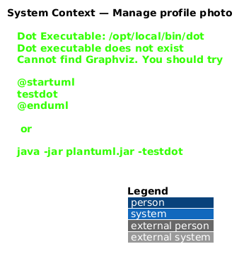
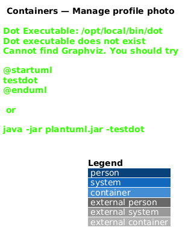
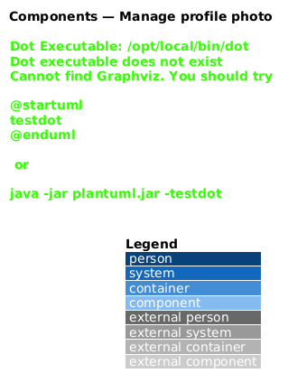
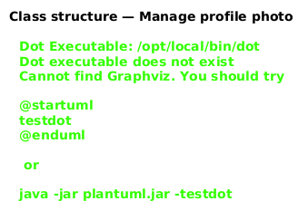
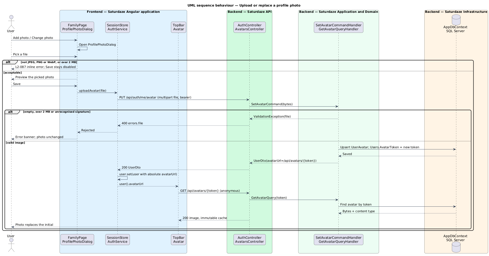
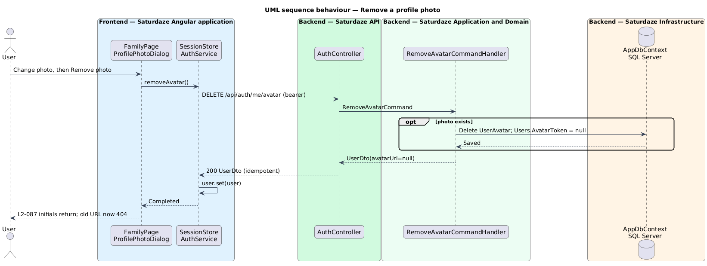

# Manage profile photo

## Overview

Saturdaze is a web application that plans personalized family weekends. Every signed-in account is represented by an *account avatar* — a small disc in the top bar (which opens the account menu) and in the Account card on the Family page. By default the disc shows the upper-cased first letter of the account email.

*profile photo* — an image the account holder uploads to replace that initial

*avatar capability URL* — an unguessable, anonymous URL (`/api/avatars/{token}`) that serves the stored photo; browsers load it from an `` element, which cannot attach a bearer token

This feature lets the account holder add, replace and remove a profile photo. While a photo is set, both account avatars show the photo instead of the initial. The photo belongs to the user, not the family: family members other than the account holder keep their initials.

## Description

### Frontend

`FamilyPage` adds a quiet button to the Account card, labelled "Add photo" when the user has no photo and "Change photo" when one is set. The button opens `ProfilePhotoDialog` (D27 in `docs/mocks/pages/dialogs.html`) through the CDK `Dialog`, in keeping with the rule that pages hold no inline forms.

`ProfilePhotoDialog` shows a 96px preview (the current photo, the picked file, or the initial), a "Choose a photo" control backed by a visually hidden `<input type="file" accept="image/jpeg,image/png,image/webp">`, and a hint stating the rules. When the picked file is not `image/jpeg`, `image/png` or `image/webp`, or exceeds 2 MB, the dialog shows an inline `field__error` and keeps Save disabled. "Remove photo" appears in the left action slot only when a photo is set. The dialog closes with `{ kind: 'save', file }`, `{ kind: 'remove' }`, or `undefined` on cancel; the page performs the call and reports server rejections in its existing error banner.

`ISessionStore` gains `uploadAvatar(file: Blob)` and `removeAvatar()`; both delegate to `IAuthService` and replace the `user` signal with the returned user. `AuthService` sends `PUT /api/auth/me/avatar` as `multipart/form-data` (field `file`) and `DELETE /api/auth/me/avatar`. Every user returned by `AuthService` passes through one mapping that resolves the relative `avatarUrl` against `API_BASE_URL`, so `User.avatarUrl` is either `null` or an absolute URL.

The `sd-avatar` component gains a `src` input. When `src` is set it renders `` and adds the `avatar--photo` class; otherwise it renders the initial. The avatar stays `aria-hidden`, because the email (Account card) or the "Account menu" button label already names it. `sd-top-bar` gains an `avatarSrc` input that `App` binds to `session.user()?.avatarUrl`.

### Backend

`User` gains `Guid? AvatarToken`, the capability token of the current photo. A new `UserAvatar` entity (table `UserAvatars`, primary key and cascading foreign key `UserId`) holds `ContentType`, `Data` (`varbinary(max)`) and `UpdatedAtUtc`. Keeping the bytes out of `Users` means user lookups never load image data.

`UserDto` gains `string? AvatarUrl`, built by a single `UserDto.From(User)` factory used by login, register, refresh, verify-email and `GET /api/auth/me`. It is `/api/avatars/{token:N}` when a token is set and `null` otherwise.

`AuthController` exposes two authenticated actions:

- `PUT /api/auth/me/avatar` reads the `file` form field and dispatches `SetAvatarCommand(byte[] Data)`. A request size limit of 4 MB bounds the multipart body.
- `DELETE /api/auth/me/avatar` dispatches `RemoveAvatarCommand` and is idempotent.

`SetAvatarCommandHandler` rejects an empty file, a file larger than `AvatarImage.MaxBytes` (2 MB), and a file whose leading bytes match none of the JPEG (`FF D8 FF`), PNG (`89 50 4E 47 0D 0A 1A 0A`) or WebP (`RIFF....WEBP`) signatures, by raising `ValidationException("file", …)`, which the middleware maps to 400. The declared content type is ignored; the stored `ContentType` comes from `AvatarImage.DetectContentType`. SVG is never accepted because it can carry script. On success the handler upserts the `UserAvatar` row and assigns a new `AvatarToken`, so a replaced photo's URL stops resolving.

`AvatarsController.Get(Guid token)` is `[AllowAnonymous]` and dispatches `GetAvatarQuery`. The handler finds the user holding the token and returns the bytes and content type, or raises `NotFoundException` (404). The response carries `Cache-Control: public, max-age=31536000, immutable` — safe because the token changes on every upload — and `X-Content-Type-Options: nosniff`.

Migration `AddUserAvatars` adds the column, the unique filtered index on `Users.AvatarToken`, and the table.

## Requirements

| L2 ID | Refines (L1) | Requirement |
|-------|--------------|-------------|
| `L2-087` | `L1-001`, `L1-012` | A signed-in user shall be able to upload a profile photo from the Family page's Account card, replace it, and remove it. While a photo is set, the account avatar in the Account card and the top bar shall show the photo instead of the user's initial. The API shall accept only JPEG, PNG or WebP images of at most 2 MB, identified by their content rather than the declared type, and shall serve the stored photo from an unguessable capability URL (`UserDto.avatarUrl`) that changes on every upload and stops resolving when the photo is replaced or removed. |
| `L2-008` | `L1-001`, `L1-012` | Every endpoint except the listed anonymous routes, including the `GET /api/avatars/{token}` capability URL, shall reject requests that lack a valid `Authorization: Bearer <jwt>` header. |

## Diagrams

### System context

The context view identifies the account holder and the Saturdaze system that stores the photo.

### Containers

The container view separates the authenticated upload path from the anonymous image path the browser uses to display the photo.

### Components

The component view names the page, dialog, avatar components, client services, controllers, handlers and the signature check involved in this slice.

### Class structure

The class view shows the request path, the `UserAvatar` entity held apart from `User`, and the `avatarUrl` the frontend renders.

### Behaviour — upload or replace a photo

The sequence view traces the upload to `L2-087`, including the client-side and server-side rejection paths and the anonymous image load that follows a successful upload.

### Behaviour — remove a photo

The removal clears the token, so the previous capability URL returns 404 and both avatars fall back to the initial.

