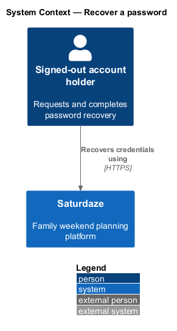
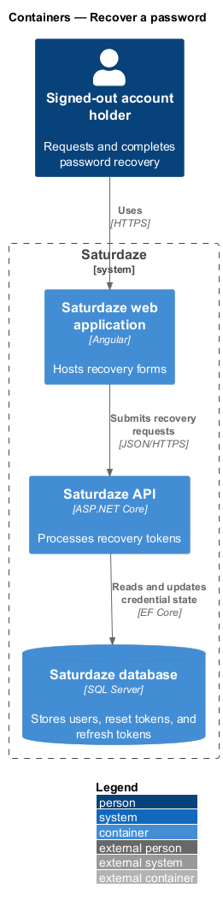
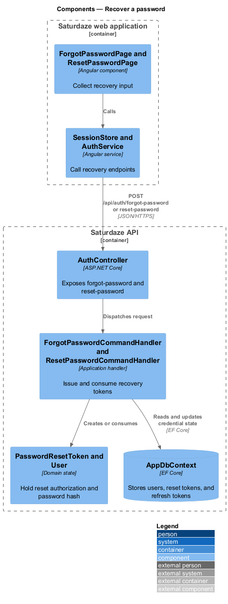
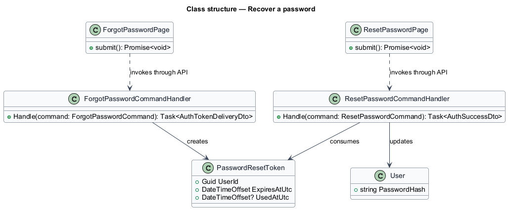
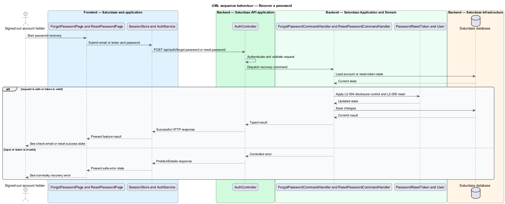

# Recover a password

## Overview

Saturdaze is a web application that plans personalized family weekends. Password recovery separates a non-disclosing email request from the token-authorized password reset.

*reset token* — single-use credential that authorizes one password change before expiry

The request path always presents the same response for registered and unregistered email addresses. The reset path validates token state and password rules before updating `User.PasswordHash`.

## Description

The feature forms a vertical slice across the Angular application, the ASP.NET Core API, application handlers, domain state, and SQL Server persistence.

- **`ForgotPasswordPage`** — Angular page that validates the email request and navigates to the check-email state.
- **`ResetPasswordPage`** — Angular page that reads the reset token and validates matching passwords.
- **`SessionStore and AuthService`** — Client services that call the forgot-password and reset-password endpoints.
- **`AuthController`** — API controller exposing both recovery endpoints.
- **`ForgotPasswordCommandHandler`** — Application handler that creates delivery metadata without disclosing account existence.
- **`ResetPasswordCommandHandler`** — Application handler that consumes `PasswordResetToken`, hashes the new password, and returns a fresh session.

## Requirements

The feature realizes the following level-2 (L2) requirements. Each row cites the level-1 (L1) capability refined by the requirement.

| L2 ID | Refines (L1) | Requirement |
|-------|--------------|-------------|
| `L2-004` | `L1-001` | A signed-out user must be able to request a password-reset link by entering their email. The system must not reveal whether the email is registered. |
| `L2-005` | `L1-001` | The system must accept a reset token plus a new password and confirmation, validate the token, enforce password complexity, and rotate any existing refresh tokens for that user on success. |

## Diagrams

### System context

The context view identifies the person using this capability and the Saturdaze system that owns the resulting state.

### Containers

The container view follows the interaction from the Angular web application through the API to SQL Server.

### Components

The component view names the page, client service, controller, handler, domain type, and persistence boundary involved in this slice.

### Class structure

The class view shows the request path and the state types used by the feature.

### Behaviour — request and complete password recovery

The sequence view traces the primary behaviour to `L2-004` and `L2-005`. Its alternate path shows how the feature returns a controlled failure.

