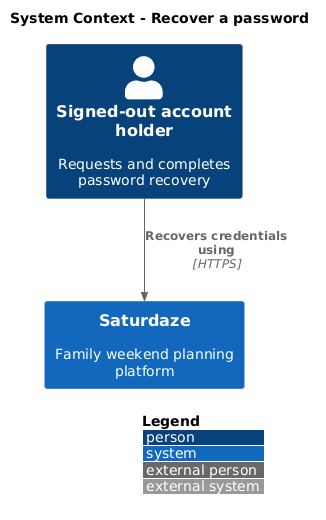
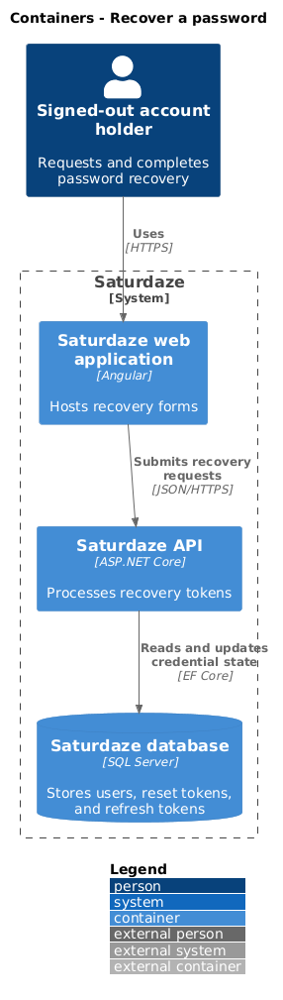
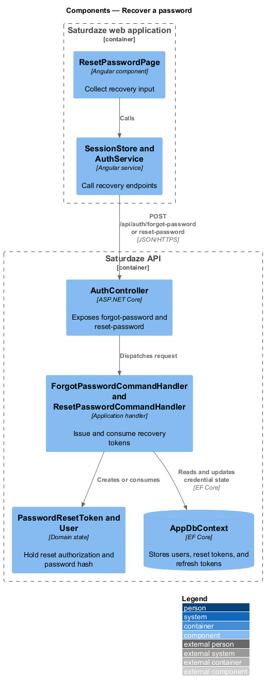
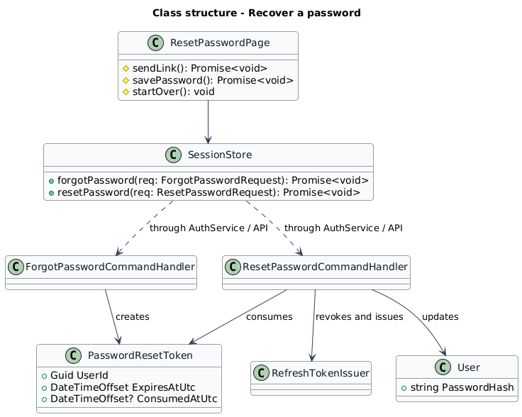
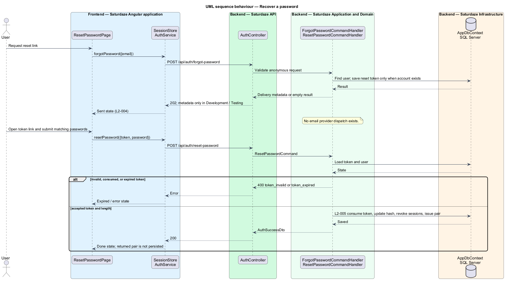

# Recover a password

## Overview

Saturdaze is a web application that plans personalized family weekends. Password recovery separates a non-disclosing email request from the token-authorized password reset.

*reset token* — single-use credential that authorizes one password change before expiry

The request path always presents the same response for registered and unregistered email addresses. The reset path validates token state and password rules before updating `User.PasswordHash`.

## Description

`ResetPasswordPage` at `/reset-password` presents request, sent, new-password, done, and expired states. Presence of `?token=` selects the new-password form; old recovery routes redirect here.

`SessionStore` and `AuthService` call the request and reset endpoints. The page presents sent state even when the request fails, preventing account-existence feedback in that UI.

`ForgotPasswordCommandHandler` invalidates earlier reset credentials and stores a hashed token expiring after 60 minutes. `AuthController.DevDelivery()` exposes delivery data only in Development and Testing; other environments return an empty accepted response.

`ResetPasswordCommandHandler` consumes a valid token, updates the password hash, revokes active refresh tokens, and returns a newly issued session. The current browser reset method ignores that session and displays done.

Email dispatch is absent. Only eight-character minimum length is enforced; the stronger composition checklist in L2-005 remains a gap. Confirmation is checked in the browser, not a separate API field.

## Requirements

The following L2 requirements refine the cited L1 capabilities. Implementation gaps stated in Description do not waive these obligations.

| L2 ID | Refines (L1) | Requirement |
|-------|--------------|-------------|
| `L2-004` | `L1-001` | A signed-out user shall be able to request a password-reset link by entering their email. The system shall not reveal whether the email is registered. |
| `L2-005` | `L1-001` | The system shall accept a reset token plus a new password and confirmation, validate the token, enforce password complexity, and rotate any existing refresh tokens for that user on success. |

## Diagrams

### System context

The context view identifies the person using this capability and the Saturdaze system that owns the resulting state.

### Containers

The container view follows the interaction from the Angular web application through the API to SQL Server.

### Components

The component view names the page, client service, controller, handler, domain type, and persistence boundary involved in this slice.

### Class structure

The class view shows the request path and the state types used by the feature.

### Behaviour — request and complete password recovery

The sequence view traces the primary behaviour to `L2-004` and `L2-005`. Its alternate path shows how the feature returns a controlled failure.

