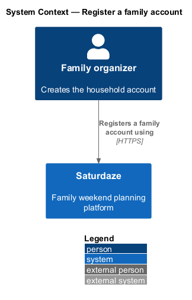
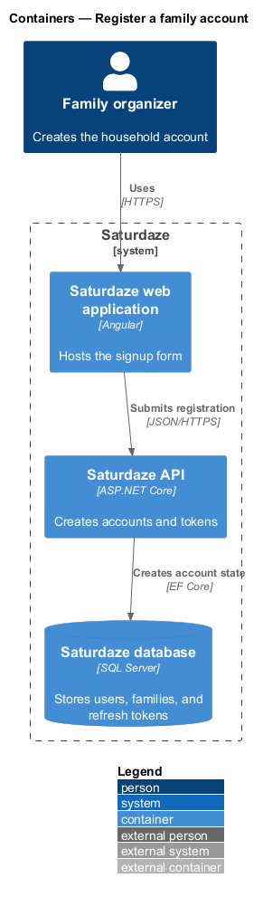
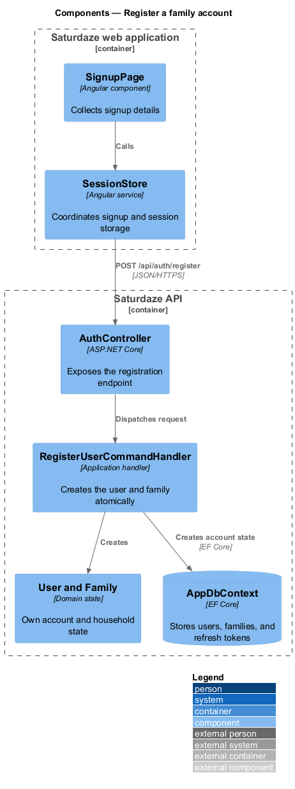
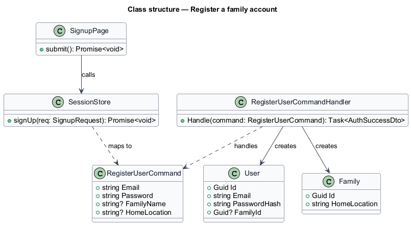
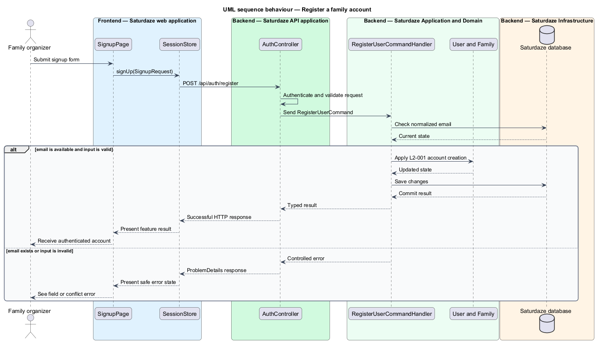

# Register a family account

## Overview

Saturdaze is a web application that plans personalized family weekends. Account registration creates the credentials and household boundary used by every personalized feature.

*family account* — user identity paired with the single family profile it owns

The signup flow collects credentials and optional family details. A successful transaction creates `User` and `Family` records before returning access and refresh tokens.

## Description

The feature forms a vertical slice across the Angular application, the ASP.NET Core API, application handlers, domain state, and SQL Server persistence.

- **`SignupPage`** — Angular page that validates the signup form and accepts the terms acknowledgement.
- **`SessionStore`** — Client state service whose `signUp()` method delegates registration and stores the returned session.
- **`AuthController`** — API controller that exposes `POST /api/auth/register`.
- **`RegisterUserCommandHandler`** — Application handler that checks email uniqueness, hashes the password, creates the account records, and issues tokens.
- **`Pbkdf2PasswordHasher`** — Infrastructure service that creates the stored password hash.
- **`User` and `Family`** — Domain entities created together for the new account.

## Requirements

The feature realizes the following level-2 (L2) requirements. Each row cites the level-1 (L1) capability refined by the requirement.

| L2 ID | Refines (L1) | Requirement |
|-------|--------------|-------------|
| `L2-001` | `L1-001` | The system must accept a signup payload (email, password, optional family name, optional home location), create a `User` row, create an empty `Family` row owned by that user, issue an access token + refresh token, and return both with the user record. |

## Diagrams

### System context

The context view identifies the person using this capability and the Saturdaze system that owns the resulting state.

### Containers

The container view follows the interaction from the Angular web application through the API to SQL Server.

### Components

The component view names the page, client service, controller, handler, domain type, and persistence boundary involved in this slice.

### Class structure

The class view shows the request path and the state types used by the feature.

### Behaviour — register a family account

The sequence view traces the primary behaviour to `L2-001`. Its alternate path shows how the feature returns a controlled failure.

