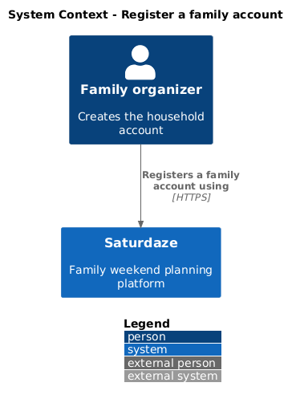
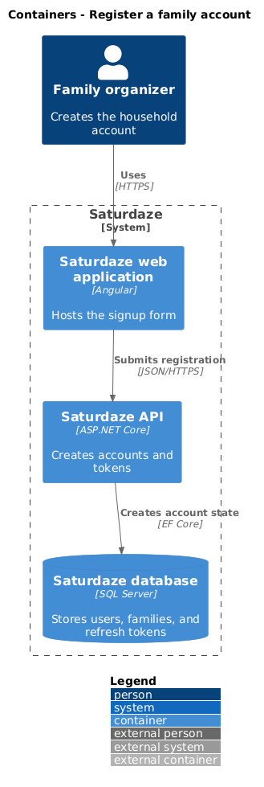
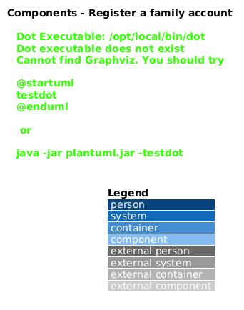
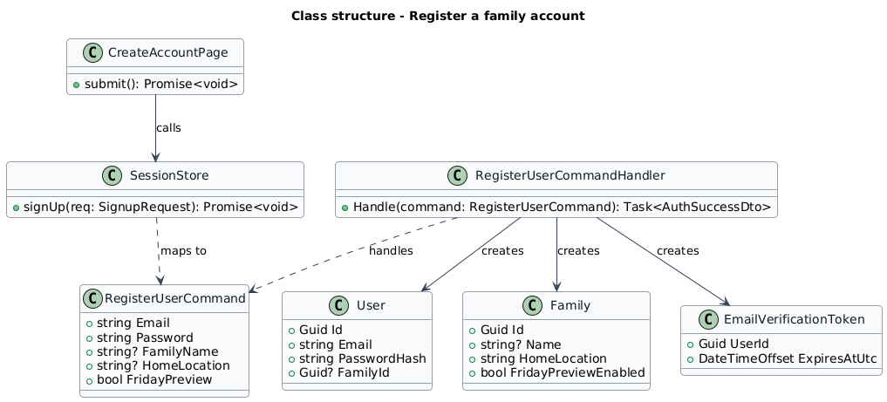
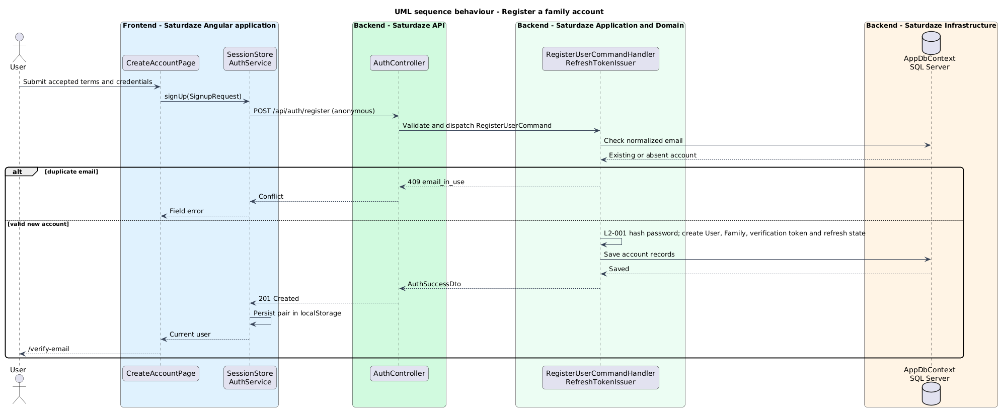

# Register a family account

## Overview

Saturdaze is a web application that plans personalized family weekends. Account registration creates the credentials and household boundary used by every personalized feature.

*family account* — user identity paired with the single family profile it owns

The signup flow collects credentials and optional family details. A successful transaction creates `User` and `Family` records before returning access and refresh tokens.

## Description

`CreateAccountPage` at `/create-account` validates credentials and terms acknowledgement and calls `SessionStore.signUp()`. It also sends the Friday-preview preference and then opens `/verify-email`.

`AuthController.Register()` dispatches `RegisterUserCommand` and returns 201 with `AuthSuccessDto`. `RegisterUserCommandHandler` checks normalized email uniqueness, creates `User` and `Family`, and issues credentials through `RefreshTokenIssuer`.

`Pbkdf2PasswordHasher` stores salted password hashes. `SessionStore` persists registration credentials in local storage and sets the current user.

Email delivery is not connected to a provider. Registration and verification screens describe the intended email flow; delivery remains a gap under L1-001.

## Requirements

The following L2 requirements refine the cited L1 capabilities. Implementation gaps stated in Description do not waive these obligations.

| L2 ID | Refines (L1) | Requirement |
|-------|--------------|-------------|
| `L2-001` | `L1-001` | The system shall accept a signup payload (email, password, optional family name, optional home location), create a `User` row, create an empty `Family` row owned by that user, issue an access token + refresh token, and return both with the user record. |

## Diagrams

### System context

The context view identifies the person using this capability and the Saturdaze system that owns the resulting state.

### Containers

The container view follows the interaction from the Angular web application through the API to SQL Server.

### Components

The component view names the page, client service, controller, handler, domain type, and persistence boundary involved in this slice.

### Class structure

The class view shows the request path and the state types used by the feature.

### Behaviour — register a family account

The sequence view traces the primary behaviour to `L2-001`. Its alternate path shows how the feature returns a controlled failure.

