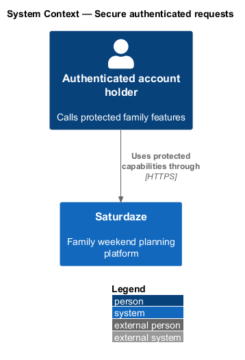
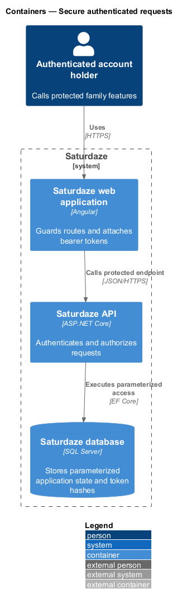
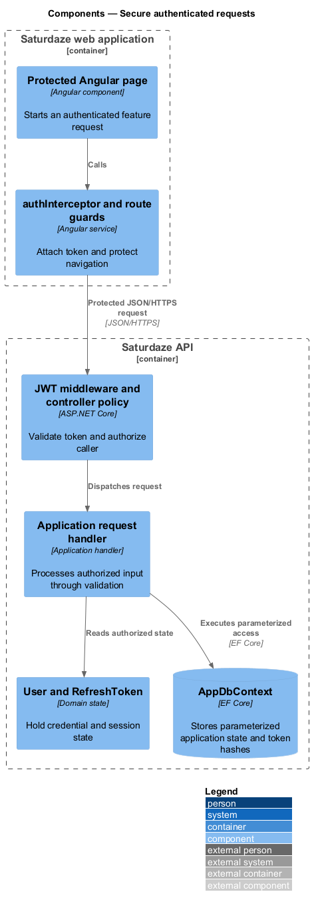
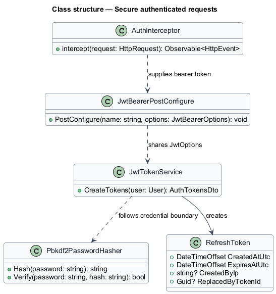
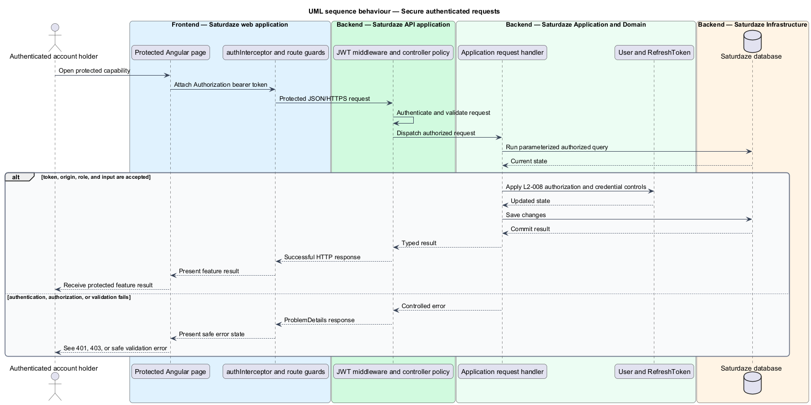

# Secure authenticated requests

## Overview

Saturdaze is a web application that plans personalized family weekends. The security slice protects credentials, browser requests, API boundaries, and database access across the application.

*bearer token* — signed access credential attached to an HTTP Authorization header

Angular guards and `authInterceptor` protect navigation and attach access tokens. ASP.NET Core validates JWTs, endpoint policies authorize roles, and EF Core parameterizes application queries.

## Description

The feature forms a vertical slice across the Angular application, the ASP.NET Core API, application handlers, domain state, and SQL Server persistence.

- **`authInterceptor`** — Angular interceptor that attaches the current bearer token to API requests.
- **`requireAuth and requireAdmin`** — Angular guards that protect authenticated and administrative routes.
- **`JwtBearer middleware`** — ASP.NET Core middleware configured by `JwtBearerPostConfigure`.
- **`Pbkdf2PasswordHasher`** — Infrastructure service that stores passwords as salted PBKDF2 hashes.
- **`JwtTokenService`** — Infrastructure service that signs access tokens and hashes refresh-token material.
- **`AppDbContext`** — EF Core persistence boundary used through LINQ and parameterized commands.

`RefreshToken` records creation, expiry, revocation, and creator IP. The `ReplacedByTokenId` link required by `L2-033` is `<TO SUPPLY>` in the current domain model.

## Requirements

The feature realizes the following level-2 (L2) requirements. Each row cites the level-1 (L1) capability refined by the requirement.

| L2 ID | Refines (L1) | Requirement |
|-------|--------------|-------------|
| `L2-008` | `L1-001`, `L1-012` | Every endpoint except `POST /api/auth/register`, `POST /api/auth/login`, `POST /api/auth/forgot-password`, `POST /api/auth/reset-password`, `POST /api/auth/verify-email`, `GET /api/weather` (no PII), and `GET /api/activities\|/api/restaurants\|/api/events` (read-only public data) must reject requests that lack a valid `Authorization: Bearer <jwt>` header. |
| `L2-029` | `L1-012` | Plaintext passwords must never be written to the database, and the password hash format must use PBKDF2 with at least 100,000 iterations and a per-user random salt. |
| `L2-030` | `L1-012` | The JWT signing key must be read from the `SATURDAZE_JWT_SIGNING_KEY` environment variable in production and never embedded as a real value in source control. |
| `L2-031` | `L1-012` | In production, the API must accept cross-origin requests only from the explicit list configured in `Cors:AllowedOrigins`. Wildcard origins must be rejected. |
| `L2-032` | `L1-012` | The system must use EF Core LINQ or parameterized SQL for every database call; no string-interpolated SQL is permitted. |
| `L2-033` | `L1-012` | Every issued refresh token must record `CreatedAtUtc`, `ExpiresAtUtc` (14 days), `CreatedByIp` (when available), and on use must be replaced by a new token with `ReplacedByTokenId` linking back. |

## Diagrams

### System context

The context view identifies the person using this capability and the Saturdaze system that owns the resulting state.

### Containers

The container view follows the interaction from the Angular web application through the API to SQL Server.

### Components

The component view names the page, client service, controller, handler, domain type, and persistence boundary involved in this slice.

### Class structure

The class view shows the request path and the state types used by the feature.

### Behaviour — authorize a protected request

The sequence view traces the primary behaviour to `L2-008` and the credential controls in `L2-029` through `L2-033`. Its alternate path shows how the feature returns a controlled failure.

