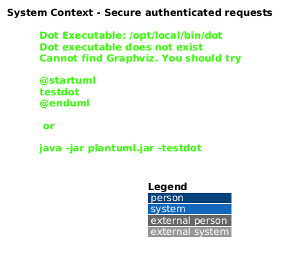
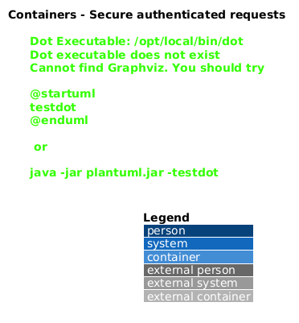
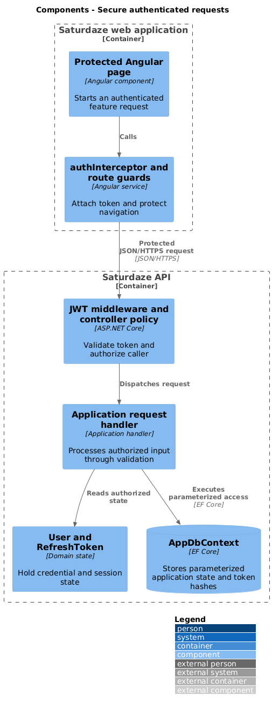
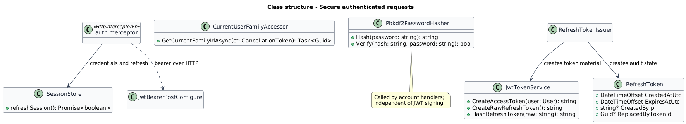
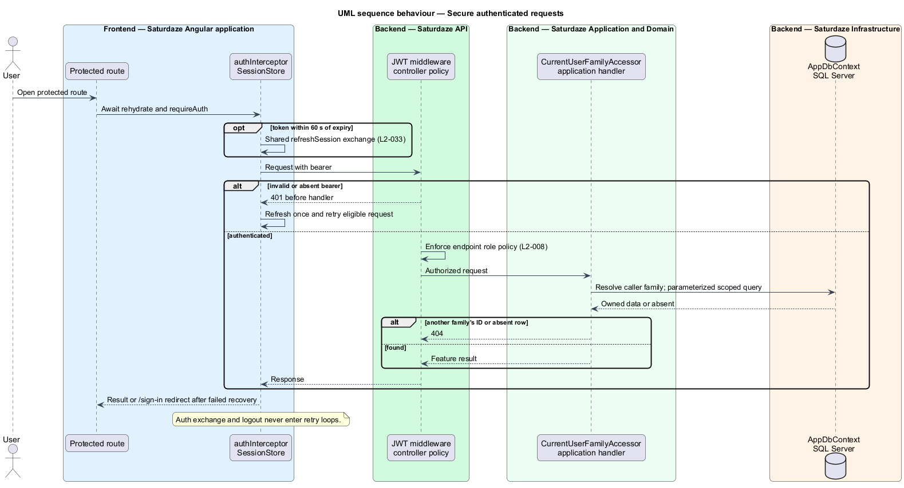

# Secure authenticated requests

## Overview

Saturdaze is a web application that plans personalized family weekends. The security slice protects credentials, browser requests, API boundaries, and database access across the application.

*bearer token* — signed access credential attached to an HTTP Authorization header

Angular guards and `authInterceptor` protect navigation and attach access tokens. ASP.NET Core validates JWTs, endpoint policies authorize roles, and EF Core parameterizes application queries.

## Description

`authInterceptor` attaches the current bearer except on credential-issuance endpoints. It refreshes near-expiry tokens, retries an eligible 401 once, and redirects to `/sign-in` when recovery fails.

`requireAuth` and `requireAdmin` control browser navigation. `Program.cs` applies fallback API authorization; explicit AllowAnonymous attributes identify public auth, weather, shared-weekend, calendar, and development endpoints.

`CurrentUserFamilyAccessor` resolves the authenticated account's family. Family-owned handlers filter by that ID and return 404 for another family's resource.

`JwtBearerPostConfigure` configures signature validation, `Pbkdf2PasswordHasher` creates salted hashes, and `JwtTokenService` signs access tokens and hashes refresh material. `RefreshTokenCommandHandler` rotates refresh credentials with creator IP and replacement linkage.

`IAppDbContext` exposes EF Core sets; application queries use LINQ or parameter binding. Public share tokens encode a weekend GUID without expiry or revocation. `GetSharedWeekendQueryHandler` returns the full WeekendDto, including family ID and errands; public-data minimization remains a security gap.

## Requirements

The following L2 requirements refine the cited L1 capabilities. Implementation gaps stated in Description do not waive these obligations.

| L2 ID | Refines (L1) | Requirement |
|-------|--------------|-------------|
| `L2-008` | `L1-001`, `L1-012` | Every endpoint except `POST /api/auth/register\|login\|refresh\|logout\|forgot-password\|reset-password\|verify-email\|resend-verification`, `GET /api/weather` (no PII), `GET /api/weekends/shared/{token}` and `GET /api/weekends/{id}/calendar.ics` (capability URLs that browsers and calendar clients fetch without a bearer) shall reject requests that lack a valid `Authorization: Bearer <jwt>` header. `GET /api/activities\|/api/restaurants\|/api/events` are personalized per family (votes, locks, novelty history) and therefore require a bearer too (ADR-008). Enforcement is a global fallback authorization policy; anonymous routes opt out explicitly. |
| `L2-029` | `L1-012` | Plaintext passwords shall never be written to the database, and the password hash format shall use PBKDF2 with at least 100,000 iterations and a per-user random salt. |
| `L2-030` | `L1-012` | The JWT signing key shall be read from the `SATURDAZE_JWT_SIGNING_KEY` environment variable in production and never embedded as a real value in source control. |
| `L2-031` | `L1-012` | In production, the API shall accept cross-origin requests only from the explicit list configured in `Cors:AllowedOrigins`. Wildcard origins shall be rejected. |
| `L2-032` | `L1-012` | The system shall use EF Core LINQ or parameterized SQL for every database call; no string-interpolated SQL is permitted. |
| `L2-033` | `L1-012` | Every issued refresh token shall record `CreatedAtUtc`, `ExpiresAtUtc` (14 days), `CreatedByIp` (when available), and on use at `POST /api/auth/refresh` shall be revoked and replaced by a new token, with the presented row\'s `ReplacedByTokenId` pointing to the replacement. |

## Diagrams

### System context

The context view identifies the person using this capability and the Saturdaze system that owns the resulting state.

### Containers

The container view follows the interaction from the Angular web application through the API to SQL Server.

### Components

The component view names the page, client service, controller, handler, domain type, and persistence boundary involved in this slice.

### Class structure

The class view shows the request path and the state types used by the feature.

### Behaviour — authorize a protected request

The sequence view traces the primary behaviour to `L2-008` and the credential controls in `L2-029` through `L2-033`. Its alternate path shows how the feature returns a controlled failure.

