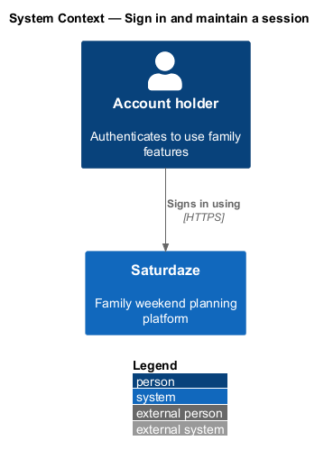
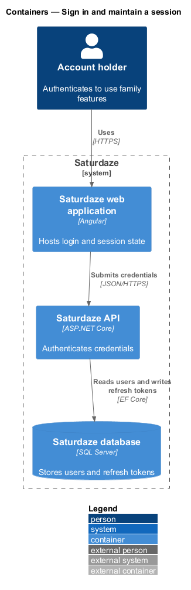
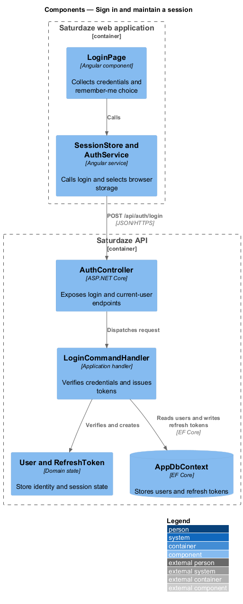
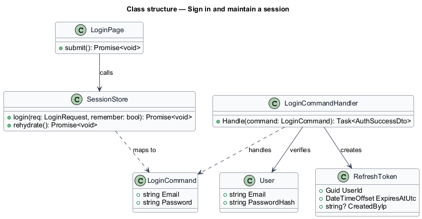
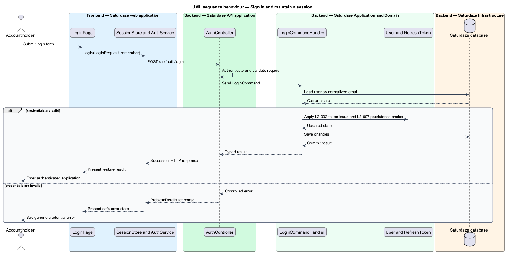

# Sign in and maintain a session

## Overview

Saturdaze is a web application that plans personalized family weekends. Sign-in exchanges valid credentials for access and refresh tokens and restores the authenticated application shell.

*remembered session* — token session persisted across browser restarts in local storage

`SessionStore` selects durable or tab-scoped browser storage from the remember-me choice. `LoginCommandHandler` verifies the password and creates a new `RefreshToken` for the session.

## Description

The feature forms a vertical slice across the Angular application, the ASP.NET Core API, application handlers, domain state, and SQL Server persistence.

- **`LoginPage`** — Angular page that collects email, password, and the remember-me choice.
- **`SessionStore`** — Client state service that authenticates, persists tokens, and rehydrates the current user.
- **`AuthService`** — Typed HTTP service that calls the authentication API.
- **`AuthController`** — API controller that exposes `POST /api/auth/login` and `GET /api/auth/me`.
- **`LoginCommandHandler`** — Application handler that verifies credentials and issues the token pair.
- **`RefreshToken`** — Domain entity recording the server-side refresh-token lifetime and creator IP.

## Requirements

The feature realizes the following level-2 (L2) requirements. Each row cites the level-1 (L1) capability refined by the requirement.

| L2 ID | Refines (L1) | Requirement |
|-------|--------------|-------------|
| `L2-002` | `L1-001` | The system must authenticate a user by `Email` + `Password`, issue a fresh access token + refresh token on every successful login, and return a generic 400 error on any credential failure (without distinguishing "no such user" from "wrong password"). |
| `L2-007` | `L1-001` | The login form's "remember me" toggle must select between durable persistence (`localStorage`) and session-only persistence (`sessionStorage`) for the access and refresh tokens. |

## Diagrams

### System context

The context view identifies the person using this capability and the Saturdaze system that owns the resulting state.

### Containers

The container view follows the interaction from the Angular web application through the API to SQL Server.

### Components

The component view names the page, client service, controller, handler, domain type, and persistence boundary involved in this slice.

### Class structure

The class view shows the request path and the state types used by the feature.

### Behaviour — sign in and select token persistence

The sequence view traces the primary behaviour to `L2-002` and `L2-007`. Its alternate path shows how the feature returns a controlled failure.

